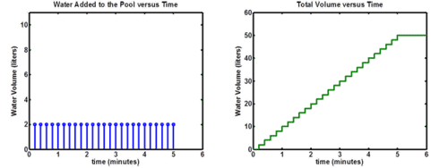
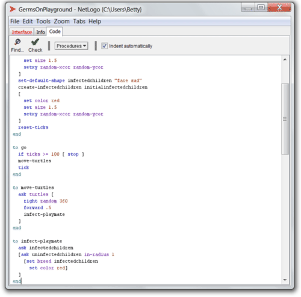
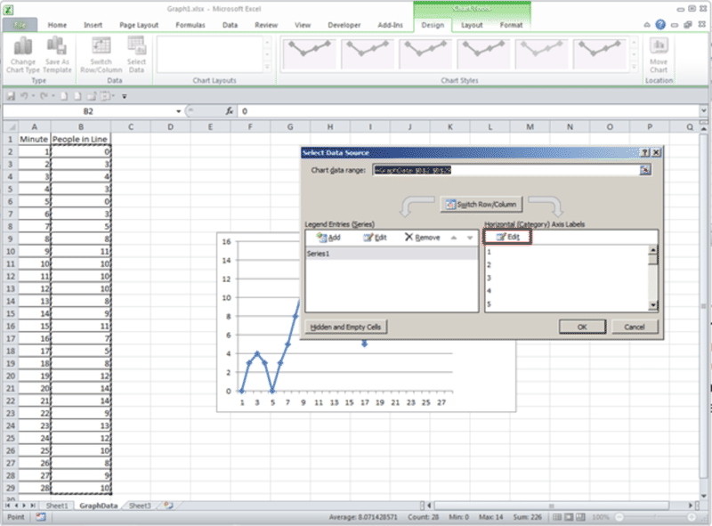
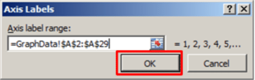
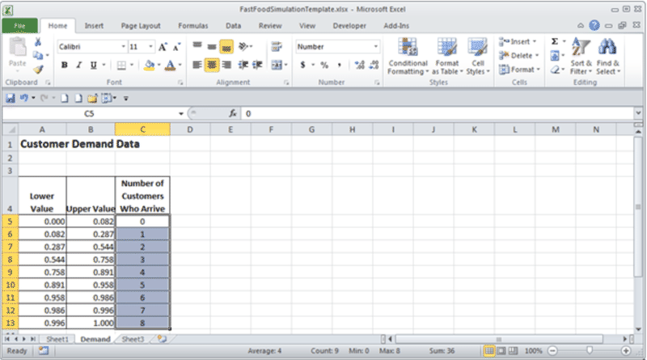
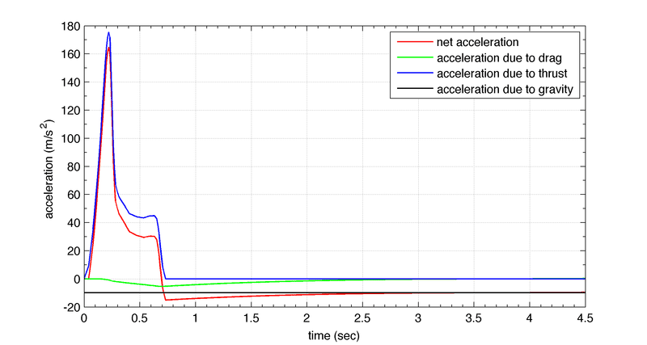
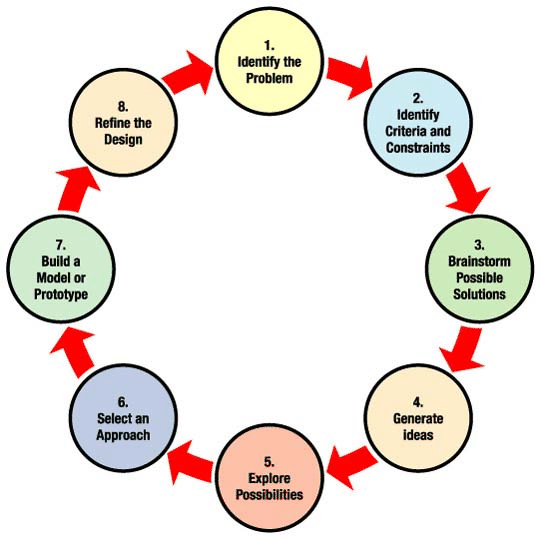
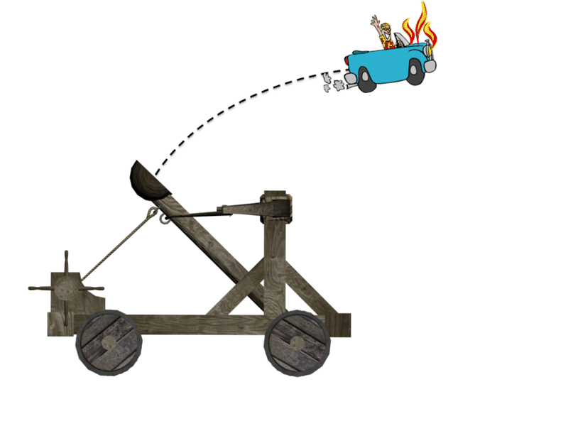

<!--
author:   Behzad Raiszadeh; James Batterson

email:    LiaScript@web.de

version:  0.0.1

language: en

narrator: US English Female

comment:  A joint collaboration between NASA and CK-12, the purpose of this FlexBook® resource is to provide high school teachers with an introduction to the main principles of modeling and simulation as used in science and engineering as well as a set of lesson plans.

logo:     ../cover.jpg

tags:      modelling, simulation, physics, science

-->

# CK-12 Modeling and Simulation for High School Teachers: Principles, Problems, and Lesson Plans

> This document was automatically translated to LiaScript from
>
> https://www.ck12.org/book/ck-12-modeling-and-simulation-for-high-school-teachers%3a-principles-problems-and-lesson-plans/

## 1.0 Preface

<article>

</article>

### 1.1 Background and Overview of Goals

<article>

Welcome to the Modeling and Simulation FlexBook_®_ digital resource, the result of a collaboration between the National Aeronautics and Space Administration (NASA) and the CK-12 Foundation._1_

The purpose of this FlexBook_®_ digital resource is to provide high school teachers with an introduction to the main principles of modeling and simulation as used in science and engineering, as well as a set of lesson plans. The chapters on principles and fundamentals were written by university professors, high school science teachers, and practicing scientists and engineers who employ modeling and simulation in their daily work. The lesson plans were developed by high school teachers in collaboration with practicing scientists and engineers from NASA, who worked with the teachers in a two-week modeling and simulation summer workshop. All material has been reviewed by subject matter experts.

As the first release of this FlexBook_®_ digital resource was prepared in the Winter of 2011 - 2012, the “NRC Framework for Next Generation Science Standards”_2_ (NGSS) was published. It liberally references the use of modeling and simulation in science and engineering. For example, in Chapter 3, Scientific and Engineering Practices – Developing and Using Models, we see in part:

By Grade 12, students should be able to:

* Represent and explain phenomena with multiple types of models
* Discuss the limitations and precision of a model
* Use (provided) simulations or simulations developed with simple simulation tools
* Make and use a model to test a design or aspects of a design

Furthermore, the NGSS draft for public comment, released in May 2012, provides good examples of Performance Expectations that use modeling and simulation. For example, from Middle (MS) and High School (HS) Earth and Space Science (ESS) Performance Expectations we find:

* MS-ESS-History of Earth (e.) Use **models** of the geosphere and biosphere that highlight system interactions to explain how the geosphere and biosphere coevolve over geologic time.

* MS-ESS-Earth’s Interior Processes (b.) Develop and use **models** of ancient land and ocean basin patterns to explain past plate motions.

* MS-ESS-Human Impacts (a.) Use **system models and representations** to explain how human activities significantly impact: (1) the geosphere, (2) the hydrosphere, (3) the atmosphere, (4) the biosphere, and (5) global temperatures.

* HS-ESS-Space Systems (b.) Use **mathematical, graphical, or computational models** to represent the distribution and patterns of galaxies and galaxy clusters in the Universe to describe the Sun’s place in space.

While this represents an excellent advance in high school education content toward 21_st_ century practices, there are very few colleges that teach modeling and simulation either as a part of their teacher preparation programs or even as part of an undergraduate science or mathematics major. A similar situation arose in 2008, when the Commonwealth of Virginia was about to revise its science content standards to include 21_st_ century content such as information on quarks, plasmas, organic chemistry, nanotechnology, and modeling and simulation. Because there were research data_3_ that indicated many science teachers had less than full knowledge of contemporary and emerging subject areas, the Commonwealth partnered with the CK-12 Foundation to develop the 21_st_ Century Physics FlexBook_®_: A Compilation of Contemporary and Emerging Technologies. This FlexBook_®_ digital resource was written by a cadre of high school teachers and community college and four-year college professors. It was aimed at providing freely available, technically vetted material in a timely way for teachers to include the new standards in their day-to-day teaching, prior to revised, standard textbooks becoming available.

NASA has a need to assure an appropriate STEM literacy of its next-generation workforce. The CK-12 Foundation is committed to providing free, computer-based, open content to the K-12 community under CC BY-NC license in their FlexBook_®_ format – allowing teachers to customize their lessons as they see fit. Thus, CK-12 and NASA have partnered to develop this FlexBook_®_ digital resource in order to make modeling and simulation technology and methodology freely available to K-12 educators in a timeframe commensurate with the publication of the Next-Generation Science Standards (NGSS).

It is the intent of NASA and CK-12 to update this book over time with additional chapters on modeling and simulation and additional lessons plans. Users are invited to submit their ideas for additions to the CK-12 Foundation at http://www.ck12.org.

</article>

### 1.2 Organization of the Content

<article>

There are two major sections to this FlexBook_®_ digital resource:

* Fundamental Ideas in Modeling and Simulation
* An Appendix of Lesson Plans

The “Fundamental Ideas” section addresses various aspects of modeling and simulation in science and engineering, such as its breadth of use, some of its limits, numerical and computer issues in doing modeling and simulation, and a range of modeling and simulation methodologies. The “Appendix” contains several detailed lesson plans for teaching modeling and simulation in the context of a variety of content. Each lesson plan is explicitly aligned with national science standards.

</article>

### 1.3 Synopsis of the Content

<article>

* **Chapter 1 - Introduction to Modeling and Simulation**

This chapter introduces the novice to the main ideas of modeling and simulation for science and engineering along with some basic modeling and simulation vocabulary and terms. The chapter opens with some definitions of modeling and simulation and several examples of how and where it is used. It then introduces the idea of a simulation study, the process used to develop models and simulations for such studies, and what is entailed at each step. The readers are then introduced to modeling and simulation methodologies, including discrete-event simulations, continuous simulations, agent-based modeling, and systems dynamics. This chapter ends with an explanation how Monte Carlo technique is used in science and engineering.

* **Chapter 2 - Effectively Incorporating Modeling and Simulation into Classroom Instruction**

This chapter describes the use of inquiry-based instruction to effectively incorporate modeling and simulation into classroom instruction. Science teachers have always been concerned about engaging students in the content of the subjects they teach. It is very easy for students to see science as a complex, fact-driven field of study in which all of the basics have already been determined. Especially with the great advances in personal computers and technology in general over the past few years, it is all too easy for students to view traditional science courses as not relevant to their everyday life. Teachers are always on the lookout for approaches that make instruction both relevant and enjoyable while at the same time maintaining academic rigor. One approach that is starting to gain traction in education is in the use of models and simulations (MODSIM) in the classroom.

There are three sections in this chapter. The first section discusses inquiry-based instruction and how the use of a guided inquiry model is particularly suitable for using MODSIM as an instructional tool. The second section describes the MODSIM School Demonstration Project undertaken as a collaboration of NASA Langley Research Center, the National Institute of Aerospace (NIA), and the Virginia Beach (Virginia) City Public Schools using inquiry-based instruction with models and simulations. Finally, the third and largest section contains example lessons utilizing this approach.

* **Chapter 3 - Live, Virtual, and Constructive Models and Simulations for Test and Evaluation**

This chapter defines three categories of modeling and simulation and the practice of test and evaluation (T&E) as used throughout industry and government research and development agencies and departments – in this particular chapter, by the Department of Defense. The chapter first describes what Test and Evaluation is and explains why T&E is conducted on a new product. Examples are provided and risk and test planning are defined. Next, live, virtual, and constructive (LVC) simulations in test and evaluation are defined as three basic categories of simulation. Examples are provided as to the strengths and weaknesses of each category. Systems Integration Laboratories are described, as is validation and verification (V&V) for models and simulations. Live, virtual, and constructive simulations are then described in the integration of several LVC components into a distributed test event.

* **Chapter 4 – Live, Virtual, and Constructive Modeling and Simulation for Training**

This chapter provides an introduction to live, virtual, and constructive (LVC) modeling and simulation (M&S) for training. While Chapter 3 discussed bringing a simulation to fruition via T&E, this chapter details one of the uses of the completed simulation: training. LVC simulations are being used by the military, space, safety, transportation, and other organizations to provide effective training for individuals and teams at various levels of fidelity. LVC simulations save time, money, and lives while achieving an improvement in human performance. In this chapter the reader will gain an understanding of LVC modeling and simulation by learning to categorize LVC as it pertains to training applications. The reader will also get an illustrated overview of the history of modeling and simulation for training from very early attempts to the present day and future promises. The chapter concludes with an introduction to LVC architectures and the cultural, technical, and economic challenges and considerations associated with integrating LVC in support of individual, small- to large-scale training exercises.

* **Chapter 5 – Using Computer Simulation to Make Better Business Decisions**

This chapter is an introduction to how computer simulation can be used in business to improve the decisions that business managers make. In the scenarios that this chapter addresses, improved decisions result in increased profit, reduced cost, and better service to customers. The chapter first describes basic business concepts such as profit, customer service, capacity, and demand. Understanding these terms is important because the purpose of simulation is to help managers make decisions about capacity that is used to make goods and provide services in response to customer demand and, as a result, to improve profit and customer service. A familiar setting is used as an example in this chapter, specifically, a fast-food restaurant. The succession of lessons in this chapter ultimately leads to a description of how a computer simulation model might be created to mimic the operations of the restaurant to help a manager understand how different decisions, such as purchasing equipment, augmenting or reducing staff, and re-assigning/cross-training staff, lead to different levels of profit and customer service. Essential background information and skills are provided throughout the chapter, such as the concept of probability distributions and Excel spreadsheet functions that are required to create the simulation model.

* **Chapter 6 – Agent-based Modeling**

The traditional view of modeling and simulation is to model the entire system and the interactions between different entities of the system based on clearly defined and well understood theories. Although we may not be able to identify and describe various system behaviors top down, we may be able to identify the main components, what they do, and how they are related. For example, we cannot describe the traffic in New York City as a function, but we know that cars – in particular yellow taxis – and utility trucks play a major role. The movements of the vehicles are constrained by traffic lights, traffic regulators, sidewalks, and pedestrians. Instead of trying to come up with a complex fluid-mechanic solution, each taxi, car, truck, regulator, and potential pedestrian is modeled as an agent. Instead of describing the system behavior top down in form of functions, we only define the components and their interplay and observe the system behavior that emerges bottom up. An agent-based model consists of a collection of autonomous agents. Each agent is able to make decisions based on a set of software instructions programmed to model its behavior, according to how it interacts with its environment and with other agents. Agent-based modeling provides a powerful method to model behavior of complex system that would otherwise not be possible using traditional approaches.

Lesson Plans
------------

* **Flight Fidelity: Engineering with Practical Mathematics**

High school college-prep physics students will use the iterative engineering design process to build a model rocket capable of carrying a specific payload. During the test flights, the students will work both to ensure that their designs fly with a minimal amount of horizontal velocity, and that they fly as high as possible. The students will measure and record the maximum height attained by their rockets.

The students will then describe the forces acting on the rockets when they are in flight, including a drag force model that varies with the square of velocity. Using Newton’s laws of motion, the students will develop the equations describing the motion of the rockets. This project is an ideal platform for students to see the practical application of mathematical concepts (such as Riemann sums) to which they have been exposed in their higher-level mathematics courses. Additionally, this project takes advantage of the cognitive maturity of calculus-based physics students, motivating them to use high-level mathematical paradigms (such as the Euler method of integration) to bring relevance to the theory they have learned in their math and science courses.

* **Stress and Strength Testing**

This unit focuses on the concepts of stress, strength, deflection, point of failure, allowable strength, modulus of rupture, and factor of safety. To model these concepts in action and allow the students to conduct their own tests, the experiment tests the strength of popsicle sticks of varying sizes. The strength of a material is defined as the amount of stress that causes failure. Failure occurs when the stress is larger than the strength, causing the popsicle stick to break under the given load (weight). Students collect a range of data that will be compiled by the teacher. The experimenters are asked to organize, display, and analyze that data in different ways. Once these basic concepts are understood, the students are tasked with an engineering project, the design of a bridge that can withstand a maximum amount of stress before failing. The students test their designs using a computer-based bridge building simulation, make any revisions necessary, and then construct the actual bridge using popsicle sticks and glue. The bridges are tested by the teacher to determine their strength.

* **Aliens Attack!**

As a part of a new focus on moving out into our solar system, NASA has increased its emphasis in several areas, including research into xenobiology and the interactions of differing life forms from very disparate environments. This unit will be used as a means to explore the interactions between ourselves and potential alien life forms from beyond our earthly environment in order to determine the potential positive and negative consequences. In particular, this unit will focus on student problem-solving activities in order to develop a plan should one of several scenarios unfold involving the introduction of alien microbial life on Earth.

This unit was designed in order to 1) integrate modeling and simulation into lesson activities as a means to teach the engineering design process to students; and 2) provide students with the opportunity to apply previously-mastered content in biology to real-world scenarios while scaffolding in specific content regarding the characteristics of microorganisms and how they can help/hurt the environment and other organisms. Each lesson can be used as an individual activity in genetics, evolution, classification, or microorganisms, or can be used in tandem to emphasize the ModSim model.

* **Troubled Waters: Water Quality, Usage, and Reclamation**

This unit focuses on water reclamation. It features a simulation that allows students to follow water from pristine and logging forests through residential and commercial areas into wetlands and urban areas. Students have the opportunity to explore a number of water quality issues, including how land use affects water quality, how to collect and analyze data related to water quality, and how water filtration systems work, both in general and in their communities. The lessons culminate in an actual engineering project to design, build, and operate a wastewater filtration system. The unit as a whole contains a number of activities which build upon each other, but each can also be used as a stand-alone activity to teach individual concepts. This lesson is intended for use in high school biology, chemistry, environmental science, Earth science, ecology, urban studies or sustainability classes. Students are expected to have a basic understanding of ecosystems, the water cycle, data collection, percent composition, and graphical analysis.

* **Exploring Trajectory Optimization Using Simulation**

This unit focuses on trajectory optimization, a key tool in engineering design. The unit is framed as an engineering design challenge that requires the students to attempt to design an optimized trajectory for iRobot’s Roomba, an autonomous robotic vacuum cleaner. Students are introduced to how modeling and simulation is used at NASA to optimize the design of helicopters, airplanes, and space vehicles. Through a series of activities, including the use of a Traveling Salesman Problem Computer Simulation and a Roomba Trajectory Simulation that utilizes student data, students gain an understanding of how modeling and simulation can be useful, and are in fact essential, to engineers.

</article>

### 1.4 Authors’ Bios

<article>

* **Natalie Apuzzo** is a government contractor for the OSD Test Resource Management Center. She works in the Joint Mission Environment Test Capability Program Management Office, where she is Technical Editor and Web Content Developer. She has 10 years of experience in the Department of Defense, with eight of those years in the Test and Evaluation Community.

* **James G. Batterson**, B.S. (Mathematics); M.S. (Physics) College of William & Mary. Mr. Batterson has taught high school physics and mathematics, worked as a scientific programmer for LTV Corporation, and, from 1980 until his retirement in 2008, was a research engineer at NASA Langley Research Center. At NASA he conducted flight research on the dynamics and control of aerospace vehicles, serving as Head of the Dynamics and Control Branch and, later, as Deputy Director for Strategic Development. He has also served on a number of community boards, including the Newport News School Board and New Horizons Regional Education Center Board. While at NASA, he worked on assignments for the Office of Science and Technology Policy, the National Nanotechnology Coordination Office, NASA Headquarters, and the Office of Virginia’s Secretary of Education. Upon retirement, Mr. Batterson became Senior Advisor to the Commonwealth for STEM Initiatives in Governor Tim Kaine’s administration. There he led a project that developed the “21st Century Physics Flexbook_®_ – a Compilation of Contemporary and Emerging Technologies,” an open content, freely available, web-based resource, written mostly by, and for, high school physics teachers.

* **James Beltran** is Science Curriculum Specialist at H.M. King High School, Kingsville, TX. He received a B.S. (Biology & Chemistry) and M.S. (Biology & Neurosciences) at Texas A&M. Previously, Mr. Beltran has taught high school biology, pre-AP biology, physics, pre-AP physics, and AP physics. He is currently completing work on two additional degrees – an M.S. in Education Administration at Texas A&M and a Ph.D in Molecular and Human Genetics at Baylor College of Medicine. An undergraduate research opportunity drove his interest in how to prevent illness rather than simply treat it after the fact. This led to his development of the lesson plan, “Aliens Attack!”

* **James Bradley**, B.E. (Mechanical & Electrical Engineering) General Motors Institute, MBA (Operations Management) Dartmouth College, and Ph.D. (Industrial Engineering) Stanford University, is a professor at the Mason School of Business, College of William and Mary. With industry experience at General Motors and Digital Equipment Corporation, Professor Bradley taught at Stanford and Cornell before coming to the College of William and Mary, where he currently teaches in the Mason School of Business and carries out research in developing managerial policies that improve the flow of goods through supply chains, and how to use information technology and analytics to improve supply chain performance.

* **Mark Clemente**, B.A. (Chemistry) University of Pennsylvania, MSEd (Secondary Science Education) Old Dominion University, is a chemistry teacher at Kempsville High School, Virginia Beach Public Schools (Virginia). Before entering the K-12 education field, Mr. Clemente served in the U.S. Navy. He has taught high school chemistry, materials science, and AP chemistry and served as Science Department Chair. Mr. Clemente was Educator in Residence at the National Institute of Aerospace, where he developed a range of modeling and simulation courses and inquiry-based curriculum in collaboration with the NIA research and education staff and NASA scientists and engineers. He authored a modeling and simulation chapter in the 21 _st_ Century Physics FlexBook_®_: A Compilation of Contemporary and Emerging Physics, a collaboration between the CK-12 Foundation and the Commonwealth of Virginia. Mr. Clemente has been selected as Virginia Beach Teacher of the Year and is a National Board Certified Teacher.

* **Javier (Jeff) Covelli** is President, Innovative Technology Professionals and Senior Business Development Manager, Computer Sciences Corporation. B.S. (Ocean/Civil Engineering) U.S. Naval Academy, M.S. (Electrical Engineering) Naval Postgraduate School, M.S. (Industrial Engineering/Management Systems) University of Central Florida, Ph.D. (Modeling & Simulation) University of Central Florida. Dr. Covelli has a broad range of operational, training, and management experience, ranging from a U.S. Navy carrier pilot assigned to the USS George Washington through various assignments onboard ship including Weapons Systems Training Instructor, Combat Systems Officer, and Maintenance Safety Officer. He has held numerous software and modeling and simulation analysis, development, and management positions with major companies including Lockheed Martin Corporation, Science Applications International Corporation, General Dynamics, and Northrup Grumman Corporation Sector (NPS). He is currently responsible for identifying and qualifying new training and range support opportunities, developing strategic teaming alliances to bolster CSC qualifications, developing strategic relationships within DoD and DHS, and supporting the capture and proposal development process for CSC.

* **Lisa Damian-Marvin** is a physics teacher at Candem Hills Regional High School, in FiveTowns CSD school district, Maine. B.A. (Chemistry) Boston University, M.S. (Chemistry) Carnegie Mellon University, M.A. (Gifted and Talented Education) Northcentral University. In addition to teaching physics, chemistry, engineering, and forensics, Mrs. Damian-Marvin was a founding director of the Midcoast Academy for New and In-Service Educators, a program that trained and supported conditionally certified K-12 teachers throughout the mid-coast Maine region. She also worked with the American Geologic Association as a curriculum developer for a national environmental education program. Mrs. Damian-Marvin is a National Board Certified Teacher, was awarded the 1999 Presidential Award for Excellence in Secondary Science Teaching, was a 2001 Albert Einstein Distinguished Educator Fellow Finalist, and won the 2011 Yale-Lynn Hall Teacher Action Research Prize.

* **Bernard “Chip” Ferguson** is the Program Manager for Joint Mission Environment Test Capability (JMETC) Program, part of the OSD Test Resource Management Center. Since joining the Army in 1965, Mr. Ferguson has held leadership positions in combat units, varied level staffs, the Army’s Operational Test and Evaluation Command, and Office of the Director, Test and Evaluation, Office of the Secretary of Defense. Upon retirement from active duty, Mr. Ferguson became a Division Manager and Operations Manager with SAIC supporting test and evaluation in DoD. With his vast experience in distributed testing and evaluation, Mr. Ferguson was selected for his current position in 2006.

* **John Fitzgerald** is a mathematics teacher at Camden Hills Regional HS, Rockport, Maine. B.A. Nasson College, Springvale, Maine; M.S. (Engineering) University of New Hampshire. He has taught the full curriculum of secondary mathematics in private and public schools in Maine and Connecticut since 1976 with a few breaks. From 1980-84, he was employed by Research Computing and the Oceanographic Research Group in Durham, NH. During the 2000-01 school year he served as Interim Head of School for the Children’s House Montessori School in Rockport, ME. Since 2009, Mr. Fitzgerald has also taught Elementary Statistics as an Adjunct Faculty member at the University College at Rockland and at Thomas College. He is currently the President of the local teachers association and advises for the school yearbook. His professional interests include a deeper understanding around the instruction of the AP Calculus curriculum, teacher mentoring and the evaluation process. He is Vice President of the Board of Trustees of the Camden Public Library. An avid outdoorsman, Mr. Fitzgerald enjoys sailing, rowing, cycling and walking in the woods. He and his wife manage an alpaca farm on their property in Camden and are visited often by their children and grandchildren.

* **Joseph Herrington** is a physics and principles of engineering teacher at John D. O'Bryant School of Mathematics & Science, Boston, MA. B.A. (Physics) Northeastern University. In addition to his teaching duties, Mr. Herrington develops new curricula in modeling and simulation and simulation-based science and engineering. He has presented at the 2011 NSTA Conference in San Francisco where he spoke on the importance of modeling and simulation (MODSIM) in the classroom and of his experiences as a participant in NASA's Simulation-Based Aerospace Engineering Teacher Professional Development Program. He has also co-presented a one-week workshop focusing on MODSIM to a group of teachers from the Kingsville School District in Kingsville, TX.

* **Michael G. Lilienthal** is Principal Analyst at Electronic Warfare Association, Government Systems, headquartered in Herndon, Virginia. Dr. Lilienthal received his Doctor of Philosophy in experimental psychology, specializing in psychophysical scaling and measurement from the University of Notre Dame. He is a graduate of the Navy War College Command and Staff College, has a Certificate in Systems Engineering from the Navy Postgraduate School, and is a Certified Professional Ergonomist and an IEEE Certified Biometrics Professional. Dr. Lilienthal served in the Navy for 30 years as an Aerospace Experimental Psychologist working a variety of programs in research, training, human systems integration, policy development, test & evaluation and modeling & simulation, including a tour as the Director of the Department of Defense’s Modeling and Simulation Office (DMSO). He retired as a captain and has been working for the Joint Mission Environment Test Capability (JMETC) in the Operations, Planning & Support Division.

* **Margaret Loper** is Chief Scientist for the Information & Communications Laboratory at the Georgia Tech Research Institute. She earned a B.S. (Electrical Engineering) from Clemson University, M.S. (Computer Engineering) from the University of Central Florida, and a Ph.D. (Computer Science) from the Georgia Institute of Technology. Dr. Loper’s technical focus is parallel and distributed simulation, and her research contributions are in the areas of temporal synchronization, simulation testing, and simulation communication protocols and she is currently involved in projects related to data intensive systems and the interoperability of live, virtual and constructive (LVC) simulations. She is an instructor and course developer for Georgia Tech’s Professional Master’s in Applied Systems Engineering, teaching the Modeling and Simulation (M&S) for Systems Engineering course. She teaches three M&S professional education courses and runs the M&S Certificate program. Dr. Loper also leads a STEM activity called America’s Teachers @ I/ITSEC. This program brings K-12 teachers from across the U.S. to the Industry/Interservice Training, Simulation & Education Conference (I/ITSEC) to expose them to M&S technology and to help them understand how to bring M&S technology into their classroom.

* **Bridget Mariano** is a chemistry teacher and computer resource specialist, Kempsville High School, Virginia Beach Public Schools (Virginia). B.S. (Cum Laude - Biology and Chemistry) Old Dominion University. Before coming to Kempsville High School, Mrs. Mariano taught in the Math/Science Magnet Academy at Ocean Lakes High School, where she was selected as Teacher of the Year in 2010. She has made numerous presentations on modeling and simulation, both in her school district and outside, including at the MODSIM World Expo (Virginia Beach) and at the Interservice/Industry Training, Simulation, and Education Conference (Orlando). She is a National Board Certified Teacher with specialty endorsements in Adolescent and Young Adult Science Education. Outside of school, Mrs. Mariano enjoys time with her husband, Jon, and four children, Amber, Alexander, Carlie, and Chloe.

* **Catherine Murray** is a mathematics and physics teacher in Boston, MA. B.A. (Physics with a minor in Mathematics) Drew University and M.Ed. (Secondary Science Education) Boston College. She has been a Boston Public School teacher for 12 years now, teaching all levels of math as well as physics. Catherine refuses to accept the answer from her students that they “just aren’t good” at math and science. She is passionate about making both science and math education accessible to all students, especially to urban school students who come from a sweeping variety of educational backgrounds and experiences. In 2010, she was selected by NASA to participate in its Simulation-Based Aerospace Engineering Teacher Professional Development program. Catherine firmly believes that by making Modeling and Simulation an integral part of STEM curricula, it increases student buy-in to the subject as well as improves their learning outcomes. She hopes to continue working in the field of science curriculum development.

* **Katie Phalen** is a chemistry teacher at Tempe High School, Tempe Union High School District in Tempe AZ. B.S. (Agriculture) University of Arizona. Ms. Phalen has been an educator for 25 years and is currently teaching HOPE Chemistry (Health Occupations Preparatory Education) and Introductory Chem-Physics. In the past, she has taught a wide range of courses including Honors Chemistry, General Chemistry, and Biology. She enjoyed developing the “Troubled Waters” lesson plan as it is designed to address the world water crisis from a chemical and biological stand point.

* **Behzad Raiszadeh**, B.S. (Mechanical Engineering) University of Virginia, M.S. (Aerospace Engineering) George Washington University. Mr. Raiszadeh worked in private industry in the Washington D.C. area and Colorado Springs for ten years before joining NASA in 2000. At NASA, he was assigned to Atmospheric Flight and Entry Systems, a department responsible for the safe landing of missions to other planets. Mr. Raiszadeh was a flight dynamics engineer for the highly successful Mars Exploration Rovers (MER), helping construct the Entry, Descent, and Landing (EDL) simulations for the entire landing sequence. After the MER landings in 2004, Mr. Raiszadeh moved to the Mars Science Laboratory (MSL) project; he was responsible for mission performance modeling, simulation, and analysis. In 2007, after leaving the MSL project, he joined the Ares I launch vehicle project and served as the element manager for the upper stage. Following the cancellation of the Constellation project and the Ares I launch vehicle, he joined NASA Langley’s Office of Education as the Modeling and Simulation Education Project Manager. There, he was responsible for the technical content of the “simulation-based engineering and science teacher professional development program.” Mr. Raiszadeh led the development of this FlexBook_®_. He is responsible for the technical content of the FlexBook_®_ and has been the primary contact person with all the authors.

* **Andy Register** earned BS, MS, and Ph.D. degrees in Electrical Engineering from the Georgia Institute of Technology. His doctoral research emphasized the simulation and real-time control of nonminimum phase mechanical systems using modern control and artificial neural network techniques. Dr. Register has approximately 20 years of experience split between R&D at GTRI and product development at two early-phase start-up companies. R&D experience centers on radar system simulation using both single and multi-processor systems. This experience includes the development of state-of-the-art computer architectures and interfaces along with their integration into human- and hardware-in-the-loop systems. More recently he has been developing advanced radar tracking algorithms, radar-control techniques, and software architectures for various sensor integration simulations. Dr. Register is also teaches graduate-level courses in systems engineering and is involved in teaching satellite mission system concepts to high school students in Atlanta.

* **Mary Bridget Samson** teaches at Tempe High School, Tempe Union High School District in Tempe AZ. Bachelor of Science Education (Biology) Northern Arizona University. Ms. Samson has taught Biology, IB Biology, Biotechnology, and Chem/Phys at Tempe High School for 7 years. She has also assisted in teaching at a summer Field Biology course in Wisconsin for the last 10 years. She is currently working towards her Masters of Science in biology education from the University of Arizona. The lesson plan Katie Phalen and Mary Bridget designed addresses the world water crisis from a chemistry and ecology viewpoint with a connection to how water is used by NASA on the International Space Station and for other planned space travel.

* **Andreas Tolk** holds a Ph.D. and M.S. in Computer Science, both from the University of the Federal Armed Forces in Munich, Germany. Dr. Tolk is a Professor of Engineering Management and Systems Engineering at Old Dominion University in Norfolk, Virginia. Jointly appointed to the Modeling, Simulation, and Visualization Engineering Department, he is also affiliated with the Virginia Modeling, Analysis, and Simulation Center (VMASC) as well as with the National Centers for System of Systems Engineering (NCSOSE). He has published more than 300 peer-reviewed contributions to journals, textbooks, and conferences. Dr. Tolk received the Frank Batten College of Engineering Award for Excellence in Research in 2008, the first Technical Merit Award from the Simulation Interoperability Standards Organization (SISO) in 2010, and the Outstanding Professional Contribution Award from the Society for Modeling and Simulation (SCS) in 2012.

* **Elizabeth Whitaker** earned her Ph.D. in electrical and computer engineering (specialization in artificial intelligence) from the University of South Carolina in 1992. She has over twenty years of experience on software development and research projects. Her primary research interest is applied artificial intelligence (AI), and she has provided case-based learning technologies to be integrated into a multiple machine learning approach. Dr. Whitaker is working on several research projects in human cultural and behavioral modeling exploring the docking and integration of agent-based, case-based and system dynamics models. She and her software team participated on a research project providing case-based military course-of-action (COA) analysis and system dynamics models for recognizing COA weaknesses. She led another project that investigated new modeling tools to aid intelligence analysts in knowledge discovery.

* **Christopher Yglesias** is Assistant Deputy Program Manager for Operations, Planning & Support for the Joint Mission Environment Test Capability (JMETC) Program. Prior to joining the JMETC program, Mr. Yglesias worked for the Office of Naval Research, Future Naval Capabilities Program supporting various Navy and Marine Corps Science and Technology efforts in the area of Intelligent Autonomy of Unmanned Systems. Mr. Yglesias is an Electronics Engineer from the Air Combat Environment Test & Evaluation Facility at the Naval Air Systems Command. He is currently pursuing an advanced degree in Systems Engineering.

_1_ SAA1-1110 “Nonreimbursable Space Act Agreement Between Ck-12 Foundation and National Aeronautics and Space Administration for Development of a First Draft FlexBook_®_ on Simulation-Based Engineering and Science.”

_2_ “A Framework for K-12 Science Education: Practices, Crosscutting Concepts, and Core Ideas.” Developed by the Committee on a Conceptual Framework for New K-12 Science Education Standards, Board on Science Education, Division of Behavioral and Social Sciences and Education, National Research Council. Public Release July 19, 2011.

_3_ Kentucky Survey of Critical Technologies. In 2003-04, the Kentucky Science and Engineering Foundation contracted with Horizon Research International to carry out a survey of almost 300 middle and high school science teachers in Kentucky found that very few were knowledgeable of contemporary and emerging technology areas. For example only 60% had heard of nanotechnology, and 18% felt they understood what nanotechnology was. Eighty-eight percent of the teachers were aware of the term “artificial intelligence,” but only 27% reported understanding the concept.

</article>

## 2.0 Introduction to Modeling and Simulation

<article>

In this chapter, the significance of Modeling & Simulation (M&S) will be discussed. This includes definitions and uses of M&S. There are processes for developing models and simulations. The modeling and simulation process is described and illustrated using the example of traffic flow through a gas station. After the M&S process has been introduced, different simulation approaches are discussed. The two most common approaches are called discrete-event and continuous. These approaches refer to the way in which time is represented in systems. Additional methodologies that are commonly used to represent system behavior are agent-based simulation and system dynamics. Agent-based simulation and system dynamics are introduced through examples. Monte Carlo, which involves random number generation, is then described as a simulation methodology. Monte Carlo simulations are also used as an approach to better understand the role of randomness in behavior of real-life engineering systems.

</article>

### 2.1 The Significance of Modeling and Simulation

<article>

Lesson Objectives
-----------------

* Define the basic modeling and simulation terminology.
* Understand the difference between a model and a simulation.
* Describe how models and simulations are used.

Vocabulary
----------

__abstraction__

A strategy for simplifying a problem by identifying the essential features of a real system and representing them in a different form.

__decision making__

A mental or cognitive process resulting in the selection of a course of action among several alternative scenarios.

__experimentation__

A methodical, trial-and-error procedure used to understand how changes in the input or operating environment affect a result.

__model__

A physical, mathematical, or logical representation of something that exists in the real world.

__simplification__

A technique in which unimportant details are removed in an effort to define simpler relationships.

__simulation__

An approach for solving real-world problems that usually involves mathematical equations and a computer-generated solution.

__system__

A set of interacting pieces that respond to inputs according to a set of rules that govern the resulting behavior.

__systems engineering__

An engineering discipline that focuses on the way different parts of a system should coordinate and interact to achieve a desired goal.

__testing__

A methodical procedure used to understand the differences between a simulation and the real world.

__training__

Teaching and learning with the goal of improving real-world performance under both normal and extreme conditions.

Check Your Understanding
------------------------

* Is modeling and simulation a new approach to solving problems or was it used before computers?
* It is easy to recognize that modeling and simulation is used in computer games, but is it used in fields other than entertainment?
* Models and simulations have been traditionally used by engineers to design systems, such as airplanes and spacecraft – are there other uses for simulation?
* Are models and simulations used only by engineers and scientists, or can teachers, managers, and financial analysts also use them?

Introduction
------------

Simulation is a multidisciplinary approach to solving problems that includes mathematics, engineering, physical science, social science, computing, medical research, business, economics, etc. Simulation is not new; it dates back to the beginnings of civilization, where it was most commonly used in warfare. With the development of computers, simulation moved from role-playing, where people represented the systems of interest, to computer-based, where software is developed to encode algorithms that represent the systems of interest. While once referred to simply as “simulation,” the discipline is now more commonly called “modeling and simulation” (M&S, or MODSIM). While once considered an enabling tool of mostly engineers and scientists, M&S is now considered a discipline of study and research on its own. Students can receive undergraduate and graduate degrees in Modeling and Simulation.

Introduction to Terminology
---------------------------

There are a number of definitions of models, simulations, and modeling and simulation (M&S). The definitions published by the U.S. Department of Defense (DoD) in their online glossary are as follows:

A **model** is a physical, mathematical, or otherwise logical representation of a system, entity, phenomenon, or process.

A **simulation** is a method for implementing a model over time.

Modeling and Simulation is the discipline that comprises the development and/or use of models and simulations.

Although the terms “modeling” and “simulation” are often used as synonyms, within the discipline of M&S both are treated as individual and equally important concepts.

Modeling is a purposeful abstraction of reality. The real world is too complex to be fully understood by humans. We want to select from the real world those elements that form a reasonable or adequate approximation of the world required for the purpose at hand. This is accomplished through the process of simplification and abstraction. **Simplification** is an analytical technique in which unimportant details are removed in an effort to define simpler relationships. **Abstraction** is an analytical technique that establishes the essential features of a real system and represents them in a different form. The resultant model should demonstrate the qualities and behaviors of real world system that impact the questions that the modeler is trying to answer.

A model is characterized by three essential attributes: reference, purpose, and cost-effectiveness. A model has a “referent,” some real or imagined system. A model should have some cognitive “purpose” with respect to its referent; it is impossible to evaluate or intelligently use a model without understanding its purpose. It should be more “cost-effective” to use the model for this purpose than to use the referent itself; it may be impossible to use the referent directly, or using the referent would be dangerous, inconvenient, or expensive. For example, one cannot go to Mars to test a Mars rover that is going to Mars – there must be a model or several models developed on Earth of the referent (the actual rover).

The execution of a model over time is understood as the simulation. Simulation, according to Shannon (1975), is “the process of designing a model of a real system and conducting experiments with this model for the purpose either of understanding the behavior of the system or of evaluating various strategies (within the limits imposed by a criterion or set of criteria) for the operation of the system.” There are many different types of computer-based simulations. Some of the most common approaches include discrete-event, continuous system, agent-based, and system dynamics (these will be described later in the chapter). A common feature they share is generating or predicting an artificial time-history of the system, allowing the observer or experimenter to draw inferences concerning the operating characteristics of the real system that is represented.

Uses of Models and Simulations
------------------------------

Why modeling and simulation? One reason is affordability. Experimentation in real life can be costly – would you rather simulate a staff reduction in a manufacturing plant or actually reduce staff to see the impact of your decision? Models and simulations also support feasibility and safety. With a simulation, you can simulate conditions of hazardous or closed areas, assess capabilities yet to be developed, and speed up the passage of time. One reason models and simulations are becoming more important in recent years is the ability to distribute them across multiple people and multiple geographic areas, made possible by the ever-increasing bandwidth of the internet. Large numbers of people or unique resources can interact together while they are physically apart from each other in geographical locations. For complex problems that touch many disciplines, allowing this cooperation and collaboration is often key to solving the problem. Lastly, M&S is used to solve problems with no closed-form solution. Many science and physics textbooks provide equations to predict the behavior of physical systems. However, these equations are typically derived for ideal situations. Most real-life science and engineering problems cannot be solved using closed-form solutions to equations out of textbooks. For example, most undergraduate physics books provide equations to predict the motion of a simple projectile. These equations assume there is no air resistance. As the effects of air resistance are included, the problem becomes unsolvable using simple projectile equations. The only way to predict the motion of a projectile and account for air resistance is by modeling and simulation using numerical techniques.

Now that we know what benefits models and simulations provide, let’s look at a few examples that illustrate how they are used in the real world.

Systems Engineering: A Wise Investment

Simulations can be used to design and implement a system effectively. They can be used to explore feasibility of new concepts, specify requirements for a system, design specific parts and how they should be manufactured, and identify maintenance issues of the system related to repair and replacement. For example, you can simulate the impact a new sub-system or component might have in your overall system. Once you determine it will have the desired impact, you can use simulation to design the actual sub-system or component. For example, a city designer could use simulation to determine the impact of changing an intersection from a stoplight to a traffic circle. Once they determine the traffic circle will have a positive impact on traffic flow, they can use simulation to design the size (or diameter) of the traffic circle, the angle of entry needed to enter the circle from surrounding roads, and size of the center island. Another example would be an automotive engineer using simulation to determine the impact of a new brake design. If the new brake system is determined to improve safety, simulation can be used to design the specific components that will be part of the brake system.

M&S makes it possible to evaluate many aspects of a proposed design change and can save a project valuable resources by eliminating the need to build and test a full-scale prototype. This is very important, because once the design of a system is completed and is ready for manufacturing, changes and corrections can be extremely expensive. Simulation can also help estimate how much a system will cost and how a company can reduce its costs. Consider the brake design example above. A model can be used to estimate how much it will cost to produce the new brake system, by including the cost of materials, labor, and retooling the manufacturing and/or assembly lines. Once the cost is known (or estimated), the company can use the model to compare different scenarios, for example the cost to produce the new brakes using material _x_ versus material _y_. A simulation study can cost substantially less than what would be needed to actually design or redesign a system. In other words, it would cost less to develop a simulation of a new brake system than to develop the actual (real) brake system to see whether it has a positive impact on safety. Since the cost of a change or modification to a system after installation is so great, simulation is a wise investment.

Experimentation: Understand “Why” and Explore “What If” Possibilities

Simulations can be used to experiment: you can construct a model of the system and examine how the behavior of the entire system changes when an aspect of the system is changed. This will help expose undesired phenomena within the system and help design a more robust system. You can compress or expand time in a simulation to speed up or slow down phenomena so they can be investigated. For example, you can examine an entire manufacturing shift in a matter of minutes, or spend two hours examining all the events that occurred during one minute of simulated activity. You can also construct a model to answer questions to help plan and avoid unnecessary delays. For example, what if a specific machine is removed from service for an extended period of time? What if demand for service increases by 10 percent? The ability to explore these options through simulation is unlimited.

One of the greatest advantages of using simulation is that once you have developed a valid simulation model, you can explore new policies, operating procedures, or methods without the expense and disruption of experimenting with the real system. A deeper understanding of the cause and effect relationships in the system also helps you develop new or improved ideas to manage the system more effectively. Modifications are incorporated in the model, and you observe the effects of those changes on the computer rather than the real system.

Improved Decision Making: Diagnose Problems and Identify Constraints

Simulation is commonly used to support **decision making** by answering questions such as, “How complex a system is needed?” and “Which alternative is best?” Many real world systems are very complex - so complex that it is impossible to consider all the interactions taking place in one given moment. Simulation allows you to better understand the interactions, diagnose problems, and gain insight into what affects performance of the overall system. For example, production bottlenecks give manufacturers headaches. Bottlenecks are an effect rather than a cause, and simulation can be used to discover the cause of the delays in system. For example, the bottleneck could be the result of a lack of available materials, a poorly designed workflow, or attributed to a specific person (or people) that are part of the manufacturing process.

Simulation modeling has been proven an effective tool for managers to understand the effects of their decisions on the important performance metrics of the system. The cause-and-effect relationships obtained by running the simulation models increase the effectiveness of the decision-makers. Making good decisions regarding process and policy changes, schedule changes, priority changes, and addition and deletion of resources are examples of where management can gain insight from M&S. For example, accurate costing of products is an important activity within a company; it is a key requirement for identifying the organization’s profitability. Managers can use simulations to explore the impact of cost and availability of different materials on the overall schedule of the system being developed.

Testing and Training: Train the Team

Simulation is often used to support the two distinct areas of testing and training. **Testing** (and evaluation) is focused on understanding if the system works as expected and if it will help in the real world. It is a process by which a system or components are exercised and results analyzed to provide performance-related information. For example, a test of a car engine’s performance under different conditions (e.g., weather, terrain) could be conducted in two ways: by connecting it to a real vehicle and testing under real conditions, or by connecting it to a simulated vehicle testing under simulated conditions. In the real vehicle you would have to pay the cost of the fuel and possibly put an operator in danger if the design is not stable. In the simulated world, the engine could be tested under a wide range of simulated conditions, saving operating costs of the vehicle and keeping people out of harms way_1_.

In **training** we want to ensure the system is used correctly and that we prepare operators for rare emergency situations. Putting the operator in a simulation of the real system first enables them to learn by their mistakes and learn to operate better. An example is learning to fly a plane. In many professional flight schools, initial training is conducted with a simulator. As the student becomes familiar with basic aircraft handling and flight skills using the simulation, more emphasis is placed on learning the actual cockpit instruments. This is less expensive and less disruptive than putting someone in the real aircraft for on-the-job training. Simulation allows a pilot to train for maneuvers or situations that may be impractical or dangerous to perform in the aircraft, while keeping the pilot and instructor in a low-risk environment.

In any case, it is important to remember that while both test/evaluation and training can be done to an extensive degree using modeling and simulation, these simulation scenarios still are only approximations (often very good ones!) of the real world.

Communication: Develop Understanding and Build Consensus

Many people operate with the philosophy that talking loudly and writing complex reports will convince others that their system design is valid. Often, these designs are based on someone’s thoughts about the way the system operates rather than on real analysis. Simulation studies help you avoid these problems by providing an understanding of how a system really operates rather than one person’s opinion about how a system will operate.

Using simulation to present design changes creates an objective opinion. Simulations can be used to come up with the optimum system design to provide the most desirable results, whether it be increasing production or reducing the waiting time for service. System designers and planners have much more confidence accepting reliable simulation results, which have been modeled, tested, validated, and visually represented, as opposed to accepting one person’s opinion and personal prediction of the behavior of the system.

Lesson Summary
--------------

Although modeling and simulation (M&S) can use models that are physical, computational, or a combination of the two, computational M&S is interested in models that can be implemented using computer software. While modeling is more focused on the conceptual understanding of a problem space, simulation is more focused on executing the model using software. In other words, modeling relies on simplification and abstraction to develop an adequate model, and simulation is implemented to carry that model’s behavior forward in time. Today, models and simulations are indispensable for solving many real-world problems. The applications of modeling and simulation are ubiquitous in the 21_st_ century. Modeling and simulation is used for design, test and evaluation, decision making, and training in areas such as health and medicine, manufacturing, planetary and space exploration, transportation, construction, entertainment, defense, and educational systems.

Further Reading / Supplemental Links
------------------------------------

* David Goldsman, _A Simulation Course For High School Students_, Proceedings of the Winter Simulation Conference, 2007.
* DoD Modeling and Simulation (M&S) Glossary (http://www.msco.mil/MSGlossary.html)
* Jerry Banks, _Introduction to Simulation_, Proceedings of the Winter Simulation Conference, 2000.
* Ricki Ingalls, _Introduction to Simulation_, Proceedings of the Winter Simulation Conference, 2011.
* Robert Shannon, Systems Simulation: The Art and Science, Prentice-Hall, 1975.
* Simulation (http://en.wikipedia.org/wiki/Simulation)

Points to Consider
------------------

* How do you develop a model or simulation?
* What are the important steps to follow – is there a process to follow that can help?
* When are important decisions made about how much detail to include, what data is needed, and what software to use?

References
----------

_1_ In some engineering disciplines, this is also called a “hot bench” simulation.

</article>

### 2.2 The Simulation Process

<article>

Lesson Objectives
-----------------

* Explain the steps necessary for developing a model or simulation.
* Describe how the steps of the process are related, and when steps need to be repeated.
* Understand the importance of each step and how it contributes to the system being developed.

Vocabulary
----------

__algorithm__

A set of rules that precisely defines a sequence of operations. Algorithms are essential to the way computers process data. Many computer programs contain algorithms that detail the specific instructions a computer should perform (in a specific order) to carry out a specified task. There are various ways to classify algorithms: implementation, design paradigm, field of study, and complexity._1_

__conceptual model__

A way of translating modeling requirements (i.e., what is to be represented by the simulation) into a detailed design framework (i.e., how it is to be done), from which the software and hardware that will make up the simulation can be built.

__executable__

Software in a form that can be run in the computer. It typically refers to machine language, which is the set of native instructions the computer carries out in hardware._2_

__experiment__

A methodical trial and error procedure carried out with the goal of verifying, falsifying, or establishing the validity of a hypothesis. An experiment is any process or study, which results in the collection of data, the outcome of which is unknown. In statistics, the term is usually restricted to situations in which the researcher has control over some of the conditions under which the experiment takes place._3_

__measure of performance__

Measure of a system's performance expressed as some distinctly quantifiable performance features. MOPs define the key performance characteristics the system should have when fielded and operated in its intended operating environment._4_

__modeling formalism__

A representation of an object of study that emphasizes structural elements and techniques rather than content. It is a kind of _a priori_ structure that organizes the important information about the object in a mathematical or computational way. For example, if the object of study was traffic on a road, a software developer could choose from a variety of modeling formalisms to represent the traffic: queuing model, cellular automata, or fluid dynamics models.

__problem statement__

A concise description of the issues that need to be addressed by a problem-solving team, which should be presented to them (or created by them) before they try to solve the problem._5_

__programming language__

An artificial language designed to communicate instructions to a computer.

__runtime error__

Runtime errors are software bugs that were not detected during the compilation process by the compiler, and cause the program to crash and terminate prematurely during the execution of a program. An example of runtime error is when a number is divided by zero, or trying to take the square root of a negative number.

__scenario__

A scenario is a description of the initial set of conditions and timeline of events used to evaluate the behavior of the system.

__simulation language__

A computer language used to write programs to simulate the behavior through time of such things as transportation or manufacturing systems.

__simulation paradigm__

An approach for developing a simulation program. A methodology specifies the concepts used to construct simulation models, what relationships may exist among those concepts, how the concepts may be organized and viewed by the modeler, and the rules governing the construction of simulation models. Common simulation paradigms used today include discrete-event simulation, continuous system simulation, agent-based simulation, and system dynamics.

Check Your Understanding
------------------------

* Where do you start when you want to develop a simulation?
* Is the process you follow based on the problem you are trying to solve, or is there a process that can be used for any problem?
* Is developing a simulation a set of sequential steps or do you need to iterate, going through some steps several times?
* Once the problem to solve has been identified, is simulation design and development performed only by a software developer?

Introduction
------------

A good way to understand M&S is to look at the process through which models and simulations are developed. There are different development processes described in the literature. Despite describing them differently, most are pretty similar. The process shown in **Figure** [below](#x-ck12-SW50cm8tTW9kX2FuZF9TaW0tMDE.) captures the main ideas represented in most processes.

In a simulation study, there is the person who has a problem that needs to be solved (the client) and the person or group that will solve the problem by developing a simulation model (the simulation analyst). We will use client and simulation analyst in the following sections of the process.

Establish Purpose and Scope
---------------------------

Every simulation study begins with a statement of the problem. If the client provides the **problem statement** (i.e., the problem they want to answer with the simulation), the simulation analyst must insure that it is clearly understood. If the simulation analyst prepares the problem statement, it is important that the client understands and agrees with the problem formulation. A good approach is for the simulation analyst to develop a set of assumptions about the real world system associated with the problem statement, and make sure that the client agrees with this problem definition. Even if this occurs, it is possible that the problem will need to be reformulated as the simulation study progresses, due to new information and requirements.

The simulation objectives are the questions to be answered by the simulation. The questions could be described as different scenarios that will be investigated. The simulation project plan is a document that includes how much time will be required, people that will be used, hardware and software requirements if the client wants to run the model and conduct the analysis, stages in the investigation, output at each stage, cost of the study, and billing procedures, if any. In other words, the project plan documents how you’re going to run the simulation project itself. The amount of detail needed in the project plan should be equivalent to the size of the project, e.g. a large, complex simulation would need a very detailed project plan.

To illustrate how the modeling and simulation process works, we’ll use an example of a full-service gas station. The station has two islands and four service lanes, as shown in **Figure** [below](#x-ck12-SW50cm8tTW9kX2FuZF9TaW0tMDI.). Depending on time of day, one or two attendants serve customers. Significant portions of the customers drive vans and light trucks, which have larger gas tanks and take more time to fill. Drivers of passenger cars wait longer for service behind the vans or light trucks, which leads to complaints.

The management of the full-service gas station is considering restricting the vans and light trucks to two of the lanes to improve the flow of vehicles. They want to use modeling and simulation to answer the question, “Will customer service time for passenger cars improve by making this change?”

Formulate the Conceptual Model
------------------------------

The **conceptual model** is an abstraction of the real-world system under investigation. A simulation conceptual model is a living document that grows from an informal description to a formal description and serves to communicate between the diverse groups participating in the simulation’s development. It describes what is to be represented, the assumptions limiting those representations, and other capabilities (e.g., data) needed to satisfy the user’s requirements. It is recommended that you start with a simple model, adding detail and complexity as needed until you reach the right representation for your problem.

An informal conceptual model may be written using natural language and contain assumptions about what you are or are not representing in your model. An informal model can help clients and simulation analysts understand the basic outline of the model, from their perspectives, on how the real world is represented in the model. A formal conceptual model is an unambiguous description of model structure. It should consist of mathematical and logical relationships describing the components and the structure of the system. It is used as an aid to detect omissions and inconsistencies and resolve ambiguities inherent in informal models, and used by software developers to develop code for the computational model. Software implementation is not discussed in the formal conceptual model.

The first step in the gas station example is to simplify the problem by making assumptions. For example, modeling the attendant’s mood or physical characteristics is not important to answering the question of how to improve service time for passenger cars. Therefore, only a simple representation of attendant behavior might be needed. Similarly, assumptions about the importance of road geometry, vehicle dynamics, or weather conditions will also need to be made. In addition to these types of assumptions, behavioral information is needed to better define model components. For example, the simplified attendant’s behavior might be represented by three possible states: pumping gas, taking payment, or idle; and vehicle dynamics might be simplified to three characteristics: type of vehicle, size of gas tank, and the location of the gas tank cap (left vs. right). These types of decisions are made based on the purpose of the model and the questions the client would like the simulation analyst to answer. The conceptual model is the place where this type of information is documented; it is a living document and will evolve over time, as the problem is better understood.

Acquire and Analyze Data
------------------------

Having good data to drive a model is just as important as having sound model logic and structure. Simulation analysts must decide what data are needed, what data are available and whether they are pertinent, whether existing data are appropriate for the required purpose, and how to gather the data. Even though data collection is identified as a separate step in the development process, constructing the conceptual model occurs while data collection is taking place. In a real world simulation study, the gathering and evaluation of input data is very time-consuming and difficult; a significant amount of time used in the study is often consumed by this task.

Regardless of the method used to collect the data, the decision of how much to collect is a trade-off between cost and accuracy. There are several potential sources of data: historical records, observational data, similar systems, operator estimates, vendor's claims, designer estimates, and theoretical considerations. Systems differ with regard to how much data is available to populate the system database. Data-rich refer to systems where data is abundant from prior experiments or obtained from measurements. Data-poor refer to systems where meager amounts of historical data or low-quality data exist. In some cases it is impossible to acquire better data (e.g., combat); in others it is too expensive to collect (e.g., topography and vegetation of a forest).

In the gas station example, the simulation analyst will need to collect a variety of data for the model. Some of the data will be used as input and some of it will be used in the algorithms or equations used inside the simulation. Let’s consider traffic flow. How many vehicles will come into the gas station? Will the number be constant or will it change with the time of day or the day of the week? What percentage of vehicles are passenger cars versus trucks or light vans? Data needs to be collected to answer all of these questions. In addition to traffic flow, we will need data to represent the attendant’s behavior. How much time does it take for a particular vehicle to have its gas tank filled? How long does it take for the attendant to process a customer’s payment? Is it possible for customers to take longer in one of these steps, maybe because they exited the vehicle to go to the restroom? The simulation analyst can choose to gather empirical data (e.g., spend the day at the gas station and count cars) or use probability distributions, based on real data, to represent these aspects of the model. Some of the data will be used as input and can be varied during the simulation study (e.g., the number of cars visiting the gas station) and some of the data may be used internal to the simulation as part of an equation and be consider hard-wired (e.g., size of the gas tank for each type of vehicle). The data and any assumptions made during the collection process should be documented with the conceptual model.

Develop Simulation Model and Program
------------------------------------

In this step, the conceptual model is coded into a computer recognizable form, an operational model. Translating the model into computer code and then into an executable involves selecting the most appropriate **simulation paradigm** (e.g., discrete-event, continuous, agent-based, or system dynamics, which are defined and discussed in later lessons) and an appropriate computer implementation (e.g., programming or simulation language). Simulation analysts may choose to develop the simulation using a programming language (e.g., C, Java, FORTRAN) or use a **simulation language** (e.g., Matlab, Simio, NetLogo, Stella). Simulation languages are higher-level software packages than programming languages. They are usually custom-made for more specific purposes and come with additional tools to facilitate their use. **Programming languages** are low-level software packages, meaning the computer code using these languages is converted into computer code using a compiler. Programming languages are used to write custom-made software. For example, it will take a computer programmer a lot longer to put together an agent-based simulation using a programming language as opposed to NetLogo simulation package. NetLogo has many internal capabilities to facilitate creating a simulation, whereas everything has to be developed from scratch using a programming language. However, simulations using programming languages run a lot faster.

There are different ways a simulation analyst might want to represent traffic flow for the gas station, depending on the purpose of the model and questions the client wants answered. For example, traffic can be represented in a simulation as a queuing model, as a fluid flow model, or as cellular automata. Each of these modeling paradigms has advantages and disadvantages, and each focuses on different types of mathematics and behavior representation. There is no single right way to select a modeling paradigm for a simulation, but once selected there are well-defined ways to do the implementation. Simulation languages usually implement a selected subset of modeling paradigms, so developing the simulation is about combining the appropriate techniques and libraries needed (e.g., discrete-event simulation languages, such as NetLogo, all represent queuing models). However, simulation languages may not have the specific capability required; so a simulation analyst may need to use a computer language to custom code the required algorithms. It is important to recognize that the simulation implementation is closely related to the conceptual model. In fact, the conceptual model should include enough information about the gas station (i.e., vehicles, attendant behavior, traffic flow) that the simulation implementer has all the information he needs to choose the appropriate language and modeling approaches.

Verify and Validate the Model and Simulation
--------------------------------------------

Verification is the process of determining that a model or simulation implementation and its associated data accurately represent the developer's conceptual description and specifications. It is often summarized as, “Did we build the model right?” Verification should be a continuing process; the simulation analyst should not wait until the entire model is complete to begin the verification process. Using interactive tools, such as a debugger, can aid the verification process.

Validation is process of determining the degree to which a model or simulation and its associated data are an accurate representation of the real world. It is often summarized as, “Did we build the right model?” Can the model be substituted for the real system for the purposes of experimentation? If there is an existing system, an ideal way to validate the model is to compare its output to that of the existing system. There are many methods for performing validation.

As part of the verification and validation (V&V) process, the simulation analyst will need to verify the requirements of the problem stated by the client, validate the conceptual model, verify the design and implementation of the simulation, and then validate the results of the simulation. In the gas station example, the simulation analyst will work with the management of the gas station to verify they understand the question to be answered, the purpose of the model, and any requirements defined by the client. In other words, the simulation analysts should make sure that the requirements are associated with changing the flow of vehicles with the two islands at the gas station, and not about adding a third island. Clients and simulation analysts often use different words for similar concepts, which can lead to a misunderstanding of requirements. Verifying requirements ensures the client and analyst mutually understand the purpose of the model.

When developing the conceptual model, the simulation analyst needs to examine the assumptions, behavior and data against the requirements of the problem. For example, if the problem is focused on improving customer service time for passenger cars by changing flow inside the gas station, then there is likely no reason to be worried about representing weather conditions. Varying the number of vehicles entering the gas station can easily represent the general idea of fewer cars visiting the gas station on bad weather days. Similarly, if the conceptual model did not include the concepts of vehicles, traffic flow, and attendants, there would be a real disconnect with the requirements of the problem.

In the verification process, the analyst needs to ensure that the models have been implemented correctly into the simulation. The question being answered in the verification is, "Are the equations being solved correctly?" In real life projects, sometimes an independent team is assembled to go through the software code and examine the results to make sure the simulation is working. In complex projects, it is not feasible to verify the code line by line, so a second simulation is built by an independent team, sometimes using different tools, to verify the simulation. If the models have been implemented correctly, the results of the two independent simulations should match, otherwise the analyst needs to track down the cause of the discrepancy. When verifying the design and implementation of the gas station simulation, the simulation analyst needs to make sure that the simulation runs and does not produce errors. If a simulation language is used for the implementation, the **algorithms**, formalisms, equations, etc. have already been verified. However, the specific use of data and combination of the equations will still need to be tested to ensure that the logic of the simulation works and is “bug-free.” For example, if the simulation were computing average traffic flow into the gas station, a divide by zero would cause a **runtime error** and cause the simulation program to crash.

Once the simulation of the gas station is running, the analyst will need to validate the results of the simulation. The simulation should be executed using the “as-is” configuration of the traffic flow in the gas station (i.e., first come, first served in any lane of the two islands). The simulation results for customer service time of passenger cars should closely match what the service time is in real life. For example, the number of cars entering the gas station is a function of bad weather. To validate the model, the analyst needs to gather data on the percentage of traffic reduction during bad weather, and making sure the model reflects this as best as possible. To validate the simulation results does require knowing what the behavior of the real system is and how it operates. This is part of data collection: to gather this type of information. If the simulation results are not the same (or similar, within some error bound) as the real gas station, then the simulation analysts and client will not be able to trust the results of the simulation when the traffic flow (i.e., passenger cars on one island, vans and light trucks on the other island) is changed.

Design Experiments
------------------

For each scenario that is to be simulated, decisions need to be made concerning the length of the simulation run, the number of runs (also called replications), and the manner of initialization that is required. One approach to conducting **experiments** is to vary the input data for each simulation run and observe the behavior of the system. If there are only a few input parameters, this approach will work. However, if the simulation has tens or hundreds of input parameters, conducting a run for each combination of the parameters can be unmanageable. In this case, a formal process called Design of Experiments (DoE) can be used to better define which runs are needed. DoE is a statistical approach to experimental design that can help minimize the number of simulation runs needed to understand the behavior of a system under investigation (Cothran 2006). The simulation analysts may also want to use a technique called Monte Carlo analysis (described in a later section), which relies on repeated random sampling to compute the results of the simulation.

Defining the experiments for the gas station model should be considered while developing the conceptual model. The reason is that the simulation analyst needs to make sure the right assumptions, behaviors, and data are collected and included in the simulation in order to support the necessary experiments. A set of experiments an analyst might run for the gas station management would be to vary the number of vehicles that come into the gas station. This could include increasing the number of passenger cars, light trucks, and vans separately, or increasing different combinations of them. After presenting the results of these runs to gas station management, they ask you whether the results change if Sue is working as an attendant versus Bob. Since the behavior of the attendant was simplified and does not include personal attributes of specific people, the simulation can’t answer that question directly. The simulation analyst will need to understand the difference between Sue and Bob’s performance and how that can be included in the simulation as the service time of the attendant, and then make changes in the simulation to include that as an input parameter and not hard-wired into the equations for the attendant. The changes needed may not be that difficult, but it requires time and resources to change the conceptual model, collect data, make the changes to the simulation, do the verification and validation, and run the experiments again. Upon presenting the new results to the gas station management, they ask if the results are different if there is a football game at the stadium down the block. If the simulation does not allow traffic to be input hourly (say it was originally implemented as a probability distributed), then more time and resources will be needed to make the changes. Defining the sets of experiments early in the simulation process can prevent many unnecessary hours or reworking the simulation.

Execute Simulation and Analyze Output
-------------------------------------

The final runs, in which data is collected for analysis, are known as production runs. They are used to estimate **measures of performance** (MOP) for the scenarios that are being simulated. MOPs are a measure of a system's performance expressed as some quantifiable features, such as customer service time in the gas station. By analyzing the MOP of the production runs, the simulation analyst determines if additional runs are needed and if any additional scenarios need to be simulated. A **scenario** is a description of the initial set of conditions and timeline of events used to evaluate the behavior of the system. For example, you may define one scenario to look at the behavior of the gas station when the attendants are attentive to customers (e.g., they are always standing at the gas pump so service can begin immediately once a vehicle arrives) and when attendants are not attentive to customers (e.g., they are inside waiting for a vehicle to arrive and take several minutes to get to the pump to begin service).

In addition to determining if more runs are needed, analyzing the results could indicate that the simulation needs to be modified. In this case, the simulation analyst should go back to the beginning of the process to understand whether the modifications represent a change to the scope and purpose, or whether it is only a modification to the simulation implementation.

Once the experiments have been defined, the simulation analyst will need to decide how many times to run the simulation for each scenario in order to have confidence in the results. Depending on the amount of uncertainty included in the simulation, the analyst may want to run each experiment multiple times in order to gain more insight into the impact of uncertainties on the overall results. For the gas station, we may decide to run each experiment five times with the same input, and then average the results. It is important for the analyst to examine the simulation results and be on the lookout for outliers. Outliers are data points that are numerically distant from the rest of the data. Outliers need closer inspection to determine why they numerically deviate from the rest of the data. Some outliers expose flaws in the system uncovered by the simulation. In some instances, inputs can conspire in such a way as to break the system. In such a case, the system design needs to be re-examined and necessary modifications be made. Such modifications usually make the system more robust. Some outliers expose bugs in the simulation itself. In this case, the simulation bugs need to be identified and fixed and the experiment re-run. In addition to the number of runs, we may discover strange behavior in the results, e.g., on Mondays, customer service time for passenger cars doubles. This would indicate a behavior we would want to investigate further to understand if it is an error in the simulation logic (that requires a change to the code) or if there is a valid reason for this behavior (e.g., everyone waits until Monday to fill up their car for the week). There are many output analysis techniques that can be used by a simulation analyst to help them analyze the results.

Configuration Control
---------------------

A simulation package for a real world project can be made up of thousands to millions of lines of computer code. Some computer simulation packages could be a collection of several individual software packages linked together. What may seem like a small change can lead to large excursions in the behavior of the overall simulation. Thus it is important to keep control of the package and its contents, known as its “configuration.” The “configuration control” is practiced in most, if not all, real world projects that have a software component. Once it is decided that the simulation works and has passed all the required tests, the configuration control manager preserves the system in its current configuration and assigns a configuration control number to it, so at any point in the future, it is possible to revert back to the last saved configuration control version, in case future revisions don’t work. The simulation analyst must never change a parameter in the configuration-controlled version of the program until given the authority, and any changes must be documented (see next section). Usually the engineer develops a “working copy” until ready to incorporate and document changes on the configuration-controlled copy. After enough changes are made, the new configuration controlled version is created with a different configuration control designation number to differentiate it from all previous releases. The new configuration-controlled copy is typically identified by a “release” or “version” number or date; for example, “Release 1.6” or “Version 2012\_03\_17” (March 17, 2012).

Develop Documentation
---------------------

Documentation is a very important part of the simulation process. If the simulation model is going to be used again by the same or different analysts, it may be necessary to understand how the simulation model operates. Also, if the model is to be modified, this can be greatly facilitated by adequate documentation.

It is important that all the simulation inputs are documented. All the simulation interfaces need to be identified, and the format of all the input data, and their units or dimensions, needs to be specified. The documentation needs to specify if an input file is a regular text file, or in binary format. If the input file is in binary, the documentation needs to explicitly spell out the format of the data byte by byte. If the input file is in regular text format, documentation needs to specify the number of columns, columns headers, how the columns are separated (comma, space, tab), number of data points, etc.

The result of all the analysis should be reported clearly and concisely. This will enable the client to review the final problem formulation, the alternatives that were addressed, the criterion by which the alternative systems were compared, the results of the experiments, and analyst recommendations, if any.

There are two types of documents we can envision for the gas station model. One is a final report delivered to the gas station management documenting the project. It will include a definition of the requirements and the questions being answered, some aspects of the conceptual model that is understandable to the client, a description of the simulation developed, the experiments conducted and the simulation results. The requirements for the final report will depend on the specific client, so the simulation analyst will need to clarify how much detail the client wants. The second type of document the simulation analyst will want to develop is a complete set of documentation on the project itself. This will include all aspects of the conceptual model, design and implementation of the simulation, the verification and validation tests and all of the data collected and analyzed. This is needed to fully understand the work that was performed and will enable the simulation analyst to look at the simulation in the future and understand what was accomplished and if the simulation can be reused for another study.

Lesson Summary
--------------

The simulation process is a framework for activities, actions, and tasks that are required to develop a simulation. The process encourages the simulation analyst and client to communicate at every step to ensure that the problem that needs to be solved and the approach being used to solve the problem are clearly understood by all parties. Some of the steps discussed above can be performed at the same time, while some steps are dependent on a previous step being completed first. Developing a simulation is an iterative process, which builds from simple to complex as more information is known about the real world system that is being investigated. This means that some steps of the process will be repeated to include or revise information. It is important to follow each of the steps, to ensure that the simulation has the characteristics and accuracy necessary to address all of client’s requirements.

Further Reading / Supplemental Links
------------------------------------

* Cellular Automaton (http://en.wikipedia.org/wiki/Cellular_automaton)
* Design of Experiments (http://en.wikipedia.org/wiki/Design_of_experiments)
* DoD Modeling and Simulation (M&S) Verification, Validation, and Accreditation (VV&A), December 9, 2009 (www.dtic.mil/whs/directives/corres/pdf/500061p.pdf)
* Fluid Flow (http://en.wikipedia.org/wiki/Fluid_flow)
* Julia Cothran, Ronald Giese and Richard Rezba, Students and Research: Practical Strategies for Science Classrooms and Competitions, Kendall Hunt Publishing, 2006.
* Osman Balci, _A Life Cycle for Modeling and Simulation_, Simulation: Transactions of the Society for Modeling and Simulation International, 2011.
* Queueing Model (http://en.wikipedia.org/wiki/Queueing_model)

Points to Consider
------------------

* Since simulation is the execution of a model over time, what are the different ways to represent time in a simulation?
* When developing the software for the simulation, what ways can I represent behavior of the system?
* Are all computer simulations the same in how they represent people and systems?
* How much math do I need to be able to represent the behavior of a system?

References
----------

_1_ Wikipedia article, Algorithm, http://en.wikipedia.org/wiki/Algorithm

_2_ PCMag.com encyclopedia, http://www.pcmag.com/encyclopedia/

_3_ Statistics glossary, STEPS, http://www.stats.gla.ac.uk/steps/glossary/

_4_ INCOSE handbook

_5_ Wikipedia article, Problem statement, http://en.wikipedia.org/wiki/Problem_statement

</article>

### 2.3 Simulation Paradigms

<article>

Lesson Objectives
-----------------

* Explain the difference between Live, Virtual, and Constructive (LVC) simulations.
* Explain the two main categories of computer simulation based on how time is represented.
* Describe the basic structure of a discrete-event simulation.
* Gain a basic understanding of the mathematical operation of integration and three methods used to approximate integrals.
* Explain the basic concepts of agent-based simulations and learn how to develop one using a simulation language.
* Describe the basic concepts of system dynamics simulations.

Vocabulary
----------

__agent__

A persistent software entity that carries out tasks on behalf of a user or another program with some degree of independence or autonomy.

__equivalent model__

A mechanical device or electrical circuit that represents the mathematical behavior for the system of interest.

__event list__

A list containing the next time that each event will occur.

__event type__

An event is described by a type, which indicates the code that will be used to process that event. For example, an event that indicates a car ignition started would be processed differently than an event that indicates a car has arrived at a specific destination. This is usually handled in a simulation by calling a function associated with the event type, which has the necessary logic to process the event and schedule new events.

__integration__

A mathematical operation that calculates the continuous sum of a function over time.

__numerical approximation__

A computer algorithm used to find an estimate of the value of an integral.

__random number generator__

A computational or physical device designed to generate a sequence of numbers or symbols that lack any pattern, i.e. appear random. Random number generators have applications in gambling, statistical sampling, computer simulation, cryptography, completely randomized design, and other areas where producing an unpredictable result is desirable.

__scale model__

A physical model of a system that might be larger, smaller, or the same size as the system it represents.

__simulation clock__

A variable giving the current value of simulated time.

__steady state__

If a system is in steady state, then the recently observed behavior of the system will continue into the future. In many systems, steady state is not achieved until some time has elapsed after the system is started or initiated. This initial situation is often identified as a transient state, start-up or warm-up period.

__system__

A collection of entities (e.g., people or machines) that act or interact together toward the accomplishment of some logical end.

__system state__

The collection of state variables necessary to define what is happening in a system at a given point in time.

Check Your Understanding
------------------------

* What does it mean for simulations to be characterized by how people interact with them?
* Is there only one way to represent system behavior in a simulation?
* What does it mean to model time as discrete instants and continuous flow?
* Which simulation paradigm requires about two years of college-level calculus and differential equations to represent the models?
* Which simulation paradigm represents a discrete individual or organization with a set of characteristics and a reasoning system that governs its behaviors, decision-making, and interactions?
* Which simulation paradigm includes representations of feedback loops and time delays that affect the behavior of the entire system?

Introduction
------------

A computer simulation is software that models the behavior of some real or imagined system over time. Systems modeled in simulations can include physical systems (e.g., cars, planes, wind turbines, manufacturing equipment, etc.) or living systems (e.g., animals, people, ecosystems, etc.). It is often the case that people need to interact with simulations for some purpose. For example, people interact with video games by controlling an avatar in the virtual game world. The first section in this lesson is a discussion of how simulations are categorized based on how people interact with them.

The remainder of this lesson is focused on defining several commonly used simulation paradigms. As defined in the previous lesson, a paradigm is an approach for developing a simulation program. A paradigm specifies the concepts used to construct simulation models, what relationships may exist among those concepts, how the concepts may be organized and viewed by the modeler, and the rules governing the construction of simulation models. Common simulation paradigms used today include discrete-event simulation, continuous system simulation, agent-based simulation, and system dynamics.

In its simplest form, a simulation must model two things: time and behavior. There are two common ways in which time is represented in simulations: discrete-event and continuous. In discrete-event simulation, time jumps from event to event in discrete steps, and there is a sudden change in at least one of the system state variables. In continuous simulation, models are defined by differential equations that allow both the state and the simulation time to change smoothly and continuously. The way discrete-event and continuous simulations model time forms the basis for all other simulation paradigms.

Behavior in a simulation needs to capture how the system being modeled will change in the future, given its present state. If we consider a car’s driver as a system, then modeling the driver’s behavior might mean representing how the driver decides where it should go, by which route, and how fast to travel. Once the driver arrives at his destination, the model should contain behavior for the driver to make the next decision (destination, route, speed). In addition to the discrete-event and continuous paradigms, agent-based simulation and system dynamics are commonly used approaches for modeling behavior. Agent-based simulation is used to represent the actions and interactions of autonomous agents (e.g., individuals or organizations) with a focus on assessing the effect that the agents’ behavior might have on the system as a whole (e.g., how do individual drivers’ behavior affect traffic). System dynamics is an approach to understanding the behavior of complex systems over time. It deals with feedback loops (when information about the past influences the system’s behavior in the future) and time delays that affect the behavior of the entire system (e.g., cause-and-effect relationships of traffic congestion and air pollution).

Agent-based simulation and system dynamics are paradigms more focused on how to model behavior, which means that they are not bound to a specific approach for managing time. In other words, they can use either discrete-event or continuous time approaches. While it is more common for simulations to use one specific approach to managing time (discrete or continuous), it is possible to have a simulation that uses both approaches together. This is not trivial to implement, but there are some problems that are best modeled by mixing time. The way people interact with simulation and each of the simulation paradigms will be described in more detail in the following sections.

Live Virtual and Constructive Simulations
-----------------------------------------

We can characterize M&S by the way in which people interact with them. “Live” simulations are those in which real people operate real systems for a fictitious reason. An example of this would be fire fighters using their real equipment against a real fire but under controlled conditions, to practice fire response. “Virtual” simulations are those that involve real people operating simulated systems. An example of this would be a flight simulator or driving simulator where you are acting as the pilot or driver, but the vehicle itself and all of its interactions with the pilot or driver are simulated. In this case, the simulation represents an approximation to the physics of the vehicle, but the human represents the uncertainty of how a real operator will interact with the vehicle. The last category is “constructive” simulation, which involves simulated people (or no people) operating simulated systems. An example of this would be a Computer Aided Design (CAD) model or a military campaign simulation. This type of military simulation was made famous by the movie _WarGames_, in which the supercomputer WOPR made decisions by itself about thermonuclear war. In both these examples, humans are not needed to actually operate the model or simulation, as all the information and intelligence is contained within the simulation.

Live simulations are not computational, in that there is no computer-based simulation representing an aspect of the real world. They are role-playing based and may use a combination of people and real systems. Virtual and constructive simulations include computational aspects, in that a computer-based simulation represents some or all of the real world system. It is possible to link simulations within one of these domains, for example networked video games are an example of virtual-virtual simulation interaction. It is also possible to link simulations across these domains. For example, live-virtual simulation interaction might include a virtual human-in-the-loop flight simulator being linked with live pilots flying real airplanes for the purpose of a training exercise. These types of links can occur, but there is a complex set of issues that must be resolved to enable the interaction. These types of problems commonly go by the name Live Virtual Constructive (LVC) or LVC Interoperability.

Discrete Event Simulation
-------------------------

In discrete-event simulation, the operation of a system is represented as a sequence of events. Each event occurs at an instant in time and represents a possible change of state in the system. A discrete-event simulation is characterized by its **system state** variables, which is a collection of all information needed to define what is happening in the **system** at a given point in time. To illustrate the idea of states, events, and state variables, consider simulating a car. A car might be represented by the states “car off,” “car on/stopped,” and “car moving,” as shown in **Figure** [below](#x-ck12-SW50cm8tTW9kX2FuZF9TaW0tMDM.).

Receiving the event

start ignition

would change the state from “car off” to “car on/stopped,” and receiving the event

press accelerator

would change the state from “car on/stopped” to “car moving.” While in the state “car moving,” an event called

arrival

could be used to schedule the car to arrive at a specific destination at a specific time. The arrow in **Figure** [above](#x-ck12-SW50cm8tTW9kX2FuZF9TaW0tMDM.) circles back into the “car moving” state since the car will remain in motion during its travel the destination. If no

arrival

events are scheduled, the state of the car would remain as “car moving” until a new event

brakes engaged

changed the state to “car on/stopped.” The car would transition to the state “car off” only when the event

stop ignition

is received. In this example, the system state variables include information about the ignition, accelerator, and brakes.

In addition to the system state variables and the logic of what happens when system events occur, other common components of a discrete event simulation include clocks, event lists, random number generators, statistics, and ending conditions. There are many good references and resources on discrete-event simulation; an Internet search will turn up papers and slides from many college classes. The description of these components, given below, is adapted from a description found on Wikipedia.

Clocks

The simulation must keep track of the current simulation time, in whatever units are suitable for the system being modeled. Each event is assigned a time stamp, which indicates when in simulation time the event will occur. In discrete-event simulations, time “hops” because events are instantaneous – the **simulation clock** skips to the next event time stamp as the simulation proceeds.

In the car example above, consider the events

start ignition, press accelerator

and

engage brakes,

each of which occurs at distinct points in time. If we assume they occur at times 1, 10, and 12, respectively, then simulation time jumps from 1 to 10 to 12 as these events are processed. In discrete-event simulation, there is no concept of time flow between these discrete instants.

Event List

The simulation maintains at least one list of simulation events. An event is described at least two attributes: the time at which it occurs (i.e., time stamp) and a type (e.g.,

start ignition, press accelerator

and

engage brakes

). This is sometimes called the “pending event set” because it contains events that have been scheduled but not yet processed. Time stamps are commonly represented as an integer value, but some simulation frameworks also allow the time of an event to be specified as an interval (i.e., the start time and end time of the event). The pending event set is typically organized as a priority queue, sorted by event time (or time stamp). Regardless of the order in which events are added to the event set, they are removed in strictly time stamp order. The flow of simulation time in a discrete-event simulation is therefore controlled by the **event list**.

Using the car example, consider a simulation that represents 3 cars: Mini Van, Convertible and Sedan. The event list for the simulation would contain events for each car being simulated and the times those events are scheduled to occur. An event has structure, meaning it will have defined fields that represent the information to be processed. The

start ignition, press accelerator

and

engage brakes

events have the following fields:

Event type, Car id, Timestamp,

and

the arrival event has fields:

Event type, Car id, Location 1, Timestamp, Location 2, Timestamp.

Since each car starts at different times, each will have a different timestamp for their

start ignition

event. The event list might contain the following entries

“start ignition, mini van, 1”, “start ignition, convertible, 5”, “start ignition, sedan, 11”.

As the simulation runs, more events will be generated and included in the event list. For example,

“press accelerator, convertible, 10”

would be inserted into the event list after

“start ignition, convertible, 5”

but before

“start ignition, sedan, 11”.

The event list representing this set of events is shown in **Figure** [below](#x-ck12-SW50cm8tTW9kX2FuZF9TaW0tMDA0).

 with start ignition events and (b) adding press accelerator event.")

Random-Number Generators

Simulations frequently use **random number generators** to create input data that approximates the random nature of real-world events, for example the arrival of traffic at an intersection. Computer-generated random numbers are usually not random in the strictest sense, as they are calculated using the probability density function. Probability density function is a function that describes the relative likelihood for a random number to take on a given value.

One problem with the random number distributions used in discrete-event simulation is that the distribution of event times may not be known at the start of the simulation. In other words, what should be the time stamp for all of the

start ignition

events when they are first scheduled? Because we don’t know what the time stamps should be, the initial set of events placed into the pending event list will not have timestamps representative of the steady-state distribution. **Steady state** is property of a system where recently observed behavior of the system continues into the future.

Consider the car simulation, events generated at the beginning of the simulation will eventually cause new events to be scheduled (e.g.,

start ignition

causes

press accelerator

to be scheduled). If all of the

start ignition

events are scheduled with the same time stamp, that would not represent steady state because in the real world, how realistic is it that everyone starts their car at exactly the same time? And if all the

start ignition

events are scheduled with the same time stamp, then all the

press accelerator

events will also have the same time, and so on.

This is where random number generators come in; they allow the simulation developer to mimic real life randomness to the time events in the simulation. For example

start ignition

event could be the time when a driver turn on his/her car in the morning to go to work. Let’s say the driver, on average, starts ignition at 8:00 am, but does not leave before 7:30 am nor after 8:30 am. A random number generator is used in the simulation to pick a time when the traveler turns on his/her ignition, based on an average person’s habits in the morning. This process is repeated for everyone that is being represented in the simulation, with a different random number generated for each person. Due to the random numbers associated with the time stamp of events, eventually steady state will be achieved after some time has passed. This is called “bootstrapping” the simulation model. In gathering statistics from the running model, it is important to either disregard events that occur before the steady state is reached or to run the simulation for long enough that the bootstrapping behavior is overwhelmed by steady-state behavior.

Statistics

The simulation typically keeps track of statistics on different properties of the system. In the car example, this might include statistics on the number of cars entering a roadway during a specific time period (e.g., rush hour traffic), or the average travel time for a car to get from point A to point B. To keep these statistics, you will need to save important information into a data file (also referred to as log files or data logs) so you can analyze the data. So, if you were interested in keeping statistics on travel time, you would need to log each

arrival

event and compute statistics on the average time a specific car (or maybe all cars) took to travel between two locations.

Ending Condition

Because events are bootstrapped, theoretically a discrete-event simulation could run forever. Therefore, the simulation designer must decide when the simulation will end. Typical choices are “at time $t$“ or “after processing $n$ number of events” or, more generally, “when statistical measure $X$ reaches the value $Y$.” In the car example, the ending condition might be “after 1000 cars enter the roadway,” “after 6 hours of simulated time,” or “when the average travel time reaches 30 minutes."

Main Loop of a Discrete-Event Simulation

A commonly used main loop of a discrete-event simulation is shown in **Figure** [below](#x-ck12-SW50cm8tTW9kX2FuZF9TaW0tMDA1). This would be the main body of the simulation. The section called “Start” is the initialization phase, where all of the state variables, clock, and ending condition are set. Also during initialization, an event is put into the event list to get the simulation started. For the car simulation where three cars are being modeled, you would schedule

start ignition

events for each car. This is when the use of random number generators is needed to assign time stamps.

Once initialization is complete, the simulation will spend the majority of its time in the “Do or While Loop.” This part of the simulation will continue to run as long as the ending condition has not been met. During this time, events are pulled from the event list (smallest time stamp first) and processed, new events are scheduled and put into the event list, and the clock is advanced to the time stamp of the event processed. Events are logged into data files and statistics computed on the measures of performance of the simulation.

Once the ending condition has been met, the simulation will execute the logic to end the simulation. In the car example, the

engage brakes

and

stop ignition

events would be scheduled for each car so that the simulation exits gracefully and a statistics report on all measures of performance can be generated.

Continuous Simulation
---------------------

In M&S terminology, continuous simulation is sometimes referred to as dynamic simulation. A continuous simulation attempts to recreate the behavior of a physical system through time. A continuous simulation is typically defined mathematically using differential equations. It takes about two years of college-level calculus and differential equations to completely understand the mathematics behind most models. But, here is the good news: sophisticated simulations for well-behaved problems do not require this much rigor. They can be built using standard techniques, a model expressed as a block diagram, and a basic understanding of **integration**.

Let’s start with integration. Suppose you have a swimming pool that needs to be filled. One way to fill the pool is bucketful by bucketful. The result of adding one 10-liter bucket of water every minute is shown in **Figure** [below](#x-ck12-SW50cm8tTW9kX2FuZF9TaW0tMDY.). Each bucketful is represented by a blue line in the graph on the left. The blue lines extend up to 10 because the bucket size in this example is 10 liters. The green stair-step line on the right is the total amount of water in the pool versus time. The total amount of water in the pool equals the volume in the first bucket plus the volume in the second bucket plus the volume in the third bucket and so on.

Mathematically this sum can be written as,

$$
v_N = b_1 + b_2 + b_3 + \ldots + b_N
$$

where, $b_1$ is the volume in the first bucket, $b_2$ is the volume in the second bucket, and so on for a total number of $N$ buckets. The total, $v_N$, is the volume of water in the pool after $N$ buckets. The same sum can be written using so-called summation notation as,

$$
v_N = \sum_{n=1}^{N} b_n
$$

If this is the first time you have seen this notation, don’t worry it is easy to decode. The $n=1$ at the bottom of the summation symbol represents the first number in the sequence. The $N$ value at the top of the summation symbol is the last number in the sequence. In this case the complete sequence for $n$ is 1, 2, 3, and so on up to and including $N$. The summation symbol itself tells us to take each value in the sequence $b_1, b_2, b_3$ and so on up to $b_N$ and add them together.

Now, suppose we have a 2 liter cup instead of a bucket. Our faucet fills this cup fast enough that we can dump one cupful into the pool every 12 seconds. The graph of adding water by the cupful is shown in **Figure** [below](#x-ck12-SW50cm8tTW9kX2FuZF9TaW0tMDc.). Notice the stair-step height in this figure is smaller than before, but there are a lot more steps. After 5 minutes, the total amount of water in the pool is the same in both cases. Except for the fact there are more cups of water to sum up the equation for this situation looks very similar,

$$
v_M = \sum_{m=1}^{M} c_m = c_1 + c_2 + c_3 + \ldots + c_M
$$

Finally, suppose you simply attach a hose to the faucet and let the water flow directly into the pool. The graph of this situation is shown in **Figure** [below](#x-ck12-SW50cm8tTW9kX2FuZF9TaW0tMDg.). With a smooth and continuous flow, $f$, into the pool, there is no stair-step shape in the total volume plot and the left plot for water added has changed to a flow rate in liters per minute. In this simple case where the flow rate is constant, the total volume of water in the pool versus time is described by a sloped line and the slope of the line is equal to the flow rate.

The total volume of water at any moment in time is still a sum; however, it is now a smooth, continuous sum called an integral. The total volume of water added to the pool is the same as the area under the blue line in the left-hand graph in **Figure** [below](#x-ck12-SW50cm8tTW9kX2FuZF9TaW0tMDg.) between any two times. The mathematical equation looks like this,

$$
V(t) = \int^{t}_{0} f(\tau) d\tau
$$

The mathematical symbol for integration looks like an elongated “$s$” to remind us of a sum. The notation means that the volume of water in the pool at time $t, v(t),$ is equal to the smooth, continuous sum (i.e., the integral) of the water flowing into the pool between a starting time of 0 and an ending time of $t$. Here the flow rate, $f(\tau)$ is constant with respect to time but that is not necessarily a requirement. For arbitrary functions of flow versus time the integral is difficult to solve explicitly but we can solve it using a simulation. For a constant flow the integral is easy to solve.

So here is a quick summary. Integrals are important because we use them to write the mathematical models that describe the various relationships in our problem. We then use a simulation to evaluate the integrals. Discrete-time simulation solves them using stair-step approximations and summation while continuous-time simulation uses numerical techniques for integration (often referred to as “numerical methods”). For special cases of $f$ (pool filling example above), we can simply write a closed-form equation. For example, the closed-form equation for the integration of a constant flow is easy. For our pool-filling problem, the closed-form equation for total volume is the flow rate times the total time or,

$$
V(t) = \int^{t_{stop}}_{t_{start}} f(\tau) d\tau = f \times (t_{stop} - t_{start})
$$

When the flow is not constant, the integral is more difficult to solve. Piecewise constant flow rates, that is, constant at one rate for a while then constant at another rate for a while, can be solved by finding the contribution due to each piecewise constant period. If the flow varies continuously with time, the normal situation, college courses in calculus and differential equations come in handy for finding explicit solutions.

Discrete M&S attacks the integration problem by breaking the problem into small steps and assuming the flow is constant during each step. Continuous M&S uses various methods that approximate the value of the continuous integral. For slowly changing inputs, either method works reasonably well. For rapidly changing inputs, the small-step approach tends to run slowly because of the sheer number of steps needed. Continuous M&S addresses this problem using an approximation to the integral. Indeed, approximating integrals is really what continuous M&S is all about.

In general, there are three ways to approximate the continuous integral: scale models, equivalent models, and numerical approximations. Scale models are still in common use to simulate the behavior of ships and aircraft in water tanks and wind tunnels. A **scale model** is a physical model that is built to be smaller, larger, or the same size as the real-world system being modeled. The model’s geometry, mass, inertias, and other physical properties are scaled up or down so that the model exhibits representative behavior in a scaled environment. Scale models are still commonly used when the behavior of air or water flow needs to be examined. In most other areas, however, numerical approximations have eliminated the use of scale models. Equivalent models are created by mapping the model’s equations into a mechanical device using springs and masses or an electronic circuit that consist of resistors, amplifiers, capacitors, and inductors_2_. Multiplication by a constant employs an amplifier. Energy loss can be achieved using a resistor. Mathematical integration is accomplished using a capacitor. Different arrangements of these components can model relatively complicated systems. Equivalent models had their heyday in the 50s and 60s but have been almost entirely replaced by numerical approximations on digital computers. Numerical approximations form the basis for all computer-based continuous simulations.

**Numerical approximation** methods try to estimate both a function’s value and its slope. The slope is then used to produce a better estimate of the function’s behavior between two points. If we know this behavior, we can produce a better estimate of the integral. Techniques are more or less sophisticated depending on how they estimate the slope. Discrete simulations, for example, always assume the slope is zero. This is a zero-order method that gives rise to a telltale stair-step representation. The least sophisticated continuous simulation technique, yet still acceptable in many applications, is Euler’s method. Euler’s method is a first-order method because it evaluates a slope at only one point. This point and its slope are then used to find the next point and the process continues. Integration is no longer a sum of stair-step values but rather, consists of a sum of trapezoids. Higher-order methods probe the slope at several and thus obtain a better estimate of the average slope. These methods are called Runge-Kutta methods of various orders. Euler’s and Runge-Kutta methods are relatively general and can be used to solve a wide variety of continuous models. In special circumstances, application-specific numerical methods have been developed that are more efficient than Runge-Kutta methods. These methods are not general, since they work well only for the class of problem that led to their development.

Agent-Based Simulation
----------------------

One approach that can be used to explore the behaviors and interactions of individuals or organizations in particular situations or environments is agent-based modeling and simulation (ABMS). The individuals modeled could be many things, such as humans, animals, bacteria, blood cells or molecules. The organizations could be any group of individuals whose behavior could be characterized as the behavior of a group. Examples might be political organizations, terrorist organizations, legislatures, military organizations, or towns.

What are ABMS agents like?

Each **agent** in an agent-based model represents a discrete individual or organization with a set of characteristics and a reasoning system that governs its behaviors, decision-making, and interactions with other agents in the model. The agents exist in an environment defined by the model. The agents interact according to a set of protocols defined in the simulation to represent how the individuals might interact in the real world. Each agent can recognize and reason about the traits of other agents that it comes into contact with in the simulation. The agents are autonomous, that is they have their own reasoning and decision-making approaches. Each agent has a memory, or history of past state, and learns and adapts from experience. It changes its behaviors in response to new knowledge, experiences and communications.

An ABMS can consist of a set of homogeneous agents, e.g. agents that represent individual people and have the same characteristics and behaviors, but in many complex systems there are a set of heterogeneous rather than or in addition to homogeneous agents. They may have different attributes, different reasoning approaches, and different behaviors from one another.

Building Agent-based Simulations

In designing an ABMS the following questions should be asked and answered:

* What are the questions that the model is trying to answer?
* How will the model be used?
* What kinds of inputs are available (either real or synthetic data) to drive the model?
* What real-world characteristics or behaviors will the agents need to represent in the simulated world?
* What kinds of interactions and behaviors do we want to explore?
* What are the characteristics or attributes of each agent (or class of agents)?
* What types of outputs will be useful in answering the questions needed by the user?
* What kind of model development tool or framework supports the needs of this model?
* How will you develop and represent the agent’s states, knowledge and behaviors?
* All models are a simplification of reality, so which aspects of the system will be represented with more detail or fidelity?

When to use ABMS approaches

An agent-based modeling and simulation approach should be chosen when the domain can naturally be represented by a set of agents and their interactions and behaviors in a particular situation or environment. The agents should have discrete behaviors and decisions and the model should require dynamic, adaptive behaviors of the agents. ABMS approaches are useful when the agents have dynamic relationships with other agents, that is, relationships that form and dissolve in response to the agents' experiences.

An example of a framework that can be used to experiment with agent-based modeling and simulation is NetLogo_3_ developed at Northwestern University. NetLogo is good for rapid prototyping and uses the easy-to-learn LOGO language. It provides a Graphical User Interface (GUI) designer and a visual representation of the world using slider bars, buttons and graphs. Individual agents in NetLogo are referred to as “turtles.” Agents may have a “breed” that allows separation of turtles by any desired classification. Each turtle has a memory, and for each “tick” of time, all turtles are “asked” to execute their desired procedures.

Simple Example: “Germs on the Playground”

The NetLogo User Manual provides easily accessible and thorough instructions including tutorials and a Programming Guide. The NetLogo download includes a model library which can be explored to see how models are built. We encourage the learner to do much experimentation with these resources.

To help novice modelers begin exploration of NetLogo, we include a walk-through illustration of the building of a very simple model using NetLogo. The NetLogo User Manual should be consulted for more extensive explanations and examples.

**Germs on a Playground**

The example model presented here, “Germs on the Playground,” represents a set of children playing on the playground for a recess period. At the beginning of the recess period there is an initial set of children who are infected with germs. As they come within a radius of one step (an arbitrary size of an agent’s step) of an uninfected child, they transmit germs to those uninfected children. The scenario here is that these hypothetical germs are transferred from one agent to another by touching or are airborne if the agents are sufficiently close to each other. Please note that this model is not medically correct, but is meant to introduce the reader to the first steps in building an agent-based model.

In building a model to explore how the germs might be spread on a playground we answered following design questions:

* What are the questions that we are trying to answer?
    * How quickly do germs spread among children in a playground depending on how many children are infected to start with
* What are the agents?
    * Individual children. A set of infected children and the uninfected children at the beginning of a recess period
* How will we specify the agent behaviors?
    * Agents move about the playground in a random pattern and come close to other agents
* How will we specify the agent interactions?
    * Children will move about the playground and will come close to each other based on their random moves. The germs will be spread if an infected child comes within a radius of 1 of an uninfected child.
* What is the context?
    * A school playground at recess
* How will they behave?
    * Each child represented by an agent in the simulation moves randomly about the playground and infected children spread germs to uninfected children who come within 1 step distance of them.

To begin building a model, start NetLogo.

Next, create a setup button. To do this press the “Add” button, and then from the dropdown next to this button choose the type of interface item to add by selecting “Button.” Move the cursor to the white part of the screen and click on where you would like the button to be located (**Figure** [below](#x-ck12-SW50cm8tTW9kX2FuZF9TaW0tMTA.)).

Fill in the _Display name_ which is the label that will be displayed on the button and the _Commands_ which will be _setup_ which is the name of the procedure that we will create in the _Code_. NetLogo shows in yellow that we have not yet created the _setup_ procedure that will be run when the _Setup_ button is pressed when the user is ready to run the model (**Figure** [below](#x-ck12-SW50cm8tTW9kX2FuZF9TaW0tMTE.)).

NetLogo displays the message that nothing named SETUP has been defined. Now, go to the “Code” tab and create a “setup” procedure. In some versions of NetLogo, the “Code” tab is labeled “Procedure.”

The commands that need to be inserted into the code are shown in the following block.

breed \[uninfectedchildren uninfectedchild\]
breed \[infectedchildren infectedchild\]
to setup
  clear-all
  Set-default-shape uninfectedchildren "face happy"
  create-uninfectedchildren numberofuninfectedchildren
  \[
    set color white
    set size 1.5
    setxy random-xcor random-ycor
  \]
  set-default-shape infectedchildren "face sad"

  create-infectedchildren initialinfectedchildren
  \[
    set color red
    set size 1.5
    setxy random-xcor random-ycor
  \]
  reset-ticks
end

We now walk through the statements in this block of code. Before we can create the procedure, we must specify the breeds.

The

breed

keyword is used to specify different types of turtles (agents).

breed \[plural-name -of-breed singular-name-of-breed\]

The two breed types of agents that are to be used in this model are:

* uninfectedchildren
    
* infectedchildren
    

and are declared with the two statements:

breed \[uninfectedchildren uninfectedchild\]
breed \[infectedchildren infectedchild\]

The “Setup” procedure begins with

to setup

The procedure ends with the command

end

The commands between these two statements are executed when the “Setup” button is pressed by the user.

The

clear-all

command removes all turtles and all variables. This clears out all results from the previous run so that the next run starts anew.

clear-all

This command sets the shape of the agents of breed uninfected children. We have chosen to represent them with the predefined shape “face happy.” The predefined turtle shapes are found under the “Tools” menu choice by selecting the “Turtle Shape Editor.”

Set-default-shape uninfectedchildren "face happy"

The next statement creates the appropriate number of agents or turtles of each of the defined breeds.

create-infectedchildren initialinfectedchildren 
\[
    set color white
    set size 1.5
    setxy random-xcor random-ycor
  \]

The commands within the brackets are executed for each of the created agents. Their colors are set to white, and their size is set to 1.5 times the default size of the NetLogo turtles. The

setxy

command will move the turtle to the position described by the

xcoordinate

and

ycoordinate

reported by the execution of

random-xcor

and

random-ycor

.

The following creates the appropriate number of

infectedchildren

.

The number will be defined in a variable called

initialinfectedchildren

which we will define as we proceed through this example. The color, size, and location are defined as described for the

uninfectedchildren

.

create-infectedchildren initialinfectedchildren
  \[
    set color red
    set size 1.5
    setxy random-xcor random-ycor
  \]

The following counter resets the “tick counter” to zero so that the simulation begins at time zero.

reset ticks

The

setup

procedure references two variables which have not yet been defined:

numberofuninfectedchildren

and

initialinfectedchildren

, which we will set up to be used as changeable parameters. For each of these variables we will create a slider bar on the interface, which will allow a user to set those variables. A user can experiment with different values for those parameters to see how the results change.

Switch to the “Interface” tab

Add a slider bar by pressing the “Add” button then selecting “Slider.” Fill in the entries for the slider bar as shown in the following **Figure** [below](#x-ck12-SW50cm8tTW9kX2FuZF9TaW0tMTM.).

You can right click on any of the interface elements and select “select” to be able to move that element in the interface. On macs, hold the control button and click on the interface element to edit, select, or delete. You can select “edit” to be able to change the settings associated with that element. Right click on the interface element again and select “unselect” to be able to go on with the next steps in building your agent-based model.

Now, add another slider bar to allow the user to set the variable

initalinfectedchildren

(**Figure** [below](#x-ck12-SW50cm8tTW9kX2FuZF9TaW0tMTQ.)).

You can now experiment with setting the sliders and pressing the setup button to see how the partial model reacts. Using descriptions of other commands in the NetLogo User Manual you can experiment with changing some of the values and commands.

Now add a “go” button that will allow the children (agents) to move about the playground in the model (**Figure** [below](#x-ck12-SW50cm8tTW9kX2FuZF9TaW0tMTU.)).

Check “Disable until ticks start” which will disable the “GO” button until after the Setup procedure has been run. The “GO” button will be a “forever” button, so check the “forever” box. A forever button executes the procedure continuously. The procedure can be stopped by pressing the button again.

Now we need to write a “go” procedure that executes when the “GO” button is pushed. Select the “Code” tab.

The “go” procedure executes a loop, which runs for 100 ticks. It executes the

move-turtles

procedure, increments the tick counter, and goes to the top of the loop to see if the number of ticks is greater than or equal to 100. If it is, the

go

procedure stops. In our model this represents the length of time that the children are playing on the playground.

to go 
  if ticks >= 100 \[ stop \]
  move-turtles
  tick
end
to move-turtles
  ask turtles \[
    right random 360
    forward .5
    infect-playmate
  \]
end

The

move-turtles

procedure executes every time it is referenced in the

go

procedure loop.

The

ask turtles

command specifies that the statements within the brackets should be execute for every turtle or agent in the model.

The

move-turtles

procedure causes each turtle to execute the following three commands:

The command

right random 360

has a turtle turn right some number of degrees as chosen by the NetLogo built-in function

random

.

The number of degrees will be between 0 and 359.

The command

forward .5

has the turtle move forward .5 steps.

* Try experimenting with changing the command _right_ to _left_
* Try changing the _forward .5_ to _back .5_
* Try changing the step size from _.5_ to _1_ or to _2_

The command

infect-playmate

has the turtle execute the

infect-playmate

procedure described in the following paragraph.

The

infect-playmate

procedure begins with the line

To infect-playmate

and ends with the

end

statement.

The

ask infectedchildren

command instructs each turtle of breed

infectedchildren

to execute the statements within the outer set of brackets.

to infect-playmate
  ask infectedchildren
  \[ask uninfectedchildren in-radius 1
    \[set breed infectedchildren
      set color red\]
  \]
end

Each

infectedchild

asks all of the uninfected children within a radius of 1 step from that

infectedchild

to perform the two steps with the next set of brackets.

* Set its breed to
    
    infectedchild
    
    (changing its shape to the sad face).
    
* Set its color to red (**Figure** [below](#x-ck12-SW50cm8tTW9kX2FuZF9TaW0tMTY.)).

Now experiment with setting the slider bars with the

numberofuninfectedchildren

(try using the value 30) and the

initialinfectedchildren

(try using the value 2). Press the “Setup” button and see that the 30 uninfected children and 2 infected children appear in the playground.

1.  Go back to the “Interface” tab.
2.  Below the “View Updates” label, select “on ticks.” NetLogo will update the view once every tick.
3.  Press the “GO” button and watch as uninfected children who come very close to the infected children become infected (**Figure** [below](#x-ck12-SW50cm8tTW9kX2FuZF9TaW0tMTc.)).

Let's add a monitor to the interface and set it up to display the number of infected children (**Figure** [below](#x-ck12-SW50cm8tTW9kX2FuZF9TaW0tMTg.)).

This playground has the oddity that the topology wraps. That is, if an agent moves off of the edge of the space, it appears on the opposite edge.

We can disable wrapping by clicking the “Settings” button on the toolbar to show the “Model Settings” dialog, and unchecking the wrapping boxes (**Figure** [below](#x-ck12-SW50cm8tTW9kX2FuZF9TaW0tMTk.)). This will keep the agents (children) inside the playground in a way that represents the physical world more realistically.

Run the model again and notice that the agents no longer wrap.

We have demonstrated the approach to building a very simple model by showing how the interface can built, and the supporting procedures that can be supplied in the “Code” tab. We have introduced a few of the basic NetLogo concepts, including the concepts of ticks and breeds. We have seen how agents can move about the simulation space and how they can interact and change based on these interactions. Much more is to be learned through exploration of the NetLogo examples, and details are provided in the NetLogo User Manual.

System Dynamics
---------------

A dynamical system is, at the simplest level, just a collection of two or more things that interact with one another. System dynamics provides an approach to analyzing and developing models that represent the dynamic behavior of such systems over time. It includes representations of feedback loops and time delays that affect the behavior of the entire system. Feedback loops allow for the system to adjust its behavior based on the measured output of the system. The objects being modeled with their behaviors, interactions and relationships are considered as a system composed of interdependent components. The system dynamics modeling approach requires the modeler to decompose the system into components and define the connections and interactions among individual elements. System dynamics provides techniques and tools for representing the interconnections and behaviors of system elements.

System dynamics is also the name of a modeling and simulation paradigm, which has a visual programming interface and an underlying computational capability. Several tools, such as Stella (http://www.iseesystems.com/), Powersim (http://www.powersim.com) and Vensim (http://www.vensim.com/), are available to support system dynamics modeling. The modeler can select system elements using a graphical interface and supply connections that represent actions on and interactions between elements. The modeler defines mathematical expressions that will be used to calculate the values of elements over time. System dynamics models are executed to explore possible outcomes of a situation given varying assumptions and inputs.

The common system dynamic symbols are shown in **Table** [below](#x-ck12-dGFibGU6RHluU21i). In a system dynamics model, a “stock” is used to represent any entity that accumulates or depletes over time. A “flow” represents the transfer of contents between stocks or into/out of a stock and is defined as the rate of change of a stock over time.

|     |     |
| --- | --- |Common System Dynamics Symbols
| Symbol | Term |
| --- | --- |
| \[Figure 18. | **Stock:** Any entity that may accumulate or deplete over time |
| \[Figure 19. | **Flow:** transfer of entities between stocks(rate of change of a stock) |
| \[Figure 20. | **Influence:** shows a causal relationship between any two variables. Colors often indicate positive (blue) vs. negative (red) correlation. |
| \[Figure 21. | **Delay:** modifies an influence to shows delay between two causally related variables |
| \[Figure 22. | **Cloud:** represents entities that leave or enter the space being modeled |

A simple system dynamics example is the growth and decline of a population of individuals, shown in **Figure** [below](#x-ck12-SW50cm8tTW9kX2FuZF9TaW0tMjU.).

In **Figure** [above](#x-ck12-SW50cm8tTW9kX2FuZF9TaW0tMDk.), “Population” is shown as a stock, with a flow representing “Birth” (inflow) that increases the stock’s quantity, and a flow representing “Death” (outflow) as the removal of elements from the population stock.

Models of dynamical systems may require the representation of feedback loops. Feedback is the use of the results of past performance of a system to influence, control or modify future performance_4_. **Figure** [below](#x-ck12-SW50cm8tTW9kX2FuZF9TaW0tMjY.) shows the population model with a feedback loop, which shows that the number of births in a given time interval increases as the population grows. This is called a causal relationship, since as population grows the number of potential parents increases, increasing the number of births. This is called a positive or reinforcing feedback loop since increases in the population lead to increases in the number of births.

An example of a negative feedback loop is shown in **Figure** [below](#x-ck12-SW50cm8tTW9kX2FuZF9TaW0tMjc.) representing the availability of gasoline in a vehicle. The arrow from the stock labeled “Gasoline in Tank” to the flow labeled “Purchase” is a feedback loop. When the gasoline level is below some threshold set in the flow, the decision is made to purchase more gasoline and the amount of gasoline in the tank is increased. This is a negative or “balancing” loop since the system reacts to counteract the low value of gasoline in the tank.

In some situations, the system is more accurately represented by a feedback loop as shown in **Figure** [below](#x-ck12-SW50cm8tTW9kX2FuZF9TaW0tMjg.). This diagram shows an arrow with a delay symbol representing a time delay between the actual gasoline level and the perceived level of gasoline in the tank. The purchase will happen after the shortage is perceived by the system.

System dynamics models can be extended to include auxiliary causal relationships, as shown in **Figure** [below](#x-ck12-SW50cm8tTW9kX2FuZF9TaW0tMjk.). These models usually include auxiliary variables that show elements of a system that are not stocks or flows. These variables, along with the stocks and flows, help to represent the complexity of the system.

Flows are the rate-of-change of the stocks to which they are attached, that is, the value of a stock equals the initial value of the stock plus the sum over time of all of the inflows minus the sum over time of all the outflows. As you can see from the graphical representation, a variable is dependent on any other variable that is causally linked to it. The value of each variable is determined by a mathematical expression that contains all of the other variables upon which it is dependent. System dynamics software generally requires the modeler to supply those quantitative relationships as a part of building the model.

**Figure** [above](#x-ck12-SW50cm8tTW9kX2FuZF9TaW0tMjk.) shows population growth dependent on the availability of food, the desire to raise children, the quality of healthcare and the level of violence in the society. These are just examples of variables that may affect population growth. One could imagine other examples of variables that could impact population growth. When building a model, the modeler chooses the variables most important to the aspects of the real world system. One of the great values of modeling and simulation using the system dynamics paradigm is allowing the modeler to explore the impact of different variables by examining their values at specific times during execution and doing what-if analysis to see how the simulation outcomes change when the values of those variables are changed.

To complete an **executable** model of the simplified population model, **Figure** [above](#x-ck12-SW50cm8tTW9kX2FuZF9TaW0tMzA.) shows the mathematical expressions that will be used to calculate the values of the system elements over time. A system dynamics tool such as Stella allows the modeler to define the mathematical expressions through an input box in the user interface.

Example definitions are as follows:

* Birth = Population \* Birth Fraction
* Death = Population \* Death Fraction

Birth Fraction is a variable that is used to calculate the number of births in a given time interval based on the population size. Death Fraction is a variable used to calculate the number of deaths. The unit for Birth Fraction is births per member of the population at any given time, and the unit for death fraction is deaths per member of the population at any given time. Birth Fraction and Death Fraction are values of variables that will be input to the system by the modeler at the time the model is run. When the user prepares to execute the model, an initial value for the population as well as values for the variables Birth Fraction and Death Fraction must be specified. The model then generates a graph showing the value of Population at each point in time over the time period explored by running the simulation.

This section has provided a brief introduction to system dynamics modeling. We have introduced the basic elements of stocks and flows to represent entities that accumulate and deplete over time and the transfer of entities into and out of stocks. We have introduced the concepts of positive and negative feedback loops and the concept of representing a time delay within a feedback loop. We showed how auxiliary variables can be used to extend a model. Finally, we briefly explained the completion of a simple model by supplying the mathematical expressions used to define the relationships among variables and the initial values used to execute the model. K-12 teachers are urged to review the Quaden and Ticofsky, and the Dianna Fisher references below. Quaden and Ticofsky give some excellent simple stock and flow models for K-5 while Fisher demonstrates examples of stock and flow for high school students.

Lesson Summary
--------------

A computer simulation is software that models the behavior of some real or imagined system over time. Simulations are categorized by the way people interact with them. Think about some commonly used simulations – a video game people interact with is a virtual simulation; a computer generated movie people watch is a constructive simulation; and a history class recreating the United Nations with class members is a live simulation. Models and simulations are becoming commonplace in everyday life; try to categorize other types of simulations, like a GPS system’s route view, a smart phone app, games, or a school play.

In its simplest form, a simulation must model two things: time and behavior. Common simulation paradigms used to represent time and behavior of systems include discrete-event simulation, continuous system simulation, agent-based simulation, and system dynamics. Discrete-event and continuous simulations are the foundation for how time flows in a simulation. Discrete-event assumes time jumps from point to point based on when an event occurs. Events in the simulation are assigned a time stamp according to when they occur; when the event is processed time advances (or jumps) to that time stamp – there is no concept of time flow between these time steps. As a result, a discrete-event simulation can simulate a long period of time for a system (e.g., one week of operation of a gas station) in a very short period of computer time.

A continuous simulation is almost the same as a discrete simulation with a very small step size, but small step sizes can result in very long computer run times (because you are not jumping from event to event, but simulating every time point between the events). Scale models, equivalent models, and numerical approximations are three continuous-time modeling and simulation approaches. Numerical approximations are conducive to computer simulation while the other two methods are not. First-order continuous simulations approximate functions using Euler’s method (trapezoidal approximation) and higher-order continuous simulation techniques approximate the integral with more accuracy.

Agent-based simulation and system dynamics are commonly used approaches for modeling behavior. Agent-based simulation is based on the idea of representing the actions and interactions of autonomous agents to understand the effect the agents’ behavior has on the system as a whole. For example, what happens when one car stops in the middle of a busy road during rush-hour traffic? Instead of representing individual agents, system dynamics is based on the idea of representing the behavior of the whole system (e.g., rush hour traffic as a system). It uses feedback loops and time delays to show how the system's structure affects its behavior over time. Since agent-based simulation and system dynamics are more focused on how to model behavior, they can use either discrete-event or continuous time approaches for managing time.

Now think about the simulations mentioned in the first paragraph – how do you think they manage time and represent behavior? Since live simulations use real people and real systems, time isn’t managed but flows according to a wall clock, and people role-playing the simulation represent behavior. What about the other examples? Can you associate a simulation paradigm with them?

Further Reading / Supplemental Links
------------------------------------

* Averill Law and David Kelton, Simulation Modeling and Analysis, McGraw-Hill, 1999.
* Discrete Event Simulation (http://en.wikipedia.org/wiki/Discrete_event_simulation)
* Discrete Event Simulation Software (http://en.wikipedia.org/wiki/List_of_discrete_event_simulation_software)
* Euler’s method (http://en.wikipedia.org/wiki/Euler_method)
* Jerry Banks and John Carson, _Introduction to Discrete Event Simulation_, Proceedings of the Winter Simulation Conference, 1986.
* Numerical Integration (http://en.wikipedia.org/wiki/Numerical_integration)
* Charles Macal and Michael North, _Tutorial on Agent-Based Modeling and Simulation._ Proceedings of the Winter Simulation Conference. 2005.
* Dianna Fisher, Modeling Dynamic Systems: Lessons for a First Course, ISEE Systems, 2011.
* iThink Stella (http://www.iseesystems.com/)
* Jay Forrester, _Counterintuitive Behavior of Social Systems_. Technology Review, _73_ (3), pp. 52-68, 1971.
* John Sterman, _Business Dynamics: Systems Thinking and Modeling for a Complex World._ McGraw-Hill/Irwin, 2000.
* NetLogo (http://ccl.northwestern.edu/netlogo/)
* PowerSim (http://www.powersim.com)
* Rob Quaden and Alan Ticotsk, The Shape of Change, Creative Learning Exchange Publisher, 2009.
* Vensim (http://www.vensim.com/)
* WarGames (http://www.imdb.com/title/tt0086567/)

Points to Consider
------------------

* Random number generators were discussed with discrete-event simulation; how else are random effects in real-world systems handled in simulation?
* Can randomness help us better understand real world systems?
* How can we use random number generators and multiple simulation runs to help us analyze the behavior of real world systems?

References
----------

_2_Also called “analog” computing.

_3_Wilensky, U. 1999. NetLogo. http://ccl.northwestern.edu/netlogo/. Center for Connected Learning and Computer-Based Modeling, Northwestern University. Evanston, IL.

_4_ While feedback can be used to purposely control a system by the engineer, it also can just be an inherent property of the system – such as population feeds back to birthrate to determine number of births.

</article>

### 2.4 Monte Carlo Simulation

<article>

Lesson Objectives
-----------------

* Discuss how random numbers are important in modeling and simulation
* Discuss the kind of answers that should interest you when random numbers are needed.
* Describe how a Monte-Carlo simulation is different from other simulations.

Vocabulary
----------

__deterministic__

A model or simulation where no randomness is involved.

__stochastic__

A model or simulation that uses random numbers so that the system states and the output results are not exactly predictable from run to run.

Check Your Understanding
------------------------

* Are random effects present in nearly every real-world system?
* Do random effects make it difficult to analyze a system because the same input does not always produce the same output?
* Are there techniques that allow us to analyze systems based on the results from many runs?

Introduction to Monte Carlo Methods
-----------------------------------

Many people think of a computer as just a fancy calculator, a device that takes an input and calculates a value. Further, if you give it the same value over and over, it will always calculate the same result. This is in sharp contrast with everyday experiences of flipping a coin, throwing dice, dealing cards, and somehow always ending up in the slowest checkout line at the grocery. The computer literate know that sophisticated software models often use random numbers to simulate flipping a coin, throwing dice, and waiting in line. Models that rely on random numbers are called **stochastic** (as opposed to **deterministic**) and simulations that rely on random numbers are called Monte Carlo simulations_5_.

Almost any simulation that attempts to model real-world behavior relies to some extent on Monte Carlo techniques. Uncertainty about input values and the way they change over time along with noise and other disturbances can be modeled and analyzed using random numbers and Monte Carlo techniques. The same techniques allow us to model and simulate systems that are too complex to model any other way. For example, simulating the behavior of atoms in an atomic bomb was the first recognized application of Monte Carlo simulation in 1945 (Metropolis 1987). Since then, Monte Carlo techniques have been used to model economics, fluid dynamics, explosions, and yes, even waiting in line.

Think about the pool-filling example in the “Continuous Simulation” section. If someone asked you how long it would take to fill the pool you could find the answer as long as you knew the flow rate and the size of the pool. Suppose I told you that the faucet isn’t very reliable and turns on with a slightly different flow rate every time. Now what would you say about how long it will take to fill the pool? If you want to be accurate, you need to qualify your answer with something like, the fastest, the slowest, or on the average. What if I make the problem a little harder by telling you to use five unreliable faucets instead of one? I could make the problem harder still by telling you that the water pressure, and consequently the flow rate, changes every 5 minutes. At some point, there are too many unknowns affecting the amount of water flowing into the pool, making it difficult, if not impossible, to directly calculate the fastest, slowest, or average time needed to fill it. This situation is a good candidate for a Monte Carlo simulation. As long as we have a good characterization of the potential flow rates and changes, we can make multiple simulation runs using different values and characterize how long it will take to fill the pool. Even though we are using the example from the “Continuous Simulation” section, it is important to realize that a continuous-simulation model is not required. Monte Carlo simulation and the simulation method used to solve each run are separate choices. Monte Carlo techniques can be used with any simulation paradigm (i.e., discrete-event, continuous, agent-based, and system dynamics).

Let’s look at a simple example. Suppose the faucet turns on with a flow rate anywhere between 1 and 3 liters per second and the pool holds 600 liters. The slowest time to fill the pool would be 600 seconds $(600 \ liters \div 1 \ liter \ per \ second)$. The fastest would be 200 seconds $(600 \ liters \div 3 \ liters \ per \ second)$. What is the average time it would take to fill the pool? The answer to this question is not as easy as it seems. Half way between the slowest time (600 seconds) and the fastest time (200 seconds) is 400 seconds, but that is not the right answer. The average flow rate is 2 liters per second, resulting in a time of 300 seconds, but that is not the right answer either. Finding the average time in this problem is more difficult than it first appears because time is inversely proportional to the rate. Calculus in the form of integration can be used to find the correct answer. A Monte Carlo simulation can also be used to find a very good approximation to the answer. The Monte Carlo procedure first obtains a large number of randomly selected flow rates drawn from the domain of possible rates from some probability density function. Next, a fill time is calculated for each rate. Finally, an average over the resulting fill times is determined.

A plot of 5000 random flow rates is shown in **Figure** [below](#x-ck12-SW50cm8tTW9kX2FuZF9TaW0tMzE.). The values appear evenly or uniformly distributed between 1 and 3. A plot of fill times is shown in **Figure** [below](#x-ck12-SW50cm8tTW9kX2FuZF9TaW0tMzE.). Time values are not uniformly distributed between the minimum and maximum, and this is exactly why it isn’t easy to find the average. An average over the 5000 values shown in **Figure** [below](#x-ck12-SW50cm8tTW9kX2FuZF9TaW0tMzE.) is 329.8 seconds compared to the theoretically correct value, calculated by solving the integral, of 329.584. The average is a good approximation but it is not an exact match. Different sets of random flow rates will result in different average values and a larger set of random values will generally result in a better approximation. The theoretically correct value was found by evaluating the following integral,

$t_{average}=\frac{v}{2} \int\limits_{r_{mint}}^{r_{max}} \frac{1}{r} dr$

where $v$ is the volume of the pool and $r$ is the flow rate. It isn’t important to understand exactly how this equation was derived nor is it important to understand how to evaluate it. The important thing to understand is that Monte Carlo simulation is another way of performing integration. Unlike integration in continuous time or continuous space simulations, this integration targets input values and the range over which they can change. The output isn’t one definitive value but a range of output values we can use to answer interesting questions like fastest, slowest, and average.

 flow rate and (b) corresponding fill times.")

Monte-Carlo Simulations in Engineering
--------------------------------------

In a real-life engineering problem, there is rarely one right answer. Rather, there are usually many answers that satisfy the project requirements. As a system gets more complex, there are increasing number of parameters that can affect the outcome. In most problems, the values of input parameters are not known with absolute certainty. As more parameters affect the outcome of the system, there are more combinations in which different parameters can combine and produce different outcomes. If a system is designed to operate only for when every parameter behaves perfectly, then the system can break when one input parameter does not behave as expected. Engineers need to design systems that are robust, and are able to withstand most probable conditions. Monte Carlo simulations help engineers get a grasp on how a system behaves when the exact value of each parameter impacting the outcome is not known. Let’s illustrate this with an example.

Let’s say NASA is trying to land a rover on the surface of Mars. A rover is a mobile platform or vehicle that carries scientific instruments and cameras. The project scientists have identified an interesting scientific site on the planet’s surface where they would like the rover to land. It is now up to the engineering team responsible for safe landing to place the rover as close to the targeted site as possible. Is it possible to land the rover at the exact location requested by the project scientists? The answer is very unlikely. There are too many uncertainties and too many unknowns to pull off a perfect mission and land the rover with great accuracy. These unknowns include air density, winds, aerodynamic properties of the entry capsule, parachute drag, etc. If the engineers responsible for landing can’t deliver the rover to the surface with pinpoint accuracy, then the scientists would like to know how close the rover could be delivered to the target. Landing engineers are able to provide such information using Monte Carlo simulations. How does Monte Carlo simulation work?

Engineers responsible for safe landing of the rover build computer simulations of the entire landing sequence. Such simulations predict the trajectory of the rover from when it enters the atmosphere all the way to touchdown. The entry, descent, and landing sequence of the Mars Exploration Rovers (MER) is shown graphically in **Figure** [below](#x-ck12-SW50cm8tTW9kX2FuZF9TaW0tMzI.). The twin rovers both landed successfully on Mars in 2004 using the landing sequence depicted in the diagram.

The listing below summarizes some of the parameters that affect the landing location of the rover.

1.  Position of the rover when it enters Mars’s atmosphere.
2.  The entry angle of the rover with respect to local horizon when entering the atmosphere.
3.  Aerodynamic drag of the capsule protecting the rover during entry.
4.  Mars atmospheric density.
5.  Mars’ winds.
6.  Aerodynamic drag force on the parachute.
7.  Aerodynamic drag force on the airbag system.
8.  Thrust force generated by the retro-rocket engines.
9.  Timing of all the events during the landing sequence.

The list above is a small subset of all the parameters that determine the trajectory of the rover and its landing location. This list is provided as a representative of the complete set to give the reader an idea about how the process works. Project engineers do not know the value of any of the parameters listed with 100 percent certainty. However, they know an average value for each parameter, and they have approximations for an upper and lower limit on that value. In order to account for all probable landing scenarios, the engineers run thousands to millions of simulations of the entire landing sequence. The value of each parameter is varied randomly with each run in accordance to that parameter’s assumed probability density function using a random number generator. In most engineering problems, the probability density function of the variables is either uniform or Gaussian. For a more in-depth discussion of these distributions refer to the “Monte Carlo Simulations in Math and Science” chapter later in the book. Such Monte Carlo simulations are used to study how the system behaves in a wide variety of conditions. Because of the time delay in getting radio transmissions to Earth and back, Mars missions do not have the luxury of calling home and getting instructions and making adjustments. Monte Carlo simulations are used to design a landing system that is robust and able to react to most probable off-nominal conditions. **Figure** [below](#x-ck12-SW50cm8tTW9kX2FuZF9TaW0tMzM.) shows the predicted landing ellipse footprint for the first of the twin Mars Exploration Rovers. If you place a dot for the landing location from each individual simulation out the Monte Carlo set, and draw a line around all dots, the resulting figure is generally shaped as an ellipse, hence the name “landing ellipse.” Note that the objective of this Mars mission was to land the rover inside the crater. The Gusev crater was thought to have been an ancient Martian lake where conditions may have been suitable for life. The “landing ellipse” could not be larger than the crater itself, otherwise part of the crater rim would fall inside the ellipse. No part of the crater rim could be inside the landing ellipse because crater walls are unsafe regions to land, with cliffs and high slope terrain. Monte Carlo simulations of the entry, descent, and landing sequence provide the necessary data to let the engineers and scientists know that the rover could be delivered inside the crater with a high degree of probability.

Monte Carlo simulations could be used on any of the simulation methodologies discussed previously, including discrete-event, continuous, agent-based, LVC, system dynamics, or any other methodology not covered in this chapter. Monte Carlo simulations help identify problems that may lie in the outer boundaries of a system design, and gives project planners, engineers, and managers the opportunity to design more robust systems.

Lesson Summary
--------------

* Almost every real system is influenced by random events.
* Random events can be simulated using random numbers
* Monte Carlo simulation requires many runs because the result from each run depends on the random values drawn for various input, initial, and internal conditions.
* Monte Carlo results have to be described based on the results over many runs. The descriptions include values such as minimum, maximum, and average.

Review Questions
----------------

1.  What is the principal difference between a stochastic versus a deterministic simulation?
2.  Is each run in a Monte Carlo simulation stochastic or deterministic?
3.  If the flow rate in **Figure** [above](#x-ck12-SW50cm8tTW9kX2FuZF9TaW0tMDc.) uniformly distributed from 1 to 3, why doesn’t the time required to fill the pool in **Figure** [above](#x-ck12-SW50cm8tTW9kX2FuZF9TaW0tMDc.) also appear to be uniformly distributed?
4.  Why are Monte Carlo results only an approximation?
5.  How can you reduce the error in the approximate answer?

Further Reading / Supplemental Links
------------------------------------

* Monte Carlo Simulation (http://en.wikipedia.org/wiki/Monte_Carlo_method)
* Nicholas Metropolis, _The Beginning of the Monte Carlo Method_, Los Alamos Science, 1987.

Points to Consider
------------------

This section touched on the use of uniformly distributed random variables, that is, every value in the range is equally likely. Throwing dice and drawing cards are good examples of uniform random variables. Most naturally occurring random variables are not uniform but rather Gaussian (i.e., bell shaped). What do you have to do to apply Monte Carlo techniques for Gaussian random variables? (_Suggested response_: Basically, change the random number generator from a uniform generator to Gaussian and repeat the trials. For advanced students this could be the lead in for a discussion of the central limit theorem.)

References
----------

_5_The name comes from the various games of chance at the casinos in Monte Carlo, Monaco.

</article>

## 3.0 Effectively Incorporating Modeling and Simulation into Classroom Instruction

<article>

Science teachers have always been concerned about engaging students in the content of the subject that they teach. It is not uncommon for students to see science as a complex, fact-driven field of study in which all of the basics have already been determined. Especially with the great advances in personal computers and technology in general over the past few years, it is easy for students to view traditional science courses as not relevant to their everyday life. Teachers are always on the lookout for approaches that make instruction both relevant and enjoyable while at the same time maintaining academic rigor. One approach that is starting to gain traction in education is in the use of models and simulations (MODSIM) in the classroom.

MODSIM is a promising approach for several reasons. The first is that it allows instruction to be student-driven. Students can explore a model or simulation at their own pace and in a manner that makes sense to them. Another is that models and simulations today use state-of-the-art technology. It seems more "real" to the students because the models and simulations use the same types of technology that they use in other areas of their life — computers, web-based programs, and gaming systems. Finally, using a MODSIM approach to study a phenomenon mirrors what happens in the world of science and engineering outside the classroom. Students can think and act like scientists and engineers as they explore for themselves how varying conditions affect a process or system without having to have the physical system available to them.

There are three sections in this chapter. The first section discusses inquiry-based instruction and how the use of a guided inquiry model is particularly suitable for using MODSIM as an instructional tool. The second section describes an undertaking of the Virginia Beach (Virginia) City Public Schools that used inquiry-based instruction with models and simulations. Finally, the third section contains example lessons using this approach.

</article>

### 3.1 Inquiry-Based Instruction

<article>

In the report _How People Learn_, Bransford states that people learn by constructing their own understanding in a process that involves prior knowledge and experiences; following a learning cycle consisting of exploration, concept formation, and application; discussing and interacting with others; reflecting on their progress in learning; and assessing their performance_1_. Students experience improved learning when they are actively engaged and when they are given the opportunity to construct their own knowledge.

One initiative that has used this research is the National Science Foundation (NSF)-funded Process Oriented Guided Inquiry Learning (POGIL) project. POGIL is a classroom and laboratory technique that seeks simultaneously to teach content and key process skills, such as the ability to think analytically and work effectively as part of a collaborative team. In the classroom or lab, students work in small groups on specially designed guided inquiry materials. These materials supply students with data or information, called a model, followed by leading questions designed to guide them toward formulation of their own valid conclusions. The teacher serves as facilitator, observing and periodically addressing individual and classroom-wide needs.

Each POGIL activity is based on a learning cycle of exploration, concept invention, and application. Students are asked a series of questions that guide them through this cycle. The questions gradually move from being deductive questions to inductive questions and challenge students to describe what they are seeing in the model, develop a conceptual understanding of the model, and then apply the newly-developed concept. More information about POGIL can be found at http://pogil.org.

While the POGIL technique typically uses paper-based models, incorporating computer-based models and simulations maximizes the student’s level of engagement and the experience becomes less static. The combination of technology and the POGIL approach allows students to explore new information in a way that makes sense to them while ensuring they are learning relevant content.

The next section highlights one school system’s project to incorporate inquiry-based MODSIM lessons into standards based math and science courses.

References
----------

_1_ Bransford, J. D., Brown, A. L., & Cocking, R. R. _How People Learn: Brain, Mind, Experience, and School: Expanded Edition._ The National Academies Press, Washington, D. C., (2000).

</article>

### 3.2 The MODSIM Demonstration School Project

<article>

In May, 2008, Virginia Beach (Virginia) City Public Schools, in collaboration with the National Institute of Aerospace and National Aeronautics and Space Administration (NASA) Langley Research Center, initiated the MODSIM Demonstration School Project at Ocean Lakes High School. The purpose of this three-year project was to use modeling and simulation as an instructional strategy within math and science instruction and to demonstrate ways to integrate math and science instruction through the use of models and simulations. A cadre of six teachers at Ocean Lakes High School was selected to participate in the project. This cadre consisted of three math teachers teaching Algebra 1, Algebra 2, and Precalculus, and three science teachers teaching Earth Science, Biology, Chemistry, and Physics. The key features of the project included:

* the use of a variety of commercial and open source modeling and simulation software packages
* on-going professional development over the course of the school year to support the development of MODSIM-based lessons
* paid summer curriculum development

They began by informally mapping the curricula. A topic listing for each subject, organized by academic quarters, was developed. The teachers then correlated math and science topics, looking for connections that could possibly lead to integrated math and science lessons.

The next step was to review available MODSIM tools and identify a set of tools for year one. Based on the availability of software and previous teacher training, the following software packages were selected:

* STELLA®, a program for building models and simulations based on systems thinking/systems dynamics
* Interactive Physics, commercial software for students to build physics models and simulations
* Scratch, open source, object-oriented programming software
* Excelets, free, interactive spreadsheets using Microsoft Excel
* PhET, fun, interactive, research-based simulations of physical phenomena from the University of Colorado
* Explore Learning Gizmos, a subscription service that uses preconstructed models and simulations with accompanying questions and quizzes

Over the course of the school year, teachers began outlining and creating lessons that incorporated MODSIM as the core instructional strategy within the lesson. The teachers spent time individually and in math/science pairs brainstorming ideas for lessons. It was during this first year that the teachers involved realized the benefit of using the POGIL approach for designing effective MODSIM-based lessons. Over the course of the project, teachers received professional development in both software and inquiry-based lesson development and were also given time to develop lessons. A sample of some of the lessons developed, as well as a listing of some of the MODSIM resources available for use in the classroom, can be found at http://modsim.wikispaces.com.

</article>

### 3.3 Sample Lessons

<article>

The lessons described below were developed with the POGIL method of guided inquiry instruction in mind. In each case, a model or simulation provides the mechanism for inquiry while the careful choice of questions helps the learners to construct their own understanding of what they observe. By using these lessons, the concepts and mathematical relationships found in the study of phase change and kinetic molecular theory can all be uncovered by the students in a student-centered, constructivist approach, allowing for a much richer learning experience for the students. (Note: although these lessons use a POGIL approach they have not been officially endorsed by the POGIL Project).

States of Matter with PhET
--------------------------

In this activity, as well as the following activity, the learners will access a simulation found on the PhET website, http://phet.colorado.edu. Through the completion of this activity, they will develop an understanding of both the physical and behavioral differences between solids, liquids, and gases. They will also uncover the various temperatures at which substances are frozen, melted, or vaporized. The numerical values are not the main focus, however. Instead, students are expected to achieve conceptual understanding of these processes: for example, that a substance could be "cold" and remain in a gaseous state or "hot" and remain in a solid state, and that a substance can change phase without changing the temperature. By having students work together and discuss their observations with their partners, the instructor can listen for the evidence that they really get the "big picture" concepts behind the nature of solids, liquids, and gases.

### Information and Directions for Students

Go to the following web site and run the States of Matter simulation: http://phet.colorado.edu/en/simulation/states-of-matter

Instructions: Please read the directions that are provided with each model very carefully. This simulation will provide you with many different ways to investigate the properties of solids, liquids, and gases. You will be asked to select or move specific objects. This image will help you to know the different objects: lid, pump, heater/cooler, substance selector, and state selector. There are also controls on the panel to the right. You will be directed to select or move specific objects in order to observe certain behaviors, so follow the instructions carefully.

### MODEL 1

**MODEL 1:** Temperature is in Kelvin (K).

.")
    
    | Substance | Solid characteristics | Temp | Liquid characteristics | Temp | Gas characteristics | Temp |
    | --- | --- | --- | --- | --- | --- | --- |
    | Neon |     |     |     |     |     |     |
    | Argon |     |     |     |     |     |     |
    | Oxygen |     |     |     |     |     |     |
    | Water |     |     |     |     |     |     |
    
2.  What temperature was the neon when you selected the solid state?
3.  What do all of the solid states have in common?
4.  What temperature was the water when you selected liquid?
5.  What do all of the liquid states have in common?
6.  What temperature was the oxygen when you selected gas?
7.  What do all of the gas states have in common?
8.  Look up the melting and boiling point for each of the substances, convert to Kelvin, and record in **Table** [below](#x-ck12-dGFibGU6TTFUMg..).
    
    | Substance | Melting point | Boiling point | State at room temperature |
    | --- | --- | --- | --- |
    | Neon |     |     |     |
    | Argon |     |     |     |
    | Oxygen |     |     |     |
    | Water |     |     |     |
    
9.  Would these substances be solids, liquids, or gases at room temperature? (Record your answers in the chart above.)

### MODEL 2

**MODEL 2:** Select the Phase Changes tab. Push on the lid to decrease the volume of the chamber to approximately half (see image below). Create a data table to record the data. Be sure to include all variables in your table. Sketch the phase diagram as it changes.

11. Heat the neon sample until the temperature reaches about 30 K. Record the new data and observations.
12. Use the pump handle to add about 10 pumps of gas. Record the new data and observations.
13. Continue heating to 40 K. Record the new data and observations.
14. What state does it appear to be at this temperature?
15. Continue heating to 50 K. Record the new data and observations.
16. Pull the lid back up to the top. Record the new data. Explain what you are observing.

### MODEL 3

**MODEL 3:** Select the Phase Changes tab. Click RESET. Select "water." Create a data table to record the data. Be sure to include all variables in your table. Sketch the phase diagram as it changes.

17. Record the initial conditions of the chamber in the data table.
18. Cool the water sample until the temperature reaches about 30 K. Record the data.
19. Push the lid down until the pressure starts to jump to about 15-20 atm. Record the data.
20. Heat to 500K. Record the data.
21. Pull the lid back up. Record the data.

### Teacher Key

**MODEL 1:**

| Substance | Solid | Temp | Liquid | Temp | Gas | Temp |
| --- | --- | --- | --- | --- | --- | --- |
| Neon  Single atoms | Vibrating, close together | 9 K | Looser movement, still at bottom | 26 K | Move freely, all over container | 55 K |
| Argon  Single atoms | Vibrating, close together | 31 K | Looser movement, still at bottom | 87 K | Move freely, all over container | 189 K |
| Oxygen  diatomic | Vibrating, close together | 20 K | Looser movement, still at bottom | 59 K | Move freely, all over container | 194 K |
| Water  Molecule with three atoms | Vibrating, not as close together as the others | 102 K | Looser movement, still at bottom | 292 K | Move freely, all over container | 809 K |

2.  9 K
3.  Vibrating/tightly packed. Water is not as tightly packed.
4.  292 K
5.  Moving around, but still on the bottom of the container.
6.  194 K
7.  All move freely throughout the container.
8.  See **Table** [below](#x-ck12-dGFibGU6My40).
    
    | Substance | Melting point | Boiling point | State at room temperature |
    | --- | --- | --- | --- |
    | Neon | 24.5 K | 27.0 K | gas |
    | Argon | 83.9 K | 87.2 K | gas |
    | Oxygen | 54.8 K | 90.2 K | gas |
    | Water | 273 K | 373 K | liquid |
    

**MODEL 2:**

10. Solid, at 9 K and 0 atm. The red dot on phase diagram is between solid and gas.
11. For both liquid and gas, pressure increases to 2–3 atm, and temperature is 30 K. The red dot on the phase diagram is on the line between liquid and gas.
12. Pressure increases, temperature is still 30 K, and there are still both liquid and gas.
13. The increase in temp leads to an increase in pressure. The pressure forces the molecules into liquid state. The pressure jumped. The red dot on the phase diagram is in the middle of the liquid section.
14. Liquid.
15. Pressure climbs and the liquid becomes almost critical.
16. Pressure drops rapidly and the liquid becomes a gas. Red dot is close to critical range or may end up in the critical range. This means that the liquid and the gas molecules are indistinguishable from one another.

**MODEL 3:** Select the Phase Changes tab. Click RESET. Select "water." Be sure to watch the phase diagram on the right side of the screen as you make changes.

17. 102 K, 0 atm, solid.
18. Vibrations slow down and molecules seem to lock together. The red dot is on the line between solid and gas.
19. It stays solid, but pressure jumps around. The red dot climbs up on the phase diagram image.
20. Changes to a liquid. The red dot moves to the right into the liquid range.
21. The red dot drops down and the liquid changes to a gas.

Extension: Explain clearly how pressure and temperature affect the state of matter.

Solids can be melted to a liquid by increasing the temperature. Liquids can be vaporized to a gas by increasing the temperature.

Solids can also be melted by changing the pressure. In the case of water, increasing the pressure liquefies the solid ice. Liquids can be vaporized by lowering the pressure. Decreasing the pressure allows the liquid to evaporate more readily.

Gas Properties with PhET
------------------------

### Information and Directions for Students

The kinetic molecular theory of gases describes a gas as sample of small particles that are in constant, random motion. These particles constantly collide with each other and the walls of their container. The physical properties of gases, such as velocity, temperature, pressure, and volume can be explained by considering the motion of the molecules. These properties are interrelated and impact one another in a very predictable manner.

Go to the following web site and run the States of Matter simulation: http://phet.colorado.edu/en/simulation/gas-properties

Instructions: Please read the directions that are provided with each model very carefully. This simulation will provide you with many different ways to investigate the properties of gases. You will be asked to select or move specific objects. This image will help you to know the different objects: lid, pump, wall, heater/cooler, gas selector.

### MODEL 1

For this exercise, use the data table below to help organize your observations. Each number in the table corresponds with one of the steps in the modeling activity. Record constant, increased, or decreased. Use arrows up and down for increase and decrease if you like.

| **Question** | **Molecular mass (heavy or light)** | **Pressure** | **Temperature** | **Volume** | **Amount** | **Speed** |
| --- | --- | --- | --- | --- | --- | --- |
| 1.  |     |     |     |     |     |     |
| 2.  |     |     |     |     |     |     |
| 3.  |     |     |     |     |     |     |
| 10. |     |     |     |     |     |     |
| 16. |     |     |     |     |     |     |
| 26. |     |     |     |     |     |     |
| 27. |     |     |     |     |     |     |
| 29. |     |     |     |     |     |     |
| 30. |     |     |     |     |     |     |
| 34. |     |     |     |     |     |     |

1.  Use the toolbar on the right to keep the temperature constant by clicking "Temperature." Next, click the \[Figure 4\]tab. Select the "Stopwatch." Grab the pump handle and pump it once. Click "Start" on the stopwatch. Wait about 30 seconds and record your observations.
2.  Open the lid at the top by sliding it to the left all the way. Leave it open for about a minute. (You can reset your stopwatch here.) Record your observations. Close the lid before continuing.
3.  Grab the handle on the wall and push the wall to the right so that it aligns under the lid handle. Wait about 30 seconds and record your observations.
4.  Use the pump to inject more gas into the chamber. Raise and lower the pump **SIX** times. Record your observations.
5.  What does the pump control in the experiment?
6.  What does the handle on the wall control?
7.  What does the lid do?
8.  Explain what you observed in step four. Why did this happen?

### MODEL 2

9.  Click \[Figure 5\]to return to the original settings. On the parameter list, select "Pressure" to keep it constant. \[Figure 6\]
10. Pump in some gas. Record your observations.
11. Why did this happen?
12. Can you use the handle on the wall to reset the volume to the original size?
13. What changed in this investigation?
14. Why did it change?

### MODEL 3

15. Click \[Figure 7\]to return to the original settings. On the parameter list, select "Volume" to keep it constant. \[Figure 8\]
16. Pump in some gas. Wait about 30 seconds, then record your observations.
17. Pump in more gas and record your observations.
18. Why did this happen?
19. How can you change the pressure?
20. Is there a knob for the pressure like there is for volume and temperature?
21. Figure out a way to get the pressure to rise to 2.5 atm. What did you do?
22. What could you do to get the pressure to return to below 1.00 atm?
23. Can you get it to exactly 1.00 atm?
24. Click \[Figure 9\]to return to the original settings again.
25. Pump in some gas (around 200 atoms).
26. Add heat using the heater at the bottom of the chamber and record your observations.
27. Remove heat using the cooler at the bottom of the chamber and record your observations.
28. Check the "Energy histogram" under "Tools" and "Options." \[Figure 10\]
29. Add heat again using the heater at the bottom of the chamber and record your observations. Click \[Figure 11\]and start over from number 25 if the top blows off.
30. Now remove the heat using the cooler at the bottom of the chamber and record your observations.
31. Click \[Figure 12\]to return to the original settings again.
32. Add one pump of the heavy gas, then switch to light gas using the gas selector and add another pump.
33. Click the "More details" button on the "Energy histogram" (particle statistics) and record your observations.
34. Which gas has a higher average speed?

### Analysis Questions

1.  What are the variables or characteristics that were investigated in this activity?
2.  What happens to the pressure of a sample if more gas in injected? (Assume the volume is constant.)
3.  What happens to the volume if the pressure is held constant as the gas is injected?
4.  Is it possible to increase the pressure without adding more gas? How can this be done?
5.  What happens to the pressure if the temperature is increased? (Assume the volume is constant.)
6.  What affects the speed of the molecules?

### Teacher Answers

**MODEL 1:**

1.  Pressure climbs to around .045 atm.
2.  Gas leaves and pressure drops to around 0.17. The amount it drops depends on how long they leave it open, etc.
3.  Pressure increases to around 0.45 atm.
4.  Top should blow off. As gas escapes, the pressure should drop back down.
5.  The amount of gas.
6.  The volume of the chamber.
7.  Prevents the gas from leaving.
8.  Because the pressure was too high.

**MODEL 2:**

10. The wall moves to the left. The chamber gets bigger.
11. Since pressure needs to stay constant, gas pushed the wall out.
12. No, it keeps pushing back out.
13. The amount of gas increased the volume of the container.
14. More gas would require more space or the pressure would increase. The wall moves out to relieve the pressure.

**MODEL 3:**

16. Pressure climbs up to around 0.45 atm again.
17. Pressure builds to about 0.80 atm.
18. More gas molecules colliding with the container wall.
19. Continue to change the amount of gas.
20. No.
21. Added more gas.
22. Open the lid to let some of the gas out.
23. Yes, or at least really close.

26. Increased temperature causes pressure to increase.
27. Decreased temperature causes the pressure to decrease.

29. The average speed increases. More molecules are traveling faster.
30. The average speed decreases. More molecules are traveling slower.

33. The blue graph (heavy gas) is not as spread out. The red graph (lighter gas) is broader.
34. The red gas is faster.

**Analysis Questions:**

1.  Pressure, volume, temperature, amount, speed, molecular mass.
2.  It will increase.
3.  It will increase.
4.  Yes, decrease the volume or increase the temperature.
5.  The pressure will increase.
6.  The temperature and the molecular mass.

Use this data table to help organize your observations. Record constant, increased, or decreased. Use arrows up and down for increase and decrease if you would like.

| Question | Molecular mass (only analyzed for 34) | Pressure | Temperature | Volume | Amount | Speed (only analyzed for 29-30) |
| --- | --- | --- | --- | --- | --- | --- |
| 1.  |     | Increase | Constant | Constant | Increase |     |
| 2.  |     | Decrease | Constant | Constant | Decrease |     |
| 3.  |     | Increase | Constant | Decrease | Constant |     |
| 10. |     | Constant | Constant | Increased | Increased |     |
| 16. |     | Increased | Constant | Constant | Increased |     |
| 26. |     | Increased | Increased | Constant | Constant |     |
| 27. |     | Decreased | Decreased | Constant | Constant |     |
| 29. |     | Increased | Increased | Constant | Constant | Increased |
| 30. |     | Decreased | Decreased | Constant | Constant | Decreased |
| 34. | Light |     |     |     |     | Increased |

Gas Behavior
------------

The models used in this activity are an Excel file courtesy of Scott Sinex at Prince George Community College.

Prerequisite: gas variables including $P, V, n,$ and $T$

### Information and Directions for Students

Ideal gases behave according to the postulates of kinetic molecular theory, which state that gas particles are very small. In fact, they are so small that the total volume of the individual gas particles is negligible compared to the volume of the container they occupy. So a container of gas is mostly empty space. These particles are in constant, random motion and collide with each other and the container walls. These collisions are perfectly elastic, meaning that the kinetic energy of the particle is conserved throughout the collision. The interactions or intermolecular forces between the particles are so small that they are considered negligible as well. The kinetic energy of the particles depends only on the temperature of the system. As ideal gases follow these rules, they are very predictable when manipulating their pressure, temperature, container volume, amount, or molecular mass.

Ideal gases are different from real gases. Ideal gases are assumed to have no intermolecular forces between the molecules, and their motion is dictated by the elastic collisions with the walls of their container.

Go to the following web site: http://academic.pgcc.edu/~ssinex/excelets/. Scroll down to the first table and click on the link to "ideal gas law." It is located in the middle column, fourth cell from the bottom.

Once opened, several tabs are available at the bottom, as shown in this image:

Select the $P-V$ tab. Make sure that the graph has the temperature at 298 K and the amount of gas $(n)$ at 0.00041 moles prior to beginning.

Using the graph and not manipulating, answer the following questions:

1.  What two gas variables are plotted on the graph?
2.  What is the volume at 3.0 atm?
3.  What is the volume at 2.0 atm?
4.  What is the volume at 1.0 atm?
5.  What appears to happen to the volume as pressure is decreased?
6.  What is the pressure at 20 mL?
7.  What is the pressure at 10 mL?
8.  What is the pressure at 5 mL?
9.  What appears to happen to the pressure as the volume is decreased?
10. What type of relationship is this illustrating between pressure and volume, direct or inverse?
11. If pressure was dropped to zero, what would the volume be?

Manipulating the temperature:

12. Slide the bar on the temperature cell to the right. What is happening to the pressure?
13. Slide the bar on the temperature cell to the left. What is happening to the pressure?
14. Does anything happen to the volume?
15. What type of relationship is this illustrating between temperature and pressure?

Reset the temperature to 298 K and now try manipulating the amount of gas $(n)$:

16. Type in the yellow box various values for $n$. Try doubling it, tripling it, halving it, etc.
17. What change occurs when the amount of gas is doubled?
18. What change occurs when the amount of gas is halved?
19. Does anything happen to the volume?
20. What type of relationship is this illustrating between amount of gas and pressure?
21. What would happen if you removed all of the gas?
22. What can you say about the container used in this model? (_Hint_: see questions 14 and 21.)

### MODEL 2: Charles’ Law

Select the $V-T \ (K)$ tab. Make sure that the graph has a pressure of 1.0 atm and an amount of gas $(n)$ at 0.00041 moles prior to beginning.

Using the graph and not manipulating, answer the following questions:

23. What two gas variables are plotted on the graph?
24. What is the volume at 350 K?
25. What is the volume at 250 K?
26. What is the volume at 150 K?
27. What appears to happen to the volume as temperature is decreased?
28. What is the temperature in Kelvin at 12 mL?
29. What is the temperature in Kelvin at 6 mL?
30. What is the temperature in Kelvin at 3 mL?
31. What appears to happen to the temperature as the volume is decreased?
32. What type of relationship is this illustrating between temperature and volume, direct or inverse?
33. If the temperature was dropped to zero, what would the volume be?
34. Do you think that you can actually change the temperature by fluctuating the container size?
35. What is different about the container that must have been used in this model as compared to model 1?
36. Explain what happened in terms of the pressure in this container as you manipulated in numbers 23-30.

Manipulating the pressure:

37. Change the pressure to 2.0 atm. What is happening to the volume? What is happening to the temperature?
38. Change the pressure to 0.5 atm. What is happening to the volume? What is happening to the temperature?
39. What type of relationship is this illustrating between volume and pressure?
40. Does this correspond to what you found in Model 1?

Reset the pressure to 1.0 atm and now try manipulating the amount of gas $(n)$:

41. Type in the yellow box various values for $n$. Try doubling it, tripling it, halving it, etc.
42. What change occurs when the amount of gas is doubled?
43. What change occurs when the amount of gas is halved?
44. Does anything happen to the temperature?
45. What type of relationship is this illustrating between the amount of gas and volume?
46. What would happen if you removed all of the gas?

### MODEL 3: Avogadro’s Law

Select the $V-n$ tab. Make sure that the graph has a pressure of 1.0 atm and the temperature is at 298 K prior to beginning.

Using the graph and not manipulating, answer the following questions:

47. What two gas variables are plotted on the graph?
48. What appears to happen to the volume as the amount of gas is decreased?
49. What appears to happen to the volume as the amount of gas is increased?
50. What type of relationship is this illustrating between amount of gas and volume, direct or inverse?
51. Is it possible to create more gas by changing the volume?
52. Which variable is the independent variable?
53. Which is the dependent variable?
54. What is different in this model as compared to Model 1 and Model 2?

Manipulating the pressure:

55. Change the pressure to 2.0 atm. What is happening to the volume? What is happening to the amount of gas?
56. Change the pressure to 0.5 atm. What is happening to the volume? What is happening to the amount of gas?
57. What type of relationship is this illustrating between volume and pressure?
58. Does this correspond to what you found in Model 1?

Reset the pressure to 1.0 atm and now try manipulating the temperature.

59. Change the temperature using the slider. Try increasing it, decreasing it.
60. What change occurs when the temperature is increased?
61. What change occurs when the temperature is decreased?
62. Does anything happen to the amount of gas?
63. What type of relationship is this illustrating between temperature and volume?
64. Does this correspond to what you found in Model 2?

Extension:

Sketch the graphs that represent Boyle’s Law, Charles’ Law, and Avogadro’s Law.

2.  What happens to the volume as the temperature is increased, assuming the pressure and the amount of gas are constant?
3.  What happens to the volume if the amount of gas is decreased, assuming the pressure and the temperature are constant?

### Teacher Answers

**Prerequisite:** gas variables including $P, V, n$ and $T$

**MODEL 1:**

1.  Pressure and volume.
2.  About 3.5 mL.
3.  About 5 mL.
4.  About 10 mL.
5.  It increases.
6.  About 0.50 atm.
7.  About 1.00 atm.
8.  About 2.01 atm.
9.  It increases.
10. Inverse.
11. The volume should be infinite; it would continue to increase and form an asymptote.

Manipulating the temperature:

12. It increases.
13. It decreases.
14. No, it does not change.
15. Direct.

Reset the temperature to 298 K and now try manipulating the amount of gas $(n)$:

16. Type in the yellow box various values for $n$. Try doubling it, tripling it, halving it, etc.
17. The pressure increases to double.
18. The pressure decreases to half.
19. No, the volume does not change.
20. Direct.
21. The pressure should drop to zero. No gas, no pressure.
22. The fact that the volume does not change implies that the container is rigid.

**MODEL 2:**

23. Volume and temperature.
24. 11.78 mL.
25. 8.42 mL.
26. About 5 mL.
27. It decreased.
28. About 360 K.
29. About 175 K.
30. About 80 K.
31. It decreased.
32. Direct.
33. The volume should be zero since at zero Kelvin, molecular movement should stop, and the molecules will no longer move around to fill their container.
34. No. Temperature is the independent variable.
35. This container must be flexible according to the data.
36. Pressure was constant since the volume was able to change in response to the temperature changes.

Manipulating the pressure:

37. Volume decreased and temperature stayed constant.
38. Volume should increase and temperature should remain constant.
39. Inverse.
40. Yes.

Reset the pressure to 1.0 atm and now try manipulating the amount of gas $(n)$:

41. Type in the yellow box various values for $n$. Try doubling it, tripling it, halving it, etc.
42. As the amount of gas is doubled, the volume doubles.
43. As the amount of gas is halved, the volume is halved.
44. No. Again, the temperature is the independent variable.
45. Direct.
46. The volume would drop to zero.

**MODEL 3:**

47. Volume and amount of gas.
48. It decreases.
49. It increases.
50. Direct.
51. No.
52. The amount of gas, like temperature, is the independent variable.
53. The volume.
54. The container is flexible like that in model 2, but the amount of gas is changing, so it must not be a closed container. Gas can be pumped in or removed.

Manipulating the pressure:

55. The volume is decreasing and the amount of gas is constant.
56. The volume would increase and the amount of gas would remain constant.
57. Inverse.
58. Yes.

Reset the pressure to 1.0 atm and now try manipulating the temperature.

59. Change the temperature using the slider. Try increasing it, decreasing it.
60. The volume increases.
61. The volume decreases.
62. No, the amount of gas is the independent variable.
63. Direct.
64. Yes.

Extension

Sketch the graphs that represent Boyle’s Law, Charles’ Law, and Avogadro’s Law.

2.  It increases.
3.  It decreases.

Investigating the Height of a Stack of Rice Cakes
-------------------------------------------------

In this activity, students explore data collection and variations in data. Each group will need a bag containing nine mini rice cakes, a ruler, and a tenth mini rice cake that is supplied by the teacher in step three of the directions. Mini rice cakes were chosen for this activity specifically because of the variation from cake to cake. For maximum impact, stop and have the class compare results and answers after questions 4, 13, and 16.

### Information and Directions for Students

1.  You have been given nine cakes. Create a stack of rice cakes using as few or as many as you wish. You will be using the measurements that you collect to predict the height of a stack of 10 cakes, so choose wisely. Use a metric ruler to measure (to the nearest 0.1 cm) the height of the cake stack and record your data in a table like the one below. Repeat this process for a total of five different measurements. _Place rice cakes on a paper towel, not directly on your desk._
    
    | **Number of Rice Cakes** | **Height of Stack (cm)** |
    | --- | --- |
    
2.  Use the data collected to hypothesize what the height of 10 rice cakes would be. Briefly explain how you arrived at this number.
3.  Once you have written your hypothesis, ask your teacher for another rice cake. Measure the height of a stack of 10 cakes and record the measurement. \_\_\_\_\_\_ cm
4.  Was your hypothesized height for 10 cakes accepted or rejected? Explain.
5.  We will now enter the collected data into a mathematical model using Excel. Go to the following website: http://academic.pgcc.edu/~ssinex/excelets/. Scroll down to the third, mustard-colored data table and click on "Investigating the Height of a Stack of Cookies (‘Just add data’ Excel)." Open the spreadsheet.
6.  Enter your data in the table on the tab labeled "Cookie Stack Height." Leave the boxes for the data points you did not collect empty.
7.  Using the data you have supplied, the spreadsheet is able to develop a line of best fit by performing a linear regression. The blue line is the line of best fit that shows the trend of the experimental data. Describe what the graph looks like.
8.  Using this model, we are able to make predictions. Find the predicted height of a stack of 15 cakes by entering 15 in the yellow box labeled "enter number of cookies" and then press the Enter key. Repeat this process for 150 cakes. Record the predictions based on your model. Number of Cakes = 15, Predicted Height = \_\_\_\_\_\_\_\_\_\_\_\_\_\_\_ Number of Cakes= 150, Predicted Height = \_\_\_\_\_\_\_\_\_\_\_\_\_\_\_
9.  The computer has generated a model based on your experimental data. Which predicted height do you think is the most accurate on your model, 15 cakes or 150 cakes? Explain.
10. Get with another group and combine your cakes to carefully form a stack of 15 cakes. Measure the height of the cakes and record the value here.
11. Compare the predicted cake height to the actual cake height. How accurate is the model?
12. Do you think your predictions would be more accurate with more experimental data? Explain.
13. List at least 2 possible sources of error that might account for any differences between the predicted and experimental values.
14. If you were given enough supplies, how could you verify the calculated prediction for the height of 150 cakes? How practical would it be to do this?
15. How would the graph change if regular sized cakes were used instead of mini rice cakes?
16. Scientists often use mathematical models of data in their research. What are some of the benefits and drawbacks of modeling data?

### Teacher Answers

There is not one correct answer to these questions. The answers will depend on the data that the individual student collects and the class discussion when results are compared. Most students will get an average thickness of 1.2-1.4 cm for a rice cake.

</article>

## 4.0 Live, Virtual, and Constructive Models and Simulations for Test and Evaluation

<article>

Test and Evaluation (T&E) is a fundamental aspect of developing a new product and is conducted in some form on almost all the products we buy and use. Models and Simulations can be used to make the T&E process quicker, cheaper, and more effective. This chapter will show how Live, Virtual, and Constructive M&S can be used to provide the consumer a better product that costs less.

</article>

### 4.1 What Is Test and Evaluation?

<article>

Lesson Objectives
-----------------

* Define Test & Evaluation (T&E), and explain why it is conducted on a new product
* Understand the difference between a test and an evaluation
* Describe and give examples of technical T&E
* Describe and give examples of user T&E
* Describe effectiveness and suitability
* Define risk as the term is used in the T&E process
* Discuss the need for test planning

Vocabulary
----------

__developer__

A person who designs and manufactures a product or system. May also be the one selling the product to a customer. For example, the developer may be a car manufacturer or the maker of electronic games and software.

__customer__

The person who buys the product and actually uses it. In the context of this lesson, the customer can also be called the user.

__effectiveness__

The extent to which the goals of the system are attained, or the degree to which a system can be used to achieve its intended purpose or a specific set of requirements._1_

__empirical information__

Information gained by means of observation or experimentation. Empirical data are data produced by an experiment or observation. A central concept in modern science and the scientific method is that all evidence must be empirical, or empirically based. Evidence or consequences must be observable and repeatable._2_

__environment__

The range of conditions under which a system can be expected to operate. This can mean adverse weather, heat or cold, rough terrain, or poor lighting conditions. The environment can also include various systems and components that are needed to complete a larger system or product, such as a satellite that is needed to send a GPS signal to a navigation system in your car. In the context of T&E, environment will include the actual conditions in which and under which a product will be used and the interrelationships that exist among them._3_

__integrated testing__

A process meant to put the product in a "real-world" environment as soon as possible and emphasize the early integration of user testing into technical test planning and execution._4_

__suitability__

The qualities of a product or system that makes it appropriate for use by a customer. Some examples would be initial cost, reliability, ease of use, cost to operate, cost to maintain, and length of time it is able to perform its stated task, among others. Suitability for a customer should be considered as part of a product’s overall effectiveness.

__system under test (SUT)__

The actual thing that is to be tested. It can be new hardware, updated software, or a component of a larger system. When it is an integral part of a larger system or family of systems, the overall interaction as a unit is referred to as a system-of-systems. We will discuss more of this system-of-systems concept in the lesson "Introduction to T&E of System-of-Systems and Interoperability," below.

__qualitative data__

Information based on some characteristic rather than on some quantity or measured value. In T&E, qualitative data may be based on subjective inputs or, in some cases, opinions; for example, ease of use, comfort, and aesthetics.

__quantitative data__

Information based on quantities or quantifiable inputs. Quantitative data has objective properties and is based on specific and observable measurements; for example, dimensions, weight, and capacity.

Check Your Understanding
------------------------

Test and Evaluation (T&E) is a fundamental aspect of developing a new product. T&E is conducted in some form by the developers of almost all the products we use. T&E can be a simple and inexpensive process, or it can be complicated and expensive. Most of us are exposed to the effects of T&E, but many do not understand why or how it is conducted. To understand how live, virtual, and constructive models and simulations can be used for T&E, the student will first need to understand the basics of T&E.

Introduction
------------

This lesson will introduce the student to the basics of Test and Evaluation (T&E). It is not meant to provide detailed knowledge of the T&E process, but rather to expose students to the necessary aspects of T&E, so they understand the relationships of T&E and live, virtual, and constructive simulations. We will discuss live, virtual, and constructive simulations in lesson two of this chapter.

Lesson Content
--------------

### Overview

Test and Evaluation (T&E) is generally conducted by the **developer** of a product on behalf of the **customer**, or the person who will actually buy or use the product. The developer does not want to sell the customer a product that does not work, and that developer wants to make sure the product works as intended. So the developer tests his product to ensure that the product works in the conditions, or **environment**, in which the customer will actually use it. Most developers will follow a defined T&E process so they can identify deficiencies and problems with their products and then correct those problems before the product is released or sold to the customer.

### What Is a Test?

Technically speaking, a test is a procedure designed to obtain, verify, or provide data for the evaluation of the performance and **suitability** of systems, sub-systems, components, and other equipment items. In short, a test is an event that obtains raw data to be used to measure specific or individual performance factors. A test can be very resource intensive, in that it can require a large amount of manpower and equipment to obtain adequate and credible data.

Discovering problems when building complex products is a normal part of any development process, and testing is perhaps the most effective tool for discovering such problems. Testing is the main instrument used to gauge the progress being made when an idea or concept is translated into an actual product. Ideally, testing progresses from early laboratory testing of technologies, to component and sub-system testing, through testing of a complete system, and finally to trial use in the customer’s hands._5_

http://www.youtube.com/watch?v=5xlObdXF8VE Go to this link to view the T&E process for a new commercial jet aircraft engine. GE90-115B Gas Turbine Jet Engine Testing & Evaluation.

http://www.bfbs.com/news/england/military-testing-facility-where-bullets-meet-their-match-45508.html Go to this link to view the process for testing new and upgraded body armor used by British troops in combat.

### What Is an Evaluation?

An evaluation refers to what is learned from a test. An evaluation denotes the process whereby raw data obtained during a test are logically assembled, analyzed, and compared to expected performance to aid in systematic decision-making. An evaluation results in analyzed information and may involve the review and analysis of **qualitative** or **quantitative data** obtained from design reviews, hardware inspections, modeling and simulation (M&S), hardware and software testing, metrics review, and actual use of equipment. An evaluation can be intellectually intensive and is used to draw conclusions by analyzing data to determine how the data from tests, models and simulations relate and interact. In general, most evaluations result in a formal written report on findings and recommendations to the developer._6_

The Federal Aviation Administration evaluated data from their tests and from Boeing tests of the 777-200 airliner to make the decision to issue a certificate of airworthiness needed to sell an aircraft on the commercial market. Automobile manufacturers evaluate data from tests of their products before they decide to release those products for sale. They want to avoid recalls such as have been experienced by some companies over the last few years.

?")

When test and evaluation are put together, it becomes a process by which a system or components are exercised and the results analyzed to provide performance-related information. Test and Evaluation (T&E) is used at a variety of levels, including basic technology, components and subsystems, a complete system or product, and even several systems working together. The information has many uses, including design decisions, production decisions, risk identification, risk mitigation, and gathering of **empirical** data to validate models and simulations. T&E is a process that ensures a product or system meets its designed capability by enabling an assessment of technical performance, specifications, and system maturity. This allows the developer to determine whether the product or system performs correctly and is appropriate for use by the customer. The T&E process is often repeated as the system evolves from models to components to production articles and complete systems._7_

It is important that the T&E is conducted using the intended operating environment for the product as early in the design process as feasible. That will present challenges for those who plan and conduct the T&E, but if T&E is not done under realistic conditions, then problems with the product may not surface until the product is in the hands of the customer. If this occurs, the developer will have the additional expense of correcting the problem after the product is on the market for sale to the customer.

Many commercial companies have found innovative ways of conducting T&E that help them avoid being surprised by problems late in a product’s development. In general, most product testing is conducted by organizations separate from those responsible for managing product development. The intent is that the separate or independent organization will be more objective in T&E of the product than the developing organization._8, 9_

### What Is the Purpose of T&E?

The fundamental purpose of T&E is to provide knowledge to assist in managing the risks involved in developing, producing, operating, and sustaining systems and capabilities._10_ T&E is generally done by the developer, but sometimes can be done on behalf of the customer who will actually use the product. T&E provides knowledge of system capabilities and limitations to the developer for optimizing product performance and suitability in real world use. T&E enables the product’s developers to learn about limitations (technical or operational) of the system under development, so that they can be resolved prior to production and deployment of the product or system to the customer.

Commercial companies have learned to make T&E an integral part of their product development process. For example, Boeing experienced significant problems with the 747-400 airliner due to ineffective T&E planning. Adequate T&E was not accomplished early in the developmental process of the new aircraft and caused the company to deliver the aircraft late and to assign 300 engineers to solve problems not found earlier in development. For the 777-200 airliner (**Figure** [below](#x-ck12-TFAxLTAxLTAx)), Boeing included aggressive T&E from the very beginning of the aircraft’s design and development. This approach was so much more effective that the 777-200 program reduced design changes, errors, and systems rework by more than 60 percent. In addition, the Federal Aviation Administration certified the initial aircraft for overseas flight on the basis of Boeing’s T&E results. The certification normally requires two years of actual flight service._11_

After a flaw in the original Pentium® microprocessor cost Intel about $500 million to replace products for customers, the firm approached the T&E of subsequent microprocessors differently. The quality of these microprocessors, such as the Pentium® Pro and Pentium® III, has significantly improved, yet they were developed in the same amount of time as the original Pentium® microprocessor, despite being many times more complex._12_

In sum, the ultimate goal of T&E is to make sure the product works as intended before it is provided to customers. This saves the company time and money in the long run and makes a better product for the customer.

")

### What Types of Test and Evaluation Are There?

There are various types of T&E depending on the system being developed, its use, and the intended customers. T&E activities might be called technical specification testing, acceptance trials, advanced technology demonstrations, verification testing, or product quality testing. Some developers conduct what they call certification testing to "certify" that the product is ready for customer use, and some companies use the term "user testing" for the same purpose. The popular magazine _Consumer Reports_ conducts what they call "consumer product testing." They do not develop or sell the products; they conduct T&E and report the evaluation to the consumer via the magazine. Sometimes, there is more than one type of testing done on the same product or system. For example, many large commercial airplane builders will conduct in-house testing, followed by the Federal Aviation Administration conducting separate certification testing. At times, models and simulations may be required to test certain capabilities and testers will have to decide whether those simulations should be live, virtual, or constructive, or a combination of those three. We will discuss live, virtual, and constructive simulations further in the next lesson.

While there are many names for the various types of T&E, companies will generally think in terms of using T&E to ensure that a product is working as intended or maturing in accordance with an expected schedule. Most products will have three basic levels of maturity: components working individually, components working together as a system in a controlled setting, and components working together as a system in a realistic setting. Thus, the focus is on attaining the knowledge necessary to ensure that their products meet a basic set of standards at given point in time._13_

### Technical Test and Evaluation

Technical T&E (**Figure** [below](#x-ck12-TFAxLTAxLTAy)) supports the design and developmental process used to build new systems and products and is generally used in the first two levels of product maturity: components work individually and components work together as a system in a controlled setting.

Technical T&E is done to provide information about risk and risk mitigation, as well as assessing the technical performance parameters of the **system under test**. Technical T&E also provides empirical data to validate models and simulations and information to support periodic technical performance and system maturity evaluations. Robust technical T&E reduces technical risk by discovering problems early during the product's development, when they are less costly to correct. This in turn increases the probability of a successful program. During early technical testing, the product developer will focus on testing technical performance specifications. Follow-on technical testing events should advance to robust, system-level and system-of-systems level testing to ensure that the system has matured to a point where it can meet the requirements of use in a realistic environment.

")

\[Figure 5\]

A Consumer Reports technician conducting "consumer product testing" on a frozen pizza in 1972. While not a real system in the strictest sense, the system under test (SUT) is the pizza. To verify that the SUT meets technical standards, the technician is painstakingly removing meat and other ingredients with tweezers and magnifying glass so they can be weighed. This is a form of technical testing, as it will assess whether the pizza meets the advertised standards. Once the technician begins to conduct a taste test on the pizza, it would be considered a "user test." (Courtesy of _Consumer Reports_ magazine)

### User Test and Evaluation

User T&E can be considered a test using representatives of typical customers or users, under realistic conditions, of any system or key component for the purpose of determining the performance of the system or product for use in real life by typical users. A user test will generally focus on the third of the three product maturities: components work together as a system in a realistic setting, also called the product’s environment.

A user type of testing should generally include interfacing systems and sub-systems to provide as real an environment as possible for the system to perform in. User T&E can be conducted early in a product’s development to provide insight into potential real-world problems and progress toward meeting performance and suitability requirements. Real-world problems might be those caused by operating a product in harsh weather or driving a vehicle over rough terrain. Another real-world example is a product being used by a customer who lacks detailed technical knowledge of how a product works. Most companies will delay a product’s release until the developer is confident the product or system is effective and suitable for use by the customer.

). The early planning for user testing should consider any special user requirements, such as the need for large or unique test areas, supporting capabilities and systems, necessary models and simulations (to include simulators), or other unique requirements to put the system under test in as realistic an environment and as close to realistic conditions as feasible. An environment is simply the surroundings in which a system or product must operate, and can include weather, terrain, dust and dirt, heat, cold, air quality, darkness, high humidity, etc. The product should be tested in an environment as near to the actual conditions it will be used in as possible.")

")

\[Figure 8\]

This is an early permanent wave machine. Technical testing might find that it met all technical specifications. User testing might find that it was effective and worked just fine, doing a wonderful job of making wavy hair. But, would it be found suitable for use at home? (Courtesy of _Consumer Reports_ magazine)

This link demonstrates one company’s process for what it calls "usability testing," which is part of user testing. http://www.youtube.com/watch?v=l9xYeP0z78k

### What Is Risk Reduction?

Risk is a measure of future uncertainties in achieving a system’s or product’s performance goals and objectives within a set of defined cost, schedule, and performance constraints._14_

"Late-cycle churn" is a phrase one commercial company uses to describe the scramble to fix significant problems or flaws that are discovered late in a product’s development. The "churn" refers to the additional, unanticipated time, money, and effort that must be invested to overcome the problem. Problems are most devastating when they delay product delivery, increase product cost, or "escape" to the customer. Usually, it is a test that reveals the problem, hopefully early in the product’s design and development when the problem is easier and cheaper to correct._15_

Risk reduction is the activity that examines identified risks at various stages of a system’s or product’s development to isolate the cause and allow the developer to take the most appropriate corrective action to mitigate that risk (**Figure** [below](#x-ck12-TFAxLTAxLTA0)). Mitigating and reducing risk has obvious consequences in terms of a system’s performance, development schedule, and cost. Risk reduction can be applied to all aspects of a program (e.g., technology, maturity, supplier capability, design maturation, performance against plan) and should be of great interest to T&E planners. T&E is a vital tool not only in mitigating known risks to a product, but also in identifying unanticipated risks and discovering previously unknown problems. The proof of successful risk reduction in T&E can be found in the degree to which a product experiences "late-cycle churn."

")

\[Figure 10\]

The underside of the Boeing 777-200 with the landing gear and flaps fully extended. To ensure the safe operation of the airplane, all these complicated parts need to work each time they are used, without fail, under all conditions! So the T&E of these systems will have a very low threshold of acceptable risk. (Courtesy of Wikipedia)

### What Is Integrated Testing?

A significant method to minimizing surprises and "late-cycle churn" in developing new products is to integrate technical and user testing for product maturity early in a product’s development. If the risks to "components working together as a system in a realistic setting" are identified early in the developmental cycle, they are much easier and cheaper to correct. Consequently, many companies and product developers place a high value on conducting user T&E early, often embedded into technical testing events, and using the results to save time, money, and assets as well as to make the product better. Examples of integrated testing will be discussed in the next lesson, "Live, Virtual, and Constructive Simulations in Test and Evaluation."

Integrated testing is not an event or separate test phase, nor is it a new type of test. **Integrated testing** is a process meant to put the product in a "real-world" environment as soon as possible and emphasize the early integration of user testing into technical test planning. The goal of integrated testing is to conduct a seamless T&E program that produces credible qualitative and quantitative data useful to all evaluators, and to address developmental, **suitability**, and customer use issues. Integrated testing allows for the collaborative planning of test events, where a single test point or mission can provide data to satisfy multiple objectives without compromising the test objectives of participating test organizations._16_

There is no single implementation of integrated testing that will be optimum for all products, but planning and conducting the T&E program in a collaborative manner will result in a more effective and efficient test effort. Such a structured approach also ensures that all test activities are necessary, duplication is eliminated, and that no areas are missing in the overall T&E effort. If done correctly, the enhanced operational realism in integrated testing provides greater opportunity for early identification of system design improvements, and may even change the course of system development during its early stages. Integrated testing can increase the statistical confidence and power of all T&E activities. Most obviously, integrated testing can also reduce the number of T&E resources needed in user T&E.

### How Do You Plan for T&E?

Planning for T&E should be within the product’s overall development strategy and allow for a realistic period of time to accomplish the planned test events, evaluations, and report preparation. Planning for T&E should first identify technological capabilities and limitations of alternative concepts and design options under consideration to support cost-performance tradeoffs. For instance, what is the minimum number of test runs needed to collect the right amount of data necessary to conduct an adequate evaluation of a system? Given that light bulbs cost money and that it takes time to test new ones, how long do you need to leave a particular light bulb on to evaluate its reliability? Also, how many light bulbs do you need for an individual test? Those are cost-performance factors a test planner must consider. Test too many light bulbs for too long, and you waste time and money. If you test too few or for too short a time, your test data may be unreliable. There are several T&E planning strategies used by various developers. Most will include a process that begins with identifying what facets or capabilities of the product need to be tested. Then T&E planners will continue by identifying how they will do that: what resources will be needed to test, how the data will be gathered and analyzed, and how the data will be reported._17_

T&E planning should also:

* Identify and describe design technical risks to the system.
* Develop a test that will stress the system under test to at least the limits of the expected product operating limits — and for some systems, beyond the normal operating limits — to ensure the robustness of the design. This testing will reduce risk of poor performance in the expected operational environments.
* Consider using early test activities, where appropriate, prior to conducting full-up, system-level testing, such as flight-testing, in realistic environments.
* Include technical and manufacturing risks in the required assessment of technical progress in order to mitigate technical risk._18_

Part of the T&E planning process should consider modeling and simulation. Test planners should collaborate early on the planned use of models and simulation to support or supplement their test activities or analyze test results. When actual system testing is not possible to support a T&E event, test planners may use computer modeling and simulations, preferably with real operators involved or "in the loop"). Should these capabilities be live, virtual, or constructive? We will discuss more about live, virtual, and constructive simulations in the next lesson.

It is important to identify gaps in planning that will prevent the test from achieving the desired results. Test planners must ensure that each T&E event will satisfy the objectives the developers need to assess the product maturity level for the system under test.

--------------

* A test is an event that obtains raw data to be used to measure specific or individual performance factors.
* An evaluation denotes the process of analyzing data obtained during a test. Simply put, an evaluation refers to what is learned from a test.
* Test and Evaluation (T&E) is a process by which a system or components are exercised and the results analyzed to provide performance-related information.
* There are many types of T&E, depending on the developer, the product, and the product’s use. The two most recognized types are described here as technical and user T&E.
* Risk reduction can be applied to all aspects of a program (e.g., technology, maturity, supplier capability, design maturation, performance against plan) and should be of great interest to T&E planners.
* The ultimate goal of T&E is to make sure the product works as intended before it is provided to customers. This saves the company time and money and makes a better product for the customer.

Review Questions
----------------

1. Describe the differences between test and evaluation.

2. What are two attributes of technical T&E?

3. What are two attributes of user T&E?

4. What are some points to consider when planning a T&E on a new product?

5. How can an effective T&E reduce risk in developing a new product?

6. What is the ultimate goal of T&E?

Further Reading/Supplemental Links
----------------------------------

http://www.youtube.com/watch?v=VdlaQTS76VU This link provides a tongue-in-cheek demonstration of the lengths some companies will go in user testing of their product.

Points to Consider
------------------

For this lesson, points to consider are provided as an aid to the instructor to stimulate critical thinking among the students. These questions have no right or wrong answers, but may help further the student’s understanding of the material. Suggested responses are provided to help the instructor guide the discussion.

T&E is a proven and accepted methodology used to make sure new products work as they are intended to and are ready for use by customers.

* Based on the picture of the landing gear and flaps of the Boeing 777-200, shown in **Figure** [above](#x-ck12-TFAxLTAxLTA0), what risk would the developer incur if adequate technical and user T&E were not conducted on this complex system? (Suggested responses: The safety consequences of a failure of the gear or flaps to extend or retract are obvious. However, additional risk incurred by inadequate T&E might include cost overruns in developing, or delays in fielding, the new airplane; expensive corrections to the landing gear after it is fielded; or excessive maintenance required of the user to keep the landing gear working properly. Aggressive testing might show that there was no problem with the landing gear itself but that the light bulb that indicates the gear is down is faulty and unreliable. So, early integrated testing might help avoid an unnecessary re-design of the system.)

* Based on what was learned in the "Introduction to Modeling and Simulation" chapter, how can M&S techniques be applied to T&E? (Suggested responses: Modeling and Simulation can be used to replicate the operational environment for the product and thus allow for early input of user testing. Testing of actual hardware can be very expensive. M&S can be used to help reduce some costs by replicating all or part of a system under test. M&S techniques could simulate components of a system that has not been completed yet, so T&E can be done before actual components are built.)

References
----------

_1_ Defense Acquisition University Glossary 14th edition July 2011 (DODI 5000.02)

_2_ Wikipedia article, Scientific Method, http://en.wikipedia.org/wiki/Scientific_method

_3_ Defense Acquisition University Glossary 14th edition July 2011 (DODI 5000.02)

_4_ Defense Acquisition Guidebook, July 2011, https://acc.dau.mil/CommunityBrowser.aspx?id=315922

_5_ United States General Accounting Office, General Practices: A More Constructive Test Approach is Key to Better Weapon System Outcomes, July 2002 (http://www.gao.gov/archive/2000/ns00199.pdf)

_6_ Defense Acquisition Guidebook, July 2011, https://acc.dau.mil/CommunityBrowser.aspx?id=315922

_7_ ACQNOTES.COM (http://imap.acqnotes.com/Attachments/Lesson%2018%20Test%20and%20Evaluation%20Overview.pdf)

_8_ Defense Acquisition Guidebook, July 2011, https://acc.dau.mil/CommunityBrowser.aspx?id=315922

_9_ DoD 5000.59-M (DoD Modeling and Simulation Glossary), December 1997

_10_ Defense Acquisition Guidebook, July 2011, https://acc.dau.mil/CommunityBrowser.aspx?id=315922

_11_ GAO General Practices: A More Constructive Test Approach is Key to Better Weapon System Outcomes, July 2002, http://www.gao.gov/archive/2000/ns00199.pdf

_12_ United States General Accounting Office, General Practices: A More Constructive Test Approach is Key to Better Weapon System Outcomes, July 2002, http://www.gao.gov/archive/2000/ns00199.pdf

_13_ United States General Accounting Office, General Practices: A More Constructive Test Approach is Key to Better Weapon System Outcomes, July 2002, http://www.gao.gov/archive/2000/ns00199.pdf

_14_ Defense Acquisition University, Risk Management Guide for Defense Acquisition, 6th ed., Aug 2006, http://www.dau.mil/pubs/gdbks/docs/RMG%206Ed%20Aug06.pdf

_15_ Francis, Paul L., Testimony Before the Subcommittee on Tactical Air and Land Forces, Committee on Armed Services, House of Representatives United States Government Accountability Office (GAO), DEFENSE ACQUISITIONS: Future Combat Systems Challenges and Prospects for Success, Mar 2005, http://www.gpo.gov/fdsys/pkg/GAOREPORTS-GAO-05-428T/pdf/GAOREPORTS-GAO-05-428T.pdf

_16_ Defense Acquisition Guidebook, July 2011

_17_ Defense Acquisition University Glossary 14th edition, July 2011 (DODI 5000.02)

_18_ Defense Acquisition Guidebook, July 2011, https://acc.dau.mil/CommunityBrowser.aspx?id=315924

</article>

### 4.2 Live, Virtual, and Constructive Simulations in Test and Evaluation

<article>

Lesson Objectives
-----------------

* Describe the categories of simulations
* Describe what a systems integration laboratory (SIL) does
* Explain the need for verification and validation of models and simulations used in Test and Evaluation (T&E)
* Describe live, virtual, and constructive (LVC) simulations and how they can be brought together for a distributed test event

Vocabulary
----------

__constructive simulation__

A simulation that involves simulated people operating simulated systems._1_

__distributed__

Originally referred to a computer network in which at least some of the processing was done by separate workstations and information was shared by, and often stored at, the individual workstations. The term is used today in a much wider sense, even referring to autonomous processes that run on the same physical computer and interact with each other by message passing. In the context of this lesson, the term is not limited to computers, but also refers to a network where individual systems and capabilities are physically separated across some geographical area and are connected to provide an environment needed to test a product. These systems can be individual components that are linked to simulate a "whole" system, or can be capabilities such as simulated adverse weather or terrain linked to the cockpit of a flight simulator. Thus, using Modeling and Simulation, a distributed environment can be developed from geographically separated systems providing all the components and capabilities needed to conduct a realistic test of a product.

__hybrid simulation__

A simulation that combines constructive, live, and/or virtual simulations, typically in a distributed environment. Such simulations typically combine simulators with actual operational equipment, prototypes of future systems, and realistic representations of operational environments._2_

__live simulation__

A simulation involving real people operating real systems._3_

__virtual simulation__

A simulation involving real people operating simulated systems._4_

__middleware__

Middleware is the data exchange software used by laboratories and simulations to send and receive data. It provides a common functionality (data distribution, filtering, etc.) to exchange data/information between systems. Middleware provides a means of assuring that test sites with different data formats, structures, sampling rates, and so forth will be able to communicate meaningfully with each other.

__Wide-Area Network (WAN)__

A communications network designed for large geographic areas._5_ A WAN is used to connect various systems such as cell phones, computers, and other devices.

Check Your Understanding
------------------------

After gaining a basic understanding of the test and evaluation (T&E) process in the previous lesson, the student will now need to apply that knowledge to the application of the various categories of models and simulations to the T&E process. As shown in the "Introduction to Modeling and Simulation" chapter, there are a wide range of models and simulations, and not all will be applicable to T&E.

Introduction
------------

This lesson will identify the categories of simulations appropriate to Test and Evaluation (T&E). The lesson will then examine some basic requirements that must be met before models and simulations can be used for testing and describe some direct applications, such as hardware-in-the-loop (HWIL) and systems integration laboratories (SIL). The lesson will then address how these applications can be connected to form a distributed environment. A distributed environment is a crucial element in using live, virtual, and constructive (LVC) modeling and simulations to support T&E. In subsequent lessons, we will show how this distributed environment applies directly to making improvements in T&E capabilities.

Lesson Content
--------------

### How Does Modeling and Simulation Apply to Test and Evaluation?

Modeling and Simulation (M&S) is used to develop data as a basis for making managerial or technical decisions. However, it is essential to apply M&S appropriately to achieve an effective and efficient Test and Evaluation (T&E) program. M&S capabilities and limitations are often inadequately understood, and M&S is sometimes planned for with insufficient attention to detail. A M&S capability in T&E involves not just the software tools themselves, but the data that feed them; the computing platforms that execute them; the standards, **middleware**, and networks that may interconnect them; the encryption capabilities and security constraints that protect them; and, most importantly, the people that plan, develop, integrate, verify, validate, accredit, and use them. Deficiencies in any of these can present a risk for using M&S incorrectly, thus obtaining unreliable and invalid test results._6_ This, in turn, can result in poor decision-making on the part of the developer in designing and producing a new product. So, while M&S will be an integral part of many T&E programs, test planners should plan carefully for the use of M&S.

A wide range of models and simulations are used in T&E. The specific method used for a particular application should depend on the requirements of the T&E planning, the capabilities needed, the product maturity level and, in particular, on what aspects of the system or systems being modeled need to be represented.

http://www.youtube.com/watch?v=ghV5uv5AZPU Go to this link to view how computer simulations are used in crash testing of a new car. Think about how much it costs to run a real crash test versus a simulated crash test - they run the real crash to verify the models used in design.

### What Is a Model?

As discussed in "Introduction to Modeling and Simulation," a model is simply a physical, mathematical, or otherwise logical representation of a system, entity, phenomenon, or process. A model can be a representation of an actual or conceptual system that can be used to predict how the system might perform under various conditions or in a range of "real-world" environments.

### What Is a Simulation?

As discussed in "Introduction to Modeling and Simulation," a simulation is an implementation of a model over time. That is, it is a way to examine how a model behaves over time. More precisely, it is the process of conducting experiments with a model for understanding the behavior of the system modeled under selected conditions. Simulations may include the use of computer inputs, laboratory models, or mock-ups of actual products. Simulations are often programmed for use on a computer; however, in the broadest sense, live military exercises and war games are also simulations._7_

### What Are the Categories of Simulations?

There are three basic categories of simulations: live, virtual, and constructive. These are often combined and referred to as LVC simulations._8_

**Live simulation:** A simulation involving real people operating real systems. Live simulations may use equipment that is representative of an actual product and can be connected with other systems such as virtual and constructive simulations._9_

). Virtual simulations sometimes replicate or use actual equipment in a central role by exercising motor control skills, decision skills, or human-generated communications. In many virtual simulations, the operators are immersed in a virtual environment that looks, feels, and behaves like the real thing. Virtual simulations can enable the testing of "dangerous" tasks at no risk to the operator, and hopefully at no risk to the equipment._10_")

")

\[Figure 3\]

Airmen and civilians from the 552nd Air Control Wing at Tinker Air Force Base, Oklahoma, work in a virtual mission simulator during a training exercise. The programs used in the mission simulators involve real people operating simulated equipment that is configured exactly the same as the actual equipment used on aircraft. (Photo by Staff Sgt. Stacy Fowler, U.S. Air Force)

**Constructive simulation:** A simulation that involves simulated people operating simulated systems. Real people stimulate, or make inputs, to such simulations, but are not involved in determining the outcomes. Constructive simulations cover the range from a simple single system simulation to complex multi-simulation interactive configurations._11_

Product developers must be confident that the models and simulations they use for T&E are credible and will perform as intended. Verification and validation of a model or simulation helps to answer the questions, “Are we using the right one?” and “Is it built correctly?” Credibility within the development community can only be achieved through a robust verification and validation process, followed by an acknowledged willingness by the developer to accept the subject M&S for their T&E requirements. Therefore, the product developer should identify the intended use of M&S and any specific requirements early so that resources can be made available to support development and verification and validation (V&V) of these M&S tools.

* **_Verification:_** Verification is concerned with functionality, answering the question, “Does it work the way it was designed?” Verification in the context of this lesson is the process of determining that a model or simulation and its associated data accurately represent the developer's conceptual description and specifications. It is often summarized as, “Did we build the model right?” For instance, a model of the Boeing 777-200 landing gear system might include a green light that is supposed to come on in the cockpit to indicate when the gear is fully extended. When that model is tested, if the green light doesn’t come on in the cockpit when the landing gear is fully extended, then the model has failed its verification. If the model fails its verification, then of course it has to be corrected or it will be of no use. Verification should be a continuing process; the analyst should not wait until the entire model or simulation is complete to begin the verification process._12_

* **_Validation:_** Validation is concerned with fidelity, answering the question, "Does it look and act like the real world?" Validation in the context of this lesson is the process of determining the degree to which a model or simulation and its associated data are an accurate representation of the real world from the perspective of the intended uses of the model or simulation. It is often summarized as, “Did we build the right model?” Primary questions for validation to answer include, “Does model match real world?” and “Can the model be substituted for the real system for the purposes of the test?” Using the same example of a model of the Boeing 777-200 landing gear, if the model was designed to have a red light come on when the landing gear was fully extended, the model might pass a verification test as it is operating the way it was designed. However, airplanes generally have a green light come on in the cockpit when the landing gear is fully extended, not a red light. So this model would not pass a validation test, as it would not be representative of the real world. If the model fails its validation, then of course it has to be corrected or it will be of no use. Validation is the precursor to approval to use the model or simulation, and there are many methods for performing validation. If there is an existing system, an ideal way to validate the model is to compare its output to that of the existing system._13, 14_

### What Is Hardware-in-the-Loop?

Hardware-in-the-Loop (HWIL) is another category of simulation that is known as a **hybrid simulation**. It usually consists of the actual hardware and software and external stimuli/drivers used to test the system's or sub-system's capability to operate in an environment simulating actual conditions. For the purposes of this lesson, HWIL simulations will be considered a methodology to integrate actual system or sub-system hardware in conjunction with other LVC models, and should not be limited to defining a specific laboratory or system. HWIL simulations place prototype or actual products and working components in the simulation to demonstrate their capability to operate within a selected environment that closely replicates real-world operating conditions. This may be just a single, small sub-system, or it could be very large and complicated, like a cockpit simulator of a Boeing 777-200 commercial airliner. The HWIL provides a system environment for the subsystem hardware to operate in.

It is much easier to control a HWIL system environment than a live system in an open air environment. Individual parameters can be controlled in the laboratory. The hardware performs the normal role that it would have operating in a real environment. Runs can be repeated, parameters can be changed as required, and the hardware is never destroyed in the test. Examples of HWIL simulations include dynamic engine test-benches, control systems, development test platforms, cockpit mockups, avionics integration systems, operational flight program simulations, and flight simulators.

Using HWIL, T&E can be conducted early in the development process, even before the product is completely developed. The degree of realism provided is dependent on the test requirements and based on the product maturity level discussed in the previous lesson. LVC simulations, especially HWIL, can be used to include a real-world environment and components into early maturity testing. That is why testing is done — to determine if components work individually and also together as a system. A realistic, simulated representation of the intended operating environment can be injected into the test. This gives the product developers and test planners early insight into how the components will work together as a system in a realistic setting. This early insight is especially important in allowing the developer to correct problems and faults before the product design is finalized.

There are also circumstances where the majority of T&E can only be accomplished by M&S. For example, there is no option but to rely on M&S to verify that a robotic Rover system landing on Mars is going to be successful. Test designers cannot create all of the environmental conditions in an Earth-based test, such as Mars’s gravity, magnetic field, atmosphere, and pressure. A significant portion of the T&E conducted for such missions are performed in HWIL tests using modeling and simulation to replicate environments encountered by the rover on Mars. These tests will generally use real Rover Hardware-in-the-Loop connected to various M&S laboratories to provide the needed realistic environment.

http://www.youtube.com/watch?v=F4bULefbHkg Go to this link to see HWIL T&E demonstration in automobile testing. Note the car industry wants to test a prototype in a safe environment before going on the road. They constructed a HWIL (called "HIL" in this video) environment in which a prototype dashboard can be tested by being connected to a computer that can simulate all the real-time car dynamics and vehicle control signals that will interact with the dashboard displays.

### What Is a Systems Integration Laboratory?

As was explained in the lesson "What Is Test and Evaluation?," many commercial companies think in terms of using T&E to ensure that a product works as intended and is maturing in accordance with an expected schedule. Those companies conduct integrated testing early to expose weaknesses in a product’s design. The intent is to find out about problems early in the design and production of prototype systems, when they are easier and cheaper to fix. The communications company AT&T, for instance, refers to this as a "break it big early" philosophy. To reduce the risk of problems later in production, a concept they call "late-cycle churn," Boeing used a new technique to validate the 777-200 airliner’s maturity in a controlled setting — a Systems Integration Laboratory (SIL)._15_

Think of a Systems Integration Laboratory (SIL) as Hardware-in-the-Loop (HWIL) on steroids. A SIL is a risk-reduction facility where the complete product or system, including software and hardware, can be integrated and tested prior to building the first production prototype. The SIL will often start out with constructive models, which are replaced by HWIL and actual subsystem hardware as the system matures over time. The SIL provides a test facility that is a cross between a pure simulation and the final system. The SIL uses as many actual operating sub-systems, such as hydraulic sub-system, engine and power train, flight controls, and computer resources, as is technically and economically feasible.

The SIL enables the system to be tested around the clock, through a range of normal and extreme operating conditions in a very cost-effective manner. Boeing made extensive investments in their SIL so that they could test all of the 777-200’s main components in simulated flight conditions (**Figure** [below](#x-ck12-TFAyLTAxLTAy)).

Boeing linked over 60 geographically separated laboratories into the SIL. The laboratory combined actual 777-200 HWIL sub-systems, such as avionics, electrical system, and cockpit flight controls, with simulated flight conditions. Each simulated test flight recorded measurements from all systems, giving engineers the accurate data needed to investigate system operation and interaction. Test problems were recorded for each flight, entered into a tracking system, and processed as a “real” airplane flight discrepancy report._16_

In this way, Boeing used the problems discovered during these simulated test flights to improve the aircraft, saving time and money. Boeing officials claim that the accuracy of the computer-generated information is critical to the credibility of such a laboratory and that Boeing’s large base of real-world, credible data was vital to the laboratory’s success. Ultimately, the laboratory "flew" about 2,000 test hours on the 777-200 and greatly enhanced the efficiency of subsequent actual flight tests. Flight testing still revealed problems, but the number of new problems was low, not significant enough to cause "late-cycle churn" or other problems in later development. Boeing was able to analyze early problems and identify potential solutions that were validated in the Systems Integration Laboratory before being incorporated on the aircraft. The monthly test-flying hour rates of the 777-200 airplane exceeded all previous programs, yet the number of new problems found on the airplane was low. Using a well-engineered SIL enabled the developer, Boeing, to reduce "late-cycle churn" and the risk to their product, saving time and money and ultimately allowing them to build a better airliner._17, 18_

")

http://www.youtube.com/watch?v=4KWEjWV2W90 Go to this link to see a System Integration Laboratory application used in developing new aircraft.

### What Is Distributed Testing?

All the categories of live, virtual, and constructive models and simulations, including HWIL and SILs, can be connected or linked. In many cases, this is done with systems and capabilities, such as a SIL, that are not co-located. By sharing information through a **Wide-Area Network (WAN)**, LVC capabilities can be linked around a campus, around a city, or around the world to form a distributed environment. When this is done to support T&E, it is referred to as distributed testing.

**Distributed** testing can be used to link sub-systems, systems, or system-of-systems to provide a distributed environment. Distributed testing can be used to integrate subsystems that are being developed or already exist at geographically separated facilities. It can also be used in lieu of some large-scale "open air" tests using actual, live, operational hardware for the systems involved. Conducting distributed LVC testing compliments live-only testing and provides the means for rapid integration of components and systems early in a product's developmental life cycle. It also provides an efficient means of adding realism to T&E by providing systems and capabilities not otherwise available, or by including separate but interrelated systems.

### How to Plan for Distributed Live, Virtual, and Constructive Simulations in T&E

Product developers should plan for T&E across the product’s entire developmental cycle to ensure that the product, its components, and its systems meet the appropriate maturity levels. M&S should be part of that planning to identify high-payoff areas in which to apply M&S and distributed LVC testing to conserve scarce resources. From early distributed tests using HWIL and SILs to test rehearsals using distributed LVC simulations, distributed testing can help early identification of problems and provide a cost-effective means to check out "live" test scenarios and thus reduce risk of failure for live-only testing. Distributed LVC simulations can provide a realistic environment for the system under test when it is impractical or too costly to use real-world assets. This is especially true for testing a system that is part of a system-of-systems, which will be discussed further in the next lesson.

Computer-generated test scenarios and capabilities, as well as LVC simulations of the system, can support distributed T&E by creating and enhancing realistic test environments. HWIL simulations enable testers and product developers to interact early with components and systems. Distributed LVC T&E can be used to identify and resolve issues of technical risk that require more focused testing. LVC simulations provide mechanisms for planning, rehearsing, optimizing, and executing complex tests. Integrated, distributed testing might also provide a means for examining why results of a physical test might deviate from pre-test predictions.

Lesson Summary
--------------

* A model is a representation of an actual or conceptual system.
* A simulation is an implementation of a model over time.
* The categories of simulations include:
    * Live: real people, real systems.
    * Virtual: real people, simulated systems.
    * Constructive: simulated people, simulated systems.
* Verification and validation (V&V) provides confidence that the model or simulation used in T&E works the way it was designed and is an adequate representation of the "real world" for its intended use in a particular test.
* Hardware-in-the-Loop (HWIL) is a hybrid simulation that includes actual system or component hardware in conjunction with other LVC applications. It is not limited to a specific system or laboratory.
* A Systems Integration Laboratory (SIL) is a risk-reduction facility where the complete product or system, including software and hardware, can be integrated and tested prior to building the first production prototype.
* Distributed testing is a process for linking various geographically separated live, virtual, and constructive sites and capabilities together in a distributed environment.

Review Questions
----------------

1. What is the difference between a model and a simulation?

2. What are live simulations?

3. What are virtual simulations?

4. What are constructive simulations?

5. Briefly compare verification and validation.

6. Describe Hardware-in-the-Loop (HWIL).

7. Describe a Systems Integration Laboratory (SIL).

Further Reading/Supplemental Links
----------------------------------

http://www.youtube.com/watch?v=ISiia1syhTM Not all HWIL testing is done by major companies on million dollar products.

http://www.youtube.com/watch?v=riBSh-4fxoc An example of a simulator, a virtual driving simulator. It includes selectable driving conditions, such as weather, traffic, urban buildings, and even a seat belt warning alarm, and uses a modified computer flat screen.

http://www.youtube.com/watch?v=HNC2SKzYZTM Another example of a virtual driving simulator. This is an emergency vehicle simulator that includes a more realistic "wrap around" screen configuration that is able to replicate accidents.

http://www.youtube.com/watch?v=KxpjiVDVo8Y This link will show you a virtual sinus surgery simulator. The operator manipulates the simulated operating probe and then sees what a doctor would see with a real probe and a real patient. How would you validate and verify this virtual simulation?

Points to Consider
------------------

For this lesson, points to consider are provided as an aid to the instructor to stimulate critical thinking among the students. These questions have no right or wrong answers, but may help further the student’s understanding of the material. Suggested responses are provided to help the instructor guide the discussion.

* In Test and Evaluation, why is the verification and validation (V&V) process for Models and Simulations so important? (Suggested response: Verification and validation provides a structured approach to develop M&S tools for the test process. It ensures that the M&S used will represent real world and that they don’t introduce errors or misrepresentations of the systems or the environments. This addresses the very basic questions all testers must ask themselves at some point in the T&E process, “How good is my data?”)
* When are distributed LVC methodologies not appropriate in T&E? (Suggested response: The most obvious conditions include system performance testing and reliability testing. You may be able to use M&S to help plan for a test of a new light bulb (i.e. how many bulbs you will need, how many times you should turn them on/off, and how long you should plan to leave them on). But to actually test the performance and reliability of a light bulb, you will need to use actual hardware. And, of course, a pizza taster's job would be very difficult to model or simulate.)
* What are some ramifications of developing a LVC distributed environment? (Suggested response: Developing a live, virtual, and constructive environment can be expensive, especially the initial development. But if it is an accurate representation, it will rapidly pay back those costs by reducing the expense in future testing. As the test planners become familiar with the LVC environment, they can use it for concept development for a whole new system to see how it operates in that environment. Developers can do that even before they have the hardware needed for the new concept.)
* Do LVC simulations have to be co-located to be effectively used in T&E? (Suggested response: It may seem counterintuitive, but no, models and simulations do not have to be co-located with the system under test. In fact, one of the primary advantages of using LVC simulations is the fact that they can be geographically separated, or distributed, and still provide the capabilities and environments needed for testing. This distributed LVC concept will be examined in the lesson "Introduction to T&E of System-of-Systems and Interoperability.")

References
----------

_1_ DoD 5000.59-M “DoD Modeling and Simulation Glossary”

_2_ DoD 5000.59-M “DoD Modeling and Simulation Glossary”

_3_ DoD 5000.59-M “DoD Modeling and Simulation Glossary”

_4_ DoD 5000.59-M “DoD Modeling and Simulation Glossary”

_5_ DoD 5000.59-M “DoD Modeling and Simulation Glossary”

_6_ Defense Acquisition Guidebook, July 29, 201, Chapter 9, _Test and Evaluation._

_7_ DoD 5000.59-M “DoD Modeling and Simulation Glossary”

_8_ DoD 5000.59-M “DoD Modeling and Simulation Glossary”

_9_ DoD 5000.59-M “DoD Modeling and Simulation Glossary”

_10_ DoD 5000.59-M “DoD Modeling and Simulation Glossary”

_11_ DoD 5000.59-M “DoD Modeling and Simulation Glossary”

_12_ DoD 5000.59-M “DoD Modeling and Simulation Glossary”

_13_ Defense Acquisition Guidebook, July 29, 201, Chapter 9, _Test and Evaluation_

_14_ DoD 5000.59-M “DoD Modeling and Simulation Glossary”

_15_ United States General Accounting Office, General Practices: A More Constructive Test Approach is Key to Better Weapon System Outcomes, July 2002, http://www.gao.gov/archive/2000/ns00199.pdf

_16_ A flight discrepancy report is a form used by pilots to describe malfunctions and problems an aircraft encounters during a flight. Maintenance personnel then use this report to identify what repairs must be made to the aircraft before it flies again. Not all discrepancy reports are serious, as they can identify that a minor light bulb has burned out and needs replacing. Or they can be very serious and cause the grounding of the aircraft, such as an engine failure during flight.

_17_ United States General Accounting Office, General Practices: A More Constructive Test Approach is Key to Better Weapon System Outcomes, July 2002, http://www.gao.gov/archive/2000/ns00199.pdf

_18_ Defense Acquisition Guidebook, July 29, 2010, Chapter 9, _Test and Evaluation_

</article>

### 4.3 Introduction to T&E of System-of-Systems and Interoperability

<article>

Lesson Objectives
-----------------

* Describe a system-of-systems
* Explain the differences between a system and a system-of-systems
* Describe network-centric
* Describe interoperability

Vocabulary
----------

__system__

A collection of interacting or interdependent components organized to form an integrated whole and accomplish a specific function or set of functions. Their parts must be related. They must be designed to work as a coherent entity, otherwise they would be two or more distinct systems. Generally, a system will produce a single function or result. Your MP3 player is a system in that it consists of various components that are combined with the purpose of working together to perform a specific function._1_

__system-of-systems (SoS)__

A set or arrangement that results when independent and useful systems are integrated into a larger system that delivers unique capabilities. A system-of-systems can result in unexpected interactions and unintended consequences. Test and evaluation (T&E) of a system-of-systems must not only assess performance to desired capability objectives, but must also characterize the additional capabilities or limitations due to unexpected interactions. Systems-of-systems is a new and evolving area for development, acquisition, and T&E._2_

Check Your Understanding
------------------------

In previous lessons, you gained insight into how live, virtual, and constructive (LVC) simulations can be applied to test and evaluation (T&E). More specifically, you learned how a distributed LVC environment can be built by connecting various geographically distinct capabilities needed for testing. The interaction of these capabilities, or systems, must now be understood before we can examine the direct applications of using distributed LVC simulation in T&E.

Introduction
------------

This lesson will address the concepts of the interaction needed of systems to form a system-of-systems in a network-centric environment, and then introduce the very important concept of interoperability. Interoperability between systems is a fundamental requirement for what makes a system-of-systems actually work, so it is a natural focus for testing a system-of-systems.

Lesson Content
--------------

### What Is a System-of-Systems?

A **system** can be defined as a functionally, physically, or behaviorally related group of regularly interacting or interdependent elements that form a unified whole. Test and Evaluation (T&E) is used to assess a system for its ability to achieve a desired effect or to perform a set of tasks under specified standards and conditions. T&E on a system can be either technical T&E or user T&E.

When independent systems are integrated into a larger system, it is known as a **system-of-systems**, or SoS. A SoS delivers unique capabilities and interactions that are not found in individual systems. Both individual systems and SoS conform to the accepted definition of a system, in that each consists of parts, relationships, and a whole that is greater than the sum of the parts; however, although a SoS is a system, not all systems are SoS._3_ For instance, a Nintendo Wii is a system (**Figure** [below](#x-ck12-TFAzLTAxLTAx)). The individual parts of a Nintendo Wii include the console, wireless controller, a separate display screen, and the Wii remote, which can be used as a handheld pointing device and detects movement in three dimensions. But all these parts are components that are integrated into a larger system. Complex, yes, but these components cannot stand alone. Each component needs the rest of the components to be able to function properly.

")

")

SoS is a rapidly changing area for product development and T&E. The SoS concept should include the system in the broadest sense, from performance of specific components to the network-centric interaction of an entire SoS. The exchange of data in a SoS can result in unexpected interactions and unintended consequences. T&E of a SoS will have unique requirements due to the complexity of the communication and data exchange within the individual systems. T&E of SoS must not only assess the desired performance capability of individual systems, but must also assess the additional capabilities or limitations due to these unexpected interactions. Early testing, both technical and user testing, is especially important in a SoS to help to mitigate the risk of "late-cycle churn" (defined in the lesson "What Is Test and Evaluation?"). Testing in a distributed LVC environment can more easily, and with fewer resources, replicate the intended SoS and its operating environment. LVC simulations, Hardware-in-the-Loop (HWIL), or a Systems Integration Laboratory (SIL) provide a unique capability to conduct testing of SoS and is a practical and efficient way to build a test environment for complex SoS. In fact, using distributed LVC simulations may be the only practical way to discover the unexpected interactions and untended consequences common to a SoS.

Network-centric, or "net-centric," refers to participating as a part of a continuously evolving, complex community of people, devices, information, and services interconnected by a communications network to achieve optimization of resources and better synchronization of events and their consequences. Many experts believe the terms "information-centric" or "knowledge-centric" would capture the concepts more aptly because the objective is to find and exploit information. The network itself is only one of several enabling factors along with sensors, data processing and storage, expert analysis systems and intelligent agents, and information distribution. The shift away from point-to-point system interfaces to network-centric interfaces brings significant implications for the T&E community.

The challenge to the T&E community is to represent the integrated architecture in the intended operating environment for the product, systems, and system-of-systems — that is, in a net-centric environment. It is imperative that the T&E community develop net-centric test planning that reflects the intended operational environment and interfaces within which the intended products and capabilities must be tested. This would include characteristics of individual systems and network characteristics and factors such as network loading, bandwidth, throughput, packet loss, latency, and jitter.5 While these terms of network performance are beyond the scope of this lesson, the student should understand that each of these characteristics form only a part of a very complicated process that will need to be addressed when conducting T&E in a network-centric environment.

![0](media/70.png "Figure 5: The continental U.S. power transmission grid is a good example of a net-centric system-of-systems. It consists of about 300,000 km of lines operated by approximately 500 companies. Transmission networks are complex, with redundant pathways and a wide-area synchronous grid, or "interconnection." This allows transmission of power throughout the area, connecting a large number of electricity generators and consumers and potentially enabling more efficient electricity markets and redundant generation. Electricity generation and consumption must be balanced across the entire grid because energy is consumed almost immediately after it is produced. Remember that the exchange of data in a system-of-systems can result in unexpected interactions and unintended consequences. Likewise, a large failure in one part of the power grid — unless quickly compensated for — can cause current to re-route itself to flow from the remaining generators to consumers over transmission lines of insufficient capacity, causing further failures. One downside of a net-centric system-of-systems, such as a widely connected power grid, is the potential of cascading failure and widespread power outage if the grid is not managed properly. The challenge for T&E planners is developing the capability to test products in this type of distributed net-centric environment._6_")

### What Is Interoperability?

Interoperability is defined as the ability of systems or components to provide data, information, and services to, and accept the same from, other systems or components and then to use the data, information, and services to enable them to operate effectively together. Interoperability is absolutely required of systems and SoS operating in a net-centric environment. It is this interoperability that enables systems that have been connected to act as a system-of-systems.

Assessing interoperability performance in a net-centric environment for system-of-systems is a key element of using distributed LVC simulations for T&E.

Lesson Summary
--------------

* A system-of-systems can be defined as the configuration or arrangement that results when independent and specific systems are integrated into a larger system, thus delivering unique capabilities and interactions.
* Network-centric, or "net-centric," refers to participating as a part of a continuously evolving, complex community of people, devices, information, and services interconnected by a communications network.
* Interoperability is the ability of systems or components to provide and accept data, information, and services that enable them to operate effectively together.

Review Questions
----------------

1. Describe the differences between a system and a system-of-systems.

2. List the two significant features of a system-of-systems.

3. How does a network-centric capability affect distributed T&E?

4. Why is interoperability between systems important?

Further Reading/Supplemental Links
----------------------------------

http://www.youtube.com/watch?v=ZMDROyNXrvo Go to this link to view how a car company used distributed capabilities to design a new car. Note the globalization where design team is one place and engineering team is another place.

Points to Consider
------------------

For this lesson, points to consider are provided as an aid to the instructor to stimulate critical thinking among the students. These questions have no right or wrong answers, but may help further the student’s understanding of the material. Suggested responses are provided to help the instructor guide the discussion.

* We now have all the "parts" necessary to understand T&E using distributed live, virtual, and constructive simulations.
    * What practical applications do you see? (Suggested response: When properly understood and planned for, distributed LVC methodologies will apply to the T&E of most products and systems that must interact or exchange data with other products or systems. The most dramatic applications will be in large system-of-systems testing, due in part to the difficulty and expense in developing live-only testing scenarios.
    * What benefits do you envision? (Suggested response: When live systems do not need to be co-located to complete a test event, there will be immediate cost and time savings to the T&E program, simply because of the expensive and time-consuming nature of collecting these systems in one place. That in turn will have multiple affects in how realistic that testing can be, how early the product or system can be tested, and eventually reduce the cost of making corrections to the design and development of the product. That will ultimately result in a better, quicker, and cheaper product to the customer.
    * What are some potential drawbacks? (Suggested response: Distributed LVC testing will not be cost-free. There will be a lot of "up front" costs, and it can be difficult to provide the network and environment needed. Distributed testing will not be appropriate for every T&E situation. Also, it is a relatively new concept, and in some cases it can appear to be "too hard" to do. These drawbacks will be discussed in the next lesson, but it should be stressed that, for many if not most cases, distributed LVC testing will save the developer time and money.
* How does network-centric affect T&E planners? (Suggested response: Net-centric systems-of-systems will present T&E planners a very complicated problem in designing accurate environments for test events that will replicate the "real world" in which the product or products will operate. They will have to anticipate and account for unexpected and unintended interactions of the various systems. This is important, as the developer will need to know what deficiencies belong to his product(s) and what problems are due to other system(s) or even the environment.

References
----------

_1_ DoD 5000.59-M “DoD Modeling and Simulation Glossary”

_2_ Defense Acquisition Guidebook, July 29, 2010, Chapter 9, _Test and Evaluation_

_3_ Director, Systems and Software Engineering, Deputy Under Secretary of Defense (Acquisition and Technology), Office of the Under Secretary of Defense, (Acquisition, Technology and Logistics), Aug 2008, http://www.acq.osd.mil/se/docs/SE-Guide-for-SoS.pdf

4 Net-Centric Environment Joint Functional Concept, Version 1.0, Apr 2005, http://www.carlisle.army.mil/dime/getDoc.cfm?fileID=30

5 Encyclopedia of Networking and Telecommunications, McGraw Hill, Thomas Sheldon, 2001

6 Wikipedia article entitled “Electrical Grid,” http://en.wikipedia.org/wiki/Electrical_grid

</article>

### 4.4 Considerations for Distributed Live, Virtual and Constructive Simulations in Test and Evaluation

<article>

Lesson Objectives
-----------------

* Explain the limitations and advantages of Test and Evaluation (T&E) in a distributed environment
* Describe how distributed live, virtual, and constructive (LVC) T&E can:
    * Mitigate risk in product development
    * Improve T&E capabilities
* Explain why distributed LVC T&E is not meant to replace live testing
* Describe the importance of "test-fix-test"
* Explain the advantages of scalable distributed T&E events

Vocabulary
----------

**scalable:** In electronics (including hardware, communication, and software), scalability is the ability of a system, network, or process to handle growing amounts of work in a graceful manner, or its ability to be enlarged to accommodate that growth. In the context of distributed T&E, we will refer to scalability as the ability to control the size and complexity of a distributed LVC event. It can be very small, to accommodate only two connected systems, or very large and complex, encompassing many systems and even multiple systems-of-systems._1_

Check Your Understanding
------------------------

In the three previous lessons, the student has been exposed to all the various "parts" needed to plan for and conduct distributed testing using LVC simulations. They should now have a basic understanding of the complexities and advantages of using such a T&E methodology. The concepts and details we have provided were not intended to make the student an expert on either T&E or distributed testing. But there should be a good enough foundation to understand when distributed LVC should be considered in T&E planning.

Introduction
------------

Testing using distributed LVC simulations is not meant as a solution to all T&E requirements. Nor will it correct all the "late-cycle churn" problems in developing a new product. However, there are distinct advantages and practical applications that can provide tremendous benefits. In this final lesson, we will introduce you to various considerations and specific advantages to the test planners, the developer, and ultimately the customer.

Lesson Content
--------------

### Limitations to Conventional Live Test and Evaluation Methodologies

Conventional Test and Evaluation (T&E) with actual and complete systems can provide for testing in representative and realistic real-world environments. However, this usually requires building a large and expensive T&E event. In many cases, testing in such a live scenario will be subject to limiting factors, such as:

* Systems that are interdependent with a system-of-systems might not be readily available because they are in high demand elsewhere, do not exist in adequate numbers yet, or do not exist at all.
* There may be limited availability of related systems needed to complement a system’s realistic environment.
* Systems may not be co-located at the test site.
* Fully complete, actual systems are not built yet.

In fact, in most cases, needed systems and capabilities are not co-located at the desired T&E venue. Relying solely on live systems for T&E is often impractical, usually very expensive, and sometimes simply impossible.

### What Are the Advantages of Distributed Testing with Live, Virtual, and Constructive Models and Simulations?

A distributed T&E environment can be built using a mixture of live, Hardware-in-the-Loop (HWIL), virtual, and constructive capabilities, all connected together. That is, the various testing components can be connected on a network to form a distributed operating environment for the system under test (SUT) linking all its enabling systems. In this distributed environment using LVC representations, the testing components and systems need not be co-located. This distributed test approach will allow the product’s developer to customize the T&E methodology to capitalize on the particular advantages of each capability as it is needed. Also, components and systems not previously available can be fully integrated into the T&E process.

 facilities with a live operator. Smaller-scale testing can be done using a distributed infrastructure to provide technical risk reduction prior to linking the environment of all interrelated systems in a larger test. Linking the various systems and components of a large system or system-of-systems using distributed test capabilities may prove to be the simplest, quickest, and cheapest way to avoid the pitfall of conducting T&E assessments based solely on individual, system-particular performance parameters.")

### How Does Distributed Live, Virtual, and Constructive T&E Mitigate Risk?

In previous lessons, we have shown how various companies and developers consider reducing what has been called "late-cycle churn" in the design and manufacturing process for new products. As we discussed in the lesson "What Is Test and Evaluation?," the Pentium® Pro and Pentium® III are much more complex and have significantly improved capabilities over their predecessors, yet due to improved T&E capabilities they were developed in the same amount of time as the original Pentium® microprocessor. Some consider the concept of "break it early" to be important in finding problems with a product or system so they can be corrected before the design is finalized. The problem with the concept of "breaking it early" is how to best do that. Testing using only actual, live systems may be logistically impossible, can be very expensive, and can intrude on production schedules. In some cases, it may be impossible if the system under test has not yet been completely built. A distributed LVC environment can be developed at a fraction of the cost of testing with live systems. This in turn offers two distinct advantages for both test planners and the developer in mitigating risk for a new product:

* Distributed testing allows for early and continuous T&E to be integrated into the product’s developmental process. This idea is called "test early, test often" and allows developers to embed testing into all phases of a product's design, development, and production. As we have shown in previous lessons, conducting T&E very early in a product’s maturity cycle by linking distributed components or using HWIL and SILs allows developers to correct problems early, when they are cheaper and easier to fix.
* Distributed LVC simulations can be built to provide a realistic environment for the product or system under test, including all the necessary and interrelated systems. That is, the system under test’s planned or expected real-world operating conditions can be replicated in a distributed testing environment that can provide the characteristics, components, systems, and other capabilities needed to test technical and user performance. Providing this realistic environment early and often allows the developer to learn how their product may behave in actual operating conditions well before the product’s design is finalized, when problems are easier and cheaper to fix.

These two advantages become even more apparent when one considers not just individual systems, but the rapidly expanding network-centric environment and the need to conduct T&E in ever more complex systems-of-systems. The ability to "test early, test often" in realistic environments will become a driving force behind distributed testing.

### How Does Distributed Live, Virtual, and Constructive T&E Improve Testing?

There are many aspects to using distributed LVC simulations to improve T&E.

* Representations of the system under test (e.g., HWIL, SILs) can be integrated into the testing process before the actual system under test (SUT) is built.
* Representations of other systems with which the SUT must interact can be integrated to test for interoperability.
* Systems and components can be integrated into the test of a live system without having to move the additional systems and components to the test site.
* Environmental models can be linked into the test to provide a realistic real-world environment. This can include bringing weather, challenging terrain, safety hazards, and other challenges into the test.
* In many cases, distributed test events are easy and relatively cheap to repeat. This allows the developer to collect much more data on the technical specifications and performance of a product.
* Due to the more controlled LVC environment, there is a significantly reduced risk of damaging the system under test, test equipment, or people.
* The test can proceed without damaging the environment, thus mitigating environmental restrictions on testing.
* Distributed test events allow for enhanced cross-flow of test data between distributed LVC T&E systems and facilities.

Conducting a technical or user test on a pizza, as described in the lesson "What Is Test and Evaluation?" may be time-consuming, but it is a relatively simple process. Testing today’s complicated systems and systems-of-systems, such as a new airliner flying in the national airspace system, presents much more of a challenge to developers and test planners. Ultimately, LVC representations can be used to evaluate the capabilities of a system or system-of-systems in a realistic distributed environment. This distributed environment can be developed at a fraction of the cost of testing with all live components and provides the capability to evaluate technical and operational performance for individual systems and systems-of-systems. This way, technical T&E can incorporate realistic environments much earlier in the product’s design phase. User T&E planners can also use distributed LVC T&E methodologies to verify early that the system under test works both "stand alone" and in the expected system-of-systems environment. Early integrated testing will allow the developers to find problems early in a product’s development, while they are still relatively easy and inexpensive to correct. Testing can then continue across the entire developmental cycle of a new product.

In order to convince him or herself, the agencies that oversee the industry (e.g., the Federal Aviation Administration or the Environmental Protection Agency), and the customer that the system performs as intended in the expected environment, the developer will be compelled to test the system in the "real world" using the actual system with other, related actual systems. Some T&E planners may want to consider using a Modeling and Simulation (M&S) methodology only, with no live systems. Regardless of how well a model or LVC simulation is constructed, it is still a representation. It will be very difficult to convince the decision maker that the system under test will function as intended in the real world using only M&S. For credible T&E, there must be some level of testing with a real system, a real user, and the expected, actual environment. In short, T&E planners must do "live" testing using real people and real systems to ensure the product has no serious faults or safety issues before it is released for use by the customers. Because of the ability to inject the "live" into testing, distributed LVC testing can provide for earlier identification of problems and reduce the amount of live testing, thus reducing cost and risk.

Distributed LVC testing cannot eliminate the risk of a major fault in the product, but can be used to build up to a live test and greatly reduce the risk before the live test occurs. A good example of this occurred recently, when the U.S. Air Force was adding a new digital communication capability to portions of their bomber fleet. Prior to conducting an actual flight test, the Air Force tested the interoperability of the new communication system by linking an actual bomber aircraft that was on the ground but manned with real pilots to a virtual simulator of an airborne communications aircraft at a separate base, also manned with real operators. A data collection facility at yet another base was also linked to complete the test. The Air Force testers discovered problems in the communications software, which the developers fixed within hours. The testers then ran the test again to verify that the communication system performed as intended with the fixes applied. All this was done with a combination of live and virtual systems separated by hundreds of miles without requiring a single flight. Conducting the live and virtual distributed testing provided for a significant reduction in risk to follow-on live flight tests of the new communications system, and saved the expense of multiple flight tests.

The above Air Force example leads us right into the concept of test-fix-test. The complexity and expense of today’s net-centric systems clearly demonstrate the need to test early and often throughout the development process and the life of the system. Test-fix-test refers to an iterative process in which the new system is subjected to a test, deficiencies are immediately corrected, the corrections are tested, and then the system continues on to another development and test cycle.

**Table** [below](#x-ck12-dGFibGU6Q29zdEZpeA..) shows the cost of fixing a defect depending on the stage during development it was found. For example, if a problem in the design is found only post-release, then it would cost 25 to 100 times more to fix than if it had already been found by the design phase review._2_ In addition to the safety aspect, think of the expense of a nation-wide recall of automobiles due to a faulty design of the brakes or an accelerator switch when thousands and thousands have been sold to customers. Successful test-fix-test generally involves early and continuous testing of the new system from the early developmental stage through fielding to customers, to dramatically reduce a product’s "late-cycle churn." This is exactly the impact a distributed SIL can have on developing new products like the Boeing 777-200.

Early testing of a system’s capability to operate in its intended environment will allow designers and system engineers to identify and correct fundamental issues with performance and interoperability before they are built into the system. That will obviously reduce development time and cost and help designers build a better product, faster, and at a lower cost!

|     |     |     |     |     |
| --- | --- | --- | --- | --- |Cost to Fix Defect versus Time Detected
| **Cost to fix a defect** | **Time detected** | **Time detected** | **Time detected** | **Time detected** |
| --- | --- | --- | --- | --- |
|     | **Design** | **Construction** | **System test** | **Post-release** |
| **Design** | 1×  | 10× | 15× | 25-100× |
| **Construction** | \-  | 1×  | 10× | 10-25× |

Distributed LVC methodologies offer T&E planners the opportunity to participate in **scalable** LVC events tailored to the test requirements. Distributed test events can be planned to support varying degrees of complexity, capabilities, requirements, funding, system maturity, and scheduling limitations. This includes experiments, early technical testing, and even follow-on user testing that might consist of:

* A **_distributed system-to-system event_** consists of connecting two systems or sub-systems together to test their interaction. In a distributed system-to-system event, test planners have the maximum ability to inject their test requirements into the event and to control test conditions and execution. These generally small, inexpensive events can be an excellent venue for "test-fix-test" and early risk reduction for the system/product, in order to assess the interaction and data exchange between systems or components. It allows the test planners to schedule and execute the event as often as needed, with minimal costs and without having to move the systems or sub-systems to the same place. This can be done using HWIL or a SIL to represent the system under test.

* A **_distributed network-centric_** event is a T&E event that uses an environment of LVC models and simulations. The size and complexity of the T&E event and the capabilities provided will naturally depend on the T&E requirements. Test planners could use a relatively small event to provide the most realistic environment possible, from concept exploration through follow-on T&E when it is too costly to bring all the player systems together at a single place. This would inject a real-world influence early in the product's design and development stage. A larger distributed LVC event could be an excellent venue to provide an assessment of system-of-systems interoperability issues early in the acquisition process. That is especially true when there are not adequate numbers of systems under test or support assets required for live testing. An even more complex network-centric distributed T&E environment would provide interactions between systems in a realistic system-of-systems environment. An important advantage of such an event is the ability to provide a realistic operating environment. This could include such factors as weather, rough terrain, heat, cold, adverse air quality (such as smoke and haze), and poor lighting conditions. In this case, virtual and constructive capabilities could supplement live systems to assess interoperability and reduce risk at a fraction of the time and cost of a live on-site test event. These larger events could naturally include various HWIL facilities and even multiple SILs._3_

As with every aspect of T&E, not all solutions will be appropriate for every situation. Distributed LVC simulation would certainly not be appropriate for testing the pizzas or permanent wave machines that were discussed in the lesson "What Is Test and Evaluation?" Using distributed LVC T&E is certainly not free. The various systems and components must be brought on line, which may be difficult with differing communication systems. Distributed testing requires detailed test planning, so all the factors affecting the test must be understood and addressed before the test execution. For many distributed LVC T&E events, there may not be a completed product or real system, and in some cases no actual users. This may complicate the problems the developer may have testing the product or system in use by actual customers. But these same limitations apply to conventional testing. While not a panacea, and not appropriate for all situations, distributed LVC T&E has proven in many situations to help developers build a better product quicker and cheaper.

### What Is the Bottom Line?

Conducting T&E using distributed LVC simulations can save the product developers time and money, reduce risk, and ultimately produce a better product! It is not appropriate for every situation, but given that a product developer does not want to sell the customer a product that does not work, they will need to test the product to ensure that the product works as intended in the conditions the customer will actually use it. Conducting T&E with live-only systems will become increasingly more difficult in the ever-changing network-centric, system-of-systems world we live in. Using LVC simulations in a distributed test environment can enable developers to test early and often in a product's development cycle and so identify and fix problems when they are much easier and cheaper to correct. A distributed LVC test environment presents a unique capability for testing net-centric systems-of-systems.

Lesson Summary
--------------

* There are limitations to testing with actual live, complete systems.
* Advantages of using distributed live, virtual, and constructive simulations in test and evaluation include being able to more easily customize individual events based on requirements and capabilities.
* Risk in developing a new product can be mitigated by:
    * Testing much earlier and more often in a product’s development. This idea is called "test early–test often."
    * Providing a realistic environment for the product or system under test and all interrelated systems.
* T&E using distributed live, virtual, and constructive simulations improves the T&E process and enables early and continuous testing across the developmental life cycle.
* "Test-fix-test" refers to an iterative process in which the new system is subjected to a test, deficiencies are immediately corrected, and then the system continues on to another test cycle.
* Distributed test events can be scalable and planned to support varying degrees of complexity, capabilities, requirements, funding, system maturity, and scheduling limitations.
* The bottom line is that T&E using distributed LVC simulations can save the product developer time and money, reduce risk, and ultimately produce a better product!

Review Questions
----------------

1. List two limitations in conducting T&E with actual live systems.

2. How does distributed LVC T&E mitigate risk?

3. How does distributed LVC T&E improve testing capabilities?

4. What is "test-fix-test"?

5. Why is scalability important in distributed LVC T&E?

6. What is the bottom line in using distributed LVC simulations in T&E?

Further Reading/Supplemental Links
----------------------------------

http://www.benmeadowcroft.com/reports/systemfailure/ Go to this link to view a report on the major causes of system failure. The continued testing of systems already in use by the customer is also important in being prepared for potential system failures.

Points to Consider
------------------

For this lesson, points to consider are provided as an aid to the instructor to stimulate critical thinking among the students. These questions have no right or wrong answers, but may help further the student’s understanding of the material. Suggested responses are provided to help the instructor guide the discussion.

* A study conducted by the National Institute of Standards and Technology in 2002 reported that software bugs cost the U.S. economy $59.5 billion annually. More than a third of this cost could be avoided if better software testing was performed._4_ Why is it that some companies don’t embed T&E early into their product’s development? (Suggested response: An aggressive T&E program can appear to be expensive and time-consuming. There is no doubt that some test events, even distributed LVC events, can have a large "up-front" cost. While developers will ultimately reap time and cost savings, the "up-front" cost of T&E can be intimidating. Also, there can be an attitude with some developers that T&E only brings bad news. While that may be true in the short term, as T&E discovers faults and problems in a product, T&E should actually be considered a money maker. Discovering those faults and problems early in a product’s development can only reduce the cost to the developer and customer. T&E doesn’t cost, T&E pays!

* We have shown how early distributed testing provides for a testing capability without having to bring all the required test assets to one place. This will save developers time and money and reduce risk, especially for a system-of-systems in a net-centric environment. However, can a distributed LVC test capability provide for a more thorough evaluation? That is, can distributed methodologies improve the evaluation part of the test and evaluation process? (Suggested response: Most test planners will focus on the distributed aspect of data collection during a test. That is, distributed LVC methodologies allow for the tester to move data and not necessarily the people needed to collect and analyze the data. While not immediately obvious, the same potential holds true for the evaluation of the test data. When the data is available on a distributed network, the evaluators are able to access the data while not having to be co-located. This ability for distributed evaluation and even reporting is yet another advantage of using distributed LVC simulations for T&E.

* Distributed testing is gaining recognition and acceptance from developers and testers. However, while the concept has proven its worth, work remains to improve distributed test capabilities and to educate product developers and testers to use it appropriately. This chapter in the Modeling & Simulation Flexbook_®_ digital resource is intended to address this very subject. In completing these four lessons, you now have a very good foundation in T&E and how distributed LVC simulations can be used.

References
----------

_1_ André B. Bondi, ‘Characteristics of scalability and their impact on performance’, _Proceedings of the 2nd international workshop on Software and performance_, Ottawa, Ontario, Canada, 2000, ISBN 1-58113-195-X, pages 195 – 203. As cited in Wikipedia article, _Scalability_, Jan 2012, http://en.wikipedia.org/wiki/Scalability.

_2_ McConnell, Steve (2004). Code Complete (2nd ed.). Microsoft Press. pp. 29. As cited in Wikipedia article, _Software Testing_, Jan 2012, http://en.wikipedia.org/wiki/Software_testing, Jan 2012.

_3_ Ferguson, Chip, _Making the Case for Distributed Testing_, ITEA Journal, Sept 2010

_4_ NIST. Economic Impacts of Inadequate Infrastructure for Software Testing, May 2002

</article>

## 5.0 Live, Virtual, and Constructive Modeling and Simulation for Training

<article>

This chapter provides an introduction to live, virtual, and constructive (LVC) modeling and simulation (M&S) for training. LVC simulations are being used by the military, space, and other organizations to provide effective training for individuals and teams at various levels of fidelity. LVC simulations save time, money, and lives while achieving an improvement in human performance. In this chapter the reader will gain an understanding of LVC modeling and simulation by learning to categorize LVC as it pertains to training applications. The reader will also get an introduction to LVC architectures and the challenges associated with integrating LVC in support of individual, small- to large-scale training exercises.

Modeling and Simulation 101 at http://www.youtube.com/watch?v=M0iZ52kUOiQ (6:19)

!?[0](https://www.youtube.com/watch?v=M0iZ52kUOiQ)

</article>

### 5.1 Categories of Simulations

<article>

Lesson Objectives
-----------------

* Describe the spectrum of modeling and simulation training activities.
* Describe a live simulation environment and give an example in the context of training.
* Describe a virtual simulation environment and give an example in the context of training.
* Describe a constructive simulation environment and give an example in the context of training.

Vocabulary
----------

__Bloom’s Taxonomy__

A classification of the levels of intellectual behavior important in learning, developed in 1956 by a group of educational psychologists led by Benjamin Bloom. During the 1990s, a new group of cognitive psychologists, led by Lorin Anderson (a former student of Bloom), updated the taxonomy, reflecting relevance to 21_st_ century work.

__cognitive skills__

Mental skills that are used in the process of acquiring knowledge. These skills include reasoning, perception, and intuition.

__constructive__

Modeling and simulation that involves simulated people operating simulated systems. This includes human or non-human systems using behavior models in a synthetic environment. Real people stimulate (make inputs to) such simulations but are not involved in determining the outcomes.

__embedded training__

Modeling and simulation involving real people using a real weapons system in training mode using embedded software and/or hardware.

__live__

Modeling and simulation involving real people operating real systems in a real environment. Sometimes the real weapons systems can be replaced by simulated weapons systems (e.g., laser tag weapons and sensors or paintball) for safe training with live human targets. This is called a tactical engagement simulation system and can include laser transmitters instead of bullets, larger rounds, or shorter-range guided weapons such as anti-tank missiles.

__mathematical model__

Model that uses mathematical symbols and relationships to describe something (e.g., formulas or historical data).

__modeling__

Application of a standard, rigorous, structured methodology to create and validate a physical, mathematical, or otherwise logical representation of a system, entity, phenomenon, or process.

__physical model__

Model whose physical characteristics resemble those of the item being modeled. In other words, it looks and feels like the real thing (e.g., airplane, statue, or house).

__process model__

Model that describes the steps needed to be followed to get things done (e.g., to do list or flow chart).

__simulation fidelity__

The simulation's degree of realism. Simulation fidelity can be measured subjectively or objectively. Subjective measurements include use of questionnaires or evaluation forms submitted by the users of the simulation. Objective measurements include measuring physiological responses and reflexes (e.g., change in blood pressure or heart rate, increased respiration rate, and task performance) of the users of the simulation.

__synthetic environment__

Environment that may be created within a single computer or a vast distributed network connected by local and wide area networks and augmented by super-realistic special effects and accurate behavioral models. They allow visualization of and immersion into the environment being simulated.

__synthetic human-made environment__

Representation of human-made structures like buildings, bridges, and roads.

__synthetic natural environment__

Representation of climate, weather, terrain, oceans, space, and features (e.g., forest, lakes, roads, bridges, or buildings) that exist in this environment.

__synthetic psychological environment__

Representation of psychological influences on individuals and/or groups based on demography and other cultural factors.

__virtual__

Modeling and simulation involving real people operating simulated systems in a synthetic environment. Virtual simulations inject human-in-the-loop in a central role by exercising motor control skills (e.g., flying an airplane), decision skills (e.g., firing or not firing a weapon in a combat game), or communication skills (e.g., as members of a command staff or team in a combat game).

Check Your Understanding
------------------------

### Drawing on Student Experiences

Many of us have been involved in sports or other activities that require practice to improve skills and gain experience and confidence. This is actually a form of live training that may or may not involve the use of modeling and simulation. So a practice game can be a live simulation of a real game — real people using real equipment.

Similarly, many of us enjoy the challenge in playing first-person shooter video games. This is a form of a virtual simulation, where real people operate simulated systems in a synthetic environment. Often, we are playing the game against computer generated adversaries. If so, this video game is incorporating a constructive simulation, where simulated people (or things) are operating simulated systems or weapons that they can use to fire at us (virtually, of course).

Introduction
------------

Live, virtual, and constructive (LVC) is a broadly used taxonomy for classifying modeling and simulation. However, categorizing a simulation as live, virtual, or constructive can at times be misleading, since the boundaries between these categories are not always clear. Complicating matters further, the degree of human participation in a simulation, as is the degree of equipment realism, can be infinitely variable.

Lesson Content
--------------

### Live Modeling and Simulation

Although complex with respect to exercise coordination and expense, **live** simulations are used extensively in military training. This type of training involves real people operating real systems (e.g., a pilot flying an aircraft and dropping real bombs on a practice target or an infantry squad shooting real bullets at practice targets). To make the training more economical and safer, real weapons systems are sometimes augmented or replaced with tactical engagement simulation (TES) equipment. An example is an infantry exercise using multiple integrated laser engagement system (MILES), which replaces real bullets with blanks and a laser. Other soldiers or adversaries carry laser receivers scattered on their bodies that detect when they have been hit by a firearm’s laser. Another example would be replacing real bullets with paintball rounds. The following video shows a live simulation of the Marine Corps Immersive Infantry Trainer (IIT) at Camp Pendleton, CA. Notice in part of the video a small squad of Marines entering a room and reacting to a projected image of a bad guy on the wall. When the Marines fire paintball rounds at the projected image on the wall, the wall has sensors that detect the hit, and the virtual bad guy falls down. The projected image of a bad guy is a virtual simulation that interfaces with the live simulation (paint ball rounds detected by the wall sensor). This is an example of how you can augment a live training exercise with a virtual simulation.

Infantry Immersion Trainer (IIT) at Camp Pendleton at http://www.youtube.com/watch?v=BR8Vg6FWAGg (3:37)

!?[0](https://www.youtube.com/watch?v=BR8Vg6FWAGg)

### Virtual Modeling and Simulation

**Virtual** simulations provide a more economical alternative for certain tasks to live M&S. This type of training involves real people operating simulated systems. It allows the user to exercise motor control and decision making or communication skills (e.g., operating a simulated space shuttle or a simulated aircraft, firing simulated weapons at simulated targets). The following **Figure** [below](#x-ck12-TFZDLTA4LTAxLTAx) is an early but advanced virtual simulation example. It is a 1969 picture of the Apollo simulator.

")

The following video shows a virtual simulation example of the EST–2000 simulator used by the Army National Guard that makes use of the laser based TES equipment.

Virtual Combat Simulator for the National Guard at http://www.youtube.com/watch?v=eFtRiwINCUs (2:00)

!?[0](https://www.youtube.com/watch?v=eFtRiwINCUs)

### Constructive Modeling and Simulation

**Constructive** simulations have been used by the military to conduct "what if" scenarios and exercises, normally with aggregated forces (cluster of computer generated platoon, company, battalion, etc.). They allow the military leadership to quickly test or validate new tactics or procedures. Constructive simulations can also be used in training exercises to augment live or virtual simulations. This type of training involves simulated people or entities (e.g., tank or aircraft) operating simulated systems. Real people stimulate (provide input to) these simulations but are not involved in determining the outcomes. The simulated entities use behavior models to determine the overall outcome of the simulation. The following video shows a mobile application use of the Army’s One Semi-Automated Forces (OneSAF) constructive simulation.

http://www.youtube.com/watch?v=sodV0rVxvRY (1:33)

!?[0](https://www.youtube.com/watch?v=sodV0rVxvRY)

### Spectrum of Modeling and Simulation Training Activities

LVC simulations used in training can be used to cover a wide spectrum of activities at varying levels of fidelity and complexity. Using a common military term, "crawl, walk, run" describes a logical progression in training that optimizes human learning and performance, the goal being to apply the right mix of simulation and training based on the student’s intellectual progression. In this military training example we apply a "learning ladder" approach that is an adaptation of **Bloom’s Taxonomy** in learning behavior (**Figure** [below](#x-ck12-TFZDLTA4LTAxLTAy)).

1.  Computer Augmented Learning (using virtual simulation): In this example an infantry soldier begins his training in the classroom using instructor-led training (ILT) and computer-based interactive multimedia instruction (IMI). At this stage the soldier learns fundamental knowledge.
2.  Specialized Task Training (using virtual and constructive simulation): The IMI can include higher level simulations like first-person shooter games. These serious games typically involve the student operating simulated weapons in a **synthetic environment** (i.e., virtual simulation) where a computer generated adversary is operating simulated systems like a weapon (i.e., constructive simulation).
3.  Visual and Cognitive Immersion (using virtual and constructive simulation): The student then progresses by applying what he has learned and incorporating decision skills. The student does this by networking the serious game with other students, acting as an infantry team.
4.  Multi-sensory Immersive (using virtual and constructive simulation): The student then progresses by applying what he has learned and incorporating fine motor skills and enhanced decision-making skills. The student does this by using realistic simulated weapons systems (versus a joystick or mouse) in an immersive training environment (ITE) networked with other students in an infantry squad. The sense of realism and complexity has now increased, along with the hardware cost.
5.  Hybrid "Crew" Stations (using virtual and constructive simulation): This exercise involves networking more than one infantry squad ITE across the internet forming a multi-player online ITE (MITE). This is the apex of **cognitive skill** development and exercise complexity, short of using a large-scale live training exercise.
6.  Operational Systems (using LVC simulation): This is the highest operational fidelity available for training, short of an actual military operation. The complexity and cost can be quite large depending on the number and type of LVC simulations integrated or working together in the exercise. For example, you could have one infantry squad in an ITE (virtual and constructive simulation) working in concert with an infantry squad using TES weapons systems in a live training environment (live simulation), all provided air cover by a pilot in a flight simulator (virtual simulation). Further, it is possible to embed training features or objects in operational equipment, such as generating targets for an operator to practice in a "training mode."

Lesson Summary
--------------

* Live modeling and simulation training is very complex and usually very expensive. Sometimes you can enhance a live training exercise with virtual or constructive simulations.
* Virtual modeling and simulation training is computationally complex but usually more economical than live training. Usually a first-person-shooter game (virtual simulation) is combined with a computer generated adversary (constructive simulation).
* Constructive modeling and simulation is best used for developing strategy and tactics and to enhance virtual or live training.
* LVC simulations can be used in a spectrum of activities to provide the optimal mix for learning.
* LVC simulations can be networked to provide greater complexity and higher levels of learning.
* Live simulations, networked with virtual and constructive simulations, form the highest level of operational fidelity and complexity.

Review Questions
----------------

1.  Give an example of a mixture of live, virtual, or constructive simulations used during training.
2.  How do you introduce motor skills learning using virtual or constructive simulations?
3.  How do you introduce motor skills learning using live simulations?

Further Reading / Supplemental Links
------------------------------------

* DoD Modeling and Simulation Glossary (http://www.dtic.mil/whs/directives/corres/pdf/500059m.pdf)

Points to Consider
------------------

Modeling and simulation used for military training can cover a wide spectrum of activities.

* What type of simulation is most realistic?
* What type of simulation is usually the least expensive to use for training?
* What type of simulation is associated with first person shooter games?

</article>

### 5.2 History of Simulations

<article>

Lesson Objectives
-----------------

* Describe an early example and more recent examples of a live simulation.
* Describe an early example and more recent examples of a virtual simulation.
* Describe an early example and more recent examples of a constructive simulation.

Vocabulary
----------

__angles of rotation__

The three critical flight dynamics parameters about a vehicle’s center of mass are known as "roll," "pitch," and "yaw." For an aircraft, roll describes the orientation of the wings, pitch describes the orientation of the fuselage up or down, and yaw describes the orientation of the fuselage left or right.

__collimating lens__

A lens on a collimator, which is a device that narrows or focuses a beam of light from a source near one of its focal points into a parallel beam.

__constructive__

Modeling and simulation that involves simulated people operating simulated systems. This includes human or non-human systems using behavior models in a synthetic environment. Real people stimulate (make inputs to) such simulations but are not involved in determining the outcomes.

__focal distance__

The distance of an object or point on which you are focusing through the lens from the film plane of a camera.

__live__

Modeling and simulation involving real people operating real systems in a real environment.

__modeling__

Application of a standard, rigorous, structured methodology to create and validate a physical, mathematical, or otherwise logical representation of a system, entity, phenomenon, or process.

__retro reflective__

A property that causes light to be reflected very efficiently back to the light source.

__synthetic environment__

Networked simulations that represent activities at a high level of realism from simulations of theaters of war to factories and manufacturing processes. These environments may be created within a single computer or a vast distributed network connected by local and wide area networks and augmented by super-realistic special effects and accurate behavioral models. They allow visualization of and immersion into the environment being simulated.

__virtual__

Modeling and simulation involving real people operating simulated systems in a synthetic environment. Virtual simulations inject human-in-the-loop in a central role by exercising motor control skills (e.g., flying an airplane), decision skills (e.g., firing or not firing a weapon in a combat game), or communication skills (e.g., as members of a command staff or team in a combat game).

Check Your Understanding
------------------------

### Recalling Prior Knowledge

In the "Categories of Simulations" lesson we were given examples of live, virtual, and constructive simulations used for training. These examples are actually fairly recent examples when you consider the history of using simulation for training. There are examples that date back before the invention of the computer. In fact, one can assume prehistoric tribes used some form of live simulation to train for the big hunt by practicing their tactics and using their weapons on a stationary or moving piece of hide (real people, real weapons, real environment). To train in reading ocean swells and waves, the early Polynesians used a Mattang Naviation Trainer, or stick chart, to represent major ocean swell patterns and the way the islands disrupted these patterns (simulated systems in a synthetic environment). Military strategists throughout history used constructive simulation or board games with dice (e.g., _Kriegspiel_) and large battle area maps with game pieces (simulated people) to sharpen their skills and develop tactics. Although the boundaries between these categories are sometimes unclear, the same taxonomy for classifying modeling and simulation (M&S) can be applied to these early examples.

Introduction
------------

Many people have made a difference in M&S technology throughout history. For this lesson, we will only focus on the past century. Hank Okraski and the National Center for Simulation provided much of the material in this lesson.

Lesson Content
--------------

### Pre-Computer Modeling and Simulation for Training

The history of LVC simulation for training can be traced as far back as recorded history. If we just look at the last century, we can see examples that predate the advent of the computer. For example, training pilots to fly during the First World War was expensive and dangerous. Lessons in a real plane cost $50 per hour, which was a huge sum of money then. Several flight simulators were invented to help improve training, like the French half barrel with wings, which was used to train pilots to fly the Antoinette monoplane (see **Figure** [below](#x-ck12-TFZDLTA4LTAyLTAx)). Although the earlier Wright brothers designs used levers for pitch and roll control, the Antoinette used two wheels mounted left and right of the pilot, one for pitch and one for roll. In later aircraft designs, the roll wheel was replaced with a centrally mounted control column or "stick."

In the United States, not even these simple trainer devices were available. A young pilot from Binghamton, New York decided there had to be a better way to train pilots. His name was Ed Link and his father was an inventor and producer of theatre organs. In 1929, Ed Link used leftover bellows and electromechanical devices from his father to put together his first flight simulator (**Figure** [below](#x-ck12-TFZDLTA4LTAyLTAy)).

, 1929.")

However, the only buyers for his flight simulator were amusement parks, where they became a novelty ride. Eventually the Army Air Corps saw the need to train experienced pilots to fly by instrument during poor weather or at night. Ed Link seized the opportunity by installing a compass and a turn and bank indicator in his flight simulator that operated similar to those in real aircraft. He also added a hood to the flight simulator, which forced the pilot to only look at his instruments. By the end of 1934, Link’s flight simulators went into full production at his small plant in Binghamton, New York.

 Link class, 1943.")

### Computer Age Modeling and Simulation for Training

The first computers used in simulations were analog computers, or differential analyzers, as they were then known. The analog computer allowed the simulation of the response of a vehicle to aerodynamic forces, as opposed to empirical duplication of their effects like the early Link trainers. Some significant developments in radio navigation, radar, and designs for synthetic radar training occurred prior to World War II at the Telecommunications Research Establishment (TRE) in the United Kingdom. A flight simulator, the Type 19 used for training in aircraft interception (AI), provided crew training for a pilot and AI operator. Using a visual projection unit and a course recorder, the computer provided the simulation of the synthetic radar picture for the AI operator of the attacking aircraft, and the relative position of the enemy target. It has been estimated the use of the Type 19 trainer saved over $78 million in aviation fuel alone.

In 1941, Commander Luis de Florez of the U.S. Navy visited the United Kingdom and wrote his "Report on British Synthetic Training," which was highly influential in establishing the Special Devices Division of the Bureau of Aeronautics, the predecessor of the present day Naval Air Warfare Center Training Systems Division (NAWCTSD) in Orlando, Florida. During this time, under the leadership of Commander de Florez, the Navy decided to build a new electronic trainer for the PBM–3 aircraft. The device was completed in 1943 by Bell Telephone Laboratories and consisted of a replica of the PBM front fuselage and cockpit, complete with controls, instrumentation, and an electronic computing device to solve the flight equations that simulated the aerodynamic characteristics of the PBM–3 aircraft. Based on this experience with using analog computers for flight simulators, the Curtis-Wright Corporation designed and developed an instrument flight simulator for the AT–6 aircraft (**Figure** [below](#x-ck12-TFZDLTA4LTAyLTA0)).

Not all simulators were being developed for military applications. Ralph Baer, a German-born American, has been credited as "the father of video games" for his development of the Brown Box and Magnavox Odyssey, the first home video game console (**Figure** [below](#x-ck12-TFZDLTA4LTAyLTA1)). The Odyssey used a removable printed circuit board card that inserts into a slot similar to a cartridge slot that allowed you to play different games. The system was sold with translucent plastic overlays that gamers could put on their TV screen to simulate color graphics. It was also sold with dice, poker chips, and score sheets to help keep score. The Odyssey was also designed to support an add-on peripheral, the first ever commercial video "light gun," called the Shooting Gallery. Unfortunately, the Odyssey was hurt by poor marketing by Magnavox retail stores; many consumers believed the Odyssey would only work on Magnavox televisions. For that reason, Atari "Pong" games became more popular: Atari put an explanation on the box saying, “Works on any television set, black and white or color.”

Simulator displays were very limited using analog computing. To provide more realism, early flight simulator visual systems used a physical terrain model, normally called a "model board" (**Figure** [below](#x-ck12-TFZDLTA4LTAyLTA2)). The model board was illuminated to avoid shadows, and a camera was moved over the model terrain in accordance with the simulated aircraft’s movement. The resulting video was provided to the pilot using television screens in front of the replica cockpit to display the simulated outside world.

Unfortunately, the focal distance of these displays ended up being the distance of the television screen from the crew. For aircraft, objects in the real outside world visual scene are at a more distant focus, close to the horizon or effectively at infinity. With the advent of digital computers in the 1960s, not only did flight simulators become more reliable and easier to maintain, but they also allowed for the development of more realistic visual systems. In 1972, the Singer-Link company developed a distant focus display using a **collimating lens** that had a curved mirror and a beam splitter device. The focal distance seen by the user was set by the amount of vertical curvature of the mirror. The first image generation systems for simulation were produced by the General Electric Company for the space program. Special purpose computers were developed for displaying computer generated graphics in three dimensions; no camera model board was required. Two professors in the University of Utah's department of computer science, David Evans and Ivan Sutherland, were pioneers in computer graphics technology (**Figure** [below](#x-ck12-TFZDLTA4LTAyLTA3)). They formed a company and, in the 1970s, formed a partnership with Rediffusion Simulation, a United Kingdom-based flight simulator company. During the next three decades, they developed display systems with enough brightness to light up a simulator cockpit to daytime light levels.

In the 1970s, Navy research engineer Al Marshal used a laser transmitter and receiver mounted on a rifle to simulate direct fire at a target on a **retroreflective** screen. When the light energy from the laser reflected back to the receiver, information would be encoded about whether or not one hit the target. He also put the receiver on a man-worn vest, creating the world’s first laser tag system and the predecessor to the modern day Multiple Integrated Laser Engagement System (MILES) (**Figure** [below](#x-ck12-TFZDLTA4LTAyLTA4)).

In the 1980s, the Defense Advanced Research Projects Agency (DARPA) began developing a wide area multi-user simulation network called SIMNET. SIMNET was designed to allow several hundred trainers (e.g., tanks, shown in **Figure** [below](#x-ck12-TFZDLTA4LTAyLTA5), and aircraft, shown in **Figure** [below](#x-ck12-TFZDLTA4LTAyLTEw)) to represent their location, movement, and health (damaged or not) in a shared simulated environment. The fidelity of SIMNET was such that it was used to train for mission scenarios and tactical rehearsals for operations performed in U.S. actions in Desert Storm in 1991. SIMNET is the predecessor of the current high level architecture (HLA) and run-time infrastructure (RTI) used for distributed real-time computer simulation systems.

 and view of the synthetic environment.")

In the early 1990s, the Navy began developing a head mounted display (HMD) based system called Virtual Environment for Submarine Ship Handling and Piloting Training (VESUB) ([below](#x-ck12-TFZDLTA4LTAyLTEx)). This design took advantage of computer hardware and software advances to form a virtual reality (VR) training medium, often called a virtual environment (VE). A head tracking device provides user head movement data to an image generator, constantly providing a simulated 360 degree representation of the visual environment to the user, complete with accurate cultural features (e.g., navigation markers and landmarks) and varying environmental conditions (e.g., fog or rain). This advanced trainer provided inexpensive but detailed harbor and channel ship handling training for a submarine officer of the deck (OOD).

### Recent Developments in Modeling and Simulation for Training

The Virtual Reality Education for Assisted Learning (VREAL) is an innovative educational program for the deaf and hard of hearing (**Figure** [below](#x-ck12-TFZDLTA4LTAyLTEy)). VR was chosen as the delivery medium to teach both living skills and academics. Research shows that humans can process visual information 60,000 times faster than textual information. Also, VR is highly interactive and provides more motivation to students.

A safe and effective transportation network in a city is vital to both the safety of the city’s commuters and its economic vitality. Public transit is an important part of the transportation system. Transportation modeling and simulation (see **Figure** [below](#x-ck12-TFZDLTA4LTAyLTEz)) allow city planners to train and make informed decisions regarding road expansions or public transit.

Oil spills from deep ocean oil wells can threaten our economy and the environment. Mathematical three-dimensional models have been developed to simulate rate and transport of oil spilled in the ocean (**Figure** [below](#x-ck12-TFZDLTA4LTAyLTE0)). These models are capable of simulating both surface spills as well as deep-water oil jets. They can be used as valuable training and planning tools for emergency managers.

Damage to structures, whether caused by human action or by nature, needs to be analyzed. Structural engineers need to know from a scientific perspective what happened to the buildings during damaging events in order to prevent future failures. State-of-the-art animated visualizations from models can help provide training and answers to questions (**Figure** [below](#x-ck12-TFZDLTA4LTAyLTE1)).

Integrated medical simulation capabilities provide valuable training to combat medical and non-medical personnel and civilian first responders (**Figure** [below](#x-ck12-TFZDLTA4LTAyLTE2)).

 Human Patient Simulators.")

Commercial aircraft simulators helped in development of entertainment simulations, giving audiences a chance to see and feel the thrill of the chillingly real and the utterly fantastic (**Figure** [below](#x-ck12-TFZDLTA4LTAyLTE3)).

Lesson Summary
--------------

* LVC modeling and simulation existed before the advent of the computer. Although simple or crude, simulation provided valuable and safe training short of learning on the job.
* With the advent of the digital computer, LVC modeling and simulation became more advanced, affordable, and realistic. This made use of simulations for training invaluable.
* Modeling and simulation can be used for high fidelity planning, analysis, training, and entertainment.

Review Questions
----------------

1.  What did the first aircraft simulators look like?
2.  What flight simulator was the first to use an analogue computer?
3.  Describe, at a high level, how a HMD works?

Further Reading / Supplemental Links
------------------------------------

* The History of Flight-Sim, by Kevin Moore (http://www.goflightinc.com/flightsimhistory.shtml)
* DoD Modeling and Simulation Glossary (http://www.dtic.mil/whs/directives/corres/pdf/500059m.pdf)

Points to Consider
------------------

Modeling and simulation has been used for training in many forms throughout history.

* What was the earliest and least complex form of simulation?
* What was the first attempt to provide a wide area multi-user simulation network?
* What is the most recent and very complex form of a simulation?

</article>

## 6.0 Using Computer Simulation to Make Better Business Decisions

<article>

This chapter is an introduction to how computer simulation can be used in business to improve the decisions that business managers make. In the scenarios that this chapter addresses, improved decisions result in increased profit, reduced cost, and better service to customers. The chapter first describes basic business concepts such as profit, customer service, capacity, and demand. Understanding these terms is important because one purpose that simulation can serve is to help managers make decisions about how much investment should be made in the capacity to make goods and provide services in response to customer demand, so that profit and customer service are improved. A familiar setting is used as an example in this chapter, specifically, a fast food restaurant. The lessons in this chapter lead to a description of how a computer simulation model might be created to mimic the operations of the restaurant to help a manager understand how different decisions can lead to different levels of profit and customer service. Essential background information and skills are provided throughout the chapter, such as the concept of probability distributions and Excel spreadsheet functions that are required to create the simulation model.

This chapter seeks to:

1.  Introduce business terminology that is generally applicable to all businesses.
2.  Define what demand, capacity, inventory, and customer service mean in business.
3.  Provide a basic understanding of variation and uncertainty.
4.  Describe how variation and uncertainty make business decisions more difficult.
5.  Explain how computer simulation can take uncertainty into account to enable better decisions.
6.  Provide a tutorial on how to build a simple spreadsheet simulation in Microsoft Excel.

As such, this chapter introduces simulation to students in the hope that they will become excited about the topic and decide to study it further, along with related topics such as probability and statistics. Those who find this subject matter interesting might want to consider jobs in the field of industrial engineering or in businesses where the kind of analysis that is described in this chapter is studied and used. The chapter also suggests that, while being a business manager is not usually considered to be a scientific job, scientific methods like simulation can be used in businesses to improve profit.  

</article>

### 6.1 Business Goals, Demand, Capacity, Inventory, and Customer Service

<article>

Lesson Objectives
-----------------

* Define key vocabulary terms

Vocabulary
----------

__capacity__

Capacity describes the rate at which a manufacturing plant produces goods or the rate at which services are provided to customers. (See the definition of goods and services below.) Capacity is expressed in units of whatever is being processed per some period of time. For example, an automobile manufacturing plant might manufacture 60 cars per hour, which would be its capacity. Capacity can be stated in units per hour, units per year, or units per any other unit of time.

__cost__

The cost of conducting business is comprised of all the money that a company spends for raw materials, employee wages, equipment, and any other expenses that are required to provide goods and services to its customers.

__customer service__

Customer service is a measure of how well customers are treated. Ideally, these are numerical measures that determine how satisfied customers are with the physical goods or services that have been provided to them. For example, customers generally care about how long they wait to have their services performed, whether goods can be shipped immediately upon their request, whether physical products have defects, and whether errors are made in the fulfillment of services. For example, customer service measures might include the average percentage of the items sold by a store that it has in stock for immediate delivery, or the average time that elapses between customers placing orders and customers receiving the goods.

__demand__

Customers create the demand for goods and services from a company. The level of demand can be stated in many ways, depending on which is most appropriate for the situation. Sometimes demand is stated as the number of units that customers request. Demand is usually stated as a rate, that is, the number of units requested during some time period, such as units per hour. Alternately, demand can be stated as the number of customers per hour, or the number of customers per year that make requests of a goods or service provider. Measuring demand by the number of customers rather than the number of units of goods that need to be delivered is appropriate when each customer requests one item from a company. If customers can request multiple items, then measuring demand by the number of units over some time period is most appropriate.

__goods__

Goods are physical entities that are processed or produced in a manufacturing operation. "Finished" goods are completed goods at the end of a company’s manufacturing process. "Finished" may refer to goods that are in the form in which they will be received by the customer, or to goods that one company finishes and provides to another company for further processing. Goods might also include incomplete units (work in process) or the raw materials that manufacturing companies start with before they do any processing.

__inventory__

Physical goods that reside in manufacturing and distribution supply chains are called inventory. Inventory can be stored prior to the start of a process, called raw materials inventory; in the middle of a process, called work in process; and at the end of a process, called finished goods inventory.

__profit__

_Profit_ is the amount of money taken in by a company over and above the costs of performing whatever services or manufacturing operations are required to generate those revenues. This residual amount of money is available to disperse among those who have invested in the company or to invest in developing additional business for the company.

__rate__

A rate is a measurement that is expressed in units per some time period. For example, see the definition of capacity above.

__raw materials__

Raw materials are goods purchased by a company that, through manufacturing, fabrication, and assembly operations, the company transforms into finished products that it sells to its customers. Raw materials are inputs into a company and the finished goods are outputs.

__service level__

A service level is a numerical measure that describes how well a company serves its customers.

__services__

Services are activities requested by customers and performed for customers but do not involve the manufacture and delivery of physical goods. For example, performing accounting services, processing an insurance claim, and depositing a check into a banking account are all services executed for the benefit of a customer where no physical product is given to the customer.

Check Your Understanding
------------------------

This lesson requires no special prerequisite knowledge. The only experience that this lesson draws upon is the student’s experience as a customer in fast food restaurants.

Introduction
------------

This lesson introduces the types of decisions that business managers make, as well as the goals they are trying to achieve by making them.

Lesson Content
--------------

Business managers must make many decisions on a day-to-day basis. For example, in a context that is familiar to most people, managers of fast food restaurants must decide how many people to hire, how many people to have working at a various times of the day, which tasks to assign to which employees (cooking burgers, cooking French fries, sweeping the floor, taking out the trash, etc.), and how many of each item (hamburgers, chicken sandwiches, salads, etc.) to have ready in the food warmer trays at different points in the day. Before the managers even get an opportunity to make these decisions, they must make other decisions when designing a restaurant about how much equipment to install, how many parking spots to have, how to design the steps a customer goes through for drive-thru service, and so forth. All these decisions are made with the goal of making the business as successful as possible. One measure of business success is profit, which is the money that a business generates for its owners. It is calculated by taking revenues, which is the total of all money taken in from customers, and subtracting the costs of operating the business. A restaurant incurs many different costs, such as:

* Paying its employees (wages or labor cost).
* Buying burgers, chicken, frozen French Fries, packing materials (raw materials cost).
* Purchasing cooking equipment (equipment cost).
* Purchasing the building (building cost) or leasing a building (lease cost).
* Purchasing cleaning supplies, office supplies, uniform cleaning, and the services to fix and maintain equipment and the building (maintenance and operating cost).
* Maintaining inventory (inventory holding cost).

A restaurant’s total cost is the sum of all these different types of costs, and possibly some others.

The equation for profit is:

______Profit = Revenue - Cost.__

Profit = Revenue - Cost.__

__Profit = Revenue - Cost.__

Profit = Revenue - Cost.__

____Profit = Revenue - Cost.__

Profit = Revenue - Cost.__

__Profit = Revenue - Cost.__

Profit = Revenue - Cost.

For example, if a restaurant was paid $20,000 on one day by all its customers for food they purchased, and the cost of operating the business was $15,000 on that day, then profit is $5,000 on that day ($20,000 – $15,000 = $5,000).

Demand is the goods and services that customers order from companies. Because demand comes from customers, it is often called "customer demand." Demand can be stated in terms of the number of customers that ask a business to deliver some product to them or provide some service for them. For example, in a fast food restaurant, customer demand might be expressed as the number of customers who order meals. Alternately, demand might be stated as the number of burgers, orders of French fries, soft drinks, and so on that customers order. The approach used depends on the situation. More precisely, demand is usually stated as an average rate, that is, the number of customers that arrive over some period of time, such as customers per hour or customers per year. When the workload placed on a company is more appropriately described by the number of each item that is ordered, then demand might be expressed as burgers per hour, orders of French fries per hour, and so on for all the items offered by the fast food restaurant. The greater the demand, the more products a company sells, and the greater the revenues a company will have.

Capacity, in the context of the fast food restaurant, describes how many customers can be served per minute on average. When a restaurant makes decisions about its building, its equipment, the number of employees hired, and the number of employees doing each task, then it is determining its capacity, or the amount of food that can be made each minute or hour. Increasing capacity increases the speed at which food can be made, which improves customer service. Increasing capacity, however, also increases cost. For example, a greater number of employees implies higher labor costs.

Inventory is the quantity of food products that the restaurant has in its building. Inventory can be in the form of raw materials, as mentioned above, or in the form of food that is already prepared and ready to be served to customers (finished goods inventory). Storing food as finished goods has the advantage that it can be given to customers more quickly, thus providing better customer service, but it may need to be thrown away if it sits around too long before a customer orders — it may spoil or simply will not taste as good as the moment it was made. So, more inventory improves customer service, but it also increases cost.

There are, therefore, three fundamental characteristics about businesses that determine revenues, how much cost will be incurred, how well customers will be served, and thus how much profit a business will make. These are:

* demand
* capacity
* inventory

Furthermore, demand, capacity, and inventory are related through customer service. To provide a particular level of customer service, a company can rely either on having more inventory ready or by having more capacity to make goods quickly when customers arrive. A manager must, therefore, decide on the appropriate inventory and capacity levels to achieve the desired service level. The higher the demand rate, the more inventory and capacity will be needed. In addition, if capacity and inventory levels are set to provide excellent service, then demand and revenues will increase because customers will come back more often and recommend the company to friends. Therefore, decisions about capacity and inventory determine how much profit a company will make, and making wise decisions is important.

Profit can be increased by increasing revenues or reducing any of the costs mentioned above. Revenues can be increased by serving more customers. A company can entice customers to come back more often and to refer new customers by word of mouth if the current customers are happy with the customer service. So, increasing capacity or inventory can increase revenue, but, as discussed above, these actions also increase cost. The questions that need to be answered to determine whether adding capacity or inventory will increase profit are:

1.  If capacity is added, will revenue increase more than cost increases?
2.  If more inventory is held, will revenue increase more than cost increases?

It is difficult, however, to estimate how much customer service and demand change as changes are made in capacity and inventory. Computer simulation, which is the main topic of this chapter, helps answer that question.

Note that capacity and demand are similar types of data: both are expressed as an average number of customers over some time period, such as a minute or an hour. These types of numbers are called rates: they express how fast customers are arriving or being served.

Lesson Summary
--------------

* Profit is revenue minus cost.
* Customer service, in general, is how well companies treat customers. One aspect of customer service is how long it takes for a company to supply a customer with the product or service he or she orders.
* Demand is the rate at which customers request companies to deliver goods or services.
* Capacity is the rate at which companies are able to deliver goods and services.
* Inventory is comprised of the goods that companies have on hand. Finished goods inventory, goods that are completed and ready to give to customers, can be used to improve customer service.
* Managers need to make decisions about how much capacity and inventory to have.
* Capacity and inventory determine how well customers are served, and, therefore, they affect demand.
* Managers can influence revenues indirectly by deciding to have enough capacity and inventory on hand to satisfy customers quickly. Having greater capacity and inventory, however, increases costs.

Review Questions
----------------

1.  If on a given day a restaurant takes in $12,000 in revenues, and all costs of doing business together on that day total $9,000, then what is profit for the day?
2.  If on a given day a restaurant takes in $50,000 in revenues, and all costs of doing business together on that day total $30,000, then what is profit for the day?
3.  If on a given day a restaurant takes in $19,000 in revenues and its costs are as follows, then what is profit?
    * raw materials cost: $11,000
    * inventory cost: $1,500
    * building cost: $1,000
    * equipment cost: $500

Points to Consider
------------------

* If increasing capacity and inventory increases customer service and revenues, but it also increases costs, then how would a manager determine whether increasing capacity and inventory was a good decision? Keep in mind that increased revenues improve profit, but increased costs decrease profit.

</article>

### 6.2 Variation in Capacity and Demand

<article>

Lesson Objectives
-----------------

* Define variation and describe how demand and the service rate vary
* Explain how variation makes business decisions difficult
* Explain why the results of business decisions are often counterintuitive when demand and capacity vary
* Use probability distributions to describe situations in which multiple different outcomes are possible

Vocabulary
----------

__average__

An average of many numerical values is calculated by summing all the values and then dividing that total by the number of values. If the number of customers that arrive at a business is recorded each hour, and then those values are averaged, this defines the average number of customers per hour that arrive at that business. If the average is similarly computed for the number of customers that a sales associate can process each hour (assuming they are always working), then this is the average service rate, or capacity, of that sales associate. Although the number of customers that arrive or that are served varies from hour to hour, the average can be considered a representative quantity for all such observations.

__demand__

Customers create the demand for goods and services from a company. The level of demand can be stated in many ways, depending on which is most appropriate for the situation. Sometimes demand is stated as the number of units that customers request. Demand is usually stated as a rate, that is, the number of units requested during some time period, such as units per hour. Alternately, demand can be stated as the number of customers per hour, or the number of customers per year that make requests of a goods or service provider. Measuring demand by the number of customers rather than the number of units of goods that need to be delivered is appropriate when each customer requests one item from a company. If customers can request multiple items, then measuring demand by the number of units over some time period is most appropriate.

__demand rate__

Demand rate is sometimes defined as the average number of customers that arrive at a business each hour. (See the definition of average to see how this average would be calculated.) However, when each customer might place an order for more than one item (for example, more than one book from Amazon.com), the demand rate might be measured in units (books) demanded per hour rather than by the number of customers per hour.

__event__

An event is a situation that will occur in the future and that will have an outcome (see definition of outcome below). This lesson uses a coin flip as an example of an event. The possible outcomes for this event are heads and tails. When we use simulation, we usually are considering uncertain events where we cannot perfectly predict what the outcome will be, just as we cannot perfectly predict the outcome of a coin flip in advance of the event.

__idle__

A machine or person performing an operation is idle when there are no orders, or no demand, from customers. For example, a cashier at a store is idle when no customers are in line. A bank teller is idle when he or she has served all the customers in the bank and is waiting for more customers to arrive.

__outcome__

An outcome is the observed or possible result of an event. For example, when we flip a coin and the result of the flip is tails, then we say that tails is the outcome of the coin flip. If we are going to flip a coin five minutes from now, we don’t know if the result will be heads or tails, so we say that there are two possible outcomes: heads or tails. When multiple outcomes are possible, then we say that it is an uncertain situation because we cannot perfectly predict the outcome. In this situation, we use probability distributions to describe the likelihood of each of the possible outcomes. For example, when flipping a coin the probability of heads is 50% and the probability of tails is 50%. This means that if we flipped the coin a large number of times, we would expect that heads would result half the time and tails would result half the time.

__probability__

When multiple outcomes are possible for an uncertain event, the probability of each possible outcome describes how likely that outcome is to occur relative to the other possible outcomes. The higher the probability of a particular outcome, the more likely it is to occur. For example, an outcome with a probability of 0.45 is more likely to occur than an outcome with a probability of 0.21. The probability also reflects the percentage of times that we would expect that outcome to occur if we were to observe which outcome occurred over many events. For example, a probability of 0.21 for a particular outcome implies that outcome would occur in 21% of the events that we observed, if the number of events were large. For a small number of observed events, we would still expect 21% of them to be the outcome whose probability is 0.21, but there would be variation around that percentage.

__probability distribution__

A probability distribution for an uncertain event is a list of all the possible outcomes and the probability of each. The probabilities for all the possible outcomes must sum to 100% (or 1). This is the same as saying that when the outcome of an uncertain event is observed, one of the possible outcomes must occur.

__queue__

In service processes, a queue is usually thought of as a line of people waiting to be served. In manufacturing, queues can be orders waiting to be put into production or work waiting to be performed at a manufacturing machine.

__service rate__

Service rate is expressed in units of whatever is being processed in an operation per some time period. For example, customers per hour is one way to express the rate at which customers are served. Service rate can also be parts per hour or units manufactured per year in manufacturing processes. This rate expresses how fast the demands or orders of customers are being satisfied. The time period over which the rate is expressed can be minutes, hours, days, weeks, months, quarters, years, or any other unit of time.

__uncertainty__

Uncertainty means that when an event is going to occur in the future we cannot perfectly predict what the outcome of that event will be. The most precise description that can be offered about the future event in this case is a probability distribution, which states the likelihood of each of the possible outcomes.

___x_ axis__

The _x_ axis is the horizontal axis on a graph. In this chapter the _x_ axis shows the times at which we want to display some data for the operation we are analyzing. For example, this can be the number of people waiting in line (queue) for service.

__variation__

Something varies, or exhibits variation, when it is not always the same value. For example, customers arriving at businesses vary because the number of customers that arrive on a day-to-day basis fluctuates. In addition, the type of variation that is considered in this chapter is the kind that cannot be predicted precisely. That is, variation arises in this situation because many different outcomes are possible, and we cannot predict exactly the outcome of the uncertain future event. When this is true, the cause of variation is uncertainty.

___y_ axis__

The _y_ axis is the vertical axis of a graph. When data are graphed by a line, it is the _y_ axis that scales the height of each point on the line, which reflects the numerical value of the data of interest that are being graphed.

Check Your Understanding
------------------------

### Recalling Prior Knowledge

The student must be familiar with the definitions for these terms:

* demand
* capacity
* inventory
* revenue
* cost
* profit

The definition for these terms can be found in the prior lesson, "Business Goals, Demand, Capacity, Inventory, and Customer Service."

Students should also be familiar with the following:

* Graphs of numerical data, specifically column or bar charts.
* What the average of a set of numbers means and how to calculate it.

Introduction
------------

This lesson contains three subsections that all describe variation and its effect on business decisions:

A. The Nature of Variation

B. How to Describe Variation

C. How Variation Makes Decisions Difficult

The first two sections describe variation and how to measure it, while the last section gives an example of how business decisions are difficult because the number of customers who arrive at a business varies from hour to hour and from day to day, and the time it takes workers to accomplish tasks varies from one customer to the next.

Lesson Content
--------------

### The Nature of Variation

In the prior lesson we used a fast food restaurant as an example of a business that we wanted to study. In order to study such an operation and make decisions about capacity and inventory we need to understand variation, because we must take it into consideration in order to make good business decisions.

When customers arrive at a fast food restaurant and place orders, the items that they order are called the customer demand. It is natural for the number of customers who arrive at a business to vary from hour to hour. Customers do not arrive in a steady stream with the same number of customers arriving each hour. Instead, the number of customers arriving each hour is sometimes small and sometimes large. This is called "variation of demand." How quickly customers are served also varies. This is called "variation of supply" or "variation in the service rate." People work faster or slower depending on how much effort they exert. Moreover, sometimes there are many obstacles to work around while serving a particular customer, while serving another customer may be easy and quick. Besides these typical causes of variation in the service rate, the **Table** [below](#x-ck12-dGFibGU6VmFyU2VydmljZVJhdGU.) identifies factors that can cause variation in the service rate in situations other than a fast food restaurant. Depending on these factors, service might be either slow or fast. People, machines, and equipment are used to serve customers, and so some of the causes of variation in service in the table are due to people and some are due to machines.

|     |     |
| --- | --- |Factors Causing Variation in Service Rate
| **Service or Goods being Provided** | **Events that Temporarily Slow the Speed of Service** |
| --- | --- |
| Downloading songs, books, and pictures over the Internet | Heavy Internet traffic, Internet failure, Internet provider failure, heavy traffic on website servers |
| Ordering a video game or book from a web site | Heavy Internet traffic, Internet failure, Internet provider failure, heavy traffic on website servers |
| Grocery store checkout | Competence/speed/skill of the cashier, cash register malfunction, number of items purchased by customer, whether an error occurs that needs to be corrected or approved by a manager, whether a bagger is available or not, whether alcohol is purchased or not and whether identification needs to be checked, an item not being recognized by the point-of-sale system, illegible bar code, speed at which customer puts items on belt |
| Collecting a toll at a toll booth | Driver having trouble getting or finding money, a stalled vehicle, running out of change in the toll booth, changing toll booth operators, broken toll booth gate |
| Cashing a check with a bank teller | Amount of the check (larger checks may require manager’s approval), teller running out of currency |
| Getting served at a sit-down restaurant | Menu item that was ordered (some take longer), number of customers being served by a waiter |
| Getting to school on a school bus | Traffic accident, broken traffic signal, delay in some students getting onto the bus, bus driver takes a wrong turn |
| Getting served lunch at the cafeteria | Running out of food that needs to be replenished on the cafeteria line, make-to-order items that are either easier or more difficult to prepare, whether cafeteria worker makes an error and needs to remake an item |

**Figure** [below](#x-ck12-QkJTLTAyLTAx) shows two columns of numbers that represent the number of customers that arrive at a restaurant each hour for a period of 20 hours. In Scenario A, the number of customers is not the same each hour: sometimes many customers arrive and sometimes fewer customers arrive. Therefore, we say that the arrival sequence in Scenario A varies. In contrast, the number of customers who arrive over 20 hours in Scenario B does not vary. In business situations we would expect the number of customers who arrive to vary from hour to hour and the number of customers who can be served to vary from hour to hour, as in Scenario A. We would rarely, if ever, expect to see a pattern without variation like that in Scenario B. Even when the number of customers who arrive is scheduled (as in a doctor’s office), demand can vary because some customers forget about their appointments and other customers show up at times other than when their appointment is.

The term customer service, in general, means how well a business "treats" a customer. There are many possible measures of how well customers are treated, one of which is how long a customer waits to be served. A key factor in how quickly customers are served is the rate of customer arrivals relative to the rate of service, which means how fast customers are served. That is, what matters is the demand rate in comparison with the service rate. If customers arrive faster than they are served, then a line of customers forms, causing customers to wait to be served. For example, when a large number of people show up at a movie theater to get tickets and the attendants cannot take care of them right away, a line forms. Waiting in line adds to the amount of time that it takes a customer to get his or her movie ticket. Even when an attendant slows down for a short period (in other words, when there is variation in the service rate), a line can form that delays customers. Variation in service rate and variation in customer arrivals can cause customers to wait longer than average, so that the level of customer service deteriorates. This is the reason why we need to understand variation, because variation affects customer service.

(Sometimes the term "queue" is used instead of the word "line" to describe waiting customers in the types of analysis that we will do. "Queue" would more likely be used in daily conversation in the United Kingdom, but it is also used in scientific studies like the ones discussed in this chapter.)

It is impossible to look at a sequence of numbers like that in Scenario A (**Figure** [above](#x-ck12-QkJTLTAyLTAx)), which represents varying rates of customer arrivals, and accurately approximate how customer service might be affected by that variation. However, we can use computers to mimic how businesses operate with varying demand and service rates to understand the effects of variation. It is the ultimate goal of this chapter to demonstrate how this is done. In addition, this chapter demonstrates how mimicking a process can help a manager determine the number of people, machines, and equipment necessary to process customers’ demands. As discussed in the prior lesson, people, machines, and equipment give a business its capacity to serve customers. Managers need to know how to set the correct capacity of their operations in order to provide good service to the customers who place demands on their businesses.

### How to Describe Variation

We described in the previous section how the number of customers that arrives at any business varies from minute to minute and hour to hour. In order to consider the effect of variation in a decision-making process, we need to describe variation in a way that is useful for the computer simulation that we will construct later. We will show how to describe variation in this subsection using a probability distribution.

Perhaps the simplest scenario that can be described by a probability distribution is the flipping of a penny. If we flip a penny, we are interested in whether the penny comes up heads or tails. Flipping the penny is an example of an event. In addition, flipping a penny is an example of an uncertain event because we cannot perfectly predict whether the flip will result in a heads or tails until we actually flip the penny. We call the two possible results from flipping the penny, heads and tails, the two possible outcomes. Once we flip the coin, whichever possible outcome we observe, heads or tails, is called the outcome of the event. Because we do not know whether heads or tails will come up, we need to describe the outcome of this event beforehand, considering that either outcome is possible.

If having the penny come up heads or tails are equally likely outcomes and, therefore, if we flipped the penny a large number of times, then we would expect that the penny would come up heads 50% of the time and tails 50% of the time. We could draw a column chart to reflect these two percentages for heads and tails, as shown in **Figure** [below](#x-ck12-QkJTLTAyLTAy). This graph is a probability distribution. It shows all the possible outcomes for the uncertain event on the _x_ axis (heads, tails). The heights of the columns are measured using the scale on the _y_ axis (the vertical axis). The height of those columns shows the percentage of times we would expect heads or tails to occur if we flipped the penny a large number of times. These percentages are also called probabilities. Both heads and tails have probabilities of 50%. Probabilities not only explain the percentage of times that we would expect a heads or tails to come up, but they reflect the likelihood that either heads or tails will come up in the next flip. Because the probabilities for heads and tails are both the same, the result of the next flip is equally likely to be either one of those possible outcomes.

We can say that the outcome of flipping a coin varies because sometimes heads is observed and sometimes tails is observed, as shown in **Figure** [below](#x-ck12-QkJTLTAyLTAz). Also note in **Figure** [below](#x-ck12-QkJTLTAyLTAz) that there is no recognizable pattern. For example, just because the last flip was heads doesn’t mean that the next flip will be a tails. Each time we flip the coin, either outcome is possible and, in fact, is equally likely. This uncertainty in what will happen next is what causes the variation in outcomes from flip to flip, and, so, uncertainty and variability are related and actually reflect the same idea.

We said that customer demand varies from hour to hour, and so we can describe it as being uncertain just as we have described the coin flip: we may know all the possibilities for the number of customers who will arrive at a business over the course of an hour, but we can never predict beforehand how many will actually show up and always be correct. Because flipping a coin and the number of customers arriving in a particular hour are both variable and uncertain, we can draw a probability distribution for customer demand just as we drew a probability distribution for flipping a coin. **Figure** [below](#x-ck12-QkJTLTAyLTA0) shows one such probability distribution. In this case, anywhere from 0 to 10 customers can arrive. We know this because these are the values that are shown on the _x_ axis (horizontal axis). So, there were two possible outcomes in the case of a coin flip, but there are 11 possible outcomes for the number of customers in this case. The height of each bar or column, as we have discussed, represents the percentage of time that each number of customers would be observed if we collected data for many hours. The most likely number of customers is 4, and 30% of the time 4 customers will arrive. The next most likely outcome is to have 5 customers in an hour. If we observed this type of customer demand for 20 hours, we might record the data as shown in **Figure** [below](#x-ck12-QkJTLTAyLTA1). Note that the number of customers varies from hour to hour. In contrast, the customer arrival data in **Figure** [below](#x-ck12-QkJTLTAyLTA2) do not vary: it is the same each hour. In business, we expect a pattern that looks like the one in **Figure** [below](#x-ck12-QkJTLTAyLTA1). The pattern in **Figure** [below](#x-ck12-QkJTLTAyLTA2) is rare, unless somehow the customer arrivals were carefully controlled and the customers were extremely reliable.

### How Variation Makes Decisions Difficult

A common way to make business decisions about capacity level is based on the average number of customers that arrive each minute (the average demand rate) and the average number of customers that a sales associate can serve per minute (average service rate). Managers’ intuitions often lead them to think that if enough capacity is put in place so that the average rate at which customers are served (in customers per minute) equals the average rate at which customers arrive (in customers per minute), then that is a sufficient amount of capacity. In the fast food restaurant example, the capacity of the operation is determined by many factors, among them how fast the kitchen can prepare food and how fast the sales associates can serve customers at the sales counter. For this discussion, we will ignore the kitchen operations and assume that they can keep up with the sales associates who take orders from customers. In order to make the illustration clear, we will also ignore the decision of how much inventory of pre-made food to have on hand. In this simplified view, sales associates are the only factor that determines capacity, thus capacity is determined in the example only by the number of sales associates and how fast they work. Therefore, while we have discussed in the previous lesson how both capacity and inventory affect service level, here we will only consider the effect of capacity.

If customers arrive at a fast food restaurant, let’s call it Fish-Fil-A, during lunch time at a rate of 2.5 customers per minute on average, and sales associates can serve 2.6 customers per minute on average, then the intuitive approach to setting a capacity level as described above would suggest that one sales associate is sufficient. The rate at which one sales associate works is roughly equal with the arrival rate of customers and is even a bit faster. Intuition might also suggest that with customers being served faster than they arrive, there should be a negligible queue and little if any waiting time. In addition, if customers are served at a rate of 2.6 customers per minute, then each customer will wait fewer than 0.4 minutes to get his or her food. (This is calculated by taking the reciprocal of 2.5 customers per minute, which is 0.4 minutes per customer.) Remember, however, that the arrival rate of the customers (2.5 customers per minute) is only an average. The number of customers that arrive each minute can vary minute to minute. Similarly, the number of customers that the sales associate serves averages 2.6 per minute, but it varies minute to minute for the reasons mentioned above. It turns out that this variation has a remarkable effect on how well customers are served.

Assume that we want to measure customer service based on our observations of the average amount of time until customers are served and how the length of the line changes over time (a longer line implies more waiting time and poorer customer service). Obviously, customers will be happier the less time they are required to wait in line to get their food. We will see that the fast food operation can provide very good service to customers on some days, but on other days provides very poor customer service, because the number of customers that arrive at lunch varies day to day, the pattern in which they arrive varies, and the speed of serving the customers varies. In fact, in observing the three-hour lunch period on any day, even a good one, we would see different, and much worse, customer service than the logical expectations that we described above.

Let us first observe customer service for a day that is neither one of the best days for customers nor one of the worst. We will call this a typical day. The results are shown in **Figure** [below](#x-ck12-QkJTLTAyLTA3), which contains a graph that shows the number of people waiting for food at each point in the 180-minute lunch period. The height of the line reflects the number of people in line as scaled by the vertical axis on the left side of the graph, which is called the _y_ axis. To find how many people are in line at a particular time, locate that time on the horizontal axis at the bottom of the graph (the _x_ axis) and determine the height of the line at that point. The _y_ axis scale shows how many people are implied by the height of the line. Another graph shows the amount of time it takes to serve each person, that is, from the time each customer gets in line until the time he or she receives the food. This is the sum of the time a customer waits in line plus how long it takes for that customer to be served once the customer has made it to the counter. Again, the height of the line, as measured by the _y_ axis, shows how long each customer waits.

Some statistics are also reported in **Figure** [below](#x-ck12-QkJTLTAyLTA3), which are computed over the 180-minute lunch hour. The quality of customer service in this example can be described by the following statistics: the average time for a customer to get food is 4.31 minutes, and the average number of people in line is 11.34 people. Some days, customers are served more quickly than this, and some days customers wait much longer, as we will see. We can see a more detailed view of customer service in the graphs. Specifically, we can see that there were 28 customers waiting at one point in time and some customers waited for longer than 10 minutes, although the average was about 4 minutes. Note that at the end of the lunch period, there were still seven customers waiting to be served.

It is also interesting to see the rate at which customers arrive and the rate at which they are served. In this example, customers arrived at an average rate of 2.45 customers per minute over the lunch hour, which is a little slower than average. The average number of customers served per minutes by the sales associate is 2.41 customers per minute, which is below their average service rate. This average, however, was computed by dividing the number of customers served by the number of minutes in the lunch hour. We note that the sales associate was idle for 8.65 minutes because there were no customers present to be served. This is not the sales associate’s fault: an associate can’t serve customers if there are none. If we adjust the sales associate’s service rate by dividing only by the time the associate is able to work, we see that the rate is faster: 2.53 customers per minute.

Why is the sales associate idle? Because there is variation in how customers arrive. Sometimes many customers arrive all at once, while at other times, fewer arrive. If too few customers arrive, the sales associate can serve all the customers in line before other customers arrive. This causes the sales associate to be idle. The time the associate is idle causes a problem because that is time that has been lost forever. Once the crowd arrives, the associate can’t travel back in time to use those minutes to get more work done. So, besides a "clump" of customers arriving at one time and causing a line to form, variation also causes the sales associate to waste time, which reduces the number of customers served in a lunch period.

The next example describes a day that is better for the customers. Graphs and statistics for this day are shown in **Figure** [below](#x-ck12-QkJTLTAyLTA4). Customers wait 2.85 minutes on average to get their food, and the average number of customers in line is 7.94. At the end of the lunch period only one customer had not been served. The graphs show that the maximum length of the line is 24 customers and the longest that any customer had to wait was a little over 7 minutes.

Why did customers get much better service on this day? Customers arrived at about the average rate we would expect, 2.51 customers per minute. However, while the average number of customers served per minute over the whole lunch period was about the same as the customer arrival rate, 2.50 customers per minute, the sales associate processed customers very quickly, at a rate of more than 3 customers per minute. So this is one case when variation from the average rate was good: the workers were able to work much faster than they usually do. Perhaps this is because the food orders for this day were smaller, easier to prepare, or there were fewer special orders.

The next example describes a day that is bad for the customers. Graphs and statistics for this day are shown in **Figure** [below](#x-ck12-QkJTLTAyLTA5). Customers wait 13.95 minutes on average to get their food, and the average number of customers in line is 34.30. In fact, we can see from the graph that the number of customers waiting in line grew steadily over the lunch period, and 56 customers are still waiting to be served at the end of the lunch hour. A manager might call this day a disaster, and it will take about 22 more minutes past the end of lunch to take care of the remaining customers. You might imagine that the customers would be very unhappy with this restaurant on this day. Perhaps they would decide never to come back based on this experience, especially if they were late getting back to work because they were waiting in line.

Why was customer service so poor on this day? Like the previous examples, there was variation but, unlike the previous examples, the variation occurred in a way that hurt customer service. In particular, the customer arrival rate was higher than average, 2.68 customers per minute, and the sales associate processed customers more slowly than average, at a rate of 2.39 customers per minute over the entire lunch period (excluding idle time). Similarly, if we were to put a hose into a swimming pool and run water into the pool at a rate greater than the rate at which water drained out of the pool, then water would accumulate in the pool, just as customers accumulated in line in this scenario.

A manager might not be able to foresee such variability in customer service and the possibility for such poor customer service, because customer arrivals and service rates vary day to day and minute to minute. Over time, a manager should observe his operation, see that there is the possibility of very bad days, and get a feel for how often they occur. However, customers’ impressions of the restaurant might be permanently hurt by the poor customer service that occurred while the manager was getting a feel for the customer service that was delivered, and business might drop off before the manager decided that he should consider increasing the number of sales associates.

So, wouldn’t it be advantageous if the manager could learn about the effects of staffing (capacity) on customer service before customers’ impressions were permanently affected? How can a manager make better decisions about staffing the sales counter without experiencing the poor customer service that intuitive policies cause? Computer simulation is one very good approach to such problems, and this is a topic that is addressed later in this chapter. If computer simulation was used, then the manager could know ahead of time what customer service would be with one or two sales associates at the counter and could make a better decision right from the beginning without needing to experiment on real customers.

Situations with variation, like the fast food restaurant, are difficult to analyze, and interesting, because the results cannot be predicted exactly in advance and they vary day-to-day. Customers receive better service some days and poor service on other days, and all this depends on how many customers actually show up for lunch, whether they arrive steadily or in clumps, and the consistency with which the sales associate serves customers.

Lesson Summary
--------------

* Something varies, or exhibits variation, when it is not always the same value. The rate of customer demand and the rate of customer service are variable from minute to minute and day to day.
* Variation may be described using a probability distribution, which is a list of all the possible outcomes and the probability of each outcome for a given event.
* Variation in demand rates and service rates affect the quality and speed of customer service, which in turn influences an operation's profitability.
* Variation in demand rates and service rates cannot always, if ever, be predicted intuitively by managers.

Review Questions
----------------

1.  Which of the following four sequences of numbers exhibit variation, and which do not? Assume that these numbers are the number of customers that appear at a drug store checkout counter in successive hours. \[Figure 10\]

2.  What are some of the reasons why the sales associate in the subsection entitled Variation Makes Decisions Difficult sometimes averaged serving fewer than 2.6 customers per minute and sometimes more than 2.6 customers per minute?
3.  What caused the fast food sales associate to be idle in the example in the section entitled Variation Makes Decisions Difficult.

Points to Consider
------------------

* How can the effect of variation in customer demand and service times on customer service be accurately measured?
* How exactly does variation in arrival times and service times cause lines to form and service times for customers to be much longer than anticipated?
* If making business decisions is difficult when capacity and demand rates vary and using intuition results in poor customer service, then how can we make good decisions about how much capacity (how many sales associates) to have and be sure that we give customers prompt service?

</article>

### 6.3 Spreadsheet Skills for Computer Simulation

<article>

Lesson Objectives
-----------------

* Define the function of the Excel spreadsheet formulas MIN, MAX, RAND, IF, and VLOOKUP
* Identify core concepts and techniques used in Excel spreadsheets, including:
    * cells and ranges of cells
    * naming worksheets
    * typing formulas into spreadsheet cells
    * cell references and absolute addresses
    * naming spreadsheet ranges
    * recalculation
    * copying and pasting cell contents
    * creating graphs
* Apply formulas, concepts, and techniques in Excel spreadsheets.

Most of these skills and techniques are also illustrated by video tutorials that can be found at this web site: http://mason.wm.edu/faculty/bradley_j/EducationalMaterials/

Vocabulary
----------

__cell__

A cell is a subdivision of a worksheet that can contain text, a value, or a formula that may rely on values of other cells.

__Microsoft Excel__

Microsoft Excel is a software product that is used mainly for numerical calculations. The work area in this software program is divided into cells. An Excel workbook can contain multiple worksheets, each which has many cells.

__recalculation__

Recalculating an Excel workbook means that all the formulas in all the worksheets of the workbook are recalculated, and a new value is shown for each cell based on the values of other cells. Recalculation is automatic by default in Excel, which means that the values of all cell formulas are recomputed whenever the value of any cell changes. Recalculation can also be done in manual mode, in which case the spreadsheet user is in control of recalculation and he or she can cause the workbook to recalculate by striking the F9 key.

__spreadsheet__

A spreadsheet is a Microsoft Excel computer file. An analogous term is Excel workbook, which may contain multiple worksheets.

__worksheet__

A worksheet is a portion of an Excel workbook that contains a two-dimensional grid of cells. A workbook may contain multiple worksheets.

__workbook__

A workbook is an Excel computer file.

Check Your Understanding
------------------------

This lesson describes basic spreadsheet techniques, and so no prior experience with Excel is required, except knowing how to start the Excel program. Nonetheless, the following Excel skills are helpful if a student knows them before undertaking this lesson:

* Typing numeric quantities into spreadsheet cells.
* Typing text into spreadsheet cells.
* Typing formulas into spreadsheet cells that involve addition, subtraction, multiplication, and division.
* Referencing a numeric value in one spreadsheet cell in the formula entered into another cell.
* Using some of the spreadsheet formulas that are included in Excel, such as SUM.

It is necessary that a student understands how graphs of numerical data are constructed, although this will be explained to some degree in this lesson. In particular, it is helpful if students understand what the _x_ axis is, what the _y_ axis is, how the height of a line on a line graph is interpreted, and how to find both the _x_\-coordinate and _y_\-coordinate of a particular point on a line graph.

Introduction
------------

This lesson introduces spreadsheet techniques that have been selected to enable the student to create a spreadsheet simulation model. These are also among the most frequently used Excel skills, which are fundamental to many types of spreadsheet analysis. This lesson, therefore, is useful in many courses, even one in which the goal is not to create a simulation model in Excel. The text in this lesson can be supplemented with online tutorial videos, which are referenced throughout this lesson.

Lesson Content
--------------

This lesson on Spreadsheet Skills for Computer Simulation is divided into the following subsections:

A. Cells and Ranges of Cells

B. Naming Spreadsheet Ranges

C. Naming Excel Worksheets

D. Typing Formulas into Spreadsheet Cells

E. Spreadsheet Recalculation

F. Copying and Pasting Cell Contents

G. The MIN Function

H. The MAX Function

I. The IF Function

J. The VLOOKUP Function

K. The RAND Function

L. Creating Graphs

Any student who is familiar with any of these topics can skip the corresponding sections and proceed with the sections on the material with which they are not familiar.

### Cells and Ranges of Cells

A video tutorial that demonstrates the topic of this subsection is available by either clicking on the appropriate link on this web site http://mason.wm.edu/faculty/bradley_j/EducationalMaterials/ or by going directly to the content:

[media.wm.edu/content/business/bradley/NASAFlexBook/VideoTutorials/CellsAndRangesOfCells.asf](http://media.wm.edu/content/business/bradley/NASAFlexBook/VideoTutorials/CellsAndRangesOfCells.asf)

Spreadsheet cells are areas in a spreadsheet sheet where we can type numerical data, text, or a formula. Each cell is located in a column and a row. Columns are referenced by letters such as A, B, C, and so forth. Rows are referenced by numbers such as 1, 2, 3, and so forth. Because every cell is associated with one column and one row, we can specify a cell’s location by giving its column letter and row number. (Merged cells are an exception to this, but they are beyond the scope of this chapter.) Specifying the column letter and row number together is like giving somebody the address to your house. We give the address of a cell by putting the column letter and the row number together. For example, the cell at address A14 is in column A and in row 14.

Entering numerical data, text, or a formula into a cell can be accomplished with the following steps:

1. Select the cell by locating the cursor over the cell and clicking the left mouse button.

2. Type the numerical data, text, or formula.

3. Hit the "Enter" key.

Often, we need to work with multiple cells at one time. For example, in the video tutorial above, data about the Smith family is contained in multiple cells. Multiple cells are required because each cell can contain only one piece of data, and there are seven members of the Smith family, for each of whom we have recorded two items of data, age and name. A picture of this data from the tutorial can be found in **Figure** [below](#x-ck12-QkJTLTAzLTAx). Because there are seven members in the Smith family, we need seven rows to record the data for all the family members. Because we are interested in recording ages and names, two columns of data are required. In all then, 14 cells are used for the Smith family data (2 × 7 = 14). The data are contained in columns A and B, and in rows 14 through 20. The cell in the upper left position in that range is cell A14, and the cell in the lower right position in that range is B20. When we refer to all these cells together, for example when we refer to this range of cells in formulas in other cells, we do so by referencing the upper left cell and the lower right cell addresses, separated by a colon — for example, in this case, A14:B20.

A cell can be selected so that the data in it can be changed by placing the cursor over the target cell address and clicking on the left mouse button. An entire range of data can be selected by placing the cursor over one corner of the range, such as cell A14, clicking and holding the left mouse button, and then, without letting up on the left mouse button, moving the cursor to the opposite corner of the range, in this case cell B20. Then, the left mouse can be released and the entire range will be selected. The entire range will be colored gray to indicate that it has been selected.

### Naming Spreadsheet Ranges

A video tutorial that demonstrates the topic of this subsection is available by either clicking on the appropriate link on this web site http://mason.wm.edu/faculty/bradley_j/EducationalMaterials/ or by going directly to the content:

[media.wm.edu/content/business/bradley/NASAFlexBook/VideoTutorials/NamingRanges.asf](http://media.wm.edu/content/business/bradley/NASAFlexBook/VideoTutorials/NamingRanges.asf)

Sometimes it is better to refer to a range of data by a name that describes it rather than by the typical notation such as A14:B20, where the upper left cell in the range is mentioned first, the lower right cell in the range is mentioned last, and the two cell addresses are separated by a colon. There can be many advantages to using range names, one of which is that it is apparent from reading the name what the data is without having to spend the time to navigate to the range of cells to investigate. If somebody is trying to understand a formula that has many references to cell addresses like B5 and range addresses like A14:B20, it can take a lot of time to navigate to each of those addresses and determine what the data is. By the time a person finishes that task, he may not remember what data are in many of the ranges. If we give cells and ranges of cells descriptive names, then it helps us understand formulas more easily. For example, the data that describes the Smith family in **Figure** [above](#x-ck12-QkJTLTAzLTAx) could be called "SmithFamilyData" or "SmithFamilyNamesAndAges." We would then know from the name what data was in the range without having to look at the data in the range to see what it represented.

There are many ways to name a range, one of which is described here. First, select the range that you wish to name. If you do not know how to do this, then see the previous subsection and the video tutorial associated with it, which describe how to select, or highlight, a range of cells. **Figure** [below](#x-ck12-QkJTLTAzLTAy) shows the data about the Smith family after it has been selected, which caused the range of cells to be shaded gray. To give that range of cells a name, move the cursor with the mouse toward the upper left portion of the Excel window to the area called the "Name Box" in **Figure** [below](#x-ck12-QkJTLTAzLTAy). This title will appear when the mouse is moved over the "Name Box" area. In **Figure** [below](#x-ck12-QkJTLTAzLTAy), the "Name Box" is currently showing the address of the upper left cell of the selected range, which in this case is cell A14. To name the range, click the left mouse button once while the cursor is over the "Name Box." The range address A14 will then be highlighted, as shown in **Figure** [below](#x-ck12-QkJTLTAzLTAz). Now type "SmithFamilyData" and hit the "Enter" key. The range is now named and the "Name Box" will show the name of the range, "SmithFamilyData," when the range is highlighted, as shown in **Figure** [below](#x-ck12-QkJTLTAzLTA0), rather than the address of the upper left cell.

### Naming Excel Worksheets

A video tutorial that demonstrates the topic of this subsection is available by either clicking on the appropriate link on this web site http://mason.wm.edu/faculty/bradley_j/EducationalMaterials/ or by going directly to the content:

[media.wm.edu/content/business/bradley/NASAFlexBook/VideoTutorials/NamingWorksheets.asf](http://media.wm.edu/content/business/bradley/NASAFlexBook/VideoTutorials/NamingWorksheets.asf)

When Excel is started, a new Excel file is created that looks like the one shown in **Figure** [below](#x-ck12-QkJTLTAzLTA1). This entire computer file is sometimes called a spreadsheet. A more formal name that is used in Excel to describe the computer file is the term workbook. Tabs can be found at the bottom of the screen, each of which contains the names of different parts of the workbook, such as "Sheet1," "Sheet2," and "Sheet3." If your version of Excel has other settings, then there may be more or fewer than three tabs. Clicking on these tabs exposes three totally different grids of cells in which data and formulas can be typed. The data pertaining to any one of these tabs is called, formally, a worksheet. A worksheet is, therefore, a two-dimensional grid of spreadsheet cells. Notice with this terminology that each workbook contains (or can contain) multiple worksheets.

When a lot of data and many calculations are needed in a workbook, it is good practice to use multiple worksheets to organize the workbook. For example, putting data about customers in one worksheet and data about a manager’s business operation in another worksheet, and giving each a descriptive name, allows each of those sets of data to be easily found. Also, calculations and the data from which the calculations are made often require different worksheet formats; for example, different column widths. Trying to combine data and calculations when different formatting is required results in a messy and confusing worksheet. Keeping different types of data and calculations on different worksheets resolves this issue.

Naming a worksheet is relative easy. First, use the mouse to locate the cursor over the tab of the worksheet that you want to rename. Then, double click the tab with the left mouse button. The name of the worksheet on the tab will then be highlighted as shown in **Figure** [below](#x-ck12-QkJTLTAzLTA2). Then, type the new name of the worksheet and hit the "Enter" key. The worksheet now has the desired name.

### Typing Formulas into Spreadsheet Cells

A video tutorial that demonstrates the topic of this subsection is available by either clicking on the appropriate link on this web site http://mason.wm.edu/faculty/bradley_j/EducationalMaterials/ or by going directly to the content:

[media.wm.edu/content/business/bradley/NASAFlexBook/VideoTutorials/SpreadsheetFormulas.asf](http://media.wm.edu/content/business/bradley/NASAFlexBook/VideoTutorials/SpreadsheetFormulas.asf)

Spreadsheet cells can contain numbers, text, or formulas.

To enter a number into a spreadsheet cell, place the cursor over the cell into which you want to add the data and then click the left mouse button. The cell is now selected. Then type the number. Finally, hit the "Enter" key. The numerical value in this cell can now be referenced by formulas in other cells. A specific example of entering numerical data is described in the next paragraph and in the accompanying video tutorial.

We demonstrate how to enter numbers into cells and how to enter a spreadsheet formula into a cell using the example below, in which we calculate the change that a customer would receive if he or she purchased a soft drink at a convenience store. Let’s say that the price for the soft drink is $1.79 and that the customer pays for the drink with a $5 bill. Then, the change the customer should receive back from the cashier is calculated using subtraction:

______$5.00 - $1.79 = $3.21.__

$5.00 - $1.79 = $3.21.__

__$5.00 - $1.79 = $3.21.__

$5.00 - $1.79 = $3.21.__

____$5.00 - $1.79 = $3.21.__

$5.00 - $1.79 = $3.21.__

__$5.00 - $1.79 = $3.21.__

$5.00 - $1.79 = $3.21.

To demonstrate how this calculation could be done in a spreadsheet, let us first enter the $5.00 into a spreadsheet cell that represents the money received by the cashier. To do this, select a cell as described above using the left mouse button. In our case, position the cursor over cell A1 with the mouse and click the left mouse button. This selects cell A1. Then type the numeral 5 and hit the "Enter" key. The value of cell A1 is now 5. To do the calculation for the change, select cell A2, using the method described previously by positioning the mouse over A2 and left-clicking with the mouse. Cell A2 is now selected. To enter the formula in that cell first note that the $5.00 given to the cashier by the customer is data that already exists in another cell, so we must find a way to incorporate that data into the calculation. We do that by first typing an equal sign, _\=_, which tells Excel that we will be typing a formula. Then we need to tell Excel what numbers we want to include in the formula and which mathematical operations we want to perform on them. The first number that we want to include in the formula is the 5 from cell A1. We do that by positioning the mouse over cell A1 and clicking the left mouse button. That causes the characters "A1" to appear after the equal sign in the formula in cell A2, so that our formula now looks like _\=A1_. We need to subtract $1.79 from the $5.00. To do that we type a dash, _\-_, to tell Excel to subtract the next number from $5.00. Then we type _1.79_ followed by hitting the "Enter" key. The value now displayed in cell A2 is 3.21, which is the correct change. If we again select cell A2 (the default is for the selected cell to move down one cell when we strike the "Enter" key), we see that the formula in that cell is _\=A1-1.79_. **Figure** [below](#x-ck12-QkJTLTAzLTA3) shows this and the "Formula Bar" region of the worksheet, where the formula can be viewed. Excel computes this formula by first finding the value being displayed in cell A1 and then subtracting 1.79 from it. This example shows that we can type numerical quantities directly into cell formulas, or we can use values from other cells in formulas. The cells referenced in a formula can contain values, such as was the case with the 5 in the example above, or the referenced cells can have formulas that determine their value.

This example shows how to create a formula in Excel with subtraction. The symbols used for the other basic mathematical operations are as follows (**Table** [below](#x-ck12-dGFibGU6TWF0T3A.)):

|     |     |     |
| --- | --- | --- |Basic Mathematical Operations in Excel
| **Mathematical Operation** | **Symbol Used** | **Type These Keys** |
| --- | --- | --- |
| Addition | +   | Shift and = |
| Subtraction | \-  | \-  |
| Multiplication | \*  | Shift and 8 |
| Division | /   | /   |

When Excel evaluates a function, it uses the standard order of mathematical operations. What that means is that Excel first goes through the equation and performs the multiplication and division operations on the values adjacent to those operators in the order that the multiplication and division signs appear, going from left to right in the formula. Subsequently, Excel makes a second pass through the equation, performing the addition and subtraction operations. If this is not the correct order of operations for a particular formula, then parentheses need to be used to cause a part of the formula to be calculated first. If any parentheses are present, then calculations on the values inside the parentheses are done before making the two passes through the formula as described above. Within parentheses, multiplication and division are done first, followed by addition and subtraction.

### Spreadsheet Recalculation

A video tutorial that demonstrates the topic of this subsection is available by either clicking on the appropriate link on this web site http://mason.wm.edu/faculty/bradley_j/EducationalMaterials/ or by going directly to the content:

[media.wm.edu/content/business/bradley/NASAFlexBook/VideoTutorials/Recalculation.asf](http://media.wm.edu/content/business/bradley/NASAFlexBook/VideoTutorials/Recalculation.asf)

We will discuss workbook recalculation using the example that was created in the previous section, where we entered a value in cell A1 representing the amount of money paid for a soft drink and determined the change due a customer in cell A2 by subtracting the cost of a soft drink from the value in cell A1. To accomplish the desired goal in that example, we could have just as well typed the equation _\=5-1.79_ into cell A2. Typing the formula as we did in the prior example offers an advantage that, if the customer gave the cashier something other than a $5 bill, then we can easily calculate the change in cell A2 by simply changing the value in cell A1 by entering a 10, 20, 50, or 100 to represent the denominations of other types of bills. For example, if we select cell A1 and type _10_ followed by hitting the "Enter" key, then the value in cell A2 automatically changes to 8.21, which would be the correct change if the customer gave the cashier a $10 bill. When we entered _10_ in the cell A1, Excel automatically went through all the formulas in the workbook and changed them based on the new number we entered in cell A1. Updating the cell values in this manner is called recalculation.

The default mode is for Excel to recalculate the formulas in a workbook automatically each time the value of any cell changes. The mode of recalculation, however, can be changed by following the steps, shown in **Figure** [below](#x-ck12-QkJTLTAzLTA4). This figure shows the steps used in Excel 2010. The steps look almost identical in Excel 2007. The steps are different for Excel 2003, in which case an Excel user should consult the Excel Help menu. In Excel 2010, first choose the "Formulas" ribbon. Then click on "Calculation Options" on the Calculation submenu. Several choices will be available at that point. Choosing the "Manual" option enables a user to control when Excel recalculates the spreadsheet.

If the spreadsheet used to calculate change is put in manual mode, then when we enter a new value in cell A1, the value in cell A2 will not change. For example, if we put $50 in cell A1, then the value in cell A2 does not change: it remains the same value that was appropriate for the former value in cell A1. In order to get cell A2 reflect the proper change if the customer were to give the cashier a $50 bill, we need to force the workbook to recalculate. To do that we hit the "F9" key, at which point cell A2 reflects the proper value of $48.21. Hence, "F9" causes the workbook to recalculate.

### Copying and Pasting Cell Contents

A video tutorial that demonstrates the topic of this subsection is available by either clicking on the appropriate link on this web site http://mason.wm.edu/faculty/bradley_j/EducationalMaterials/ or by going directly to the content:

[media.wm.edu/content/business/bradley/NASAFlexBook/VideoTutorials/CopyingAndPasting.asf](http://media.wm.edu/content/business/bradley/NASAFlexBook/VideoTutorials/CopyingAndPasting.asf)

Using the example of computing change from the cashier for purchasing a soft drink, we might want to construct a table showing the change due for a variety of different amounts tendered from a customer. Assume that we want to know what the change would be for these amounts given to the cashier: $2, $5, $10, $20, and $50. We can construct such a table by typing a formula only once and then using Excel’s copy and paste capabilities rather than typing five formulas.

Let’s start afresh with a new Excel workbook and construct a table with two columns, one with the amount tendered and one with the change due. We can start by typing headings for the two columns in cells A4 (Amount Tendered) and B4 (Change Due) (see **Figure** [below](#x-ck12-QkJTLTAzLTA5)). For the first amount tendered, select cell A5 and enter _2_ for $2.00. In cell B5 enter this formula, _\=A5-1.79_, to calculate the amount of change due as shown in **Figure** [below](#x-ck12-QkJTLTAzLTA5). Now enter the remaining quantities in cells A6 through A9 that represent the potential amounts that the cashier might tender from the customer as shown in **Figure** [below](#x-ck12-QkJTLTAzLTA5).

To determine the change for the other amounts tendered, we could type formulas in cells B6 through B9 for each amount tendered similar to the formula we typed in cell B5 when $2.00 was tendered. However, this could be time consuming if we had a very large number of alternative amounts that could be tendered. It is easier to use the formula that is already typed into cell B5 as a template for the remaining formulas than to type the formula multiple times. There are many ways to copy a formula from one cell to another, but one of the easiest is as follows:

* Select the cell that contains the formula that you want to copy to other cells.
* Use the mouse to position the cursor over the small black square that is located in lower right corner of the cell. The cursor image will change to crosshairs.
* Click the left mouse button and hold it as you move the cursor over the range to which you want to copy the formula.
* Release the left mouse button when the entire area to which you are copying the formula is highlighted.

Note that this method of dragging the lower-right corner of a cell will work only if the cells to which the formula is being copied are adjacent to the cell that contains the original formula.

If we inspect the formulas in cells B5 through B9, we find that the formulas in those cells are as shown in **Figure** [above](#x-ck12-QkJTLTAzLTEw). Excel has anticipated that as we copied the formula down that we wanted the reference to cell A5 to change to A6 in row 6, A7 in row 7, and so on. As a formula is copied from one cell to cells below it, Excel by default adjusts the cell references in the formula. If a cell to which a formula is copied is one row below the cell from which the formula was copied, then Excel will increase all the row references by 1. If the cell to which the formula is being copied is two rows below the cell from which the formula is being copied, the row references will be increased by 2, and so on. Similarly, as a cell formula is copied to the right, each reference to a column in a cell address will be increased by the number of columns the destination cell is from the cell whose formula is being copied. In this instance, we want exactly this to happen: the row reference should increase as we copy the formula down.

However, sometimes we do not want the cell references to change as they did in the example above. In that case, a user must specify that the row reference should remain the same. To demonstrate, start by selecting a cell to represent the price of the soft drink. In cell B2 enter the cost of the soft drink: _1.79_. Now change the formula in cell B5 to _\=A5-B2_. The result of the formula remains the same because we have replaced the value 1.79 with a reference to another cell (B2) that contains that same value. Now copy the formula in cell B5 down to cells B6 through B9 in the same manner that we did previously. Are the results correct? No, they are not, as is shown in **Figure** [below](#x-ck12-QkJTLTAzLTEx). Unfortunately, the reference to cell B2 changed as we copied the formula down, which we didn’t want to happen. We wanted the reference to cell B2 to remain the same.

We can cause a cell reference to remain the same as we copy cell formulas by using a technique called "absolute addressing." As is the case with most techniques in Excel, there are many ways to accomplish this, and the following is only one of the possible ways.

* Left click with the left mouse button on cell B5 to select it.
* Highlight B2 in the formula in the Formula Bar or, alternately, place the cursor either before the B, between the B and the 2, or immediately after the 2.
* Hit the "F4" button on the keyboard, which will cause dollar signs ($) to appear before the B and before the 2.

Then, copy the formula from cell B5 down to cells B6 through B9 as previously described. The dollar signs in the reference to cell B2 causes that reference to remain the same as the formula in B5 is copied. Again, this technique is called "absolute addressing." Verify that using this technique results in the correct change values in column B.

### The MIN Function

A video tutorial that demonstrates the topic of this subsection is available by either clicking on the appropriate link on this web site http://mason.wm.edu/faculty/bradley_j/EducationalMaterials/ or by going directly to the content:

[media.wm.edu/content/business/bradley/NASAFlexBook/VideoTutorials/MinFunction.asf](http://media.wm.edu/content/business/bradley/NASAFlexBook/VideoTutorials/MinFunction.asf)

In addition to being able to calculate basic formulas using addition, subtraction, multiplication, and division, Excel has many built-in functions that perform convenient and sometimes complex calculations. The MIN function is one of the many functions that are built into Excel. There are many types of functions, including functions for mathematics (like the MIN function), trigonometry, text manipulation, logical operations, and so forth. The MIN function is used to determine the minimum numerical value in a range of cells. To use the MIN function, and any other function, start by typing an equal sign, _\=_. The equal sign alerts Excel that we will be typing a function that we want it to calculate. Then type "min" (typing functions is not case sensitive). Note that as you type the "m" in "min," a list of functions appears (in Excel 2007 and Excel 2010) that start with the letter m, as shown in **Figure** [below](#x-ck12-QkJTLTAzLTEy). At this point, one may choose to double click (with the left mouse button) on the desired function to eliminate the need to type the entire function name. Once _\=min_ is typed, then type an open parenthesis, _(_. (Typing the open parenthesis is not necessary if you double click on the desired function.) Next, specify a range. Using the Excel workbook containing the data about the Smith Family, we could find the minimum age of people in the Smith Family by typing in the range A14:A20, followed by a closing parenthesis,_)_. Striking the "Enter" key gives the result shown in **Figure** [below](#x-ck12-QkJTLTAzLTEz).

### The MAX Function

The MAX function is similar to the MIN function, except that it calculates the maximum value within a range of cells rather than the minimum value. The instructions for the MIN function can be followed exactly, except that we start out by typing _\=max(_ rather than _\=min(_. In that case, one should find that the oldest Smith is 37 years old.

### The IF Function

A video tutorial that demonstrates the topic of this subsection is available by either clicking on the appropriate link on this web site http://mason.wm.edu/faculty/bradley_j/EducationalMaterials/ or by going directly to the content:

[media.wm.edu/content/business/bradley/NASAFlexBook/VideoTutorials/IfFunction.asf](http://media.wm.edu/content/business/bradley/NASAFlexBook/VideoTutorials/IfFunction.asf)

Sometimes we want to calculate the value that is displayed in a spreadsheet cell using one formula in some circumstances and another formula in other circumstances. Sometimes we want to display one text message in a cell if certain conditions are satisfied and another message otherwise. In order to tailor the formula or message in a spreadsheet cell to the circumstances, we can use the IF function. The format of the IF function is:

______\=IF(LogicalTest,FormulaIfTrue,FormulaIfFalse)__

\=IF(LogicalTest,FormulaIfTrue,FormulaIfFalse)__

__\=IF(LogicalTest,FormulaIfTrue,FormulaIfFalse)__

\=IF(LogicalTest,FormulaIfTrue,FormulaIfFalse)__

____\=IF(LogicalTest,FormulaIfTrue,FormulaIfFalse)__

\=IF(LogicalTest,FormulaIfTrue,FormulaIfFalse)__

__\=IF(LogicalTest,FormulaIfTrue,FormulaIfFalse)__

\=IF(LogicalTest,FormulaIfTrue,FormulaIfFalse)

The words "LogicalTest," "FormulaIfTrue," and "FormulaIfFalse" indicate the three components of the IF function, which must be specified. These three placeholders are replaced by formulas, values, or text as we will now describe.

LogicalTest needs to be replaced with a mathematical statement that can either be true or false. We can use an equal sign (_\=_), less than sign (_<_), greater than sign (_\>_), less than or equal to sign (_<=_), or greater than or equal to sign (_\>=_) in these statements. The **Table** [below](#x-ck12-dGFibGU6TG9nVGVzdA..) gives some examples in the left column that could be used as the LogicalTest in an IF function. The right column of the table indicates whether the LogicalTest statements are true or false.

|     |     |
| --- | --- |Examples of LogicalTest Statements
| **LogicalTest Statement** | **True or False?** |
| --- | --- |
| 1 < 10 | True |
| 1 > 10 | False |
| 5 < 5 | False |
| 5 <= 5 | True |
| 5 >= 5 | True |
| 1 = 10 | False |
| 1 = 1 | True |

Rather than type numerical values for the LogicalTest component of the IF function, we can also reference cell values. For example, if the LogicalTest component was D3 > E4, then whether the statement was true or false depends on the values of cells D3 and E4. If the value of D3 is greater than the value of E4, then the statement is true. If the value of D3 is equal to or less than the value of E4, then the statement would be false.

If the LogicalTest is true, then the value of the cell in which the IF statement is typed is determined by the second component of the IF statement, which we have called FormulaIfTrue. If the LogicalTest is false, then the value of the cell is determined by the component we have called FormulaIfFalse. FormulaIfTrue and FormulaIfFalse can be numerical values, cell references, formulas, or text. When either FormulaIfTrue or FormulaIfFalse is text, the text must have a double quote (") at the beginning and end of the text.

For example, we could use the IF statement to determine the name of the oldest Smith parent as shown in **Figure** [below](#x-ck12-QkJTLTAzLTE0). If this formula is typed in cell A15, then the result is as shown in **Figure** [below](#x-ck12-QkJTLTAzLTE0):

______\=IF(A23>A24,B23,B24)__

\=IF(A23>A24,B23,B24)__

__\=IF(A23>A24,B23,B24)__

\=IF(A23>A24,B23,B24)__

____\=IF(A23>A24,B23,B24)__

\=IF(A23>A24,B23,B24)__

__\=IF(A23>A24,B23,B24)__

\=IF(A23>A24,B23,B24)

The LogicalTest part of this IF function evaluates whether Mrs. Smith’s age is greater than Mr. Smith’s age, if it is, then the function would display the value from cell B23, which is Mrs. Smith’s name. However, the value of cell A23 is less than the value of cell A24, and so the LogicalTest is false. Therefore, Mr. Smith’s name from cell B24 is displayed, and Mr. Smith is, indeed, the oldest Smith.

### The VLOOKUP Function

A video tutorial that demonstrates the topic of this subsection is available by either clicking on the appropriate link on this web site http://mason.wm.edu/faculty/bradley_j/EducationalMaterials/ or by going directly to the content:

[media.wm.edu/content/business/bradley/NASAFlexBook/VideoTutorials/VlookupFunction.asf](http://media.wm.edu/content/business/bradley/NASAFlexBook/VideoTutorials/VlookupFunction.asf)

The VLOOKUP function is another built-in Excel function, and it is used when we want to select the contents of a particular cell within a table or range of cells that encompasses some number of rows and columns of data in an Excel worksheet. In our case, each row of data will tell us something about one member of the Smith Family, as already shown in **Figure** [above](#x-ck12-QkJTLTAzLTAx). Each row of data contains the age and name of one of the Smiths. Data is often arranged in Excel in this manner, where each row describes a particular instance, and the same data (in this case, age and name) is listed for each instance. We sometimes need to search the table to find a particular instance (row) and then report one of the pieces of data related to that instance. In our case, we want to find a particular member of the Smith Family and then report that name.

As an example, we want to search the data about the Smiths and find the name of the Smith Family member who is the oldest Smith who is no older than a certain age. One such situation in which we could use this type of calculation would be to identify the oldest Smith who is eligible to be in a baseball league where participants’ age is limited by some upper value, say 10 years old. Or, similarly, we might want to identify the oldest Smith eligible to be a cub scout, 12 years old or younger.

We can use the VLOOKUP function to accomplish this task. Specifically, when we give VLOOKUP a range of cells, it searches down the first column of data and finds the largest value that is equal or less than a specified value. Using the row of data corresponding with the cell that was selected from the first column, we then specify the column in the range of cells from which we want VLOOKUP to find and report a value. So, we can view the VLOOKUP function as first going down vertically in the first column of a range of data and identifying a row, and then going over to the right a specified number of cells to find a particular cell. The VLOOKUP function then returns the value of that cell. **Figure** [below](#x-ck12-QkJTLTAzLTE1) shows the logic that VLOOKUP follows when finding the oldest Smith who can play in a baseball league for children 10 years old and under, if we tell VLOOKUP to return a value from the second column of the range of cells A14:B20.

In our case the data range to search is in cells A14, in the upper-left corner, to cell B20, in the lower-right corner, as shown in **Figure** [below](#x-ck12-QkJTLTAzLTE2). Let’s type the age threshold that we used for the baseball league into cell A8. That is, we type a value of 10 into cell A8. Then we can enter the VLOOKUP function in Cell B8 as _\=VLOOKUP(A8,A14:B20,2)_. (One can use a fourth value in the VLOOKUP function, but we can ignore that in our case.) VLOOKUP will find the row of data in the range A14:B20 with the greatest value in column A that is no greater than the value in cell A8. In our data, that is row 18 because Donnie Smith is the oldest Smith who is no older than 10. The third value within the parentheses is 2, which means that we want VLOOKUP to return the value from the second column in the range A14:B20, which is column B. Having already selected row 18, VLOOKUP gives us the value of cell B18, which, in this case, is Donnie Smith. See **Figure** [below](#x-ck12-QkJTLTAzLTE2) to see how to enter the VLOOKUP formula.

### The RAND Function

A video tutorial that demonstrates the topic of this subsection is available by either clicking on the appropriate link on this web site http://mason.wm.edu/faculty/bradley_j/EducationalMaterials/ or by going directly to the content:

[media.wm.edu/content/business/bradley/NASAFlexBook/VideoTutorials/RandFunction.asf](http://media.wm.edu/content/business/bradley/NASAFlexBook/VideoTutorials/RandFunction.asf)

The RAND function is used to create what is called a random number. In particular, RAND generates a number that is between 0 and 1. Furthermore, each time RAND generates one of these numbers, they are equally likely to fall anywhere in the range of 0 to 1, and the sequence of numbers generated by RAND has no obvious patterns. That is, observing the last number generated by RAND gives us no idea of what the next number generated by RAND might be. Therefore, there are no discernible patterns where the sequence of numbers goes up, then down, then up, then down, and there are no sequences of numbers that either increase or decrease for a large sequence of numbers generated by RAND. A mechanism such as RAND is called a random number generator. The numbers are generated with a mathematical formula and are not actually totally random. Thus, they are technically called pseudo-random numbers. In any case, they are close enough to random to suit the purposes of simulation, which is the ultimate topic of this chapter.

The RAND function is implemented by typing _\=RAND()_ into a spreadsheet cell. Functions normally have numbers or references to cells within the parentheses, like we used with the VLOOKUP function, but the RAND function is an exception. In this case, we leave the parentheses of the RAND function empty. After typing the function into a spreadsheet cell, the sequence of numbers generated by RAND can be observed by recalculating the workbook (hitting the F9 button) multiple times. Each time F9 is struck, every RAND function in a spreadsheet generates a new random number.

As previously mentioned, any number generated by RAND is equally likely to be any value between 0 and 1. Thus we can calculate the probability that any random number will be in some portion of the range of numbers between 0 and 1. For example, the range of numbers from 0 to 0.5 covers half of the range from 0 to 1. This means that if we were to hit F9 a large number of times, we would expect that half the time, or 50% of the time, the number would between 0 and 0.5. When something is expected to happen 50% of the time if we were to hit F9 many, many times, then this is the same as saying that the probability of that event is 50%. Similarly, if we want to know the percentage of times that we should expect a random number generated by RAND to be between 0.25 and 0.60, we observe that the difference between these two numbers is 0.60 - 0.25 = 0.35, and so that range covers 0.35/1 = 0.35 = 35% of the range between 0 and 1. So, if we hit F9 many, many times, we would expect a number between 0.25 and 0.60 35% of the time.

### Creating Graphs

A video tutorial that demonstrates the topic of this subsection is available by either clicking on the appropriate link on this web site http://mason.wm.edu/faculty/bradley_j/EducationalMaterials/ or by going directly to the content:

[media.wm.edu/content/business/bradley/NASAFlexBook/VideoTutorials/Charts.asf](http://media.wm.edu/content/business/bradley/NASAFlexBook/VideoTutorials/Charts.asf)

Graphing data gives us a visual representation that can be more informative than just looking at the numerical data in worksheet cells. In simulation analyses, this helps build our intuition about how a particular business operation performs. We will use the data shown in **Figure** [below](#x-ck12-QkJTLTAzLTE3) to demonstrate the basics of graphing data in Excel. That data represent how the number of people waiting in line to be served changes over time. This might be a line at a bank, at a movie theater, or at a fast food restaurant. The numbers in column A indicate the minute at which the count was taken of people in line, and the data in column B indicate the number of people in line. The two numbers in a particular row, one from column A and one from column B are, therefore, related to one another. For example, the data in row 10 means that when the count was taken in minute 9, there were 11 people in line. (This Excel file can be downloaded from this site: http://mason.wm.edu/faculty/bradley_j/EducationalMaterials/.)

We will construct a line graph where the height of the line represents one of the two columns of data. We are interested in seeing how the line length changes over time, and, because we use the height of the line to emphasize the key data in which we are interested, we will chose the data in column B to plot as a line. So, start by selecting the range in column B from B2 to B29. Then, choose the "Insert" ribbon, as shown by the active tab in **Figure** [above](#x-ck12-QkJTLTAzLTE3). Next, choose the line graph icon as in step 1 in **Figure** [above](#x-ck12-QkJTLTAzLTE3). Next, select the icon from the menu that then appears for creating a line graph with markers (or symbols) at the data points. This is indicated as step 2 in **Figure** [above](#x-ck12-QkJTLTAzLTE3). The resulting graph is as shown in **Figure** [below](#x-ck12-QkJTLTAzLTE4).

The graph is not quite complete. Although it appears that the _x_ axis (the horizontal axis) correctly corresponds to minutes 1 through 28 as displayed in the data in column A, this is not the case. The _x_ axis values of 1 through 28 were the default as selected by Excel, and they do not correspond to any data in the worksheet. We want the _x_ axis data to correspond to the minutes in the range A2:A29. To do this, select the "Design" ribbon. Note that this ribbon is available only when a graph is selected, as shown on **Figure** [above](#x-ck12-QkJTLTAzLTE4). Then, choose the "Select Data" icon as indicated in **Figure** [above](#x-ck12-QkJTLTAzLTE4). A dialog window will then open as shown in **Figure** [below](#x-ck12-QkJTLTAzLTE5). This dialog window allows the data for the _x_ axis to be specified by clicking on the "Edit" button that is associated with the "Horizontal Axis Label" region of the dialog window, as indicated in **Figure** [below](#x-ck12-QkJTLTAzLTE5). Clicking on that button causes another dialog window to appear, which is used to specify the data for the _x_ axis, as shown in **Figure** [below](#x-ck12-QkJTLTAzLTIw). Selecting the data range that contains the _x_ axis data (from cell A2 to cell A29) enters that range specification into the dialog window, as shown in **Figure** [below](#x-ck12-QkJTLTAzLTIx). Clicking on "OK" finishes the task and updates the _x_ axis data. Subsequently, click on the "OK" button in the "Select Data Source" dialog window that is shown in **Figure** [below](#x-ck12-QkJTLTAzLTE5).

Other important tasks to make the graph complete and legible include:

* Changing the _x_\-axis title to "Time (minutes)."
* Changing the _y_\-axis title to "Customers in Line."
* Deleting the legend, which is not needed because we are plotting only one line.

Lesson Summary
--------------

* MIN: This function calculates the minimum numerical value with the specified range of cells.
* MAX: This function calculates the maximum numerical value with the specified range of cells.
* IF: This function is used to display text, numerical quantities, or to calculate formula values when the text, numbers, or formula to be used depend on certain conditions being satisfied. A single IF function can display one of two alternatives depending on the logical test that is specified as the first parameter within its parentheses.
* VLOOKUP: This function searches a range of data and returns the value from a cell in a particular row and column based on the values in the first column of the data range, a reference value that is compared with the values in the first column, and a number that specifies a column from which to extract a value.
* RAND: This function generates a random value between 0 and 1.
* Cells are the smallest denomination of data in spreadsheets. Cells display one piece of data and can use text, numerical quantities, or formulas to determine which value or data are displayed. Ranges are a collection of multiple cells. Many values, or a range of cells, are sometimes needed to describe a situation. For example, two columns and seven rows of data (14 cells in total) were needed to describe the names and ages of the Smith Family members.
* Worksheets within Excel workbooks can be given names that describe the data that they contain.
* A formula can be entered into a spreadsheet cell using basic arithmetic operations, including addition, subtraction, multiplication, and division.
* A spreadsheet user can copy a formula from one cell to another so that the formula does not need to be retyped. This makes constructing a spreadsheet model much quicker and reduces the chance that a formula is mistyped.
* We sometimes do not want the reference to a cell in a formula to change as we copy the formula to other cells. Using absolute addressing and, in particular, dollar signs, allows us keep a cell reference from changing during copy and pasting.
* Single cells and ranges of spreadsheet cells can be given names that describe the data in the cells. This allows formulas to be more understandable and intuitive.
* Recalculation is the process by which the computer re-computes every formula in a workbook. This can be done in automatic or manual mode. In automatic mode, recalculation is performed any time the contents of any cell in a workbook changes. In manual mode, a user must tell the computer to recalculate. One way to do this is to strike the F9 key.
* Graphs are visual representations of data that help us understand the data that are being plotted.

Review Questions
----------------

1.  Use the Excel MAX function to find the age of the oldest Smith from the worksheet data about the Smith family.
2.  What is the smallest possible value that the RAND function will give?
3.  What is the largest possible value that the RAND function will give?
4.  If one were to hit the F9 key to recalculate the spreadsheet, what percentage of the time would a cell that contains _\=RAND()_ give a result that is:
    1.  equal to or less than 0.30?
    2.  equal to or greater than 0.70?
    3.  between 0.40 and 0.60 (or equal to those two values)?
    4.  between 0.10 and 0.75 (or equal to those two values)?

Further Reading / Supplemental Links
------------------------------------

Video tutorials for most of the techniques contained in this lesson can be found at this web site: http://mason.wm.edu/faculty/bradley_j/EducationalMaterials/

Specifically, the links for each of the tutorials are as follows:

* MIN Function: http://media.wm.edu/content/business/bradley/NASAFlexBook/VideoTutorials/MinFunction.asf
* IF function: http://media.wm.edu/content/business/bradley/NASAFlexBook/VideoTutorials/IfFunction.asf
* VLOOKUP Function: http://media.wm.edu/content/business/bradley/NASAFlexBook/VideoTutorials/VlookupFunction.asf
* RAND Function: http://media.wm.edu/content/business/bradley/NASAFlexBook/VideoTutorials/RandFunction.asf
* Cells and Ranges of Cells: http://media.wm.edu/content/business/bradley/NASAFlexBook/VideoTutorials/CellsAndRangesOfCells.asf
* Naming Excel Worksheets: http://media.wm.edu/content/business/bradley/NASAFlexBook/VideoTutorials/NamingWorksheets.asf
* Entering Equations into Spreadsheet Cells: http://media.wm.edu/content/business/bradley/NASAFlexBook/VideoTutorials/SpreadsheetFormulas.asf
* Copying and Pasting Cell Contents: http://media.wm.edu/content/business/bradley/NASAFlexBook/VideoTutorials/CopyingAndPasting.asf
* Naming Spreadsheet Ranges: http://media.wm.edu/content/business/bradley/NASAFlexBook/VideoTutorials/NamingRanges.asf
* Spreadsheet Recalculation: http://media.wm.edu/content/business/bradley/NASAFlexBook/VideoTutorials/Recalculation.asf
* Creating Graphs: http://media.wm.edu/content/business/bradley/NASAFlexBook/VideoTutorials/Charts.asf

In addition, many of the spreadsheets discussed in this lesson can be downloaded from this web site: http://mason.wm.edu/faculty/bradley_j/EducationalMaterials/

Points to Consider
------------------

* The spreadsheet techniques described in this lesson can be used to accomplish all sorts of analyses with spreadsheets. One example is described in the next lesson, which is a computer simulation analysis of a system where the number of customers who arrive varies, as does the pace at which workers serve those customers.

</article>

### 6.4 Excel Computer Simulation

<article>

Lesson Objectives
-----------------

* Construct a computer simulation in Excel by:
    * creating a random observation based on a probability distribution
    * using the spreadsheet to keep track of how many customers are waiting in line for service at a fast food restaurant that is simulated in this lesson
    * computing statistics and graphs that show the results of the computer simulation
    * using the simulation spreadsheet to explore different sales associate staffing levels

Vocabulary
----------

__first-come, first-served__

In setting up a business operation, a manager must decide the sequence in which customers are to be served or the sequence in which orders are to be processed when manufacturing physical goods. The first-come, first-served (FCFS) method is one in which customers are served in the same order that they arrive. This can be implemented by having customers stand in a line or by having them to take a number from a sequential set of numbers that are available as they enter the business. For example, at meat counters or delis, you might be familiar with taking a number from a red dispenser; this effectively implements a FCFS policy.

__observation__

In a simulation analysis, an observation can refer to observing what happens to one customer as the computer mimics a business operation. An observation can also refer to running an entire simulation and then computing the statistics that describe what happened as many customers were served.

__queue__

A queue of people refers to a line of people who are waiting to be served, for example, at a restaurant or at a movie ticket office. The word queue is also used to describe work that builds up for a person or machine to do, when the work is not represented by a person. For example, there can be a queue of invoices to be processed, a queue of orders to be fulfilled, or a queue of automobile engines waiting to be tested.

__random variable__

A random variable is a numeric quantity whose value cannot be predicted in advance, where the probability of each possible value is defined by a probability distribution. More generally, random variables can also be other non-numeric outcomes of events, such as when a coin flip can result in either a heads or a tails.

Check Your Understanding
------------------------

### Recalling Prior Knowledge

This lesson describes how to construct a simulation model using Microsoft Excel, for which students must have the requisite spreadsheet skills, including knowing these spreadsheet functions:

* MIN
* MAX
* IF
* VLOOKUP
* RAND

Students must also be familiar with these concepts and techniques having to do with spreadsheets:

* ranges of cells
* recalculation
* copy and pasting cell contents

Students must also understand these concepts, as explained in prior lessons in this chapter:

* probability distributions
* random number generators

Introduction
------------

The lesson "How Variation Makes Decisions Difficult" demonstrated that customer service outcomes may be quite different from what a manager expects because of variation in how customers arrive and how quickly customers are served. One way to eventually determine how many sales associates should staff a sales counter in these situations, would be to experiment with the actual process. A manager might try out adding to or reducing the number of sales associates to figure out what the right number is to achieve the target level of customer service. This is an approach in which decisions are based on actual observations. In the fast food restaurant example, adding a sales associate could be a good approach when it is relatively inexpensive for a manager to pay a second sales associate for a few days to do the experiment, and the experiment can be quickly ended. Reducing the number of sales associates might be a more risky experiment if customers were poorly served because it might hurt future business.

In other situations, however, it is impractical to temporarily increase capacity to try a different level of capacity. For example, if increasing capacity meant that another burger grill would need to be purchased, then increasing the capacity in this way cannot be tried in an inexpensive manner. Once an expensive grill is purchased, it cannot be returned for a refund. If the manager then finds out that the new grill doesn’t increase customer service as much as he or she thought, the manager has made an unwise investment and the profit of the business will be reduced. Every time a manager makes such an investment, he or she does so only when he or she thinks the investment will increase the revenues by more than the investment. If this is not the case, then profit will be reduced. Experimenting with expensive investments is not a good idea.

This lesson is about how a manager can avoid making the mistake of making an investment that costs more than its value to the business in terms of increased customer service. The method we will describe to do this is called a computer-based simulation. We will describe how to conduct an experiment on the computer that approximates the result obtained by the manager in the experiment described in the previous paragraph. Computer simulation is a computer program that mimics the actual operation in which a decision is being made, and we can use the program to estimate changes in customer service and profit without having to experiment with the actual operation. This method reduces business risk because no chances are taken with disrupting customer service, and it eliminates the need to buy expensive equipment without having a good idea whether the equipment will increase profit or improve customer service. In addition, this method eliminates the cost of the extra wages for the additional sales associate in the experiment, and the simulation, in this case, can be relatively quick to construct. However, a company must have an employee that is capable of constructing a simulation model and analyzing the results, and the company must be willing to dedicate that employee to the simulation project for the number of hours required. Alternately, the company must be willing to pay a consultant to perform the simulation analysis if they do not have an employee with expertise in simulation analysis.

Lesson Content
--------------

The Excel Computer Simulation lesson is divided into these three sections:

A. Creating a Random Observation from a Probability Distribution

B. Creating a Spreadsheet Simulation Model

C. Calculating Statistics for the Simulation Model

Performing the tasks described in the three sections results in a working simulation model that could help a manager make a better decision about the number of sales associates to have in a fast food restaurant — without having to observe their operation over a long period of time or risk making initial decisions that would dissatisfy customers.

Excel files representing the examples used in this lesson and various stages of the simulation development can be downloaded from this web site: http://mason.wm.edu/faculty/bradley_j/EducationalMaterials/

### Creating a Random Observation from a Probability Distribution

We are uncertain about how many customers will arrive at a fast food restaurant during a particular one-minute interval of time because many different outcomes could occur: maybe no customers arrive, maybe one customer arrives, maybe two customers arrive, and so forth. This is the type of situation where we need a probability distribution to reflect the likelihood of each possible number of customers that could arrive within a one-minute window. (The term "window" is often used to describe a period of time over which something happens.) That probability distribution might look like the one shown in **Figure** [below](#x-ck12-QkJTLTA0LTAx), which corresponds to the numerical data shown in **Figure** [below](#x-ck12-QkJTLTA0LTAy).

If we are to mimic this customer arrival scenario in a computer simulation, we want no customers to arrive in 8.2% of the one-minute windows over which we simulate an operation, one customer to arrive in 20.5% of the time intervals, and two customers to arrive in 25.7% of the intervals. This is reflected in the probability distribution graph in **Figure** [above](#x-ck12-QkJTLTA0LTAx) and in the numerical data in **Figure** [above](#x-ck12-QkJTLTA0LTAy).

We will describe a method to accomplish the task of choosing the number of customers that arrive in the desired percentages by first subdividing the values from 0 to 1 into segments and assigning one segment to each potential number of customers that could arrive. The length of the segment that we assign to each possible number of customers that could arrive in a one-minute window will be equal to its probability. (The sum of all probabilities in a probability distribution always is 1, and so this method will always apportion all the values between 0 and 1, never more and never less.) For example, the probability of no arrivals is 8.2%, so we want to assign 8.2% of the values between 0 and 1 to the event that no customers arrive. Therefore, 8.2% of 1 is 0.082, and so we assign the values from 0 to 0.082 to the event that no customers arrive. Similarly, the probability of one customer arriving is 20.5%, and so we want to assign 20.5% of the range of values from 0 to 1 to the outcome that one customer arrives. We have already assigned the values from 0 to 0.082, and so the segment of values that we assign to one customer arrival starts at 0.082. Thus, we would assign the range of values from 0.082 to 0.287 to the outcome of one customer arriving (0.082 + 0.205 = 0.287). In about 25.7% of the time windows, two customers arrive, so we would assign a range of values 0.257 long to the outcome that two customers arrive. Thus, we assign the segment from 0.287 to 0.544 to that outcome. The remaining segment assignments are calculated similarly, as shown in **Figure** [below](#x-ck12-QkJTLTA0LTAz).

Suppose that we had a number generator that would generate a sequence of numbers in which each number was equally likely to be any value between 0 and 1, so that the percentage of numbers that were picked on some segment between 0 and 1 was equal to the length of that segment. For example, 8.2% of the time, the number generator would pick a value between 0 and 0.082. Furthermore, suppose that the numeric quantities generated had no discernible pattern, that is, it is unlikely that a long sequence of numbers would have similar values or that any distinct trends in numbers existed, either up or down. Simply put, the numbers would vary from one to the next and their values would be unpredictable. With such a number generator, we could generate the number of customers that arrived in successive one-minute intervals where the probabilities corresponded to the probabilities in **Figure** [above](#x-ck12-QkJTLTA0LTAz), using the following steps for each time window:

1.  Generate a value between 0 and 1 with the number generator.
2.  Pick the row in the table in **Figure** [above](#x-ck12-QkJTLTA0LTAz) where the random number from the first step is contained between the lower value and upper value of the segments that have been assigned to each number of possible customers who could arrive.
3.  Select the number of customers from the third column in **Figure** [above](#x-ck12-QkJTLTA0LTAz) that corresponds with the segment that was identified in the previous step.

Fortunately, such a number generator does exist in an Excel function and was described in the "Spreadsheet Skills for Computer Simulation" lesson. The Excel function is called RAND, and it generates random numbers between 0 and 1, just as is needed to generate numbers for the steps above. The numbers that RAND generates are called random variables, as defined at the beginning of this lesson, and the name for the probability distribution that describes the numbers generated by RAND is called the continuous uniform distribution on the range between 0 and 1. The word uniform indicates that each value between 0 and 1 is equally likely or, in other words, the probability for each value is uniform. The technical term continuous means that any decimal value between 0 and 1 is possible.

The only remaining task, now that we can generate random values between 0 and 1, is to devise a spreadsheet method to associate those random numbers with the appropriate number of customers. The Excel spreadsheet function VLOOKUP, as also described in the "Spreadsheet Skills for Computer Simulation" lesson, can be used to accomplish this task. To demonstrate, and to begin developing our spreadsheet simulation model, we will create a new Excel workbook, and we will dedicate one worksheet within the workbook to generate the arrivals of customers. Developing a separate worksheet for generating demand helps keep the workbook organized and understandable, and it makes sense because the structure of the cells to generate demand will be different than the worksheet on which we will do the computer simulation (each will have different column widths, different formatting, etc.).

So, open Excel and, in a new workbook, give one of the worksheets the name "Demand" so the purpose of the worksheet is apparent, as shown in **Figure** [below](#x-ck12-QkJTLTA0LTA0). Create the table of data from **Figure** [above](#x-ck12-QkJTLTA0LTAz). (Alternately, a template named FastFoodSimulationTemplate.xlsx with these steps completed can be downloaded from http://mason.wm.edu/faculty/bradley_j/EducationalMaterials/.)

Those who have done the previous lesson on "Spreadsheet Skills for Computer Simulation," or who otherwise know how to use the VLOOKUP function, understand that it looks down the first column of a range of cells and identifies the value in that column that is the greatest number in the column that is less than or equal to a target value. VLOOKUP selects the row that contains that value, and then it returns a value from that row from a particular column in the range, which the user specifies. We will have VLOOKUP consider the range of data in rows 5 through 13 and columns A through C of the Demand worksheet in **Figure** [above](#x-ck12-QkJTLTA0LTA0). If we generate a random number using Excel’s RAND function and use it as a reference value comparing it against column A, then 8.2% of the time RAND will generate a number between 0 and 0.082 and VLOOKUP will select row 5; 20.5% of the time RAND will generate a value between 0.082 and 0.287 and VLOOKUP will select row 6; 25.7% of the time RAND will generate a number between 0.287 and 0.544, and VLOOKUP will select row 7; and so on. If we then have VLOOKUP return a value from column C in the row that was selected based on the data in column A, then we will pick the number of customers according to the correct probabilities in **Figure** [above](#x-ck12-QkJTLTA0LTAy). The following VLOOKUP function implements this idea:

______\=VLOOKUP(RAND(),A5:C13,3)__

\=VLOOKUP(RAND(),A5:C13,3)__

__\=VLOOKUP(RAND(),A5:C13,3)__

\=VLOOKUP(RAND(),A5:C13,3)__

____\=VLOOKUP(RAND(),A5:C13,3)__

\=VLOOKUP(RAND(),A5:C13,3)__

__\=VLOOKUP(RAND(),A5:C13,3)__

\=VLOOKUP(RAND(),A5:C13,3)

where the "3" indicates the third column of the range being evaluated, which is column C. Entering this formula into cell B2 results in a worksheet like the one shown in **Figure** [below](#x-ck12-QkJTLTA0LTA1).

Every time F9 is struck to recalculate the workbook, a random number for the number of customer arrivals is generated in cell B2. Note that it is possible that two sequential numbers could represent the same number of customers. If we collected many random numbers generated this way in succession and plotted the percentage of times that each number of customers arrived, we could check to see that we were correctly reflecting the actual demand probability distribution. **Figure** [below](#x-ck12-QkJTLTA0LTA2) does that comparison for 1,000,000 different one-minute windows of time. That figure shows that the method above accurately reflects the intended probability distribution. The experiment deviates from the probabilities for only two possible levels of demand, and by only a small amount. If more than 1,000,000 observations of demand were made, then we would expect the resulting percentages to be even closer to the real probabilities that we are mimicking.

Mimicking the number of customers that arrive as we have done is technically called generating random variables of demand. These numbers are random in the sense that the next value cannot be predicted, and they are variables in that the number of customers varies from observation to observation. Note that these random variables are not totally random because their probabilities are defined by a known probability distribution.

In the simulation model that we will construct, we will want to construct the random variables on another worksheet besides the Demand worksheet. **Figure** [below](#x-ck12-QkJTLTA0LTA3) shows a VLOOKUP function that is used to generate random variables of demand on a worksheet entitled "Sheet1." This equation can be entered by first typing _\=VLOOKUP(RAND()_, then navigating to the Demand worksheet by left-clicking on the appropriate tab at the bottom of the Excel window and highlighting the range of cells that is used to create the random variable, specifically the range A5:C13. Then the formula is completed, as in the previous example, by typing _,3)_. This approach yields a slightly different result than we observed previously. Specifically, **Figure** [below](#x-ck12-QkJTLTA0LTA3) shows that formula as:

______\=VLOOKUP(RAND(),Demand!A5:C13,3)__

\=VLOOKUP(RAND(),Demand!A5:C13,3)__

__\=VLOOKUP(RAND(),Demand!A5:C13,3)__

\=VLOOKUP(RAND(),Demand!A5:C13,3)__

____\=VLOOKUP(RAND(),Demand!A5:C13,3)__

\=VLOOKUP(RAND(),Demand!A5:C13,3)__

__\=VLOOKUP(RAND(),Demand!A5:C13,3)__

\=VLOOKUP(RAND(),Demand!A5:C13,3)

The difference between this formula and the previous one is that the range A5:C13 is displayed as _Demand!A5:C13_. The designation _Demand!_ indicates that the range A5:C13 is on the worksheet named Demand. This designation is necessary because we typed the VLOOKUP formula on the Sheet1 worksheet. Without such a designation, Excel would have assumed that the range A5:C13 was on the same worksheet as where the formula appears.

In constructing a spreadsheet simulation model we need to mimic how customers arrive and the number of customers who are served each minute. We have described how to create a worksheet to mimic demand arrivals in the previous subsection of this lesson. Creating the worksheet to mimic how quickly customers are served is posed as a review problem at the end of this lesson. Its development is exactly the same as for the customer arrival worksheet, except the data for how many customers are served is different than for how many customers arrive. Also, the cells used to generate how many customers can be served in each one-minute window should be placed on its own worksheet, named "Service," using the same structure as the Demand worksheet. Once the worksheet for customer service is constructed, what remains to be done is to account correctly for arriving customers, customers who are served, and customers who remain waiting in line at the end of each one-minute period in the operation that we are mimicking. This task is actually fairly simple: we have already done the most technically difficult part of the simulation, which is to develop the worksheets to mimic demand and how fast customers are served.

Take the workbook in which you created the Demand and Service worksheets and name an additional worksheet "Simulation." On that sheet, create column headings as shown in **Figure** [below](#x-ck12-QkJTLTA0LTA4), or download the template that has been completed to this point from this web site: http://mason.wm.edu/faculty/bradley_j/EducationalMaterials/

The Simulation worksheet will use one row for each one-minute increment of time, and we will use a sequence of integers in column A to indicate which minute during the lunch period is being analyzed in a particular row. Note that only the first 10 sequence numbers for the first 10 minutes have been entered in **Figure** [above](#x-ck12-QkJTLTA0LTA4). We will extend the number of rows that we use later to encompass a three-hour lunch period. The data in column B shows the number of people already waiting at the beginning of each one-minute interval. Note that a value of 0 has been entered in cell B4 because we are assuming that there are no customers in line or waiting outside the restaurant doors when the restaurant opens for lunch. We could easily change this number to something other than 0 if some other value was more representative of the real situation: this could even be some random number of customers.

Column C shows the number of customers that arrive each minute, which we will determine using the Demand worksheet. Column D shows the total number of customers that are available to be served any particular minute. This includes both those customers who have just arrived (column C) as well as those customers who arrived previously but who have not yet been served (column B). Column E indicates how quickly the sales associate is working in each one-minute interval or, more precisely, how many customers the sales associate could serve at their current work pace assuming they could work the entire one-minute period without running out of customers to serve. Column F indicates how many customers were actually served in each minute interval: this is the minimum of the number of available customers and the number of customers that could be served if the sales associate did not run out of customers. Column G shows the number of customers who were present but who were not served in each interval. Customers remain waiting after the end of a time interval when there are more customers than the sales associate can serve. These customers will need to be served in subsequent one-minute intervals.

The formulas that are used to generate the data for these columns are entered into the cells noted in **Figure** [below](#x-ck12-QkJTLTA0LTA5) for the first minute of the simulation (and one formula for Minute 2) before being copied down to rows for the remaining duration of the simulation.

Note that the references to the customer arrival data and customer service data in the VLOOKUP functions in **Figure** [above](#x-ck12-QkJTLTA0LTA5) use dollar signs to create absolute addresses. This is needed because we will be copying these formulas to other rows in the worksheet, and we do not want the references to these tables of data to change. For a review of this topic see the subsection on "Copying and Pasting Cell Contents" in the "Spreadsheet Skills for Computer Simulation" lesson. Also note that these formulas assume that the Service worksheet has been constructed using exactly the same cells as the Demand worksheet. Specifically, the formulas above assume that the probability data is in the range A5:C13. If some other range is used for the service rate data, then the reference to the range of cells needs to be changed appropriately.

After entering the formulas listed in **Figure** [above](#x-ck12-QkJTLTA0LTA5), copy the formulas in cells D7 through G7 down one row. The worksheet should look like the one shown in **Figure** [below](#x-ck12-QkJTLTA0LTEw), although the quantities will be different due to the random nature of the arrivals and number of customers served. Row 8 now contains a complete row of formulas that can be copied down to other rows. Copy cell A16 down through cell A186, then copy the formulas from the range B8:G8 down through row 186 also. (Note that we could not copy the formulas from row 7 because the value in cell B7 is not what we want in subsequent time intervals.) We want to analyze a three-hour lunch period, and copying the formulas down through row 186 gives us 180 one-minute time intervals, or three hours of observations. It can now be observed how the worksheet values change every time F9 is struck and new random variables of demand and service are generated.

### Calculating Statistics for the Simulation Model and Graphing Results

Interpreting the results of the simulation requires that we create graphs and compute statistics. To do this, first, plot the number of customers waiting in line using the values in column A for the _x_\-axis data and the values in column G for the _y_\-axis values. If you are not familiar with creating graphs in Excel, then see the earlier lesson on "Spreadsheet Skills for Computer Simulation."

Although the graph will change each time F9 is struck, **Figure** [below](#x-ck12-QkJTLTA0LTEx) gives an example of what that graph might look like. Each time the F9 key is struck and the workbook is recalculated, the graph will look different. In simulation studies we say that each one of these different results is called an observation. Viewing various possible observations gives us an intuitive feel for the variety of outcomes that are possible over a lunch period. The graph in **Figure** [below](#x-ck12-QkJTLTA0LTEx) gives us an idea of the maximum number of people in line, the minimum number of people waiting, and some general idea of what the average number of people in line might be.

Our goal in creating the simulation model was to analyze how well customers would be served if we had only one sales associate working at the counter. Besides viewing the graph, above we can compute numerical statistics that describe customer service. How long customers need to wait on average to get their food is one such statistic that describes customer service. The average time a customer waits is the sum of all the time that all customers wait divided by the number of customers that have been served:

______$\text{Average Customer Waiting Time} = \dfrac{\text{Total Waiting Time for All Customers}}{\text{Number of Customers Served}}$__

$\text{Average Customer Waiting Time} = \dfrac{\text{Total Waiting Time for All Customers}}{\text{Number of Customers Served}}$__

__$\text{Average Customer Waiting Time} = \dfrac{\text{Total Waiting Time for All Customers}}{\text{Number of Customers Served}}$__

$\text{Average Customer Waiting Time} = \dfrac{\text{Total Waiting Time for All Customers}}{\text{Number of Customers Served}}$__

____$\text{Average Customer Waiting Time} = \dfrac{\text{Total Waiting Time for All Customers}}{\text{Number of Customers Served}}$__

$\text{Average Customer Waiting Time} = \dfrac{\text{Total Waiting Time for All Customers}}{\text{Number of Customers Served}}$__

__$\text{Average Customer Waiting Time} = \dfrac{\text{Total Waiting Time for All Customers}}{\text{Number of Customers Served}}$__

$\text{Average Customer Waiting Time} = \dfrac{\text{Total Waiting Time for All Customers}}{\text{Number of Customers Served}}$

Computing the exact average waiting time would require that we track the precise waiting time of each customer individually, but we will be happy with computing an approximate value for average customer waiting time because approximations are often sufficient for making good business decisions. We can develop a good estimate using the logic in **Figure** [below](#x-ck12-QkJTLTA0LTEy), which estimates how long each customer was present during each one-minute interval, depending on the customer’s situation. The logic upon which **Figure** [below](#x-ck12-QkJTLTA0LTEy) is based assumes that customers are served in the same order as they arrived, or on a first-come, first-served basis.

We must accumulate the waiting time for every customer that was present in every one-minute interval over the 180-minute lunch period, both for customers who were already waiting at the beginning of the interval and for those who arrived during the interval. One minute of waiting time will be accumulated for each customer who was waiting before each one-minute interval began and was still waiting after the one-minute interval. This is actually the precise amount of waiting time for customers in this situation. We need to accumulate one half of minute for every other customer who is present during each time interval. If we can figure out the number of customers for whom we should accumulate one minute, then this makes the calculation easy because we can accumulate one half of a minute for every other customer who was present.

To that end we start by calculating the number of customers who are waiting an entire one-minute period by comparing the number of customers waiting at the beginning of a particular period with the number of customers served in that period. If customers are served in a first-come, first-served manner, then those already waiting will be served first. If 10 customers were already waiting, and the sales associate served 3 customers during a one-minute interval, then all the customers who were served were already waiting before the interval started, and, therefore, there are still 7 customers waiting that were already waiting before the interval started. It is those 7 customers for whom we need to accumulate one minute of waiting time. In this case, we can calculate the number of customers for whom we need to accumulate one-minute of waiting time with this equation:

______Number of Customers Already Waiting - Number of Customers Served = 10 - 3 = 7.__

Number of Customers Already Waiting - Number of Customers Served = 10 - 3 = 7.__

__Number of Customers Already Waiting - Number of Customers Served = 10 - 3 = 7.__

Number of Customers Already Waiting - Number of Customers Served = 10 - 3 = 7.__

____Number of Customers Already Waiting - Number of Customers Served = 10 - 3 = 7.__

Number of Customers Already Waiting - Number of Customers Served = 10 - 3 = 7.__

__Number of Customers Already Waiting - Number of Customers Served = 10 - 3 = 7.__

Number of Customers Already Waiting - Number of Customers Served = 10 - 3 = 7.

However, what if the number of customers already waiting was fewer than the number who were served? This would be the case, for example, if 2 customers were already waiting at the beginning of the period and the sales associate served 4 customers. In that case, everybody who was already waiting was served and there are no customers for whom we need to accumulate one-minute of waiting time. If we performed the calculation above in that case, it would result in a negative number:

______Number of Customers Already Waiting - Number of Customers Served = 2 - 4 = -2.__

Number of Customers Already Waiting - Number of Customers Served = 2 - 4 = -2.__

__Number of Customers Already Waiting - Number of Customers Served = 2 - 4 = -2.__

Number of Customers Already Waiting - Number of Customers Served = 2 - 4 = -2.__

____Number of Customers Already Waiting - Number of Customers Served = 2 - 4 = -2.__

Number of Customers Already Waiting - Number of Customers Served = 2 - 4 = -2.__

__Number of Customers Already Waiting - Number of Customers Served = 2 - 4 = -2.__

Number of Customers Already Waiting - Number of Customers Served = 2 - 4 = -2.

A negative number of people, however, doesn’t make sense: there is no such thing as a negative number of customers. In fact, when the number of customers served exceeds the number who were waiting at the beginning of the period, there are no customers in that case who are still remaining from the original number who were waiting. So, in that case, the answer should be that 0 customers have waited the entire one-minute period, and we need to find some way to enter a formula in Excel to give us zero in this case and a positive number when the starting number of customers is greater than the number served in an interval. This can be done using the Excel MAX function.

In **Figure** [below](#x-ck12-QkJTLTA0LTEz), the function in cell H7 for minute 1 is _\=MAX(B7-E7,0)_. Cell B7 contains the number of customers at the beginning of minute 1 and E7 is the number of customers served during minute 1. Therefore, B7 - E7 implements the calculation discussed above. However, using the MAX function in this way returns a 0 if B7 - E7 is negative because B7 - E7 < 0 and the MAX function displays the greatest of the two values within the parentheses that are separated by the comma. (Note in **Figure** [below](#x-ck12-QkJTLTA0LTEz) that column headings have been added in cells H7, I7, and J7 that we will be using.)

Column D in **Figure** [below](#x-ck12-QkJTLTA0LTE0) shows the total number of customers who are seeking service in a particular one-minute period. Because we have calculated the number of customers who are waiting the entire minute, and our estimation assumes that all other customers will wait one half of a minute, then the number of people waiting one half of a minute is the total number of customers minus those who have waited the entire period. **Figure** [below](#x-ck12-QkJTLTA0LTE0) shows this calculation to be D7 - H7 for minute 1, which has been entered as a formula in cell I7. Copying these two functions from cells H7 and I7 down through row 186 implements this function for the other one-minute periods.

Cell B3 has been reserved to report the average customer waiting time, as noted in the caption in cell A3. The formula to implement the equation for the average customer waiting time from earlier in this subsection in cell B3 is as follows:

______\=(SUM(H7:H186)\*1+SUM(I7:I186)\*0.5)/SUM(C7:C186)__

\=(SUM(H7:H186)\*1+SUM(I7:I186)\*0.5)/SUM(C7:C186)__

__\=(SUM(H7:H186)\*1+SUM(I7:I186)\*0.5)/SUM(C7:C186)__

\=(SUM(H7:H186)\*1+SUM(I7:I186)\*0.5)/SUM(C7:C186)__

____\=(SUM(H7:H186)\*1+SUM(I7:I186)\*0.5)/SUM(C7:C186)__

\=(SUM(H7:H186)\*1+SUM(I7:I186)\*0.5)/SUM(C7:C186)__

__\=(SUM(H7:H186)\*1+SUM(I7:I186)\*0.5)/SUM(C7:C186)__

\=(SUM(H7:H186)\*1+SUM(I7:I186)\*0.5)/SUM(C7:C186)

This formula:

* sums all the customers who waited a full one-minute interval and multiples that number by 1 minute (the value 1 is unnecessary but is added here for clarity);
* sums the number of customers whom we assumed waited one half of a minute and multiplies that number by one half of a minute;
* uses parentheses so that those two previous values are added together to arrive at the total waiting time for all customers before the final computation is performed;
* divides the total customer waiting time by the number of customers who arrived in the restaurant over the lunch period.

We also want to keep track of how much time a sales associate is idle. For example, a manager would want to know if a worker was not working much of the time, in which case the manager could find other work for the person to do. We will make an estimate of idle time in the same manner as we did for waiting time. The idea is to estimate what portion of each one-minute interval a worker was busy and what portion they were idle. To do this, we will divide the number of customers that were served by the number of customers that could have been served if the sales associate hadn’t run out of customers. For example, if the sales associate could have served four customers but could serve only two because of a lack of customers, we will say that the sales associate was busy for one half of a minute (2/4) and idle for one half of a minute 1 - 2/4 = 1/2. We have both of the numbers required for this calculation in the Simulation worksheet, and so this calculation is easy. The maximum number that could be served in the period is in column E, and the actual number served is in column F.

We need to revise this idle time formula in one case, which is when a sales associate can serve 0 customers at most. This represents circumstances when there is a “breakdown” that totally disrupts service, such as the cash register malfunctioning or waiting for a manager for approval of a refund or a special price. In this case, we will assume that the sales associate will be busy the entire time trying to resolve the issue, and so there is no idle time. We can use an Excel IF function to implement this logic as shown in **Figure** [below](#x-ck12-QkJTLTA0LTE1) for minute 1. This function is:

______\=IF(E7=0,0,1-F7/E7)__

\=IF(E7=0,0,1-F7/E7)__

__\=IF(E7=0,0,1-F7/E7)__

\=IF(E7=0,0,1-F7/E7)__

____\=IF(E7=0,0,1-F7/E7)__

\=IF(E7=0,0,1-F7/E7)__

__\=IF(E7=0,0,1-F7/E7)__

\=IF(E7=0,0,1-F7/E7)

If the sales associate can serve no customers (if E7 is 0), then a 0 is displayed for idle time. Otherwise, the calculation _1-F7/E7_ implements the formula discussed in the previous paragraph. Again, this formula should be copied down through row 186 to implement it for all 180 periods.

Cell B4 has been reserved to report the percentage of time that the sales associate is idle, as indicated by the caption in cell A4. This is calculated as the total minutes idle divided by the number of minutes in the simulation. The Excel formula to implement that logic in cell B4 is as follows:

______\=SUM(J7:J186)/180__

\=SUM(J7:J186)/180__

__\=SUM(J7:J186)/180__

\=SUM(J7:J186)/180__

____\=SUM(J7:J186)/180__

\=SUM(J7:J186)/180__

__\=SUM(J7:J186)/180__

\=SUM(J7:J186)/180

This formula sums the number of minutes of idle time in column J over the entire simulation and divides that sum by the number of minutes in the simulation (180). This is the percentage of the three-hour period in which the sales associate was idle. The results of these statistics for one simulation observation for average customer wait time and percentage of idle time are shown in **Figure** [below](#x-ck12-QkJTLTA0LTE2).

### Exploring the Simulation Study

Before undertaking this section it is a good idea for students to complete the review questions at the end of the lesson regarding enhancing the basic simulation model that was created in the previous section. In particular, creating a statistic for the maximum number of customers waiting at the ends of all the 180 one-minute intervals and graphing the number of waiting customers gives further insight into the simulation results.

With the simulation model complete, the customer service results of lunch periods on successive days can be observed by repeatedly striking the F9 key to recalculate the worksheet. This gives the same type of results as were discussed in the "Variation Makes Decisions Difficult" section of the "Variation in Capacity and Demand" lesson. In that subsection, the observations of the operation raised the question of whether it would be wise to have another sales associate serving customers. There are actually many ways that another worker might be incorporated into the operation. For example, a second cash register could be used, and each of the two sales associates at the counter could handle customers from start to finish. Another alternative would be to split the tasks associated with serving a customer and have one sales associate do some of those tasks and another worker do the remaining tasks. One way to subdivide the duties would be to have one worker stationed at the cash register to take orders and receive payment while the other worker gathered the required menu items, bagged them, and delivered them to the customer at the counter. Let’s consider the first alternative of having two sales associates, each of whom handles a customer from start to finish.

Preparing our simulation spreadsheet for this new scenario requires that we have a probability distribution for how many customers are served in each one-minute interval with two sales associates. We will not explain how the probability distribution in **Figure** [below](#x-ck12-QkJTLTA0LTE3) for two associates was calculated using the original probability distribution for one sales associate. However, making this calculation is one of the topics that would be taught in a probability and statistics course. So, if a student wants to learn how to use advanced simulation techniques, this is the type of course he or she should take.

To revise the simulation for the two-employee circumstance, we need to replace the data in the Service worksheet with the appropriate data for two sales associates. To do this, take the probability data from **Figure** [below](#x-ck12-QkJTLTA0LTE3) and create the corresponding data table for the VLOOKUP function as shown in **Figure** [below](#x-ck12-QkJTLTA0LTE4), as we did originally for the number of customers who arrive. This table should be placed in the Service worksheet in the range from cell A5, in the upper left corner, to cell C21, in the lower right corner. The reference to the service data in the VLOOKUP function in column E of the Simulation worksheet needs to be changed to reflect the new data. The formula in cell E7 should be changed to

______\=VLOOKUP(RAND(),Service!$A$5:$C$21,3)__

\=VLOOKUP(RAND(),Service!$A$5:$C$21,3)__

__\=VLOOKUP(RAND(),Service!$A$5:$C$21,3)__

\=VLOOKUP(RAND(),Service!$A$5:$C$21,3)__

____\=VLOOKUP(RAND(),Service!$A$5:$C$21,3)__

\=VLOOKUP(RAND(),Service!$A$5:$C$21,3)__

__\=VLOOKUP(RAND(),Service!$A$5:$C$21,3)__

\=VLOOKUP(RAND(),Service!$A$5:$C$21,3)

to reflect that the new data requires more rows. This formula can then be copied down to all 180 rows that are used in column E.

One other change is required in the simulation model for two sales associates. That is, because there are now two sales associates, we must account for both sales associates being idle when no more customers remain to be served. That change is implemented by revising the formula in cell B4 to

______\=2\*SUM(J7:J186)/360__

\=2\*SUM(J7:J186)/360__

__\=2\*SUM(J7:J186)/360__

\=2\*SUM(J7:J186)/360__

____\=2\*SUM(J7:J186)/360__

\=2\*SUM(J7:J186)/360__

__\=2\*SUM(J7:J186)/360__

\=2\*SUM(J7:J186)/360

Multiplying the numerator by 2 is appropriate because for every minute the sales counter is idle, there are two sales associates who have been idled for 1 minute each. Dividing by 360 is appropriate because there are 360 minutes of paid time for sales associates over the 180-minute lunch period when two sales associates are employed. Both spreadsheet simulation models, one for one sales associate and one for two sales associates, can now be run and the results compared. Both simulation models were run 10 times and the averages taken of the 10 observations of average customer wait time, sales associate idle time, and maximum number of customers in line. (Excel’s AVERAGE function was used to calculate these averages.) The results for one sales associate are shown in **Figure** [below](#x-ck12-QkJTLTA0LTE5), and the results for two sales associates are shown in **Figure** [below](#x-ck12-QkJTLTA0LTIw).

A comparison of **Figure** [above](#x-ck12-QkJTLTA0LTE5) and **Figure** [above](#x-ck12-QkJTLTA0LTIw) shows that adding the second sales associate would have a dramatic effect on customer service, which is much improved. Customers wait approximately 1/6 as long when two sales associates are working, and the maximum number of customers in line is less than 1/4 as many. However, the cost of these improvements in customer service is getting another cash register, paying an additional sales associate, and increasing the amount of idle time that both sales associates have. With two sales associates, an average of 43.1% of the sales associates’ time is idle versus an average of 6.2% with one sales associate. A manager would need to make the decision whether the improvement in customer satisfaction was worth the cost. However, being able to run this simulation would give a manager the information so that he or she could make the decision without having to implement it and observe what happened as a result. If the customers’ experiences with how fast they were served were a factor in whether they visited the restaurant again, then the prospect of increased business should also be considered by the manager in his or her decision. Deciding whether the costs of an extra sales associate are less than or equal to the benefits of having an additional sales associate is an example of what is called a cost-benefit analysis in business.

Lesson Summary
--------------

* An Excel simulation spreadsheet model is composed of these components:
    * A worksheet to generate customer arrivals.
    * A worksheet to generate numbers that represent how many customers sales associates can serve in each one-minute window.
    * A Simulation worksheet on which to perform the simulation.
    * Columns in the Simulation worksheet to accumulate statistics that describe what happened in the simulation in terms of customer waiting time and employee idle time.
    * Cell formulas to summarize waiting time and idle time statistics.
* Simulation analysis can be done to evaluate improvements in customer service with staffing changes.

Review Questions
----------------

1.  Follow the directions in the "Creating a Random Observation from a Probability Distribution" section to start building a simulation spreadsheet model.
2.  Create a worksheet named "Service" in the same Excel workbook used for the question above that uses a VLOOKUP and RAND function to generate values for how many customers a sales associate could serve in one-minute windows if the sales associate can serve, on average, 2.6 customers per minute. Use the probability distribution from the **Table** [below](#x-ck12-dGFibGU6U2VydmljZQ..) to develop an appropriate table of data to use a VLOOKUP function to generate a random number as was done in the Demand worksheet.

|     |     |     |
| --- | --- | --- |Service Probability Distribution
| **Possible Number of Customers** | **Probability** | **Cumulative Probability** |
| --- | --- | --- |
| 0   | 7.4% | 7.4% |
| 1   | 19.3% | 26.7% |
| 2   | 25.1% | 51.8% |
| 3   | 21.8% | 73.6% |
| 4   | 14.1% | 87.7% |
| 5   | 7.4% | 95.1% |
| 6   | 3.2% | 98.3% |
| 7   | 1.2% | 99.5% |
| 8   | 0.5% | 100.0% |

3.  Follow the instructions in the "Creating a Spreadsheet Simulation Model" section to create your own simulation model.
4.  Why were absolute addresses needed in the VLOOKUP functions that were described in **Figure** [above](#x-ck12-QkJTLTA0LTA5)?
5.  Enhance the simulation spreadsheet as described in this lesson by doing the following:
    * Create a statistic at the top of the simulation worksheet for the maximum number of customers remaining after a one-minute interval over the 180-minute lunch period.
    * Replace the explicit range definitions in the formulas in cells B3 and B4 with range names that you create for the cells that contain the customer waiting time data and the sales associate idle time over the 180-minute lunch period.
    * Graph the number of customers waiting at the end of the one-minute intervals over the three-hour lunchtime.
    * Replace the 180 (the number of minutes in the simulation) in the denominator of cell B4 by creating a cell that designates the number of minutes in the simulation, and then references that cell in the formula in cell B4.
6.  Follow the instructions in the "Calculating Statistics for the Simulation Model" section to continue creation of your own simulation model.
7.  Use the simulation spreadsheet that you create to do an analysis of one versus two sales associates as we did in the "Exploring the Simulation Study" section to evaluate the effect of adding a second sales associate to serve customers. The average statistics that you calculate should be similar to those shown in the "Exploring the Simulation Study" section, but not exactly the same. A simulation analysis will give a different result every time!
    * Run each of the worksheets with the one-employee and the two-employee scenarios ten times by striking the F9 key 10 times for each worksheet. Accumulate statistics for average customer wait time, idle time, and maximum number of employees. Also, observe the graphs of the number of customers waiting at the end of each one-minute interval. You may save these graphs also by copying and pasting them onto another spreadsheet or alternative document.
    * How does each of these statistics vary between the two scenarios? Which statistics favor the one-employee scenario versus the two-employee scenario?

Points to Consider
------------------

* All models and associated simulations are approximations of real-world systems. For example, the probability distributions that are used in simulations may not exactly replicate reality. Also, each time a simulation is run, the sequence of random numbers that generates demand and service rates is different, so each simulation run gives us a good idea of how the system works, but not exactly how it will behave. Finally, simulation models do not include all the detail that we would find in reality.
* Simplifying simulation models in this way is necessary because including some details does not change the simulation results significantly and increases the time required by the computer to run the simulation. The simulation created in this lesson ignores how kitchen operations affect how quickly customers are served. If the kitchen staff cannot keep up with the orders, then the sales associates will need to wait for the kitchen before customers can be served. A more comprehensive simulation would have incorporated this aspect of capacity, and perhaps others.
* The decision of whether to include each facet of capacity in a simulation study depends, first, on whether it is anticipated that that aspect of capacity substantially affects customer service. If an aspect of capacity can be ignored in a simulation model, then the analysis is simplified, and the simulation will run faster.
* In the simulation that was constructed in this lesson, we assumed that we knew the probability distributions for customer arrivals and service. These data need to be collected from the operation when a simulation study is done on an actual operation. The basic method would be to collect statistics on customer arrivals and sales associates to determine the percentage of times that a certain number of customers arrived or were served, respectively. These are essentially the probabilities. However, some technical issues arise in collecting such data, such as determining if the data from the past is representative of what future demand will be like. If this is a new restaurant, for example, data from the first two weeks when everybody is trying out the restaurant may not reflect the level of demand six months later. Another technical issue arises, even when future demand is like past demand, which is whether enough data has been collected so that it accurately reflects the true probabilities.
* When we study statistics, we find that the more data we collect, the more likely it is to be representative of the actual situation. Remember that customer demand is varying all the time, and if we collect data for only one day that day might have had unusually high or unusually low demand.
* Courses in statistics and probability give a student the tools to evaluate these questions, and they are, therefore, essential to being able to create accurate simulation models. If somebody wants to learn more about simulation and use it effectively, then he or she should be encouraged to take probability and statistics courses.

</article>

### 6.5 Postscript

<article>

Comments regarding this chapter and any of its content are welcomed, and appreciated by the author. Teachers and students’ impressions of the content that is or isn’t effective, and why, help the author to improve the educational material that he creates in future. These comments can be sent to either james.bradley@mason.wm.edu or jamesrbradley@cox.net.

</article>

## 7.0 Agent-based Modeling

<article>

_Andreas Tolk, Ph.D., Old Dominion University, Norfolk, VA_

_“The answer is out there, Neo, and it's looking for you, and it will find you if you want it to.” Trinity, The Matrix, 1999_

</article>

### 7.1 Introduction

<article>

Why Do We Need Agent-based Modeling?
------------------------------------

The traditional view of modeling and simulation is very often driven by the idea of imitating some system we have observed, in order to help us understand how it works. We start with the real system and attempt to define it as being either **_technical_**\- or **_human-based_**. Technical-based systems describe engineering systems, like cars, trains, ships, etc. Human-based systems describe societies, like cities, organizations, etc. Once defined, we can then observe what the system does (its functionality), what goes into the system (the input(s)) and what comes out of the system (the output(s)). Thus we can determine whether it is a **_closed system_** that works independent of other systems or an **_open system_** wherein other systems affect or are affected by our system (the relations). From this first look at the system, we start deconstructing it, identifying the individual components by their sub-functionality, inputs, outputs, and relations to other components. Each component may be built from sub-components, and so forth, such that we are reducing the system more and more until we end with the smallest components that provide some support to the required functionality.

As an example of this traditional view of modeling and simulation, suppose you have the closed, technical system of a car, and you wish to analyze how changes to the components affect its safety in a head-on collision. You can start by distinguishing between the exterior parts of the car, the interior parts of the car, and the engine and drivetrain as the three main components. Next, you go into more detail, describing the lights, the hood and trunk, doors, fenders, framing, etc. to describe the exterior. You then use the seats, dashboard, safety belts, airbags, etc. to describe the interior. And finally, you describe the main parts of the engine and drivetrain: cylinders, valves, spark plugs, pistons, crankshafts, etc. By utilizing the physical descriptions of all these parts and how they work together, you are able to develop a simulation that very closely approximates this real system. There are, however, limitations to this approach; we assume that we correctly identified the system as being closed, and that there are no hidden parameters or unobservable parts.

The same idea can be applied to more abstract, future, physics-based technical systems. Instead of the real system, the plans for the future system, which is a system that does not exist now but may be built in the future, are used as a reference to define the simulation from the top down. A big advantage of such an approach is that it is possible to play with the components and specifications to find out how the new system can be optimized. We can therefore build a model that represents the future system as close as we want it to be, and then use that model to simulate applications before building a prototype. Again, this idea works very well for well-known, closed technical systems.

Not all systems are closed technical systems that follow clearly defined and well understood theoretical principles, such as the Newtonian physics and mechanics used for cars, trains, planes, etc. Examples of these kinds of systems include storm fronts, economic behavior at the stock market, social interactions in a crowd during a demonstration, and many more. Simulation can help us to better understand these systems, but we can no longer apply the top-down approach described above. We need a new approach to do this. And this new approach requires an agent-based model.

The underlying idea is quite obvious: although we may not be able to identify and describe the behaviors of all the components within the system, we may be able to identify the main components, what they do, and how they are related. For example, we cannot describe the traffic in New York City as a function, but we know that cars – in particular yellow taxis – and utility trucks play a major role, as well as constraints imposed by traffic lights, traffic regulators, and lots of pedestrians. Instead of trying to come up with a complex fluid-mechanic solution, each taxi, car, truck, regulator, and potential pedestrian is modeled as an agent. And instead of describing the system, we describe the components, what they do, and how they interact with each other. Then we execute the simulation and observe how the overall system behaves. Essentially, the system itself is not defined in terms of overall behavior, as in the typical top-down approach. Rather, we define the components and their interplay and observe the system behavior that emerges from the bottom up.

It is because the bottom up, agent-based modeling approach allows us to simulate more complex, semi-open technical systems that we must more fully understand how they are developed and used. This learning unit will therefore introduce the various concepts of agent-based modeling necessary to allow the student to understand how to apply agent-based solutions and how to build an agent-based solution. The student will also be able to judge if agent-based modeling is the right choice to support a task, and what other possibilities – described in more detail in other units of this book – are applicable.

There are many agent-based modeling development kits available. Examples given in this unit will use NETLOGO. The development kit can be downloaded for free from the website http://ccl.northwestern.edu/netlogo/ including examples, documentation, and other resources. As this kit was developed for teaching purposes, the use is appropriate for students even with a minimal background in computer programming. Depending on the maturity level, more advanced kits can be utilized for additional assignments. A selection of alternative development kits will be given in an appendix to this unit.

What is an Intelligent Software Agent?
--------------------------------------

The meaning of the word "agent" was originally defined as "one that produces an effect," and was derived from the Latin term _agere_, which translates as "to drive, to act, to do." Soon, being an agent was understood as someone that acted for someone else to produce the same effect. A travel agent is doing all the work for you to plan a vacation that you otherwise would have had to do yourself: finding the best flight connection, looking for a good hotel that provides everything you want within your budget, checking for local attractions to visit, etc. The more powerful computers became, the more this type of work could be supported by computers, leading to the evolution of software agents. However, software can usually only solve exactly the problems it was designed for. The same "simple" tasks can be conducted efficiently again and again, but when an unexpected condition occurs, the computer program normally runs into problems. As a result, researchers started to work on intelligent software agents. **Figure** [below](#x-ck12-QUJNRi0wMQ..) shows the characteristics of an intelligent system._1_

These ten characteristics are neither complete nor exclusive, but they represent a good hub of agreed characteristics from experts from various domains. The characteristics can be defined as follows:

* _Self-explaining:_ an intelligent system can explain how it came to a certain conclusion that led to the observed reaction of the system.
* _Robust:_ Slight changes in the environment do not lead to a failure.
* _Fault tolerant:_ Even when some parts are broken, the system can still function. This characteristic may include the concepts of self-evaluation and repair.
* _Adaptive:_ A system can adapt to a new environment that may be significantly different from the original environment.
* _Self-organizing:_ Intelligent systems are able to find a way to organize themselves to optimize their tasks without an internal or external authority. The structure is discovered by the systems, not programmed by their developers.
* _Deductive:_ Based on a set of axioms or general knowledge, intelligent systems can derive new knowledge for a particular case.
* _Learning:_ Intelligence-based systems are able to learn. They not only learn from their mistakes, they also learn from success and the communication thereof with others.
* _Cooperative:_ Intelligent systems work together with others to solve a problem.
* _Autonomous:_ A system is able to continue to pursue its objectives without human guidance, even in unfriendly environments.
* _Agile:_ Intelligent systems can rapidly and efficiently adapt to changes in the environment.

Intelligent software agents possess these characteristics.

What is Agent-based Modeling
----------------------------

The use of intelligent software agents provides investigators with a whole new way to build a model in which, instead of describing the system in the typical top down approach, and controlling all of the parts in order to achieve the desired functionality, each component of the system is an intelligent software agent that follows the rules that guide how they act and interact. The system behavior is not the input into the system to be modeled but the result of the observation of the interaction of the intelligent software agents.

Let’s look at an example from traffic. When you are standing on the Empire State Building in New York City and look down onto the streets and avenues, you see the flow of cars slowly moving through the city. **Figure** [below](#x-ck12-QUJNRi0wMg..) is a photo that shows the view.

When you watch traffic, you observe that the cars are moving in waves through the cities. The speed of these waves is directed by the magnitude of traffic lights. The traditional approach is to describe the traffic as a wave that is made up of cars. The position of each car is determined by the system: I compute where the wave should be and then compute the positions of the cars to make up the same waves that I observe from the top of the world. Nothing is wrong with this approach, until an accident occurs somewhere and all the waveforms change.

Using agent-based modeling, the approach is as follows: we completely ignore how I interpret the picture that I see. Instead, we focus on building agents for the cars. Cars follow the streets to move from where they are towards where they want to be. If there is a red light, they stop. However, some drivers drive up all the way to the light before they brake, while others get slower and continue to roll towards the light. When the traffic light turns green, some cars accelerate immediately, trying to get going as soon and fast as possible. Others may be more focused on changing their CDs, drinking their coffee, or answering a text and need some extra time to get going. When driving, some cars like to keep no gap at all between themselves and the trunk of the car in front of them, while others leave enough space for a truck. Some cars panic and get slower when being tailgated, others start speeding. All these are possible behaviors that can be captured in rules that an intelligent software agent follows.

**Figure** [below](#x-ck12-QUJNRi0wMw..) shows a screen shot of a traffic simulation using NETLOGO, which is part of the standard library of simulations that can be downloaded as an example from the already mentioned website. This example shows that using simple rules for car behavior can result in complex waves being observed for the overall system without having to tell any of the cars that they shall move through the city in waves. Such behavior is called emergent behavior.

Let’s summarize what we learned thus far. The traditional modeling process for systems describes the observed system behavior using equations to describe a system from the top down. The status of system attributes and components is then derived and simulated in accordance with these equations. For many systems, this is a valuable approach; approaches like system dynamics – as discussed in another chapter of this book – provided and still provide valuable insights. Intelligent software agents allow for a new viewpoint to cope with system models. Agents follow rules that guide their behavior, including collaboration with other agents. Using agents and rules to simulate components and their interactions, the system behaviors emerge from such basic descriptions from the bottom up.

In many application cases, agent-based models have been successfully applied to contribute to problem solutions that were not possible with traditional models. However, this does not prove that agent-based modeling is superior to other modeling paradigms. It just proves that certain problems are easier to solve using agent-based models.

References
----------

_1_ Andreas Tolk, Kevin M. Adams, Charles B. Keating: “Towards Intelligence-based Systems Engineering and System of Systems Engineering,” in: Andreas Tolk and Lakhmi Jain (Eds.): _Intelligence-based Systems Engineering_, Intelligent Systems Reference Library, Vol. 10, Springer-Heidelberg, pp. 1-22, 2011

</article>

### 7.2 Elements of Agent-based Models

<article>

Having an idea of what agents and agent-based models are, we will now turn to some more detailed definitions and examples. In particular, we will look at three components that define "agenthood": individual agents, agent societies, and the situated environment. As a rule, all three components are important for agent-based models.

Agenthood
---------

This section shall answer the question, "What makes an agent an agent?" or "What characteristics must an agent have?" To contribute to this answer, **Figure** [below](#x-ck12-QUJNRi0wNA..) shows agents in their situated environment._2_

**Figure** [above](#x-ck12-QUJNRi0wNA..) shows what needs to be taken into consideration when building agent-based models and what contributes to defining agents:

* _Individual agents:_ each agent is an intelligent software agent. They are able to perceive their environment, including other agents. This perception leads to an internal representation that is used to make decisions. It is even possible to run simulations on this perception to support better decisions. They can act on objects and communicate with other agents (or via interfaces also with humans). They have a set of rules that represent their goals, their beliefs, and their desires, all of which drive their decisions.
* _Agent society:_ as a rule, an agent-based model will use more than just one agent. While each agent exposes the characteristics of an individual agent, they may be quite different. The resulting agent societies can be quite different regarding: 1) the number of agents (from large scales with thousands of agents to just a few); 2) the degree of cooperation (all stages between cooperative to non-cooperative can make sense, depending on the problem to be solved); 3) the type of agents employed (homogeneous vs. heterogeneous agent types); and 4) if everybody can contribute new agents to the society (open society) or if strict and predefined rules regulate the composition (closed society).
* _Situated environment:_ the environment provides the context for the individual agents and the agent society. Besides other agents, the environment may be comprised of additional active and passive objects. The environment can represent geological and geographical information, weather, and all sorts of other things of interest in the context of the problem. What’s most important here is that the agents are situated within the environment, which means they both perceive and act in this environment.

Passive objects can be best understood as just being things. They normally do not change their attributes if not acted upon by others. The streets and office buildings used in the traffic examples are normally pretty static and are not normally important for the computation of traffic problems unless they are acted upon, resulting in a change to their attributes. An active object, on the other hand, may change its status on its own without being acted upon or having to expose all the characteristics of an intelligent software agent. Traffic lights are a good example of an active object in the situated environment of the traffic simulation.

The question often arises, "What is the difference between objects and agents?" While they are both software programs that communicate via interfaces and act towards a given goal, intelligent software agents have internal decision rules that govern if and how to respond to a subroutine (a program running within a program), while objects simply execute the subroutine that is called. Objects have no control over their actions, they have to act. Agents have full control and use their rules to make a decision about how to answer the inquiry to maximize their goals and desires. This difference is summarized in Wooldridge_3_ and Jennings et al._4_ by the now well-known slogan: _Objects do it for free, agents do it for money._

Individual Agents
-----------------

Many textbooks start with describing the agent. The approach selected in this section has the advantage that you already know why some of the characteristics are so important, as you already know the context. Knowing the context makes defining the characteristic properties of an agent easier. The following list is compiled from a variety of papers that tried to define individual agents better. Up to today, there is no generally accepted definition available, but the research community agrees that these following characteristics all contribute to the understanding of what an agent really is.

* **_Agents are situated!_** They are in an environment that they can sense and perceive. They can use their sensors to find out more. They can move around in this environment and act on objects or other agents. Therefore, agents need sensors to sense and perceive as well as effectors to interact. The ability to observe and act accordingly is often referred to as reactivity, in particular when observation and (re)action are directly related by rules.
* **_Agents are social!_** They can exchange information with other agents. This information can be task related. It can also comprise orders or tasks within an agent hierarchy working together to solve a problem, or can be coordination between agents. Agents can collaborate or they can compete for tasks. In any case, several languages have been developed to support this communication.
* **_Agents are flexible!_** There are many other words that have a similar meaning that have been used to describe the same idea: agents can intelligently adapt to new situations. They not only act according to their rules, they observe if their action contributes to reaching their goals. They can learn, as they can change their rules if the observation shows that some actions are not helping to reach the goal or may even be counterproductive. This makes them agile and sustainable.
* **_Agents are autonomous!_** They can operate without the direct intervention of humans or other authorities. Autonomy requires control about their state and behavior. It also requires guidance by some kind of value system, which can be purely utilitarian, or it can be based on complex psychological models of beliefs, desires, morals, and ethics.
* **_Agents are pro-active!_** They do not simply act in response to their environment, they take the initiative. This requires that they build a plan and conduct the resulting operation. Communication with other agents supports both aspects: building the plan and executing the plan in an orchestrated manner.

To support this set of characteristics, the following architectural frame addressing the main agent characteristics has been proposed._5_ It is comprised of a set of functions for the external domain (to deal with interactions with the environment, which includes other agents and humans as well), and a set of functions for the internal domains needed for the agent to act and adapt as an autonomous object. The external functions are perception, communications, and action. The internal functions are sense making, decision-making, memory, and adaptation.

Let’s define the functionality and related challenges in a little bit more detail. We use the order in which the functions are likely used when an agent acts in the situated environment.

* **_Perception:_** Using its sensors, the agent receives signals from his environment and prepares this information for the internal sense making function. The general assumption is that with more and more observation – and exchange of results with other agents that do the same – the closer the perception gets to the real situation.
* **_Sense Making:_** In order for observations to make sense, they need to be mapped to an internal representation. The internal representation is the picture the agent has about himself within the situated environment. Looking at the earlier figure showing the agent in his situated environment, the perception is depicted in the cloud. The internal representation does not have to be complete (for example, the triangle and one of the big blocks are missing) and can even be wrong. It is possible that the agent only uses a limited set of attributes to capture his observations, such as "is moving" or "is not moving," as a Boolean parameter that cannot capture velocity and direction. The general rule is: "If you need a detail for your decision process, you need to be able to observe it and it needs to be captured in your internal representation!" Another problem to tackle is data fusion. If we make two similar observations, we have to decide if these observations are dealing with the same thing or if we have two things to take care of.
* **_Memory:_** the rules and algorithms that define how sense making and later decision-making are done are stored in the memory. It is possible to distinguish between short-term and long-term memories. The memory domain stores all information needed for the agent to perform the tasks. There are many approaches to model and implement memory and represent knowledge, information, or data required for the sense-making and decision-making function to work.
* **_Communications:_** As agents are social, they share results with others and ask questions. If two agents use different kinds of sensors, they can share the results of their observations and both can improve the internal representation. If one agent already observed the effects of a certain action, he can communicate the results so that other agents can use the experience. It is possible to use different kinds of languages; whiteboard approaches can be implemented to support collaboration.
* **_Decision Making:_** Agents can support reactive as well as proactive methods. That means we can use simple if-then rules to react on events, or we can use complex decision algorithms based on plans, goals, and value systems. We can ask for more information, or we can trigger some action.
* **_Action:_** Whenever the decision-making function triggers an action, the effectors of the agent are used to act in the situated environment. This includes moving the agent itself as well as acting on active and passive objects. It is also possible to act on other agents other than simply communicating with them. In a hostile environment, agents may attack each other. In a cooperative environment, one agent may transport another agent to a location that was otherwise out of reach. All possible actions – and their constraints – should be known to the decision-making component and stored in the memory.
* **_Adaptation:_** Agents learn and adapt; they are flexible. If a certain action does not lead to the desired effect, this action will no longer be supported. If the environment changes, the internal representation needs to be updated and the rules and algorithms need to be adjusted. Depending on the sophistication of the approach, the agent may discover new heuristics or algorithms. It is possible to simply apply operations research and classic optimization, or it is possible to use complex artificial intelligence approaches.

As this enumeration shows, all seven components are in perpetual interplay with each other. The decision-making function may need more observations from the perception; the memory is adapted based on new information received from communication; and so forth. Many agent-based model frameworks support (pseudo-) parallel execution of these components for agents, and definitely within a society of agents.

Applying These Ideas in Agent-based Models
------------------------------------------

When designing an agent-based model, one eventually brings together all the various components discussed so far, even if only starting with a very simple setup at first. To begin with, one should have at least one agent situated in its environment along with at least one other agent or an object. As soon as this is the case, the agent needs to be able to "see" the other partner (or the object) in order to interact with them. This can be done by implicitly modeling sensors or simply assuming that everything in the environment can be "seen" by the agent by using the information provided by the other agent or object (i.e., its location, direction, and velocity). The next step is to create an internal map and copy all relevant information, filtered by what the sensors can actually observe. Finally, an agent can be programmed to apply complex algorithms to add new observations to what they "see."

This process of programming an agent to add new conditions/observations eventually leads to the processes of **sense making** and **decision-making**. Sense making correlates the observations with the knowledge stored in the program’s memory, and then tries to identify patterns in what is "seen." Decision-making then connects such patterns with actions. These two processes can be controlled through the application of simple _IF-THEN_ rules. If a condition is discovered in the environment (the sense making process), then the related action is executed (decision making).

While simple _IF-THEN_ rules can be applied to many basic scenarios, more complex interactions require the use of additional, stored information from memory for comparison. This holds true even if one were to only use a single constant or a list of constants from a database. These have to be stored and therefore belong to memory. If, for example, our agent has only a limited set of actions stored in his memory from which he can choose to conduct, then the agent must therefore have the constants (conditions) in his memory as well. What’s more, not only is it necessary to use additional, stored memory for more complex interactions, it is possible to categorize these memories into the equivalent of short-term and long-term memories. To do this requires that the agent follow two different sets of rules. The short-term set comprises those rules that are used often or have been recently used, while the long-term set comprises rules that are not so often applied.

The actions of the agent, which result from the application of short-term and/or long-term stored information, can be constrained by predetermined values. If an action exceeds these values, the action is not considered. Using the traffic example, the speed limit may be a legal constraint for some drivers, while others may add a 10% tolerance rate and drive 40 mph in a 35 mph zone. Still others may have no problems driving as fast as possible as long as they don’t see a police car. This example can be used to generalize values which can be used to reflect a variety of scenarios.

The process of using observed conditions to guide actions is not too terribly difficult until one considers how beliefs play a role in real-world situations and how these beliefs can be modeled. Because beliefs often guide the selection process, and because they often reflect higher individual values, two choices may look the same in any given context: the belief system of the agent will therefore guide his choice. If, for example, an agent has the same rates of success when either fighting for something or simply giving up and looking for an alternative, a programmed belief that peaceful operations are a better solution should guide his selection of that option.

So how does one implement adaptation in a model? Adaptation is actually programmed into a model whenever something is implemented that changes how rules are applied regarding sense making and decision-making, including the application of values/beliefs. If, in the traffic scenario, more police cars are punishing speeding, even speed lovers will adapt their patterns.

Once a model has been developed that closely resembles the real-world situation it was designed for, one would likely seek out answers to questions. Specifically, one would be looking for patterns of behavior to emerge as a result of manipulating some condition within the environment or some action of the agent. The wave patterns in the city traffic model are one example. Schelling’s segregation model is another._6_ Here Schelling defined a chess board structure with two types of agents on it, and both types of agents were programmed to follow the same simple rule: _In order to be happy in a place, a certain percentage of neighbors should be of the same type!_ If this is not the case, the agent moves to a free space, if possible. This leads to patterns that clearly separate the types. The figures below show the NETLOGO implementation of Schelling’s segregation model with initial and resulting distributions for 30% similarity (i.e., an agent feels happy when at least 30% of its neighbors are of its same type) and 70% similarity (i.e., an agent feels happy when at least 70% of its neighbors are of its same type).

 and 70% (bottom) happiness rate.")

In both cases nobody told the agents to segregate, it just happened: a pattern emerged. Many complex system structures have been explainable by simple rules. New approaches are looking at how emergent behaviors can actually be used within engineering to make systems become more stable, sustainable, and agile.

It should be pointed out that the patterns of emergent behaviors do not happen magically. There is no emerging intelligence, no _deus ex machina_. The results of emergent behavior can always be explained after they occurred based upon the programmed agent specifications and/or their location within the situated environment. A modeling simulation system in general – and an agent-based modeling simulation system in particular – is a production system that follows well defined algorithms and rules (i.e., applied mathematics based on computable functions). No one expected such clear segregation to occur just based on very simple rules within a simple geometry, but it did and it can be explained after observation. Sometimes the results that emerge are as predicted. Sometimes the unintended is observed, but these results are often the most powerful in their ability to incite further discussion as to how the modeled system actually works.

References
----------

_2_ Andreas Tolk, Adelinde M. Uhrmacher: “Agents: Agenthood, Agent Architectures, and Agent Taxonomies,” in: LeventYilmaz and TuncerÖren(Eds.): _Agent-Directed Simulation and Systems Engineering._ Wiley-Berlin, pp. 75-109, 2009

_3_ Michal Wooldridge: “An Introduction to Multiagent Systems,” Wiley-Hoboken, NJ 2002

_4_ Nicholas R. Jennings, Katia Sycara, and Michal Wooldridge: “A Roadmap of Agent Research and Development,” _Autonomous Agents and Multi-Agent Systems_ 1, 275-306 (1998)

_5_ Lisa J. Moya and Andreas Tolk: “Towards a taxonomy of agents and multiagent systems.” _Proceedings of the 2007 Spring Simulation Multiconference_, 1:11–18, SCS San Diego, CA, 2007

_6_ “Thomas C.Schelling” “Dynamic Models of Segregation,” Mathematical Sociology 1:143-186, 1971

</article>

### 7.3 Examples

<article>

Let’s summarize the chapter to this point with some examples that show how the various ideas can be implemented using NETLOGO. Both the teacher and the student are encouraged to work through the tutorial in addition to this short introduction, as this section provides only a cursory overview, but will offer clearer descriptions of some of the more technical and implementation-centric terms used. The main ideas for this chapter are directly taken from _Tutorial #3: Procedures,_ which is freely available with the NETLOGO software for download.

NETLOGO uses **_patches_** and **_turtles_**. Patches and turtles both have variables that store information about their current state, but while patches remain at a fixed position in the grid, turtles can move around. You can best imagine the patches to be the cells of a chessboard, where each cell can have a set of attributes describing it in detail. The turtles are the figures that move around on the chessboard, also being described by a set of attributes. Conceptually, the patches can be best interpreted as representing the situated environment, and the turtles build the agent population, although technically each patch is an agent itself as well. In addition, NETLOGO defines **_links_** connecting two turtles, supporting the idea of communication. The last agent type in NETLOGO is the **_observer_**. That is the overall master agent supporting all activities that turtles, patches, and links cannot do by themselves.

NETLOGO allows users to define the variables and procedures for patches, turtles, links, and the observer. A variable captures the value of a characteristic attribute. A procedure summarizes several commands for an agent into one command line. To activate a procedure, the NETLOGO command "ask" is used. The use of "ask" implies that this is not a simple procedure command, but that each agent decides if and how he answers what he is asked to do. One of the easiest NETLOGO commands used with "ask" is "set." This command is used to set the variable of the addressed agent to the defined value. The following command sets all patch colors to the value green:

$$
\text{ask patch} \ [ \text{set pcolor green} ]
$$

We can also ask a single specified agent, for example, to switch the color of the patch at the position (2, 4) to red:

$$
\text{ask patch} \ 2 \ 4 \ [ \text{set pcolor red} ]
$$

Let’s use the example of grass, sheep, and wolves to look into the implementation possibilities of our conceptual ideas captured in this chapter._7_ The complete NETLOGO program is printed in the appendix to this chapter. The idea is the following: Sheep eat grass. If they eat enough grass, they can multiply. If they do not eat enough grass, they die. Wolves eat sheep. If they eat enough sheep, they can multiply. If they do not eat enough sheep, they die. Once the grass is eaten, it grows back, but that takes some time.

The grassland in which sheep and wolves live is represented in NETLOGO by patches that are either green (grass that can be eaten) or brown (grass that has been eaten and is currently growing back). As the grass grows back slowly, an attribute is needed that captures how far the grass has grown back already. Each time step, the grass grows back a little bit more until the patch is green again.

Wolves and sheep are both represented in NETLOGO by turtles, and both of them have energy. The example in NETLOGO calls the attribute for the grassland patches countdown, which results in the following definitions (note that the text in ${\color{blue}\text{BLUE}}$ describes the command):

$$
\begin{align*}
& \text{turtles-own} \ [ \text{energy} ] \quad {\color{blue}\text{;; both wolves and sheep have energy}}\\
& \text{patches-own} \ [ \text{countdown} ] \quad {\color{blue}\text{;; countdown to grass grown back}}
\end{align*}
$$

The example that comes in NETLOGO is pretty basic: Sheep and wolves need energy every time step. If the energy level falls down to zero, they die. If they eat, their energy level rises by a pre-defined amount. Here are some code segments that show these steps.

$$
\begin{align*}
& \text{set energy energy} - 1 \quad	{\color{blue} \text{;; energy is used}}\\
& \text{if energy} < 0 \ [ \ \text{die} \ ] \quad {\color{blue} \text{;; if energy is below zero, you die}}\\
& \text{set energy energy} + \text{gain-from-food} \quad {\color{blue}\text{;; energy increases by eating}}
\end{align*}
$$

Both species can reproduce with a given likelihood as long as they still have energy. If they reproduce, they breed a new instance of their species and share their energy with the new breed.

$$
\begin{align*}
& \text{to reproduce-sheep}	\quad {\color{blue}\text{;; procedure for sheep}}\\
& \ \ \text{if random-float } 100 < \text{sheep-reproduce [} \quad {\color{blue}\text{;; chance to reproduce}}\\
& \ \ \ \ \text{set energy (energy} / 2 \text{)} \quad {\color{blue}\text{;; share your energy}}\\
& \ \ \ \ \text{hatch} \ 1 \ [ \ \text{rt random-float} \ 360 \ \text{fd} \ 1 \ ] \quad {\color{blue} \text{;; hatch and move forward 1 space in a}} \ {\color{blue}360^{\circ}} {\color{blue} \text{direction}}\\
& \ \ ]\\
& \text{end}
\end{align*}
$$

Wolves reproduce the same way. If a random number is below the likelihood of reproduction (which is a user-defined parameter), a new turtle hatches and moves to one of the neighbored cells, taking half of the energy of the parent.

The general actions per time steps in the NETLOGO example are to move one step into a random direction, decreasing the energy. Sheep eat the grass in the target cell, if available, which raises their energy level by the user-defined value. The countdown attribute of the grass patch is set back to the maximum grow-back time, which is user defined. Wolves eat sheep in the target cell, if available, which raises their energy level by the user-defined value. Both species reproduce as described above. At last, the patch countdown-values are decreased and patches with countdown values reaching zero are set back to green. The following screenshot (**Figure** [below](#x-ck12-QUJNRi0wNw..)) shows the example with all user-defined parameters.

So far, we have agents (wolves and sheep) that interact with each other and their situated environment, but several of our discussed components are still missing. Our agents are pretty deaf, dumb, and blind. The first improvement is to add perception. Wolves and sheep should be able to see what is in the neighboring cells. Based on this, the decision where to go can be made:

* If a wolf sees a sheep in the neighbored cell, he moves into it to hunt the sheep.
* If a sheep sees grass in the neighbored cell, it moves into it to eat it.
* If a sheep sees a wolf, it may move away from him.

NETLOGO provides several functions that help to improve establishing a more realistic perception for our agents, such as measuring the distance. This allows defining a maximal radius that a wolf or a sheep can see. By adding more features to the patches, such as coverage by trees and bushes or elevation, allows for the creation of valleys, wooded terrain, and other features that support more realistic perception.

Next, we want to deal with memory and experience. One possibility is to implement a parameter that sheep that have witnessed how another sheep was hunted down in their neighborhood are more afraid of wolves and react faster when they see a predator approaching. Also, they may remember certain features of the environment, such as narrow valleys, which do not allow for a rapid escape. Another option is to add experience counters for wolves and sheep. Every successful hunt makes a wolf a little bit better; every observed encounter makes a sheep more careful and cautious. If a hunt is modeled as a random event, similar to reproduction, the likelihood of a successful hunt is increased with the experience of the hunter and decreased with the experience of the sheep. The experience level can also decrease with time, modeling that short-term memories influence hunter as well as victim more strongly than long-term memories. The experience level can also influence the detection probability: an experienced sheep will detect more wolves, and experienced wolves can hide better when approaching their victims (although I have to admit that this may be more realistic for antelopes and lions).

Once the initial set-up is completed, communication and the social aspects of the community of agents need to be integrated. Sheep only die without a sound in movies like _The Silence of the Lambs_. When they are hunted down in the wilderness, they communicate their fear, and alarm others. If one sheep gets killed, the others will run away from the scene.

On the other hand, wolves hunt in packs, and they communicate well to orchestrate their moves. Nothing speaks against modeling such pack behaviors and communications between wolves.

Many other improvements are possible. A sheep that needs to eat or otherwise die may behave more riskily. Running may burn more energy than normal moving. Complex hunting behaviors with one part of the pack waiting at the end of narrow terrain for sheep that are driven towards them by the second part of the pack can be modeled, and so forth.

By now, you should have a good idea how to model the main concepts of perception, sense making, communication, decision-making, action, and adaptation. This example as well as many of those freely available through NETLOGO will help to broaden your understanding. As with all disciplines, practice makes perfect. Experiment with some of the models before attempting to write your own.

References
----------

_7_ Uri Wilensky and Kenneth Reisman: "Thinking like a Wolf, a Sheep or a Firefly: Learning Biology through Constructing and Testing Computational Theories – an Embodied Modeling Approach," _Cognition & Instruction_ 24(2):171-209, 2006

</article>

### 7.4 Professional Agent-based Simulation Development Environments

<article>

To finish this chapter, a couple of agent-based simulation development environments shall be described. This list is neither complete nor is it exclusive. As agent-based modeling is a topic of ongoing research, many universities continue to improve existing kits or develop new ones. In particular these research results are available at no cost as open source software. There are also some very good commercial solutions available, and it is often worth it to ask for academic licenses. While this introduction does not require any of these additionally provided functions, advanced professional development of modeling simulations requires more thorough research into the different types of commercially available solutions. The list provided herein is supposed to be a starting point. It is based on the 2006 comparison report by Railsback et al._8_ Students looking for a supportive development environment should always do some literature research, as new reviews are published on a more or less regular basis in workshop proceedings as well as in journals, many of them freely available on the web as well. Using an evaluation scheme like proposed in the referenced paper is highly recommended.

The criteria used by Railsback et al. evaluate how easy it is to implement and run an agent-based simulation system, in particular for researchers and students with minimal programming experience. Some of the guiding questions the researchers asked were:

* _How easy is it to set up and execute the model?_
* _How easy is it to plot results and identify and display key parameters?_
* _Can the model be stopped at critical points, reconfigured, and started again?_
* _Can the model easily import initialization data from other sources, such as spreadsheet or database programs?_
* _Can the model easily export the results to such programs?_
* _Does the development kit help the researcher to deal with complexity?_
* _Are all concepts identified in the chapter earlier supported?_
* _What about the execution speed (in particular for the computers you have at hand)?_
* _How well is debugging supported?_
* _Which computer platforms and programming languages are supported?_

It is a worthwhile exercise to come up with your own evaluation catalogue and apply it to select the best agent-based modeling simulation programs for your advanced project. The **Table** [below](#x-ck12-dGFibGU6TW9kU2ltUHJvZw..) shows some of the most popular agent-based modeling simulation programs.

<table title="" border="1" id="x-ck12-dGFibGU6TW9kU2ltUHJvZw.." summary=""><caption>Agent-based Modeling Simulation Programs</caption><thead><tr><th><strong>Name / Website / Costs</strong></th><th><strong>Description</strong></th></tr></thead><tbody><tr><td><ul id="x-ck12-NjViMDNhODFiM2NjZWI0NzUwOTE5NDY1YmU3Nzg3MjQ.-ecu"><li>Name: AnyLogic</li><li>Website: <a href="http://www.xjtek.com/">http://www.xjtek.com/</a></li><li>Costs: commercial</li></ul></td><td>AnyLogic is a commercial development environment that offers very reasonable academic support. The main reason it is mentioned here is that AnyLogic actually combines system dynamics, discrete event simulation, and agent-based simulation into one environment. All three paradigms are supported and can be compared or merged into one model. Object are predefined and can be used drag-and-drop style to get used to the kit, but later all objects can be modified and new objects can be defined.</td></tr><tr><td><ul id="x-ck12-YjI4YWU1YTgxMDQ1NWFkMjc1MzkwMzJmN2E0MjkxZGE.-kuw"><li>Name: Brahms</li><li>Website: <a href="http://www.agentisolutions.com/">http://www.agentisolutions.com/</a></li><li>Costs: free</li></ul></td><td>Brahms is a set of software tools to develop and simulate multi-agent models of human and machine behavior. Brahms was originally developed to analyze or design human organizations and work processes. Brahms is a full-fledged multi-agent, rule-based, activity programming language. It has similarities to belief-desire-and-intention (BDI) architectures and other agent-oriented languages, but is based on a theory of work practice and situated cognition.</td></tr><tr><td><ul id="x-ck12-MzZjZjI5NjdkN2FiODU4NzA3NDcwYjRlOGU0ODYxNDQ.-f1h"><li>Name: Janus</li><li>Website: <a href="http://www.janus-project.org">http://www.janus-project.org</a></li><li>Costs: free</li></ul></td><td>Janus is a professional multiagent simulation platform. It is in particular useful for simulating the interaction of agents (social or biological) and their emergent collective behavior. Janus is able to run agent architectures, organizational models, and holarchies and holon-based models under one umbrella. It provides support developing, running, displaying and monitoring multi-agent based applications. Janus-based applications can be distributed across a network.</td></tr><tr><td><ul id="x-ck12-NTExMDQ1OTgwMDJkMGY3Nzg2NTM2MjliYTcxZDVhZjg.-yth"><li>Name: MASON</li><li>Website: <a href="http://cs.gmu.edu/~eclab/projects/mason/">http://cs.gmu.edu/~eclab/projects/mason/</a></li><li>Costs: free</li></ul></td><td>MASON is a fast discrete-event multi-agent simulation library core in Java, designed to be the foundation for large custom-purpose Java simulations, and also to provide more than enough functionality for many lightweight simulation needs. MASON contains both a model library and an optional suite of visualization tools in 2D and 3D.</td></tr><tr><td><ul id="x-ck12-ZDM3ODU1YWRiNWU5MTJlMDRiNjI3NTVkNjE1Mzk5ZmU.-lyd"><li>Name: NetLogo</li><li>Website: <a href="http://ccl.northwestern.edu/netlogo/">http://ccl.northwestern.edu/netlogo/</a></li><li>Costs: free</li></ul></td><td>NetLogo is a multi-agent programmable modeling environment. It is used by tens of thousands of students, teachers and researchers worldwide. It also powers HubNet participatory simulations. It is authored by Uri Wilensky and developed at the CCL. You can download it free of charge. It supports its own very easy to learn simulation language and a fully integrated evaluation environment.</td></tr><tr><td><ul id="x-ck12-ZDNjM2E5MjkyMTQ4MDBjMmE1NTc1MjllZjFmNjM1ZmQ.-108"><li>Name: Repast</li><li>Website: <a href="http://repast.sourceforge.net/">http://repast.sourceforge.net/</a></li><li>Costs: free</li></ul></td><td>Repast is actually a suite, i.e., is a family of advanced, free, and open source agent-based modeling and simulation platforms that have collectively been under continuous development for over 10 years. Of particular interest to readers of this book will be Repast Simphonie, which is a richly interactive and easy to learn Java-based modeling system that is designed for use on workstations and small computing clusters.</td></tr><tr><td><ul id="x-ck12-ZTlkNGJlMWZhMmI5NmYxYTE3ZmIxZjEzZjdjMmYwZTk.-j3e"><li>Name: StarLogo</li><li>Website: <a href="http://education.mit.edu/starlogo/">http://education.mit.edu/starlogo/</a></li><li>Costs: free</li></ul></td><td>StarLogo is a programmable modeling environment for exploring the workings of decentralized systems, i.e. systems that are organized without an organizer, coordinated without a coordinator. With StarLogo, it is possible to model and gaining insights into many real-life phenomena, such as bird flocks, traffic jams, ant colonies, and market economies. It was particularly designed for educators.</td></tr><tr><td><ul id="x-ck12-ZmE2NTdmYTViZmI3NGFkMWYzNzA4MjZmYTZlOTE2ZmU.-xsf"><li>Name: Swarm</li><li>Website: <a href="http://www.swarm.org">http://www.swarm.org</a></li><li>Costs: free</li></ul></td><td>Swarm is a very professional development environment that supports many platforms and languages. The website is actually a Wiki that allows users to go to many different places to download a variety of papers, programs, add-ons, etc. It is a suite comprising support of a general language and toolbox for agents, intended for widespread use across scientific domains.</td></tr></tbody></table>

Within in this chapter we discussed agent-based modeling as a modeling paradigm support to build systems from the bottom up. The approach allows the user to define the acting components as interrelated agents that perceive, make sense, plan, and execute actions. They communicate with each other and act socially. They have memory and can learn and adapt to new tasks and a changing environment. They can be used to model mutual support as well as competition. But agents are not magic. When implemented, they are computer programs as all other simulation systems. They are just another metaphor to be used to address a problem from certain viewpoints. They deserve a place in the spectrum of M&S paradigms, but as with all other paradigms, they represent just one of several viewpoints. As the German science philosopher Karl Popper stated in _Objective Knowledge: An Evolutionary Approach_ (1972), "Whenever a theory appears to you as the only possible one, take this as a sign that you have neither understood the theory nor the problem which it was intended to solve."

References
----------

_8_Steven F. Railsback, Steven L. Lytinen, Stephen K. Jackson: “Agent-based Simulation Platforms: Review and Development Recommendations.” Simulation 82(9): 609-623 (2006)

</article>

### 7.5 Appendix: Wolf Sheep Predation Example

<article>

The following is a copy of the Wolf Sheep Predation example that is part of the NETLOGO model library. Make sure that you have the right version of this example that comes with your version of NETLOGO.

globals \[grass\]  ;; keep track of how much grass there is
;; Sheep and wolves are both breeds of turtle.
breed \[sheep a-sheep\]  ;; sheep is its own plural, so we use "a-sheep" as the singular.
breed \[wolves wolf\]
turtles-own \[energy\]       ;; both wolves and sheep have energy
patches-own \[countdown\]
to setup
  clear-all
  ask patches \[ set pcolor green \]
  ;; check GRASS? switch.
  ;; if it is true, then grass grows and the sheep eat it
  ;; if it false, then the sheep don't need to eat
  if grass? \[
    ask patches \[
      set countdown random grass-regrowth-time ;; initialize grass grow clocks randomly
      set pcolor one-of \[green brown\]
    \]
  \]
  set-default-shape sheep "sheep"
  create-sheep initial-number-sheep  ;; create the sheep, then initialize their variables
  \[
    set color white
    set size 1.5  ;; easier to see
    set label-color blue - 2
    set energy random (2 \* sheep-gain-from-food)
    setxy random-xcor random-ycor
  \]
  set-default-shape wolves "wolf"
  create-wolves initial-number-wolves  ;; create the wolves, then initialize their variables
  \[
    set color black
    set size 1.5  ;; easier to see
    set energy random (2 \* wolf-gain-from-food)
    setxy random-xcor random-ycor
  \]
  display-labels
  update-plot
end
to go
  if not any? turtles \[ stop \]
  ask sheep \[
    move
    if grass? \[
      set energy energy - 1  ;; deduct energy for sheep only if grass? switch is on
      eat-grass
    \]
    death
    reproduce-sheep
  \]
  ask wolves \[
    move
    set energy energy - 1  ;; wolves lose energy as they move
    catch-sheep
    death
    reproduce-wolves
  \]
  if grass? \[ ask patches \[ grow-grass \] \]
  tick
  update-plot
  display-labels
end
to move  ;; turtle procedure
  rt random 50
  lt random 50
  fd 1
end
to eat-grass  ;; sheep procedure
  ;; sheep eat grass, turn the patch brown
  if pcolor = green \[
    set pcolor brown
    set energy energy + sheep-gain-from-food  ;; sheep gain energy by eating
  \]
end
to reproduce-sheep  ;; sheep procedure
  if random-float 100 < sheep-reproduce \[  ;; throw "dice" to see if you will reproduce
    set energy (energy / 2)                ;; divide energy between parent and offspring
    hatch 1 \[ rt random-float 360 fd 1 \]   ;; hatch an offspring and move it forward 1 step
  \]
end
to reproduce-wolves  ;; wolf procedure
  if random-float 100 < wolf-reproduce \[  ;; throw "dice" to see if you will reproduce
    set energy (energy / 2)               ;; divide energy between parent and offspring
    hatch 1 \[ rt random-float 360 fd 1 \]  ;; hatch an offspring and move it forward 1 step
  \]
end
to catch-sheep  ;; wolf procedure
  let prey one-of sheep-here                    ;; grab a random sheep
  if prey != nobody                             ;; did we get one?  if so,
    \[ ask prey \[ die \]                          ;; kill it
      set energy energy + wolf-gain-from-food \] ;; get energy from eating
end
to death  ;; turtle procedure
  ;; when energy dips below zero, die
  if energy < 0 \[ die \]
end
to grow-grass  ;; patch procedure
  ;; countdown on brown patches: if reach 0, grow some grass
  if pcolor = brown \[
    ifelse countdown <= 0
      \[ set pcolor green
        set countdown grass-regrowth-time \]
      \[ set countdown countdown - 1 \]
  \]
end
to update-plot
  set grass count patches with \[pcolor = green\]
  set-current-plot "populations"
  set-current-plot-pen "sheep"
  plot count sheep
  set-current-plot-pen "wolves"
  plot count wolves
  if grass? \[
    set-current-plot-pen "grass / 4"
    plot grass / 4  ;; divide by four to keep it within similar
                    ;; range as wolf and sheep populations
  \]
end
to display-labels
  ask turtles \[ set label "" \]
  if show-energy? \[
    ask wolves \[ set label round energy \]
    if grass? \[ ask sheep \[ set label round energy \] \]
  \]
end
; Copyright 1997 Uri Wilensky. All rights reserved.
; The full copyright notice is in the Information tab.

</article>

## 8.0 Lesson Plan: Flight Fidelity - Engineering with Practical Mathematics

<article>

</article>

### 8.1 Lesson Overview and Content Focus

<article>

High school college-prep physics students will use the iterative engineering design process to build a model rocket capable of carrying a specific payload. During the test flights, the students will work both to ensure their designs fly with a minimal amount of horizontal velocity, and that they fly as high as possible. The students will measure and record the maximum height attained by their rockets.

The students will then describe the forces acting on the rockets when they are in flight, including a drag force model that varies with the square of velocity. Using Newton’s laws of motion, the students will develop the equations describing the motion of the rockets. The entire flight of each rocket is simulated by numerically integrating the equations of motion using Euler’s method of integration in an Excel spreadsheet-based simulation. This fairly detailed simulation models flight parameters that change over time, such as the overall mass, drag force, force of the rocket engine, etc. Such a simulation can be used to analyze a complex real life problem such as this and to gain insight about its motion. The goal for students goes beyond having them simply plug numbers into their numerical simulators as instructed — this lesson aims to give students a deep understanding of exactly _how_ each cell of the simulator was calculated and _why_ it makes sense to do it that way.

Determining the drag coefficient of the rocket is a challenging problem. The students will be able to use the numerical simulator to "back out" the value of the drag coefficient for their model rocket from the maximum height it achieved. Students will then be presented with the final challenge of predicting their rocket’s maximum height when it is launched with a different powered engine. This is accomplished by using the previously determined drag coefficient and swapping the rocket engine’s thrust model in the simulation. The rocket’s maximum height will be measured independently and compared with the maximum height from the simulation. This exercise will provide students with both a measure of the accuracy of their prediction and a platform from which to discuss the inherent errors associated with solving complex real life problems.

An advanced physics extension to the lesson prompts students to create their own numerical simulator, similar to the one provided.

The lesson also invites interdisciplinary collaboration between math and science teachers by providing extensions that guide students through deriving and/or using more advanced mathematical approaches to measuring maximum altitude, measuring the center of pressure of the rocket, analyzing the effect of improving the accuracy of estimated values, and predicting the instantaneous force of an engine through the use of piecewise functions. Several technology extensions are briefly described as well, should the necessary equipment be available.

This project is an ideal platform for students to see the practical application of mathematical concepts (such as Riemann sums) to which they have been exposed in their higher-level mathematics courses. Additionally, this project takes advantage of the cognitive maturity of calculus-based physics students, motivating them to use high-level mathematical paradigms (such as the Euler method of integration) to bring relevance to the theory they have learned in their math and science courses.

</article>

### 8.2 Grade Level and Student Prerequisites

<article>

**Grade Level: 11–12**

This project is appropriate for high school students with a working knowledge of algebra-based kinematics and Newtonian dynamics. Because of the cognitive complexities of truly understanding the numerical process that will be used, these students should ideally be in at least their junior year of high school. Use of this lesson, in conjunction with the advanced physics extensions, was originally designed as a capstone project for students who had a working knowledge of calculus-based physics concepts.

At a minimum, the successful completion of this project requires students to have the following prerequisite knowledge/skills:

* An understanding of the relationship between a drag coefficient and a drag force.
* The ability to apply Newton’s laws of motion to a rocket in flight.
* The ability to apply basic trigonometric and algebraic processes to real-life problems.
* A basic understanding of using equations in spreadsheets.

This project is unique, though, in its available extensions. The mathematics extensions allow students to delve deeper into several mathematical applications that are used within the project. Additionally, the advanced physics extensions allow students with an understanding of calculus-based physics to apply more advanced mathematical methods to a hands-on engineering problem, including solving second-order differential equations through simulations developed by students.

</article>

### 8.3 Learning Objectives

<article>

* Students will use the iterative engineering design process to solve a problem.
* Students will apply Newton’s laws of motion to the flight of a model rocket.
* Students will use and/or create a computer simulation that describes the motion of a model rocket; the simulation will use a spreadsheet and numerical techniques to show solutions for a second-order differential equation.
* Students will use algebra and trigonometry to solve a problem.
* Students will evaluate the errors associated with the use of simulations to solve complex problems.

</article>

### 8.4 Materials and Resources

<article>

Teacher Resources
-----------------

* The Engineering Design Process
* Rocketry: Equation Derivation
* Numerical Simulations using Euler’s Method of Integration

Student Handouts
----------------

* Reproduction Masters for Model Rocketry (Contains many useful student handouts; download at http://www2.estesrockets.com/pdf/2826REPRO.pdf)
* Flight Fidelity Challenge: Part 1
* Engineering Design Brainstorming Worksheet
* Rocket Stability
* Model Rocket Engine: Type A8 Specifications
* Rocketry Spreadsheet: Student Guide
* Flight Fidelity Challenge: Part 2
* Model Rocket Engine: Type ½ A6 Specifications

Internet
--------

**Rocketry 101** An extremely informative overview of the basics of model rocketry, it is highly recommended for anyone who is unfamiliar with model rocketry.

http://www2.estesrockets.com/pdf/Rocketry101.pdf

Multimedia
----------

**NASA eClip: Launchpad: Designing a Capsule for Space**

Explains why the Apollo capsule was shaped like a gumdrop and why the blunt-shaped capsule has been used for past and present NASA spacecraft. Also explains how engineers use the design process to help expand on the work others have done before them.

http://www.nasa.gov/audience/foreducators/nasaeclips/search.html?terms=Capsule

Please click on the video with the following caption: "Launchpad: Designing a Capsule for Space."

**NASA eClip: Launchpad: Newton’s Laws On-Board the International Space Station**

A good review of Newton’s laws of motion and how they are important to rockets and the International Space Station.

http://www.nasa.gov/audience/foreducators/nasaeclips/search.html?terms=solid%20rocket%20boosters

Click on the video with the following caption: "Launchpad: Newton’s Laws On-Board the International Space Station."

**NASA eClip: Launchpad: Liftoff with Solid Rocket Boosters**

Explains the cause of thrust as applied to model rocketry and extends this information by explaining the chemical reaction that occurs when liquid hydrogen and liquid oxygen are combined to operate the space shuttle’s three main engines. See how this controlled explosion moves the shuttle up into orbit.

http://www.nasa.gov/audience/foreducators/nasaeclips/search.html?terms=solid%20rocket%20boosters

Click on the video with the following caption: "Launchpad: Liftoff with Solid Rocket Boosters."

Equipment
---------

* Skill Level 1 Model Rocket (one per group)
* Model Rocket Launch Set
* A8- Model Rocket Engines (three per group, plus two spares)
* ½ A6-2 Model Rocket Engines (one or two per group)
* Supply of materials to build homemade model rockets (tubes, nose cones, plastic bags for parachutes, string, engine mounts, pre-made fins and/or balsa wood to cut out fins, rubber cement, wood glue, masking tape, straws, sandpaper). All the specialized supplies, such as fins and nose cones, can be purchased online; search "model rocket supplies" for retailers.
* Optional: Materials to decorate the rockets, such as spray paint and decals
* Materials to use as payload; ideally, some form of dense metal such as lead shot
* Two handheld altimeters
* Tape measure
* Computers with access to a spreadsheet application

Supplemental Readings or Websites
---------------------------------

**Determine Maximum Altitude**

A NASA resource that details the background and method of a more accurate method of determining the maximum height of a rocket using two independent observers: http://microgravity.grc.nasa.gov/education/rocket/rkthowhi.html

**NASA Rocketry Teachers Guide**

A comprehensive (150 pages) collection of activities and lesson plans that emphasizes hands-on science, prediction, data collection and interpretation, teamwork, and problem solving. The first part of the guide contains background information about NASA, the history of rockets, and basic rocket science: http://www.nasa.gov/audience/foreducators/topnav/materials/listbytype/Rockets.html

**Estes Model Rockets**

A website that has a large library of educator resources, including curricula, informational briefs, and student handouts. Supplies can also be purchased at this site: http://www2.estesrockets.com/cgi-bin/WEDU100P.pgm

**Thrust Curve**

Theoretical thrust curves for most engines sold for model rocketry: http://www2.estesrockets.com/pdf/Estes_Time-Thrust_Curves.pdf

Experimental thrust curves for most engines sold for model rocketry: http://www.thrustcurve.org

**Estes Engine Charts**

A chart that lists specifications of most engines sold for model rocketry, including mass of engine and mass of propellant. http://www2.estesrockets.com/pdf/Estes_Engine_Chart.pdf

Other
-----

**Sources of Funding**

Costs associated with starting or maintaining a rocketry project in your classroom can be partially or wholly offset by applying for mini-grant. Two organizations that offer easy-application aerospace mini-grants are listed below:

* American Institute of Aeronautics and Astronautics: http://www.aiaa.org (Go to "Students and Educators"; join for free; go to "K–12" Programs)
* Air Force Association: http://www.afa.org/aef/aid/educator.asp

</article>

### 8.5 Time Required

<article>

**Basic Lesson:** 460 minutes, or a 2–3 week project (appropriate for college-prep physics students)

**Basic Lesson plus Advanced Physics Extension:** 460 minutes, or a 2–3 week project.

**Optional Mathematics Extensions:** Each of the four core lessons are designed to be taught in 80 minutes. There is also a final, optional mathematics extension that explains how to use the Octave computer programming language as a numerical simulator.

</article>

### 8.6 Procedure

<article>

 

ENGAGE: Introduction to Model Rocketry (80 minutes)
---------------------------------------------------

Watch the NASA eClip video, "Launchpad: Designing a Capsule for Space" to set the stage both for the engineering design process and the complexities of launching a rocket upward.

Launchpad: Designing a Capsule for Space video:

https://www.youtube.com/watch?v=tsP4LEH_WDI

!?[0](https://www.youtube.com/watch?v=tsP4LEH_WDI)

Ask students if they have ever built and launched a model rocket. Briefly discuss their experiences with model rocketry. Explain that they will be completing an engineering project (which differs from a "science" project) focused on designing a model rocket and predicting its motion. Provide teams of three students with a simple standard model rocket kit. Allow students approximately 45–60 minutes to build the rocket, according to the instructions provided in the kits, asking them to take note of the various parts of the rocket as they build the model.

When students have completed their models, pass out or project the student handout "The Alpha Model Rocket Nomenclature" (page 2 of the Estes Reproduction Masters). Review the basic structure of a model rocket and ask students to brainstorm which parts of the rocket could be changed in order to improve its performance, where "performance" refers to how high and how straight the rocket flies. Offer no opinion as to the efficacy of their suggestions.

Explain to the students that it is important to allow the glue used to construct the rockets time to dry; therefore, it is not safe to launch on the same day as constructing the model.

EXPLORE: The Flight Fidelity Challenge (80 minutes)
---------------------------------------------------

Pass out or project the handout, "Model Rocket Engine Functions" (page 6 of the Estes Reproduction Masters). Ask students to examine the diagram of the engine. Correlate the burn of the engine to the flight of the rocket: the burn of the solid propellant creates an upward thrust and, therefore, an upward acceleration.

Ask students to draw a free body diagram of the rocket while the engine is burning propellant (see diagram below). Ask students, "What happens to the rocket’s forces when the propellant is exhausted?" Ask them to draw a free body diagram.

Eventually, the rocket’s velocity will slow to zero, at which point it will turn around and begin accelerating towards Earth. Point out to students that during this time, the engine is burning through its "Delay and Smoke Tracking" layer. The last digit in the engine’s designation number defines the length of time of the delay: for instance, the A8-3 engine that is recommended for this project has a three-second delay. (For more information on how to interpret the letter-number designation on the engines, please refer to the "Model Rocket Engines" handout, page 5 of the Estes Reproduction Masters.) Have students draw a free body diagram of the rocket during the delay (before parachute deployment).

Once the "Delay and Smoke Tracking" layer has burned through, the "Ejection Charge" layer sends a burst of force up through the rocket body, pushing the nose cone out, which allows the parachute to deploy. Have students draw a free body diagram of the rocket immediately after parachute deployment. Be sure students understand that the increase in area created by the parachute will cause an increase in the drag force that opposes the rocket’s motion. According to Newton’s Second Law, the direction of an object’s net force must be the same as the direction of the object’s acceleration. Since the net force acting on the rocket is upward, the rocket must be experiencing an upward acceleration (slowing down as it travels downward). Because the rocket is slowing down, the drag force, which is dependent on the square of the velocity, will simultaneously and continuously decrease until both the drag force and the rocket’s weight are equal. Ask students what happens at that point. (Forces are equal, so speed remains constant; this is where the rocket reaches its terminal velocity.)

At this point in the activity, refrain from deriving the full, expanded equation for the rocket’s motion (see the Teacher Resources section for "Rocketry: Equation Derivation"). Students can be encouraged to attempt to independently derive the equation; however, this part of the lesson does not require the use of the equation, only a conceptual understanding of which rocket characteristics might influence which forces (for instance, increasing the mass of the rocket will increase the rocket’s weight, and increasing the cross-sectional area will increase the drag force).

It is very important to review the safety hazards of launching a rocket (see page 4 of the Estes Reproduction Masters). If time and weather conditions allow, take students outside with _one_ of the rockets students constructed on the first day to demonstrate a launch. Ensure the launch pad is not on dry grass or dry underbrush, as it could easily start burning by coming into contact with the flames from the engine ignition. Load the rocket with an A8-3 engine. Before launching, ask students to observe the motion of the rocket to verify the points made in the class discussion. Launch and retrieve the rocket.

Return to the classroom. Pass out the "Flight Fidelity Challenge—Phase 1" handout (provided in the "Student Handouts" section). Review the challenge, criteria, and constraints with the students. Show them the materials that will be made available to them.

Pass out the "Rocket Stability" handout (provided in the "Student Handouts" section) and review how to measure centers of mass and pressure. You should tell students only that there must be at least two body diameters of separation between the rocket’s centers of pressure and mass. At this level, students should independently determine that the center of mass needs to be _above_ (more towards the nose of the rocket) the center of pressure. Students will be able to logically deduce that it is advantageous to have the payload in the nose cone towards the top of the rocket as opposed to near the engine on the bottom.

> ### Mathematics Extension:
> 
> Calculate center of pressure (included in the "Mathematics Lesson Extensions" section). In this extension, students will learn the process of using geometry (and, for more advanced students, calculus) to mathematically determine the centroid of a geometric object. They will then use that process to calculate the centroid of their model rocket, which corresponds to their rocket’s center of pressure. The position they calculate can be compared to the position they obtain by experimentally finding the center of mass of rocket’s shadow, as described in "Rocket Stability" handout.

Pass out the "Engineering Design Brainstorming Worksheet" (provided in the "Student Handouts" section), which steps students through the first four phases of the engineering design process. For the remainder of the class period and for homework, students should individually complete this worksheet.

EXPLORE: Engineering Design Process (160+ minutes)
--------------------------------------------------

Have the "Engineering Design Process" projected as students enter the room; alternatively, copy the page as a student handout. If necessary, review the engineering design process with the class. Ask students what this project’s problem is, and what the problem’s criteria and constraints are.

Tell students that once they build their rocket prototype, they will need to evaluate its performance. Once they evaluate the performance of their rocket, they will be able to refine and improve the design to improve performance. Ask students how their rocket’s performance might be evaluated (observing the direction of flight, measuring the maximum height). Remind students that one of the criteria was that they be able to fully describe the physical characteristics of the rocket so that they can predict its motion under other conditions. Ask students to brainstorm constructs that could be measured within their launching trials (initial mass, final mass of the engine cartridge, approximate angle of launch takeoff, and maximum height of flight). Ask students what tool they would use to take each measurement. The masses are measured on a balance, the degree to which the rocket flight is vertical is approximated using a protractor (or, students can just eye the flight path and estimate). Ask students how they would measure the maximum height. If the flight of the rocket is close to vertical, students can calculate the maximum height by measuring the distance from the observer to the launch controller and using a handheld altimeter to measure the angle of sight to the maximum height of the rocket; with these two values, simple trigonometry can be used to calculate the maximum height of the rocket. (For increased accuracy, remember to add the height of the observer!)

\[Figure 3\]> ### Mathematics Extension:
> 
> Determine Maximum Height (included in the "Mathematics Lesson Extensions" section). In this extension, students will develop the geometry of a maximum height model that accounts for errors associated with rockets that don’t fly in a perfectly vertical trajectory.> ### Technology Extension:
> 
> As a verification of this calculation, students can include as part of their payload a PICO altimeter, which is small enough to fit inside a 10mm-diameter rocket body, and is capable of digitally measuring the exact altitude attained by the rocket. Do a Google search of "pico altimeter" for purchasing options.

For the remainder of the EXPLORE phase, students should collaborate, design, build, and modify a model rocket according to the engineering design process. Stress to the students the value of the iterative process: even with the best simulations available, "real-life" engineers always build, test, evaluate, and modify their ideas; they never give themselves "only one chance." "Getting it wrong" is expected and should be thought of as a positive step on the path to getting it right!

Each group should be provided with three engines, which will allow them to perform three iterations of the engineering design process as they attempt to idealize their rocket’s performance. All students should be using the **same** engine power. A8-3 engines work well for the parameters defined in this lesson plan. Before each launch, students should be required to perform a swing test to verify the rocket’s stability: use a couple of pieces of masking tape to secure a length of string around the rocket’s center of mass. Stand in a clear area and slowly start the rocket swinging in a circle. If the rocket is stable, it will swing with its nose forward and the tail to the back.

EXPLAIN: Analyzing the Motion (60 minutes)
------------------------------------------

By the end of the EXPLORE phase, students should have launched their rocket three times and should have recorded the maximum height attained by their final rocket design.

Show the NASA video "Launchpad: Newton’s Laws On-Board the International Space Station" or "Launchpad: Liftoff with Solid Rocket Boosters" to review how Newton’s Laws relate to a rocket.

Say to the students, "In order to successfully launch a shuttle, NASA engineers need to calculate the fuel necessary to reach a certain altitude, the altitude of the shuttle’s orbit. I’d like to model this situation for you, but we don’t have a shuttle available. What we do have are these rockets you’ve designed. These rockets are powered by small engines, so they clearly can’t make it into orbit. Therefore, instead of calculating the fuel necessary to get to a specific height, you’re going to use the amount of fuel you have (or in other words, your engine) to predict exactly how high your rocket will go. And, by the way, I’m going to give you a completely different engine, one with a completely different power than the type of engine you’ve used so far. So, listen carefully and ask questions if you get confused; otherwise, you may find yourselves unable to apply this process to the new engine."

Write the new challenge on the board. Ask students to brainstorm what values they would need to make this prediction and what physics concepts/equations they will need to apply. After giving time to brainstorm individually, write students’ ideas on the board. Values that are needed to make the prediction include the rocket’s mass, the mass of the propellant, the thrust provided by the propellant, and the drag coefficient of the rocket. The primary concepts/equations involved are Newton’s Second Law of Motion and kinematics equations.

Have students derive an appropriate Newton’s 2_nd_ Law equation for a rocket as it flies upward to its maximum height, and algebraically solve for acceleration in that equation (see the Teacher Resources document "Rocketry: Equation Derivation").

Tell students to consider each variable in this equation individually:

* _Thrust Force_: What causes this force? (the engine) How long does that force last? (until the engine burns up, partway up to the rocket’s maximum height) During the burn, is the thrust produced a constant thrust or a varying thrust? (a varying thrust) Do we know how that thrust changes over time? Luckily, the answer to this question is "yes" because the engine manufacturers provide this information in graphical form, called a thrust curve. Pass out or project the handout "Typical Time/Thrust Curve" (page 7 of the Estes Reproduction Masters) and review its characteristics.

> ### Mathematics Extension:
> 
> Analyze a Thrust Curve (included in the "Mathematics Lesson Extensions" section). Prior to this extension, students estimate thrust values by interpolating a provided thrust curve. In this extension, students will use piecewise linear functions and sequences, as applied to the same thrust curve, to refine and improve their estimates.

* _CD_, coefficient of drag. Review with students (or introduce the concept, if they haven’t yet been exposed to it) that this is a function of the shape of an object moving through a fluid. Coefficient of drag is normally measured experimentally using wind tunnels or calculated using computational methods. However, in this lesson, it will be estimated by adjusting the drag coefficient in the simulation until the simulation matches the maximum height achieved when the rocket was launched.
* _A_, area, the cross-sectional area of the rocket, in the unit m_2_. What shape is your rocket? (a tube) What shape is the cross-sectional area of a tube, in the direction that it travels through the air? (a circle) What is the formula for the area of a circle? $(\pi r^2)$ It’s easier to measure the diameter of a tube. So what’s the relationship between the diameter and the radius? $(d = 2r)$
* $\rho$, air density, in the unit kg/m_3_. If you live in cities that are close to sea level, a standard value of 1.225 kg/m_3_ can be used. However, if you live at higher altitudes, it is recommended that you use average air density in your area. For example, average air density in Denver is 1.047 kg/m_3_. Denver’s altitude is approximately a mile above mean sea level. For a more precise value, students can perform an Internet search to find the exact air density at or close to the launch location.
* _v_2__, velocity squared, in the unit (m/s)_2_. Does the velocity of the rocket change as it is moving upward? (yes) Can you measure the velocity of the rocket in flight? (no, not easily, at least) Is there some other construct that is directly related to the rocket’s velocity that we _can_ measure? (yes, maximum height, using kinematics equations) This will be tricky because this is a complex, real life problem; the drag force changes when velocity changes, which means that the acceleration is also changing. There is a trick that we can use to overcome that complexity though. We’ll talk about it after we’re done looking at every variable in this equation.
* _m_, total mass of the rocket, payload, and engine in the unit kg. Is this variable changing and why? (yes, because the thrust is produced by burning the propellant. When the propellant is burned, its mass is expelled, causing an overall decrease in mass of the rocket.) Another changing variable!
* _g_, the Earth’s standard gravity constant, 9.81 m/s_2_
* _a_, acceleration, in the unit m/s_2_. Clearly, since _FT_, _v_, and _m_ are all changing, acceleration is changing as well.

So, we have an equation that describes the motion of a rocket traveling straight up, but there appear to be many variables that change along the way. We need a method of accounting for those changes. To begin, let’s idealize the situation. Let’s say that the rocket’s thrust was a constant value, that somehow the mass was _not_ changing, and that you were traveling in space where there was no air resistance. How could you figure out how far you would travel in 10 minutes? (Use $F_T = ma$ to find acceleration, then use $x = x_0 + vt + \frac{1}{2} at^2$). You are able to do that because acceleration is constant — remember, this kinematics equation holds true _only_ in constant acceleration situations. That is the exact idea we’re going to use to solve our much more complex problem.

Draw a "Z-t" graph on the board similar to the figure below.

 whose value is changing over a specified time interval. Suppose you need to use **_Z_** in a simulation and its value has to be constant within each time interval. This graph clearly indicates a large difference between the **_Z_** values at the beginning and end of the time period shown. However, a constant value of **_Z_** can be approximated by chopping the function into multiple segments occurring over shorter time intervals. The change in **_Z_** within any one of these segments is much less than the change in **_Z_** over the original time span, so each segment can more appropriately be assumed to have a constant value for **_Z_** (see figure below).")

, the difference between the beginning and end **_Z_** values within each time interval will be very small. In other words, within a very small time interval, **_Z_** approaches being a constant value and that value of **_Z_** can be used in equations that require no change over time. This overall method is called the Euler method of integration, and it is a basic method used to carry out integration on a computer.")

Let’s apply Euler’s method to a rocket’s upward motion. Consider the equation we derived for the upward motion of the rocket, assuming the rocket has no (or very little) horizontal motion, and, unlike "real" rockets such as the Space Shuttle, the air density and gravitational field remain constant:

$$
\frac{F_T-\frac{1}{2}C_D A \rho v^2}{m}-g=a
$$

The constants (such as area, the Earth standard gravity constant, and air density) are known values or are easily measured. A constant acceleration is needed so that it can be used in the constant acceleration kinematics equations. To this end, consider very small time intervals of the flight and assume that, within those very small time intervals, all forces and the rocket’s mass remain constant. Because all values to the left of the equal sign are estimated to be constant during a single time interval, then the construct to the right of the equal sign (acceleration) will also be constant. As long as the initial conditions for the rocket are known (_y_ = 0 m; _v_ = 0 m/s), that acceleration can be used in the kinematics equations to calculate a final velocity and final position of the "first time interval." Those final values then become the beginning conditions for the second time interval. The Euler method of integration moves through each time interval sequentially, ending with the final conditions of the final time interval.

Going through the Euler method manually could be very time consuming, especially if the time increments are small. However, the Euler method involves doing the exact same thing over and over again. We have a tool available to us — a computer — that will follow directions and perform repetitive tasks very well. So, if we tell the computer the specific steps and instruct it to keep repeating those steps until the end, we will have the work done for us. Essentially, we will be creating a simulation of the motion of the rocket. The easiest and most readily available tool for this task is a spreadsheet, but it could also be done using a simple computer programming language such as Octave or Matlab.

Ask students to consider the effect of the size of the time interval that is used (the smaller the time interval, the more accurate the results).

Each constant will be defined within the spreadsheet, and a dynamic equation for each variable will become a column in the spreadsheet. Pass out the "Model Rocket Engine: Type ½ A6 Specifications" and the "Rocketry Spreadsheet: Student Guide" (both included in the "Student Handouts" section). Lead students through the process of defining dynamic spreadsheet equations for each variable (see "Numerical Simulators Using Euler’s Method of Integration," included in the "Teacher Resources" section).

Some important notes about using the spreadsheet:

* It may take one, two, or more time increments for the engine thrust force to exceed the weight of the rocket and produce a positive acceleration in the simulation. In real life, rockets rest on the ground and will not lift off until positive acceleration is achieved. Positive acceleration is achieved when the thrust force is greater than the weight of the rocket. In the spreadsheet, acceleration should manually be set to zero until the acceleration is positive.
* When the rocket reaches maximum height, it turns around and begins traveling downward. The only difference between the upward and downward motion of the rocket (prior to parachute deployment) is the direction of the drag force. Therefore, after the rocket reaches maximum height, the sign of the drag force needs to change. This is accomplished using the SIGN function. Drag force is always opposite to the direction of velocity. The argument to the SIGN function is velocity. The SIGN function returns +1 if velocity is positive (moving up) and returns -1 if velocity is negative (moving down). The SIGN function saves the student the trouble of examining velocity in the spreadsheet and manually changing the sign on drag force calculations. Note that the spreadsheet is valid until parachute deployment. Coefficient of drag changes drastically after parachute deployment.
* The spreadsheet accounts for the mass that is ejected during the engine firing. A constant mass flow rate is used in the spreadsheet, where mass is calculated as a function of time. After engine burnout, mass remains constant. Students should manually set the mass values in the spreadsheet to a constant value after burnout. Forgetting this step will produce erroneous results.
* Time increment is the amount time between one integration time step to the next. Choosing a proper time increment is very important in a numerical simulation. A large integration time step leads to large integration errors, and a time increment that is too small results in a simulation that is too computation-intensive and takes up too many computer resources. In any numerical integration problem, the engineer needs to do a convergence analysis. In a convergence study, the engineer chooses an initial time increment, runs the simulation and records a few important output parameters, such as the altitude in this case. The engineer then reduces the time increment, runs the simulation again, and records how much the output parameters change, repeating the process until the answers don’t change very much. At this point, the simulation has converged. Reducing the time increment any further would just be waste of computer resources. For this simulation, an integration time increment of 0.01 seconds has been chosen. A convergence study has not been performed on this problem. Students are encouraged to perform a convergence study to find the most appropriate time increment.

ELABORATE: Calculating a Drag Constant (20 minutes)
---------------------------------------------------

Once students understand the process, provide them with a digital copy of the spreadsheet, appropriate for the A8 engine they used. Have students use the spreadsheet to determine the drag coefficient. To do this, students first input all relevant constants for their rocket (mass and diameter). They should then guess what their coefficient of drag is (0.5 is a good starting number) to see what maximum height the spreadsheet calculates. If the maximum height shown in the spreadsheet is too low, students should deduce that they need to decrease the drag coefficient. Conversely, if the maximum height shown in the spreadsheet is too high, students should deduce that they need to increase the drag coefficient. Students should continue to manipulate the value for drag coefficient until the maximum height shown by the spreadsheet matches their experimentally measured maximum height.

> ### Physics Extension:
> 
> Have students attempt to sketch the _y-t_, _v-t_, and _a-t_ graphs of the rocket’s motion, from launch to just prior to parachute deployment. Then, have students use the graph function of their completed spreadsheets to check their predictions. It is interesting to graph all three curves on a single axis system, as shown in the "Teacher Resources" section. Discuss the striking characteristics of the graphs, such as: (a) the drastic change in acceleration; (b) the similarity in shape between the thrust curve and the beginning of the acceleration curve; (c) the correlation between of the velocity curve’s inflection point and the acceleration changing from a positive value to a negative value; (d) the correlation of maximum height and zero velocity; and (e) the acceleration’s approach to -9.81 m/s_2_.> ### Advanced Physics Modification:
> 
> Project the example spreadsheet and discuss the structure of the spreadsheet in the detail appropriate for your particular students. Then, instead of providing the spreadsheet to the students, have them "self-create" the spreadsheet to simulate their rocket’s motion.

EVALUATE: Making Predictions (60 minutes)
-----------------------------------------

When most students have calculated the drag coefficient of their rocket, present the final challenge to them (pass out "Flight Fidelity Challenge: Part 2," and "Model Rocket Engine: Type ½ A6 Specifications," both provided in the "Student Resource" section). Begin by stressing that their drag coefficient is a constant. It will not change as long as the size or shape of the rocket structure doesn’t change. (Changing mass does not change an object’s drag coefficient.) The challenge, then, is for students to use their calculated drag coefficient and their understanding of the spreadsheet to predict the maximum height attained by their rocket when it is launched with a ½ A6 engine. Manipulating the spreadsheet to make a prediction can be assigned as homework if students have access to a computer.

To successfully predict a maximum height, students will need to make several changes to their spreadsheet:

* Change the engine type designation to ½ A6.
* Correct the initial mass of the rocket, which will be 1.2 g less than the mass of their previous trials because of the difference in mass between the two engine types. Mass should be converted to the unit kg before being entered on the spreadsheet.
* Determine a new burn rate by dividing the mass of the propellant by the burn time (as read from the thrust curve). For the ½ A6 engine, the burn rate would be .00156 kg/.325 s = .0048 kg/s.
* Values for thrust should be interpolated from the provided ½ A6 engine thrust curve.

Ask students to print their spreadsheet when they have made all of their changes. They should circle the maximum height shown on the spreadsheet.

Students should launch their rocket with an ½ A6 engine, measuring the maximum height using the method they used earlier. If time and resources allow, repeat the launch and have students average their two heights. Students should calculate the percent error associated with their prediction and discuss the errors inherent in the overall process they used to make their prediction.

> ### Mathematics Extension:
> 
> Calculate a More Accurate Propellant Mass (included in the "Mathematics Lesson Extensions" section). Up to this point, students have assumed a linear degradation of mass. In this extension, students will use numerical extensions to solve the differential equations that govern the actual change in propellant mass as it burns and is expelled. In addition, they account for the change in mass that occurs during the delay and tracking stage. Students then complete an error analysis to compare the various methods of assigning an instantaneous mass within the spreadsheet.> ### Technology Extension:
> 
> The acceleration, velocity, and position of a rocket, as calculated by the spreadsheet simulator, can be verified through use of a video camera and video-based motion analysis software such as VideoPoint (http://www.lsw.com/videopoint). Position the video camera such that you will be able to see the rocket in the frame for approximately the first second of motion. Position a meter stick (for reference) immediately beside the launch pole; be sure, though, that the meter stick will not interfere with the launch of the rocket. Film the launch of the rocket and upload the clip to your computer. The motion analysis software will allow a frame-by-frame identification of the rocket’s position within the clip. Based on those positions, the program generates graphs and tables of the rocket’s changing position, velocity, and acceleration. These values can be compared to the values calculated by the spreadsheet simulator. Any differences can be discussed, with emphasis on the errors inherent to each method.> ### Mathematics/Technology Extension:
> 
> Computer Programming through Octave (included in the "Mathematics Lesson Extensions" section). A final extension to this lesson is presented. In that extension, students are led through how a computer programming language can be used to perform a numerical simulation similar to the one they created with the spreadsheet.

</article>

### 8.7 Student Assessment

<article>

The learning objectives listed at the beginning of this lesson plan are bulleted below, followed in italicized print by the method by which each will be evaluated:

* Students will use the iterative engineering design process to solve a problem.

_Students will be graded on the thoroughness of the "Engineering Design Brainstorming Worksheet" and the engineering journal they maintain during the EXPLORE phase._

* Students will apply Newton’s laws of motion to the launch of a model rocket.
* Students will use and/or create a computer simulation that describes the motion of a model rocket; the simulation will use a spreadsheet and numerical techniques to show solutions for a second-order differential equation.

_During the ELABORATE phase, students will be evaluated on the process they used to calculate their drag coefficient. Points will be awarded for demonstrating an understanding of the derivation of the Newton’s Second Law equation, using the correct process to calculate their rocket’s drag coefficient, and for the ability to articulate the process used to arrive at that answer._

_In the EVALUATE phase, students will again be evaluated on these two objectives based on accuracy and on articulating their process._

* Students will use algebra and trigonometry to solve a problem.

_In the EXPLORE, EXPLAIN, ELABORATE and EVALUATE phases, students will demonstrate basic use of trigonometry to calculate the maximum height their rocket travels. Algebra skills will be assessed when students articulate the process they used to arrive at their answer in the ELABORATE phase._

* Students will evaluate the errors associated with the use of simulations to solve complex problems.

_Students will complete an error analysis of their EVALUATE phase, in which they will discuss the errors inherent in the process and how those errors might affect their results._

</article>

### 8.8 Lesson Evaluation

<article>

Students will be asked to anonymously evaluate the degree to which the lesson achieved the following goals:

* The lesson reinforces concepts learned in their physics and/or math classes.
* The lesson encourages students to expand and refine their understanding of the physical world.
* The lesson focused on ideas that are relevant to society and the world in which the students live.
* The lesson made students think deeply about science and math concepts.
* The lesson was fun.
* The lesson motivated me to learn.

The teacher will reflect on the lesson after it is completed, including the degree to which the lesson’s objectives were met, problems encountered and possible modifications to the plan to overcome those problems, and concepts or techniques that were especially effective.

</article>

### 8.9 Alignment with National Standards

<article>

National Science Standards, Grades 9–12
---------------------------------------

**Content Standard A: Science as Inquiry**

* Abilities necessary to do scientific inquiry
* Understandings about scientific inquiry

**Content Standard B: Physical Sciences**

* Motions and Forces

**Content Standard E: Science and Technology**

* Abilities of technological design
* Understandings about science and technology

**Content Standard G: History and Nature of Science**

* Science as a human endeavor
* Nature of scientific knowledge

National Council of Teachers of Mathematics, Grades 9–12
--------------------------------------------------------

**Problem Solving, Communication, Connection and Representation:**

* Problem Solving
* Communication
* Connection
* Representation

**Hands-on Mathematics:**

* Numbers and Operations
* Algebra
* Geometry
* Measurement

National Education Technology Standards and Performance Indicators for Students
-------------------------------------------------------------------------------

1.  **Creativity and Innovation:** Students demonstrate creative thinking, construct knowledge, and develop innovative products and processes using technology.
    1.  create original works as a means of personal or group expression
    2.  use models and simulations to explore more complex situations
    3.  identify trends and forecast possibilities
2.  **Research and Information Fluency:** Students apply digital tools to gather, evaluate, and use information.
    1.  plan strategies to guide inquiry
    2.  locate, organize, analyze, evaluate, synthesize, and ethically use information from a variety of sources and media
    3.  process data and report results
3.  **Critical Thinking, Problem Solving, and Decision Making:** Students use critical thinking skills to conduct research, manage problems, solve problems, and make informed decisions using appropriate digital tools.
    1.  identify and define authentic problems and significant questions for investigation
    2.  plan and manage activities to develop a solution or complete a project
    3.  collect and analyze data to identify solutions and/or make informed decisions
    4.  use multiple processes and diverse perspectives to explore alternative solutions

</article>

### 8.10 Special Acknowledgements

<article>

The authors of this lesson plan would like to extend recognition and thanks to the following professionals who were instrumental in helping us work through and verify the validity of the scientific principles and processes. Our work would not have been possible without their help.

Dr. Eric Queen, Research Engineer, Atmospheric Flight and Entry Systems Branch at NASA's Langley Research Center

Behzad Raiszadeh, Modeling and Simulation Education Project Technical Manager, NASA's Langley Research Center

Dr. Paul Wlodkowski, Associate Professor, Marine Systems Engineering, Maine Maritime Academy, and Graduate Faculty, University of Maine

</article>

### 8.11 Teacher Resources

<article>

The Engineering Design Process
------------------------------

-----------------------------

**Variables:**

* _Fg_ = force of gravity (weight)
* _FD_ = drag force
* _FT_ = thrust
* _m_ = mass
* _g_ = gravitational acceleration (9.81 m/s_2_)
* _CD_ = drag coefficient
* _A_ = cross sectional area
* $\rho$ = air density
* _v_ = velocity
* _a_ = acceleration

**Drag Force:** $F_D = \frac{1}{2} C_D A \rho v^2$

**Newton’s 2_nd_ Law:**

$$
\begin{align*}
\sum F &= ma\\
F_T - F_D - F_g &= ma\\
F_T - \frac{1}{2} C_DA \rho v^2 - mg &= ma\\
\frac{F_T - \frac{1}{2} C_DA \rho v^2}{m} - g &= a
\end{align*}
$$

Numerical Simulators Using Euler’s Method of Integration
--------------------------------------------------------

### Background Related to Rocketry

An elementary understanding of spreadsheets is required to be able to use and/or create the spreadsheet necessary for calculating the rocket’s drag coefficient. To use the spreadsheet, students must know how to change values in a cell. To self-create the spreadsheet (advanced physics extension), students must know how to format cells, how to define cells as functions, and how to copy those equations down the length of a column. Many spreadsheet tutorials can be found on the Internet. For example, see http://people.usd.edu/~bwjames/tut/excel/

The spreadsheet necessary for this project requires a number of constants to be defined, as well as six columns of varying constructs that are defined through functions. All values are recorded in MKS units.

The completed spreadsheet (truncated at the 36_th_ row) is shown below:

__group name__

Because the rocket’s cross sectional area is a circle, the equation for the area is $A = \pi r^2$. The prior cell can be accessed to create the function; using the example spreadsheet shown on the previous page, the function to calculate the area in cell D7 is as follows:

______\=((D6/2)^2)\*3.14__

\=((D6/2)^2)\*3.14__

__\=((D6/2)^2)\*3.14__

\=((D6/2)^2)\*3.14__

____\=((D6/2)^2)\*3.14__

\=((D6/2)^2)\*3.14__

__\=((D6/2)^2)\*3.14__

\=((D6/2)^2)\*3.14

__air density__

Burn rate defines how the mass of the engine decreases over time due to the combustion of the propellant; for the purposes of this project, the burn rate is assumed to be constant over the time of the burn.

For an A8 Estes engine, .00312 kg of propellant are burned in .7 seconds. Students can either determine the rate mathematically:

______Burn Rate = Total Propellant Mass/Time of Burn__

Burn Rate = Total Propellant Mass/Time of Burn__

__Burn Rate = Total Propellant Mass/Time of Burn__

Burn Rate = Total Propellant Mass/Time of Burn__

____Burn Rate = Total Propellant Mass/Time of Burn__

Burn Rate = Total Propellant Mass/Time of Burn__

__Burn Rate = Total Propellant Mass/Time of Burn__

Burn Rate = Total Propellant Mass/Time of Burn

or they can graph the data (mass vs. time) and interpret the slope of the resulting line as the burn rate.

Propellant masses of other engine types can be found at:

http://www2.estesrockets.com/pdf/Estes_Engine_Chart.pdf

__drag coefficient__

This is the value for which students will be "solving." The exact procedure is outlined in the lesson plan.

### VARIABLES

Set all initial values (except initial mass) as zero, as is shown on line 15 of the provided spreadsheet. This should be reflected as the first line in the spreadsheet. Initial mass of the rocket can be found in cell D5 in the spreadsheet shown.

__time (unit _s_)__

Choosing a proper time increment is very important for a good simulation. Refer to the procedure part of the lesson about choosing a proper time increment.

In the spreadsheet shown, the time increment is 0.01 seconds. Cell B15 was set to the function

______\=B14+0.01__

\=B14+0.01__

__\=B14+0.01__

\=B14+0.01__

____\=B14+0.01__

\=B14+0.01__

__\=B14+0.01__

\=B14+0.01

This equation should be copied down the row to the end of the simulation.

__thrust (unit _N_)__

Estes website provides thrust curves for all of their engines in form of thrust-versus-time plots. However, in order to use thrust data in the simulation, the data has to be digitized into a tabular format and entered into the simulation (column C in the spreadsheet). Digitizing thrust curves is discussed in detail in the mathematics extensions.

Once the propellant has completely burned, the value of thrust should remain at zero.

Propellant masses of other engine types can be found at:

http://www2.estesrockets.com/pdf/Estes_Time-Thrust_Curves.pdf

__total mass (unit _kg_)__

This column accounts for the loss of mass due to propellant combustion. For the spreadsheet shown, cell D15 was set to the function

______\=D14-$D$9\*(B15-B14)__

\=D14-$D$9\*(B15-B14)__

__\=D14-$D$9\*(B15-B14)__

\=D14-$D$9\*(B15-B14)__

____\=D14-$D$9\*(B15-B14)__

\=D14-$D$9\*(B15-B14)__

__\=D14-$D$9\*(B15-B14)__

\=D14-$D$9\*(B15-B14)

A constant mass flow rate model is being used to account for the propellant mass ejected from the engine. This constant mass flow rate is stored in spreadsheet cell D9. If an Excel cell contains an equation consisting of values of parameters stored in other cells, and this cell is copied to the cell below it, Excel automatically increments all cell locations referenced within the equation. In the equation above, we want all the cell locations to increment as cell D15 is copied down to the end of the simulation, except for D9. To prevent cell D9 from incrementing, you would have to place a dollar sign before D and before 9 ($D$9). A variable mass flow rate model will be discussed later, in which the mass flow rate is different within each time increment, with values stored in a separate column. To implement the variable mass flow rate model, simply replace $D$9 by the column containing the mass flow rate column.

This equation should be copied down the row until where thrust goes to zero. After engine burnout, the mass remains constant. Copy rocket mass at engine burnout down the row all the way down to the end of the simulation. Forgetting this step will result in errors.

__acceleration (unit _m/s_2__)__

Acceleration is determined by using the previously derived equation

______$\frac{F_T-\frac{1}{2}C_D A \rho v^2}{m}-g=a$__

$\frac{F_T-\frac{1}{2}C_D A \rho v^2}{m}-g=a$__

__$\frac{F_T-\frac{1}{2}C_D A \rho v^2}{m}-g=a$__

$\frac{F_T-\frac{1}{2}C_D A \rho v^2}{m}-g=a$__

____$\frac{F_T-\frac{1}{2}C_D A \rho v^2}{m}-g=a$__

$\frac{F_T-\frac{1}{2}C_D A \rho v^2}{m}-g=a$__

__$\frac{F_T-\frac{1}{2}C_D A \rho v^2}{m}-g=a$__

$\frac{F_T-\frac{1}{2}C_D A \rho v^2}{m}-g=a$

where _v_ refers to the velocity on the previous line of data (since it is a known value), and _F_ and _m_ refer to the thrust and total mass on the current line of data.

For the spreadsheet shown, the above equation is written in cell E15 as follows:

______\=((C15–SIGN(F14)\*(0.5\*$D$10\*$D$7\*$D$8\*F14^2))/D15)–9.81__

\=((C15–SIGN(F14)\*(0.5\*$D$10\*$D$7\*$D$8\*F14^2))/D15)–9.81__

__\=((C15–SIGN(F14)\*(0.5\*$D$10\*$D$7\*$D$8\*F14^2))/D15)–9.81__

\=((C15–SIGN(F14)\*(0.5\*$D$10\*$D$7\*$D$8\*F14^2))/D15)–9.81__

____\=((C15–SIGN(F14)\*(0.5\*$D$10\*$D$7\*$D$8\*F14^2))/D15)–9.81__

\=((C15–SIGN(F14)\*(0.5\*$D$10\*$D$7\*$D$8\*F14^2))/D15)–9.81__

__\=((C15–SIGN(F14)\*(0.5\*$D$10\*$D$7\*$D$8\*F14^2))/D15)–9.81__

\=((C15–SIGN(F14)\*(0.5\*$D$10\*$D$7\*$D$8\*F14^2))/D15)–9.81

This equation should be copied down the row. Note the SIGN function in the above equation. SIGN is a spreadsheet function that returns +1 if the argument is a positive number, and returns -1 if the argument is negative. The direction of the drag force changes when the rocket reaches maximum height and begins to move down. The argument in the SIGN function here is the velocity. On the way up, the direction of velocity is positive, therefore drag force must be negative in the equation above, and vice versa. The SIGN function accounts for the change in the direction of drag force when the rocket reaches maximum height.

After the acceleration equation is copied all the way down the spreadsheet to the end of the simulation, you will notice that the first few lines show negative acceleration. As shown in the thrust profiles of ESTES rockets, thrust force starts at zero and rapidly goes up to a near maximum value. Real life rockets act in a similar fashion at ignition. In real-life, a rocket that is ready to launch, does not get off the pad until enough thrust is built up to overcome the weight of the rocket. We need to mimic this behavior in the simulation. If this behavior is not accounted for in the simulation, the rocket would move in the downward direction for the first few time steps. To keep the rocket on the launch pad in the simulation at liftoff, manually zero out all the negative acceleration terms at the start of the simulation, as shown in the spreadsheet printout above. In this example, rows E15 to E18 were manually set to zero. As instructed previously, make sure the equation above is copied down the row to end of simulation _before_ zeroing out acceleration cells at liftoff.

__velocity(unit _m/s_)__

Velocity is determined by using the basic kinematics equation

______$v = at + v_0$__

$v = at + v_0$__

__$v = at + v_0$__

$v = at + v_0$__

____$v = at + v_0$__

$v = at + v_0$__

__$v = at + v_0$__

$v = at + v_0$

The velocity equation above is represented in the spreadsheet by setting cell F15 to the function:

______\=E15\*(B15-B14)+F14__

\=E15\*(B15-B14)+F14__

__\=E15\*(B15-B14)+F14__

\=E15\*(B15-B14)+F14__

____\=E15\*(B15-B14)+F14__

\=E15\*(B15-B14)+F14__

__\=E15\*(B15-B14)+F14__

\=E15\*(B15-B14)+F14

This equation should be copied down the row to the end of simulation.

__height (unit _m_)__

Height is determined by the basic kinematics equation

______$y = y_o + v_ot + \frac{1}{2} at^2$__

$y = y_o + v_ot + \frac{1}{2} at^2$__

__$y = y_o + v_ot + \frac{1}{2} at^2$__

$y = y_o + v_ot + \frac{1}{2} at^2$__

____$y = y_o + v_ot + \frac{1}{2} at^2$__

$y = y_o + v_ot + \frac{1}{2} at^2$__

__$y = y_o + v_ot + \frac{1}{2} at^2$__

$y = y_o + v_ot + \frac{1}{2} at^2$

The height equation above is represented in the spreadsheet by setting cell G15 to the function:

______\=G14+(F15\*(B15–B14))+(0.5\*E15\*((B15–B14)^2))__

\=G14+(F15\*(B15–B14))+(0.5\*E15\*((B15–B14)^2))__

__\=G14+(F15\*(B15–B14))+(0.5\*E15\*((B15–B14)^2))__

\=G14+(F15\*(B15–B14))+(0.5\*E15\*((B15–B14)^2))__

____\=G14+(F15\*(B15–B14))+(0.5\*E15\*((B15–B14)^2))__

\=G14+(F15\*(B15–B14))+(0.5\*E15\*((B15–B14)^2))__

__\=G14+(F15\*(B15–B14))+(0.5\*E15\*((B15–B14)^2))__

\=G14+(F15\*(B15–B14))+(0.5\*E15\*((B15–B14)^2))

This equation should be copied down the row to the end of simulation.

__kinematics graphs__

Although the kinematic plots shown below are generated using a separate plotting package, all the data used to generate these plots can be extracted from the spreadsheet. The figure below shows position, velocity, and acceleration plotted on the same time scale. There are a few interesting features in these plots. The acceleration plot looks similar to the A8-3 engine thrust curve while it is firing. The velocity curve reaches maximum value at the end of the engine burn. This point also coincides with an inflection point on the position plot. Acceleration changes from positive to negative at engine burnout, because thrust is the only force in the positive (up) direction. After burnout, direction of acceleration changes from positive to negative, because gravity and drag both act in the negative (down) direction. The velocity decreases continually after burnout and crosses the _x_\-axis at about 3.8 seconds. The height plot is at its maximum value at this point. Subsequent to reaching maximum height, the velocity becomes negative and position starts decreasing. Discuss with students how these plots relate to calculus concepts they learned in class. Velocity is derivative of position, and acceleration is derivative of velocity. In other words, the velocity plot is the slope of the height plot, and the acceleration plot is the slope of the velocity plot. Point out to the students how these calculus concepts are illustrated in a real life simulation of a rocket trajectory.

![0](media/163.png "Figure 4: Use the figure below to get into a discussion with students about the kinematics of a rocket flight. The figure below shows accelerations due to all the forces acting on the rocket. The forces acting on the rocket are thrust, drag, and the gravity force. While the engine is ignited, acceleration due to thrust dominates all other forces. Note that the positive direction is up. While the engine is on, the direction of acceleration due to thrust is positive, and acceleration due to drag and gravity are both negative, opposing the thrust. But because acceleration due to thrust is so much greater than all other forces, the overall acceleration is positive during the engine burn. After engine burnout, gravity and drag take over. Gravity is always pulling the rocket down with an acceleration of 9.81 m/s_2_, and the aerodynamic drag force adds an additional deceleration component on the way up. The drag force is maximum at engine burnout, because the rocket is at maximum speed at this point. The drag force gradually decreases as the rocket reaches maximum height approximately 3.8 seconds into flight. Plots such as the one below are used by rocket engineers to analyze the performance of rockets, and lets them know what changes need to be made to improve performance.")

\[Figure 5\]

</article>

### 8.12 Student Handouts

<article>

Flight Fidelity Challenge: Part 1
---------------------------------

You have now had the opportunity to build a standard Estes model rocket. That standard model is engineered to be inexpensive to buy, straightforward to build, and easy to successfully launch.

Your goal now is to design and build a model rocket that will fly straight up.

Your rocket must meet the following **criteria:**

* The rocket is capable of being launched multiple times.
* The rocket is loaded with 40 g of payload.
* The rocket’s flight is stable.
* The rocket’s flight path veers no more than 10° from the vertical – our definition of "straight up."
* The rocket’s physical characteristics have been fully defined, allowing the motion of the rocket under different conditions to be calculated.

In addition, you must adhere to the following **constraints:**

* The mass of the rocket, including the engine and payload, does not exceed 75 g.
* The payload is secured so that it doesn’t move in flight.

Think about the design and construction of the standard rocket you built. You need to make _at least_ THREE significant changes that will improve the performance of your rocket and/or allow you to better accomplish the stated goal. You will have three engines with which to test your model; you should modify your rocket between each of your flight trials in an attempt to maximize your rocket’s performance.

By the deadline provided, your group needs to bring to class:

* A safe, stable rocket preloaded with 40 g of payload that is immovable within the body of the rocket when it is launched. The positions of the centers of mass and pressure should be clearly marked on the body of the rocket.
* The "Engineering Design Brainstorming Worksheet" filled out by each member of your group.
* A completed engineering journal that documents:
    * A sketch and description of the initial "best design" decided by your group after brainstorming.
    * Results of each of the test flights: maximum height, approximate angle of trajectory, and general performance notes.
    * After each test flight, evaluate the results: What worked well? What did not work well? Why did it not work well?
    * The modification(s) your group made after the evaluation of each of the first two test flights, with a well-articulated reason (grounded in physics principles) why each modification was made.
    * When a final design is decided upon, list the three modifications you made to the standard rocket’s design, with a well-articulated reason (grounded in physics principles) why each modification should improve the rocket’s performance.
    * A mathematical verification of the stability of your rocket (calculate the number of body diameters between your rocket’s centers of mass and pressure).
    * Scaled blueprints of your rocket’s design, which indicate the materials used, the location of the payload, and the positions of the centers of mass and pressure.

Engineering Design Brainstorming Worksheet
------------------------------------------

Complete _individually_, before you begin construction. Use additional paper if necessary.

**Define the problem:**

**List the criteria:**

**List the constraints:**

**Brainstorm possible solutions:**

Identify parts of the rocket that could be changed to improve the performance of your rocket and/or allow you to better accomplish the stated goal.

**Do research to generate ideas for possible solutions:**

How did you research this problem?

What did you find out?

**Explore possibilities:**

On the back of this sheet of paper, draw three different possible solutions. Label and describe the differences.

When all members of your group have completed the brainstorming worksheet, discuss your ideas and come to a consensus about a "best design." The best design can be an idea from a single member of your group or a combination of ideas from different members of your group. Sketch and describe the best design in your engineering journal.

Rocket Stability
----------------

Adapted from http://quest.nasa.gov/space/teachers/rockets/act12ws13.html

A rocket that flies straight through the air is said to be a _stable_ rocket. A rocket that veers off course or tumbles wildly is said to be an _unstable_ rocket. The difference between the flight of a stable and unstable rocket depends upon its design. All rockets have two distinct "centers." The first is the _center of mass_. This is a point about which the rocket balances. If you could place a ruler edge under this point, the rocket would balance horizontally like a seesaw. What this means is that half of the mass of the rocket is on one side of the ruler edge and half is on the other.

The other center in a rocket is the _center of pressure_. This is a point where half of the surface area of a rocket is on one side and half is on the other. The center of pressure differs from center of mass in that its location is not affected by the placement of payloads internally in the rocket. This is just a point based on the surface of the rocket, not what is inside. During flight, the pressure of air rushing past the rocket will balance half on one side of this point and half on the other. You can determine the center of pressure by cutting out an exact silhouette of the rocket from cardboard and balancing it on a ruler edge.

The positioning of the center of mass and the center of pressure on a rocket is critical to its stability. In order for a rocket to be stable — and therefore safe to launch — the centers of pressure and mass must be _at least_ **two** body diameters apart. You will need to prove your rocket’s stability before you are allowed to launch it.

**To Determine Centers of Mass and Pressure:**

1. Tie a string loop around the middle of your rocket. Carefully slide the string loop to a position where the rocket balances. This is your rocket’s center of mass. Mark this position on both the rocket body and your scale drawing.

, trace the shadow, and cut it out.")

3. Lay the cardboard silhouette you just cut out on a ruler and balance it. This is your rocket’s center of pressure. Mark this position on both the rocket body and your scale drawing.

Model Rocket Engine: Type A8 Specifications
-------------------------------------------

**Average Mass of Engine: 16.2 g**

**Average Mass of Propellant: 3.12 g**

**Thrust Curve:**

FROM ESTES WEBPAGE:

-----------------------------------

---------------------------------

First, record the maximum height of your rocket in the test flights: \_\_\_\_\_\_\_\_\_\_\_\_\_

Record your rocket’s calculated drag coefficient: \_\_\_\_\_\_\_\_\_\_\_\_\_\_\_\_\_\_

In Part 2 of this challenge, you will use the published physical characteristics of a ½ A6-2 engine, along with the knowledge you’ve gained about using the numerical simulator (spreadsheet), to predict the maximum height your rocket would fly when powered with a ½ A6 engine. The specifications of the ½ A6 engine are provided below.

By the beginning of class on launch day, your group needs to bring to class:

* The SAME rocket you used in "Flight Fidelity Challenge, Part 1." Do NOT make any alterations to it, or you will change its drag coefficient!
* A list of the changes you made to the spreadsheet in order to account for the changes caused by the new engine. Include a reason why you made each change and the method you used to decide what value to use.
* A printed copy of the completed spreadsheet you used to predict your rocket’s maximum height.

Your predicted height using a ½ A6-2 engine: \_\_\_\_\_\_\_\_\_\_\_\_\_\_\_\_\_\_\_\_\_

Flight Observations:

Maximum Height Calculation:

Percent Error:

On a separate sheet of paper, thoroughly discuss the errors associated with the prediction you made, and how each error you identify would affect the results you got.

Model Rocket Engine: Type ½ A6 Specifications
---------------------------------------------

**Average Mass of Engine: 15.0 g**

**Average Mass of Propellant: 1.56 g**

**Thrust Curve:**

FROM ESTES WEBPAGE:

Thrust Curve:

\[Figure 6\]

</article>

### 8.13 Mathematics Lesson Extensions

<article>

Calculate the Center of Pressure
--------------------------------

**Overview:** This exploration can be used as an enrichment exercise for a geometry class. Students will first need to know what a centroid is and how to find it for triangles and rectangles. They will need to be able to calculate areas of those shapes.

**Learning Objective:** Students will accurately calculate the centroid of a complex model.

**Prerequisite:** Geometry; can be extended to include calculus concepts.

**Materials:** Graph paper, ruler

**Time Required:** 80 minutes

**Procedure:** A profile of a rocket (like a shadow cut-out) is used to calculate the center of pressure of the rocket. The centroid (the geometric center) of this profile can be computed, and it correlates with the center of pressure of the rocket. In flight dynamics, it is essential to know where the center of pressure is relative to the center of mass in order to assure stability. You should find through your calculation that the center of mass for the rocket will be "forward," meaning closer to the top of the rocket, than the center of pressure. Most of the mathematics required for this process is relatively easy, except for the nose cone if it is non-conical (which may require calculus).

The centroid of an object, like a rocket, is a calculation of the product of areas and distances from a reference point divided by the total area. Examine the rocket profile below and the mathematics that follow.

The centroid (shown in the figure above as a black dot with a cross) of each geometric region should then be located as accurately as possible. Centroids of rectangles are easy and intuitive. Methods for finding the centroid of a triangle can be researched in a geometry text or on the Internet.

For this two-dimensional representation, we need to define two axes that are going to be our references for centroid calculations. Since the profile of the entire rocket is symmetric, it makes sense to have one of the orthogonal axes run along the axis of symmetry. Without any computation we can claim that the centroid of the entire rocket profile will be on this axis of symmetry. The other axis is chosen to be at some distance below the rocket passing through the reference point O (the origin, if you will). Students should draw a line from each centroid to the symmetry axis.

Since there is symmetry, the centroids of the fin sections will be directly across the axis of symmetry from each other, and the line that connects them will be perpendicular to that axis. The points of intersection (shown in the figure below as A, B, and C) are measurable distances from the origin, O. Points D (centroid of the rectangle) and E (centroid of the nose) are already on the axis.

.")

The position of the centroid of the entire figure on the axis measured from O on Figure 2 is calculated by the following formula:

$$
d=\frac{\sum (\text{Area of object} * \text{distance})}{\text{Total Area}}
$$

Letting the areas of the triangle-rectangle-triangle portion of the fins be represented by Area A, Area B, and Area C, respectively; the area of the body rectangle by Area D; and the nose by Area E; then the formula above would be:

$$
d=\frac{(\text{Area A} * \text{OA} * 2 + \text{Area B} * \text{OB} * 2+ \text{Area C} * \text{OC} * 2 + \text{Area D} * \text{OD} + \text{Area E} * \text{OE})}{(\text{Area A} * 2 + \text{Area B} * 2 + \text{Area C} * 2+ \text{Area D} + \text{Area E})}
$$

The area and centroid of the nose must be calculated using the following guidelines. First, a curve match must be made. The non-conical nose can probably be matched by using a quadratic function. The vertex may have to be offset if the point on the nose is not blunt. Let’s look at a simple parabola first.

$$
Area=2 \int\limits_{0}^{4} \sqrt{y}dy=\frac{32}{3}
$$

The centroid is the point on the axis of the symmetry such that a horizontal line drawn through it would divide the area in half, so

$$
\begin{align*}
& 2 \int\limits_{0}^{h} \sqrt{y}dy=\int\limits_{0}^{4} \sqrt{y}dy\\
& \frac{4}{3}h^{3/2} = \frac{16}{3} \rightarrow h = 2.5
\end{align*}
$$

So, the centroid would be approximately 2.5 units from $y = 0$ and 1.5 units from $y = 4$, which would be the measurement required for the example shown.

If a more pointed nose were required, then an offset quadratic function might be tried. Integrate what is needed (see the figure below). Although, if the edges of the curve are close to a straight line, as is shown in this example, it may be just as easy to approximate the centroid by using that of an isosceles triangle, which is just a third the length of the base altitude.

In fact, in this particular model, the value of _h_ is 2.05, and, if it was calculated using an isosceles approximation, it would be exactly 2. The difference is within the error of measurement (assuming units are centimeters or inches). So it would seem that as nose sections become more linear, the isosceles approximation would be easier.

### Alignment with National Math Standards: NCTM, Grades 9–12

**Problem Solving, Communication, Connection and Representation**:

* Problem Solving
* Communication
* Connection
* Representation

**Hands-on Mathematics**:

* Geometry
* Measurement.

### Calculate Center of Pressure: Student Worksheet

Locate the centroid of the rocket profiled below. Each grid is 3 cm square.

1.  Why is the location of the center of pressure of a rocket an important point to know?
2.  How does the center of pressure differ from the center of mass of a rocket?
3.  Both points, CoP and CoM, share a relationship to the rocket’s stability in flight. Can you determine what that is?

### Calculate Center of Pressure: Student Worksheet Key

")

Area of body: 180 sq cm

Area of nose: 27 sq cm

Sum of distances \* Areas = 2\*32.76\*7.3 + 21\*180 + 39\*27 = 5311.3

Total area = 2\*33 + 180 + 27 = 273

Quotient} = 5311.3/273 = 19.5 (approx)

So, the centroid of the profile is 19.5 cm from O (shown on the model as 

\[Figure 7\]).

Figuring out the centroid of the rocket profile as the center of pressure is a good approximation for locating the center of pressure of the model rocket. Accurate measurement of the center of pressure is a difficult engineering problem and takes a lot of resources. In the real rocket engineering world, the center of pressure is found by simulating air flow past the rocket using complex computational methods or by using wind tunnel testing and measuring aerodynamic forces. Both of these methods are expensive and time consuming, but locating the center of pressure on a real rocket is a very important parameter and needs to be located accurately. The center of mass of the rocket is the balance point and can be determined for model rockets by balancing them while suspended on a string. In order for a rocket to have stability in flight, the CoP and CoM should be a distance apart of at least 1.5 times the rocket body diameter. The CoM should always be higher (closer to the nose) for the rocket to be stable during flight.

**Additional Resource:** This NASA link explains this process for an airfoil, but the concept is the same as is done in this exploration — different variables, but the same concept.

http://www.grc.nasa.gov/WWW/K-12/airplane/cp.html

Determine Maximum Height
------------------------

**Overview:** This lesson requires knowledge of right triangle trigonometry and law of sines. In the original project, this math extension was used to determine the maximum height a rocket achieves while in flight, as shown in Figure 1, below. However, it is a nice stand-alone math lesson in using trigonometry along with two independent observers to measure heights of static objects like buildings or trees.

**Learning Objective:** Students will use triangle trigonometry to calculate the length of a side of a three dimensional object.

**Prerequisite:** Advanced algebra or pre-calculus.

**Materials Needed:** Measuring tape, inclinometer

**Time Required:** 80 minutes

**Procedure:** Within the basic lesson plan, students assume that their rocket flies directly vertical, in which case simple right triangle trigonometry can be used to determine the rocket’s maximum height. However, many rockets will fly at least slightly off a vertical path. When this happens, the triangle is no longer a right triangle, so the maximum altitude calculated with the tangent function would be inaccurate.

. Then, allow the students to brainstorm, with no other constraints, the problem of determining a method to accurately measure the maximum height of a model rocket. Students’ first inclination might be to use a simple right triangle with a single observer who will measure the angle of elevation as the rocket flies to its maximum (as shown above). If students agree that this is the best way, the teacher might ask if two independent observers might be better. It is essential that students understand that in all likelihood, the rocket’s path will not be exactly vertical; thus, the method used to calculate maximum height must be "independent" of the position from which the rocket is launched.")

Pass out the student exploration "How high is that tree?"

_Model 1:_

Paul and Elise would like to estimate the height of a tree. Assuming they are on level ground, Paul measures an angle of elevation of 30 degrees to the top of the tree from point $A$. Elise, standing 10 m from Paul and in a straight line to the tree, measures an angle of elevation to the top of the tree of 40 degrees. Using this information, find the height of the tree. Both Paul and Elise do not need to know how far they are from the base of the tree.

_(Define height as H. Create tangent function equations for triangles ADC and BCD. Simultaneously solve these two equations.)_

_Model 2:_

Now, suppose Paul and Elise do this. Paul stands at point A and Elise stands at point B. It is known that distance AB is 54 meters. Again, the assumption is that everything is on level ground, so point points A, B, C are in a plane that is perpendicular to line segment CD. Paul and Elise each measure the angle of elevation to the top of the tree. Paul’s measurement is 30° and Elise’s is 37°. Then Paul measures angle CAB as 15° and Elise measures angle CBA as 20°. They each use these measurements to calculate independent measurements on the height and compare. What do they find?

_Note: To measure angles CAB and CBA, after recording the angle of max height, a vertical angle, students will move their inclinometer from the max height to a point on the ground directly underneath the max height (correlating to segment AC in the diagram). Students will then measure the angle parallel to the ground from that line to the line connecting the two observers (segment AB in the diagram)._

Measure values of length L, and angles a, b, c, d.

It is a nice derivation to show that $\sin \angle ACB=\sin(b+c)$ by showing that the sine of an angle is the same as the sine of its supplement.

_Model 2 Answer: Paul calculates the height as approximately 18.6 m; Elise calculates it as 18.4 m. Their average is 18.5 meters._

Ideally, two independent values of _H_ (the maximum height of the rocket) are calculated and compared. If careful measurements are taken, they should be close. They may be averaged to obtain the final value.

Please note that this derivation does _not_ reference the launch position at any time. Therefore, the maximum height can be accurately determined with this equation, regardless of whether any _x_\-direction motion has occurred between liftoff and attaining max height.

Have students examine the similarities and difference between the two models: both models require multiple measurements to calculate a height that cannot be directly measured. Model 1 requires two observers, who stand a known distance apart and along the straight line segment AC, to each measure the angle of elevation to the top of the tree. Alternately, Method 2 has no requirements as to where the observers must stand, only that the distance between them be a known or measured value.

Have students identify which model would more accurately determine the maximum height if the object of interest were a rocket instead of a tree; have them explain their reasoning. If necessary, ask students if they think the path of the rocket will be exactly vertical and which model would fit better if it were not. Guide students towards understanding that Model 1, which requires the object to be measured and the two observers to be located along a straight line, would require the observers to know _before the launch_ exactly where the rocket would be located when it is at max height. Since that is not possible, Model 2 would yield a more accurate result.

Note: There are several methods to solve analytically for the height in Model 2; only one of those methods is derived above. For more, access the following NASA site:

http://www.grc.nasa.gov/WWW/K-12/rocket/rkthowhi.html

Student worksheets follow.

### Calculate The Height Your Rocket Achieves

Student Exploration

In this exploration, you will determine a method to calculate the maximum height your rocket achieves. You must begin with the assumptions that:

* The plane on which your rocket is launched and from which you are measuring is an approximately level plane.
* You have a device that you can use to measure angles vertically (this would be referred to as an angle of elevation in a mathematics setting) and horizontally (the acute angle between two fixed points on the plane relative to your position).

Brainstorm various methods of determining this height measurement and describe and/or sketch them below. Select the one you think is best and explain your reasons.

### How high is that tree?

Student Exploration

_Model 1:_

Paul would like to estimate the height of a tree. Assuming he is on level ground, he measures an angle of elevation of 30 degrees to the top of the tree from point A. He then moves 10 meters to point B and measures an angle of elevation to the top of the tree of 40 degrees. Using this information, find the height of the tree.

Now, suppose Paul does this. He enlists the help of his companion Elise. Paul stands at point A and Elise stands at point B. It is known that distance AB is 54 meters. Again, the assumption is that everything is on level ground so point points A, B, C are in a plane that is perpendicular to line segment CD. Paul and Elise each measure the angle of elevation to the top of the tree. Paul’s measurement is 30 degrees and Elise’s is 37 degrees. Then Paul measures angle CAB as 15 degrees, and Elise measures angle CBA as 20 degrees. They each use these measurements to calculate independent measurements on the height and compare. What do they find?

_Note: To measure angles CAB and CBA, after recording the angle of max height – a vertical angle – students will move their inclinometer from the max height to a point on the ground directly underneath the max height and then measure a horizontal angle to the position of the other observer._

Student Exploration

------------

**Activity Title:** Analyze a Thrust Curve

**Overview:** In the original project, thrust curves for rocket engines were modeled using piecewise linear functions. In the spreadsheet developed in the physics part of the project, time increments are being tracked in column B. A rocket engine thrust curve is a graphic depiction of how the engine thrust changes as a function of time. Modeling the curve using piecewise linear functions allows evaluation of thrust at any desired time, by breaking the curve into smaller time increments. In this lesson, the student will use this process to divide the thrust curve – after first defining it as a piecewise linear function – into finer time increments. The second use of this process will be to gain greater accuracy in the degradation of propellant mass over time. This is addressed in Lesson Four.

**Learning Objective:** Students will use piecewise linear functions and sequences to estimate instantaneous values of a construct that varies over time.

**Prerequisite:** Advanced algebra or pre-calculus. This lesson requires knowledge of piecewise functions.

**Time Required:** 80 minutes

**Procedure:** One of the first steps to using the numerical simulator (spreadsheet) within the basic lesson plan is to estimate the instantaneous value for thrust at each defined point in time. This is accomplished by analyzing the curve through piecewise linear functions. It is important to note that the provided thrust curves are not exact, so small errors students incur in defining piecewise functions will not significantly alter their results.

Begin by guiding students through the following example.

The piecewise linear concept would seem to be the simplest way to estimate instantaneous values of thrust. The entire curve above could be approximated by breaking it into several linear regions between the following time intervals: \[0, 0.12), \[0.12, 0.20), \[0.20, 0.24), \[0.24, 0.30), \[0.30, 1.0), \[1.0, 1.02\]. The regions where the slope of the thrust curve is changing rapidly should be broken down into smaller time increments to more accurately approximate it with a series of straight lines. The **Table** [below](#x-ck12-dGFibGU6VGFuZFQ.) summarizes the time and thrust values in these intervals

|     |     |
| --- | --- |Time and Thrust Values
| Time | Thrust |
| --- | --- |
| 0.0 | 0   |
| 0.12 | 13  |
| 0.20 | 6.0 |
| 0.24 | 4.0 |
| 0.30 | 3.5 |
| 1.0 | 3.5 |
| 1.02 | 0.0 |

Plotting these points and connecting them with straight lines produces the following graph, which is very similar to the Estes B4 engine curve.

 and \[0.12, 0.20) in the curve above. The spreadsheet uses a time increment of 0.01 seconds. So we have to be able to evaluate thrust during the entire burn at every 0.01 second time increment.")

The number of common differences (or the number of time increments) within each interval is found by dividing the change in time across the entire interval divided by the time increment

$$
N=\frac{t_f-t_i}{\Delta t}
$$

Common difference (change in thrust in each time increment) is found by dividing the change in thrust across the entire interval by the number of common differences (number of time increments in the interval).

$$
D=\frac{T_f-T_i}{N}
$$

Where

$N$ number of common differences (number of time increments in the interval)

$t_f$ final time in the interval

$t_i$ initial time in the interval

$\Delta t$ time increment

$T_f$ thrust at the end of the interval

$T_i$ thrust at the start of the interval

$D$ common difference (thrust change in each time increment)

At each time increment, thrust can be found by adding $D$ to the value of thrust from the last time increment.

$$
\begin{align*}
T_2 &= T_1 + D\\
T_3 &= T_2 + D
\end{align*}
$$

... and so on.

For region 1, time interval is \[0, 0.12), and thrust values are \[0, 13). On the spreadsheet, the time values begin at zero and advance by increments of 0.01. The total time difference in this interval (0.12 minus 0) divided by the time increment (0.01 seconds) will give the number of time intervals (common differences) in this region needed to advance a sequence from the first thrust value to the last on the interval.

$$
\begin{align*}
N &= \frac{0.12-0}{0.01}=12\\
D &= \frac{13-0}{12}-1.08 \overline{3}\\
T_1 &= 0.0\\
T_2 &= 1.083\\
T_3 &= 2.167\\
T_4 &= 3.250
\end{align*}
$$

.. and so on.

For region 2, time interval is \[0.12, 0.20) and thrust values are \[13, 6).

$$
\begin{align*}
N &= \frac{0.20-0.12}{0.01}=8\\
D &= \frac{6-13}{8}=-0.875\\
T_1 &= 13\\
T_2 &= 12.125\\
T_3 &= 11.250\\
T_4 &= 10.375
\end{align*}
$$

.. and so on.

The process in repeated for the remaining intervals. Note that the thrust values on time interval \[0.30, 1.0) seem to be constant at an approximate value of 3.5. The thrust drops to zero at 1.02 seconds. The red dots below show all the points that were computed using the process described.

**Solution for the C-11 Engine** (which students will develop in the "Student Exploration"): Solutions may vary, depending on how accurately students wish to define piecewise functions.

For the equations in **Table** [below](#x-ck12-dGFibGU6QzExU29s),

* independent variable time = _t_
* dependent variable thurst = _Th_

|     |     |     |     |     |
| --- | --- | --- | --- | --- |Solution for C-11 Engine
| Time Interval | Thrust Interval | Slope | Known Point _x_ & _y_ Coordinates | Equation |
| --- | --- | --- | --- | --- |
| 0 - .26 | 0 - 22 | 22/.26 | _x_: 0  _y_: 0 | _Th_ = (22/.26)_t_ |
| .26 - .36 | 22 – 10 | \-12/.1 | _x_: .26  _y_: 22 | _Th_ = (-12/.1)_t_ + 22 |
| .36 - .90 | 10 – 5 | \-5/.54 | _x_: .36  _y_: 10 | _Th_ = (-5/.54)_t_ + 10 |
| .90 – .92 | 5 – 0 | \-5/.02 | _x_: .90  _y_: 5 | _Th_ = (-5/.02)_t_ + 5 |

Using the concept of sequences with a time-step of 0.02:

For time interval 0 – .26,

____Number of common differences = .26/.02 = 13; D = 22/13__

Number of common differences = .26/.02 = 13; D = 22/13__

__Thrust values: 0, 1.69, 3.38, 5.08, 6.77, 8.46, 10.15, 11.85, 13.53, 15.23, 16.92, 18.62, 20.31__

Thrust values: 0, 1.69, 3.38, 5.08, 6.77, 8.46, 10.15, 11.85, 13.53, 15.23, 16.92, 18.62, 20.31

For time interval .26 – .36

____Number of common differences = .10/.02 = 5; D = -12/5 = -2.4__

Number of common differences = .10/.02 = 5; D = -12/5 = -2.4__

__Thrust values: 22, 19.6, 17.2, 14.8, 12.4__

Thrust values: 22, 19.6, 17.2, 14.8, 12.4

For time interval .36 – .90

____Number of common differences = .54/.02 = 27; D = -5/27__

Number of common differences = .54/.02 = 27; D = -5/27__

__Thrust values: 10, 9.81, 9.62, 9.44, 9.26, 9.07, 8.89, 8.70, 8.52, 8.33, 8.15, 7.96, 7.77, 7.59, 7.41, 7.22, 7.04, 6.85, 6.67, 6.48, 6.30, 6.11, 5.93, 5.74, 5.56, 5.37, 5.19__

Thrust values: 10, 9.81, 9.62, 9.44, 9.26, 9.07, 8.89, 8.70, 8.52, 8.33, 8.15, 7.96, 7.77, 7.59, 7.41, 7.22, 7.04, 6.85, 6.67, 6.48, 6.30, 6.11, 5.93, 5.74, 5.56, 5.37, 5.19

For time interval .90 – .92

____Number of common differences = .02/.02 = 1; D = -5/1 = -5__

Number of common differences = .02/.02 = 1; D = -5/1 = -5__

__Thrust values: 5, 0__

Thrust values: 5, 0

This numerical processing would be easier to do in a spreadsheet. In the application developed at NASA, the author used a computer program (Octave, which is a hybrid of Matlab) to create a matrix that was entered into the spreadsheet.

### Determine The Thrust Values For A Specific Engine

Student Exploration

Use the thrust curve of a C-11 engine (shown below) to estimate the instantaneous thrust values for a sequence of time values.

")

Use the concepts of a piecewise linear function and sequences to come up with the values for thrust at a time interval of your choice.

Lesson Four
-----------

**Activity Title:** Calculate a More Accurate Mass: An Error Analysis

**Overview:** The original project was conceived as a capstone project for AP Physics and AP Calculus students. In Lesson Three, students created a spreadsheet that recorded thrust values (for engine propellant) for small time increments. In this lesson they extend that spreadsheet to account for mass degradation over the time interval.

**Learning Objective:** Students will explore methods to increase the accuracy of estimations, including how calculus is used by engineers to solve differential equations by numeric means.

**Prerequisite:** Calculus. This lesson requires knowledge of piecewise functions and integral calculus as it is used to determine area.

**Time Required:** 80 minutes

**Procedure:** Within the basic lesson plan, students assume the mass of the propellant degrades linearly. That is actually _not_ the case, though; in fact, the mass depletion is proportional to the thrust. As the engine thrust changes, the rate at which the propellant is being ejected changes proportionally as well. In the world of rocketry, the constant of proportionality is called specific impulse, represented by the symbol $I_{sp}$. The procedure below shows the derivation of $I_{sp}$ and how it is calculated for each specific engine. Quantities needed to calculate $I_{sp}$ are total mass depleted from the engine, and the thrust profile. Each engine will have a unique value for $I_{sp}$.

$m_i$ initial mass

$m_f$ final mass

$T$ thrust at each instance of time

$t$ time

$g$ acceleration of gravity at Earth sea level, 9.81 m/s_2_

$I_{sp}$ specific impulse

By definition, the rate of depletion of propellant is proportional to thrust. Note that thrust is a function of time as it changes with time.

$$
T(t) \propto \dot m
$$

The right side is multiplied by standard Earth’s gravity field constant at sea level $g$ (9.81 m/s_2_). The proportionality relationship should still hold.

$$
T(t) \propto \dot m g
$$

As mentioned above, $I_{sp}$ is the constant of proportionality. The minus sign is included so that the value of $I_{sp}$ will be positive.

$$
T(t)=-I_{sp} \dot m g
$$

Let’s integrate both side of the equation from start of the engine burn to the end.

$$
\int\limits_{0}^{t_f} T(t)dt=-\int\limits_{0}^{t_f} I_{sp} \frac{dm}{dt}g dt
$$

$I_{sp}$ and $g$ are both constants and are moved out of the integral, and $dt$ terms cancel out of the right hand side. So the integral on the right hand side is now in terms of $dm$.

$$
\begin{align*}
\int\limits_{0}^{t_f} T(t)dt &=-I_{sp}g \int\limits_{0}^{t_f} dm\\
\int\limits_{0}^{t_f} T(t)dt &= -I_{sp}g(m_f-f_i)\\
\int\limits_{0}^{t_f} T(t)dt &= I_{sp}g(m_i-f_f)
\end{align*}
$$

Finally the specific impulse $I_{sp}$ is found using the equation below. The $m_i-m_f$ quantity is the amount of propellant mass expelled during the engine burn, and is computed by weighting the engine before and after the burn, and subtracting the two values. The propellant mass is given in specifications for rocket engines by the engine manufacturer. The integral $\int\limits_{0}^{t_f}T(t)dt$ is the area under the thrust curve and can easily be calculated.

$$
I_{sp}=\frac{1}{g(m_i-f_f)} \int\limits_{0}^{t_f}T(t)dt
$$

_Author Note: the notation $\dot m$, which is more commonly seen by high school teachers of calculus as $m^{\prime}$, is the notation the scientists we worked with at NASA used. I thought it interesting enough to use here. I’d never seen it before._

_Also, it is important to note that the mass flow rate will be negative and that is why the calculation for $I_{sp}$ must include a negative sign, in order to make the value of $I_{sp}$ a positive quantity._

$I_{sp}$ can now be used to come up with a mass depletion model for the engine. Negative sign means the mass is decreasing.

$$
\dot m = -\frac{T(t)}{I_{sp}g}
$$

In each time step, it is assumed that mass flow rate is constant, so the amount of mass lost is the mass depletion rate above times the integration time step.

$$
\Delta m=-\frac{T(t)}{I_{sp}g} \Delta t
$$

Note: Physics students should recognize that the final term $\int\limits Tdt$ as the area under the thrust curve or **total impulse** of the engine.

Using the idea of Euler’s method (taking a continuous process and breaking it into small incremental pieces, thus changing it into a discrete process) is employed to get:

$$
\begin{align*}
new \ mass &= prior \ mass- \left(\frac{thrust * (time - time \ prior)}{gI_{sp}}\right)\\
new \ mass &= prior \ mass - \left(\frac{thrust * \Delta t}{gI_{sp}}\right)
\end{align*}
$$

The "thrust" in the equation above is the incremental value that was calculated in the "Analyzing a Thrust Curve" extension.

In the numerical simulator being used in the basic lesson, students should already have columns for time and thrust in small, incremental pieces. A good approximation of the total thrust is the sum of the product of these incremental pieces. An excellent discussion can be generated about discrete approximations for continuous processes (see note at the end of this explanation). Once this idea is imparted, it is also important for the students to see that a Riemann sum is being applied as well

$$
\frac{1}{I_{sp}g} \int\limits_{0}^{t_f} T(t)dt=\frac{1}{I_{sp}g} \sum^{n}_{i=1} Thrust_n * \Delta t
$$

and that a continuous process is being modeled by a discrete process. The result of this calculation can become another column in the spreadsheet. Then, through an iterative process, the change in propellant mass can be calculated. From there, the physics takes over.

Once students have corrected the mass column in their spreadsheet, they should compare the calculated maximum height using this new series of mass values with the calculated maximum height using the linear degradation of mass model. These two values should be different and a percent error should be calculated.

Adding yet another dimension to the error analysis, students can then account for the mass of the delay and tracking layer. This can be approximated by looking at the engine specifications: for example, an Estes B4-2 rocket engine has an initial mass of 19.8 grams, and a B4-4 has an initial mass of 21.0 grams. The propellant masses for both engines are the same, so the 1.2 gram difference must be the approximate mass of the delay and tracking layer. Assume the degradation is linear over the time period of the delay and account for this change in mass on the spreadsheet. Compare the maximum height calculated after this change with the two maximum height values compared in the previous paragraph; students should find the percent error is smaller. They should then do another error analysis.

_Note about discrete approximations for continuous processes: In the author’s discussions with engineers and scientists at the NASA Langley Research Center, this topic arose. As it turns out, this method is very useful in the modeling and simulation process. The mathematics of many of these engineering models is based on differential equations that either cannot be solved explicitly or have complicated explicit solutions. Thus, they can often only be solved using numerical methods. The concept of using small, discrete increments provides solutions to problems that, while not error free, could not easily be done by other means. Euler method is the simplest, most crude method to perform numerical integration. However, it was chosen for this lesson plan because it provides an easy-to-understand introduction into the concept of numerical integration. There are many other numerical integration schemes that are more complex but produce less error. One such numerical integration method used often is the Runge-Kutta method. The fourth order Runge-Kutta method is commonly used as a good trade between accuracy and computer processing time. Write-ups are available in Wikipedia among other places._\*_ Whenever possible, solutions are always compared to empirical realities in order to refine the process._

_\*_ _Thanks to Jim Batterson, NASA Educational Consultant, for the information about Runge-Kutta. This method was also mentioned in several conversations with mentor Behzad Raiszadeh._

### Calculate A More Accurate Mass: An Error Analysis

Student Exploration

In order to estimate the incremental change in propellant, the first quantity that must be calculated is specific impulse, or $I_{sp}$, which is the thrust per unit mass expelled.

The variable set:

$m_i$ initial mass

$m_f$ final mass

$T$ thrust

$t$ time

$\dot m=\frac{dm}{dt}$ mass flow rate

$\dot w =\frac{dw}{dt}=\dot m g$ where $w$ is weight

$I_{sp}$ specific impulse

Questions:

1. If you are unfamiliar with the notation $\dot m$, what do you think it means?

2. Using the notation referenced in question 1, what is $\frac{d}{dt} \dot m$?

3. What is the sign of $\dot m$ (for rocket engines)?

Now to the derivation of a formula for $I_{sp}$.

4. Begin with:

$$
\begin{align*}
I_{sp} &=-\frac{T}{\dot w}=-\frac{T}{\dot m g}\\
I_{sp} \dot m g &= -T
\end{align*}
$$

Integrate both sides (remember, $\dot m =\frac{dm}{dt}$ and consider $g I_{sp}$ a constant)

5. Now show that:

$$
I_{sp}=\frac{1}{g(m_i-m_f)} \int\limits_{0}^{t_f} Tdt
$$

and give an explanation of how you arrived at this.

The constant of proportionality for $I_{sp}$ is the term

$$
\frac{1}{g(m_i-m_f)}
$$

which has a calculable value for any given engine, where $(m_i-m_f)$ is the change in propellant mass (in specifications for rocket engines, propellant mass is given).

6. Calculate the value for $I_{sp}$ for the engine you are using.

7. Once you have your $I_{sp}$ value, examine what we do next (the next three lines):

$$
\begin{align*}
I_{sp} &= \frac{1}{g(m_i-m_f)} \int\limits_{0}^{t_f} Tdt\\
(m_i-m_f) &= \frac{1}{gI_{sp}} \int\limits_{0}^{t_f} Tdt\\
new \ mass &= prior \ mass-\left(\frac{thrust * (time - time \ prior)}{gI_{sp}}\right)\\
new \ mass &= prior \ mass-\left(\frac{thrust * \Delta t}{gI_{sp}}\right)
\end{align*}
$$

The "thrust" in the equation above is the incremental value that was calculated in the thrust curve exploration.

Now, using your spreadsheet, the incremental change in mass can be calculated for each time-step. If your time increment is constant, which it should be, and you know that $g I_{sp}$ is constant, you can see how the change in mass is proportional to the change in thrust. The method shown here, using a numerical calculation with small, incremental steps to solve a differential equation, is known as Euler’s method.

8. Error analysis. There are two levels of analysis that can be performed.

Part 1: Without the concept of variably changing mass, most physics classes will assume the propellant depletes linearly. So, your task here is to find the maximum height when the mass is changing variably (the analysis above) and then find the maximum height when it is changing linearly. Calculate the percent error between these two values.

Part 2: The variably changing mass analysis does not account for the mass of the delay and tracking layer. If it is possible to determine this, do so and add this to the propellant mass. Remember that the mass of the delay and tracking layer does not begin to deplete until the propellant is exhausted. It will be important to account for this in the proper place in your spreadsheet. Once this is done, you can compare the maximum heights again.

Lesson Five
-----------

**Activity Title:** Computer Programming through Octave

**Overview:**

In the base lesson plan, students created a numerical simulator within a spreadsheet. A numerical simulator such as this can be created using computer programming languages as well. In this extension, a computer program written in a language called Octave is used to interpolate values for thrust. The concept is the same as what students did in the thrust curve exploration, but the computer is doing the work for them. Octave is a free download but has little support. However, it is a hybrid of another language called Matlab. Matlab is not free, but it does have online support. Matlab is used by engineers in industry and can be very expensive per seat license. However, Matlab has special deals for K–12 educators, and, while still not cheap, it is considerably less expensive than the standard industry price. We found that code written in Octave using Matlab support was relatively easy.

The use of a computer program to generate a matrix of time / thrust values may resonate with some teachers and students. The code for the Octave program that does this is given below. The output of the program below is a text file, "thrust\_profile.txt" on the desktop (or in the folder where the program resides). "thrust\_profile.txt" can be loaded into the spreadsheet for use in the simulation.

X =  \[0.00    0.22   0.28      0.66       0.72     100.0\];
Y =  \[0.00   10.00   5.00      3.00       0.00       0.0\];
time = 0:0.01:1.1;
thrust = interp1(X,Y,time);
fp = fopen('thrust\_profile.txt','w');
for n=1:length(time)
    fprintf(fp,'%8.2f   %8.4f\\n',time(n),thrust(n));
end
fclose(fp);

Students would have to change the $X$ and $Y$ values (these are just endpoints of the piecewise linear functions, there can be as many as needed) and the end-time (currently set at 1.1 in the third line of code).

The script above can be written in a regular text editor and saved with a ".m" extension. Let’s say we named the file containing the script above thrust\_curve.m.

Starting Octave brings up the screen below. Octave accepts user input, line by line, at the command prompt. In the screen shot below, the command prompt is the last line, **octave-3.4.0:1>**. User input is entered immediately after the > sign. In order to run the program above, the user needs to type "**thrust\_curve**" at the command prompt and press "Enter." Octave then processes the contents of the file sequentially and generates the output file, **thrust\_profile.txt**. Octave is only able to see files that are at the current working directory. **thrust\_curve.m** will not run if it is not in the current working directory of Octave. The current working directory can be changed by issuing the **cd directory\_name** command at the command prompt. **directory\_name** is the name of the folder (or directory) where **thrust\_curve.m** resides.

 on the command prompt of Octave to change the current working directory to "Desktop". On Macs, "Desktop" has to be typed with the first character in capital letter. The author then copied the code above into the clipboard and pasted it on the Octave window. Octave ran the contents of the program line by line and produced the output file "thrust\_profile.txt" on the "Desktop".")

A screenshot of the computer follows as the example of what happened. Note that now there is a file that has been generated called "thrust\_profile.txt."

\[Figure 20\]

</article>

## 9.0 Lesson Plan: Stress and Strength Testing

<article>

</article>

### 9.1 Unit Overview and Content Focus

<article>

This unit focuses on the concepts of stress, strength, deflection, point of failure, allowable strength, bending strength, and factor of safety. To model these concepts in action and allow the students to conduct their own tests, the experiment tests the strength of popsicle sticks of varying sizes. The strength of a material is defined as the amount of stress that causes failure. Failure occurs when the stress is larger than the strength, causing the popsicle stick to break under the given load (weight). Once the basic concepts of strength of materials are understood, the students are tasked with an engineering project, the designing of a bridge that can withstand a maximum amount of stress before failing. The students test their designs using a computer-based bridge building simulation, make necessary modifications, and then construct the actual bridge using popsicle sticks and glue. The bridges are tested by the teacher to determine their strength.

_\*_The entire unit is composed of four smaller lessons that can be utilized individually or together as part of a larger project.

</article>

### 9.2 Grade Level(s)

<article>

Grades 11-12; ages 16-18

</article>

### 9.3 Learning Objectives

<article>

$\checkmark$ The students will participate in a class-wide discussion of visible signs of stress on an object and its causes, as well as define the "strength" of an object.

$\checkmark$ The students will record the definitions of stress, strength, deflection, and point of failure in their notebooks.

$\checkmark$ The students will view a video clip of a 4-point-bend stress test that was filmed live at a NASA Structures and Materials Research Lab.

$\checkmark$ The students will review the "Lab Safety Rules" for the classroom prior to beginning the 3-point-bend stress test with their lab partners.

$\checkmark$ The students will test the strength of 3 small popsicle sticks and 3 large popsicle sticks by measuring the amount of suspended mass that that causes failure and recording the information in their data table.

$\checkmark$ The students will create a line plot using the class data (compiled by teacher) and analyze the data by responding to a series of prompts.

$\checkmark$ The students will compute material properties of the popsicle sticks and use them to predict future tests.

$\checkmark$ The students will draw conclusions and make predictions based on the data.

$\checkmark$ Using the simulation programs World of Goo and West Point Bridge Builder, the students will learn the basics of bridge design and design a blueprint for a bridge that can withstand a given amount of stress and stay within budget.

$\checkmark$ The students will construct their bridge according to their design.

$\checkmark$ Students will evaluate the overall success of their design and application with bridge building after their bridge is put under a strength test by the teacher.

</article>

### 9.4 Student Prerequisites

<article>

This lesson reintroduces the concepts of stress, strength, deflection, and point of failure while introducing the terms allowable stress, bending stress, and factor of safety. The concepts are studied using mathematical and experimental models.

Students must understand the concepts of force and mass at a basic level, be well-versed in algebra, have a working knowledge of trigonometry, and be able to graph and interpret line plots and histograms. They must be aware of and follow lab safety rules and procedures.

For students that may lack background in some of the concepts covered in this lesson plan, http://www.khanacademy.org is an excellent source for background information. For example, the link below explains histograms:

http://www.khanacademy.org/video/histograms?playlist=ck12.org+Algebra+1+Examples

</article>

### 9.5 Materials and Resources

<article>

Handouts
--------

Lab Procedure, Data table, graph paper, questions sheet (with prompts from teacher for thoughtful interpretations of data), print rules/specifications for any bridge design or bridge building contests that you choose to enter, guidelines for final written evaluation

Internet Simulation
-------------------

_West Point Bridge Simulator (free download)_

http://bridgecontest.usma.edu/index.htm

_West Point Bridge Builder Video from TeacherTube.com_

http://www.teachertube.com/viewVideo.php?video_id=181665&title=West_Point_Bridge

_World of Goo_

http://2dboy.com/games.php

Equipment
---------

Teacher Modeling:

* 2” × 4” × 8’ piece of wood
* 2 milk crates
* Clay or Play Dough
* Styrofoam cup, paper cup, and plastic cup

Each Lab Group (_3-4 students_):

* Two desks/tables
* Gallon buckets (sand pail or milk jug will also work)
* Popsicle sticks (small and large)
    * small = 4.5” × 3/8”
    * large = 6.0” × 3/4”
* Weights (i.e. sand or rocks)
* Balance/scale

Bridge Building:

* Standard-size popsicle sticks
* Elmer’s glue
* Cardboard base

</article>

### 9.6 Time Required

<article>

Ten 50-minute class periods for the whole unit, including all the mini lessons. The time required will change depending on your class’s individual needs and the sections of this lesson that you use.

</article>

### 9.7 Assessment

<article>

**Informal Assessments:** observation of student involvement in class discussions, answers to questions, level of engagement (facial expressions), level of teamwork with lab partner, successful progression through procedural steps of lab experiment, ease of use with simulation software

**Formal Assessments:** histogram plot, analysis of graphed data, written conclusions and predictions based on experiment data, bridge design and construction, final written evaluation

</article>

### 9.8 Lesson Evaluation

<article>

_\*_Ask yourself and/or your students for feedback about the lesson

Seek student input on the ease of use of the West Point Bridge Builder simulation, and ask for their advice on conducting this project in the future.

Teacher should reflect on student preparation, scheduling, and time management. Did the students have the prerequisite knowledge necessary to complete the tasks? Was the time allotted sufficient?

</article>

### 9.9 Alignment with National Standards

<article>

National Science Education Standards (Grades 9-12)
--------------------------------------------------

**Content Standard A: Science as Inquiry**

* Abilities necessary to do scientific inquiry
* Understanding about scientific inquiry

**Content Standard B: Physical Science:**

* Structure and Properties of Matter
    * A substance has characteristic properties, such as density, a boiling point, and solubility, all of which are independent of the amount of the sample. A mixture of substances often can be separated into the original substances using one or more of the characteristic properties.
* Motions and Forces
    * Objects change their motion only when a net force is applied. Laws of motion are used to calculate precisely the effects of forces on the motion of objects. The magnitude of the change in motion can be calculated using the relationship $F = ma$, which is independent of the nature of the force. Whenever one object exerts force on another, a force equal in magnitude and opposite in direction is exerted on the first object.

**Content Standard E: Science and Technology**

* Abilities of technological design
* Understandings about science and technology
    * Science often advances with the introduction of new technologies. Solving technological problems often results in new scientific knowledge. New technologies often extend the current levels of scientific understanding and introduce new areas of research.
    * Creativity, imagination, and a good knowledge base are all required in the work of science and engineering.

**Content Standard F: Science in Personal and Social Perspectives**

* Natural resources
    * Human populations use resources in the environment in order to maintain and improve their existence. Natural resources have been and will continue to be used to maintain human populations.
    * The earth does not have infinite resources; increasing human consumption places severe stress on the natural processes that renew some resources, and it depletes those resources that cannot be renewed.
* Environmental Quality
    * Many factors influence environmental quality. Factors that students might investigate include population growth, resource use, population distribution, overconsumption, the capacity of technology to solve problems, poverty, the role of economic, political, and religious views, and different ways humans view the earth.

**Content Standard G: History and Nature of Science**

* Nature of science
    * It is part of scientific inquiry to evaluate the results of scientific investigations, experiments, observations, theoretical models, and the explanations proposed by other scientists. Evaluation includes reviewing the experimental procedures, examining the evidence, identifying faulty reasoning, pointing out statements that go beyond the evidence, and suggesting alternative explanations for the same observations.

National Council for Teachers of Mathematics Standards
------------------------------------------------------

**Data Analysis and Probability Standards**

_Formulate questions that can be addressed with data and collect, organize, and display relevant data to answer them:_

* Understand the meaning of measurement data and categorical data, of univariate and bivariate data, and of the term variable
* Understand histograms, parallel box plots, and scatterplots and use them to display data

_Select and use appropriate statistical methods to analyze data:_

* For univariate measurement data, be able to display the distribution, describe its shape, and select and calculate summary statistics

_Develop and evaluate inferences and predictions that are based on the data:_

* Understand how sample statistics reflect the values of population parameters and use sampling distributions as the basis for informal inference

_Understand and apply basic concepts of probability:_

* Understand the concepts of sample space and probability distribution and construct sample spaces and distributions in simple cases

Standards for Technological Literacy
------------------------------------

Standards viewable at http://www.iteawww.org/service/sitemap/.

**The Nature of Technology**

* Standard 3: Students will develop an understanding of the relationships among technologies and the connections between technology and other fields of study.

**Technology and Society**

* Standard 6: Students will develop an understanding of the role of society in the development and use of technology.

**Design**

* Standard 9: Students will develop an understanding of engineering design
* Standard 10: Students will develop an understanding of the role of troubleshooting, research and development, invention and innovation, and experimentation in problem solving.

**Abilities for a Technological World**

* Standard 12: Students will develop abilities to use/maintain technological products and systems

</article>

### 9.10 Mini-Lessons

<article>

The Stress and Strength Testing lesson unit is comprised of the following mini-lessons:

* Introduction of Material Properties
* Engagement - Teacher Modeling with 2” × 4”
* Introduction to Strength of Material
* West Point Bridge Builder program

Introduction of Material Properties
-----------------------------------

**Overview:** This lesson provides an introduction of material properties through the game _World of Goo_ and completion of a worksheet during play

**Resources:** World of Goo (http://2dboy.com/games.php)

_Although the full game costs $20, students can complete the lesson using the free demo version._

**Time Required:** 100 Minutes

**Procedure:** Introduce students to the game _World of Goo_. The game is fairly straightforward, and students should gain a basic understanding with little teacher assistance. Students are to complete a worksheet while playing the game (worksheet follows lesson).

Following the students’ completion of the worksheet, lead them in a discussion on the following:

1.  The importance of iteration in the design process.
2.  The use of computer modeling and simulation in the design of structures in order to increase efficient use of time resources.
3.  The importance of computer models in determining the material efficiency and safety of structures.
4.  Material properties determine the limits of a design and are one of many design constraints in structural design that must be overcome through engineering.

**World of Goo**

Bridge and tower construction and engineering game

"_World of Goo_ is a physics-based puzzle/construction game. The millions of Goo Balls who live in the beautiful World of Goo don't know that they are in a game, or that they are extremely delicious."

A **_free_** demo version may be downloaded: http://www.worldofgoo.com/

Name: \_\_\_\_\_\_\_\_\_\_\_\_

**Description of Game:**

_The world of this game is inhabited by a strange species... balls of goo! A mysterious person known as "The Sign Painter" seems to want you to guide as many of them as possible into the black tube at the end of each level. To accomplish this, construct structures composed of the goo balls themselves(!) that span vast chasms and reach great heights._

**Directions:**

_Follow the directions given throughout the game in order to complete each level. At the conclusion of a level, record the amount of time and number of moves used. We will use these to compare the efficiencies of each student at the conclusion of the activity._

Level 1 – _"Going Up"_

Time: \_\_\_\_\_ Moves: \_\_\_\_\_

Q: What shape(s) does the game allow you to form with the goo balls?

A:

Level 2 – _"Small Divide"_

Time: \_\_\_\_\_ Moves: \_\_\_\_\_

Q: Why does your structure begin to bend when you make it longer to bridge the gap?

A:

Q: What happens to the lengths of the connections on the top of your structure while it is bending?

A:

Level 3 – _"Hang Low"_

Time: \_\_\_\_\_ Moves: \_\_\_\_\_

Q: Try to build a tall, slender tower. When does it become unstable?

A:

Level 4 – _"Impale Sticky"_

Time: \_\_\_\_\_ Moves: \_\_\_\_\_

Q: What can be done to counteract a long, horizontal structure’s tendency to bend or topple?

A:

_\*__When you complete the "Impale Sticky" level, you are presented with a choice of two paths that you can follow. Proceed along the upper path. When you reach the level entitled "Tower of Goo," complete the next two questions._

_"Tower of Goo"_

Time: \_\_\_\_\_ Moves: \_\_\_\_\_

Q: What are two obstacles you are presented with in trying to complete this level?

1.

2.

Efficiency Challenge

Time: \_\_\_\_\_ Moves: \_\_\_\_\_

Replay _"Tower of Goo"_ until you reach what you believe is your lowest time and number of moves. Record that combination and draw a picture of your resulting structure in the space below.

------------------------------------------

**Overview:** In this lesson, the teachers will lead students in a modeling activity with a 2" × 4", followed by class discussion of material test terminology (stress, strength, etc). Students will test their understanding of compressive strength with cups of different materials, review lab expectations, and test large popsicle sticks.

**Resources:**

4-Point Bending Test Videos

* https://www.youtube.com/watch?v=3dQ05Ma06QY – Unsuccessful Trial
* https://www.youtube.com/watch?v=1mFEQNE64lI – Successful Trial
* https://www.youtube.com/watch?v=gFfmvlRXJdI – Close-up View

**Materials:**

* 2” × 4” × 8’ piece of wood
* 2 milk crates
* Clay or Play Dough
* Styrofoam cup, paper cup, and a plastic cup
* Two desks/tables
* Gallon buckets (sand pail or milk jug will also work)
* Large Popsicle sticks (large = 6.0” × 3/4”)
* Weights (i.e. sand or rocks)
* Balance/scale

**Time Required:** 100 Minutes

**Procedure:**

1.  Support a 2" × 4" with milk crates positioned on either end. Ask for a volunteer to walk across the board, using a spotter if needed. Ask the class for observations. What do you observe happening to the wooden plank as the student walks across? What would happen if multiple students were on the plank simultaneously? (try adding an additional student) Have you ever been on a structure that has bent under your weight? (i.e. bridges) Why do you think the structure reacted that way?
2.  Move into an introduction of stress, strength, deflection, and point of failure of materials/structures. Students should record the following definitions into their notebooks:

* **Stress**: the load (force) in Newtons per unit area (m_2_) of a material; the heavier the load, the more stress is put on an object
* **Strength**: the amount of stress that causes failure.
    * Model different types of strength using clay — compressive strength (pushing down), tensile strength (pulling apart), shear strength (tearing in different directions), and bending strength.
* **Deflection**: the movement of a material away from its original position when it is subjected to a load (e.g., the amount the material bends).
* **Point of failure**: when the stress is larger than the strength (in this case the amount of weight it would take to cause the 2" × 4" to break); not an exact value.

_\*\*__Check for understanding: Which material would have a greatest compressive strength: a styrofoam cup, a paper cup, or a plastic cup? How do you know? Model by placing books on each of the cups until they crush under the weight. Were the students predictions correct?_

3.  Lead into video clips from NASA. This is a 4-point-bend stress test led by Dr. Wally Vaughn at a NASA Structures and Materials Research Lab. The test shows Dr. Vaughn testing a wide tongue depressor. The machine in the clip is run on hydraulics and can apply up to a 1,000-pound load! Show pictures of the "Million Pound Machine," which can apply up to 1,000,000 pounds of force when testing large pieces of equipment, like the wing of a plane or a support strut for the Constellation Program’s lunar lander, Altair.
4.  Distribute lab procedures with the "Stress and Strength" worksheet, which contains their data tables, and review the goals for the class experiment. The students will test the strength of 3 large popsicle sticks by measuring the amount of mass (kg) in the applied load at the point of failure, recording the information on their data table, and converting each to a load (i.e., force or weight) in Newtons.
5.  Make predictions as to how much weight the large popsicle stick can hold when it reaches its point of failure. Record predictions prior to beginning the experiment.
6.  Review lab safety rules and arrange lab partners to conduct the experiment.
7.  As groups complete their experiment, they should record their data on the "Class Data Collection" section of the "Stress and Strength" worksheet (following page). The worksheet may be converted to a format that can be shown on an LCD projector. Members of each group could then add their respective results so the whole class may view them.

_Homework: Graph the class set of large popsicle stick data. Using the class set of data, the students create a histogram and answer the questions on the sheet provided._

_“The Million Pound Machine”_

Name: \_\_\_\_\_\_\_\_\_\_\_\_ Date: \_\_\_\_\_\_\_\_\_\_\_\_

Lab Procedure: (students work in groups of 4)

1. Each group will need to collect the following materials:

* 3 small popsicle sticks
* 3 large popsicle sticks
* 1 bucket with handle
* 1 4-cup measuring cup with pour spout
* 1 bag of sand
* 1 balance/digital scale

2. The apparatus for your experiment will be set up as follows:

4. Find the mass of the bucket and sand. Record this on your data table.

5. Repeat steps 3-4 for each of the remaining of the sticks. Take turns in your lab roles.

6. Calculate the average mass applied to your popsicle sticks and record it in the appropriate box in the data table.

Calculate average force applied to your popsicle sticks. The average force in Newtons is calculated by multiplying the average mass (when measured in kilograms) by 9.8 m/s_2_.

### Stress and Strength: Worksheet

Name: \_\_\_\_\_\_\_\_\_\_\_\_ Date: \_\_\_\_\_\_\_\_\_\_\_\_

Each member of the group is responsible for completing the data table and questions.

Prediction:

How much mass do you think it will take to break the large popsicle stick?

\_\_\_\_\_\_\_\_ kg

Data:

|     |     |     |     |
| --- | --- | --- | --- |\_\_\_\_-sized Popsicle Sticks
|     | **Trial 1** | **Trial 2** | **Trial 3** |
| --- | --- | --- | --- |
| Mass of Load at Point of Failure (kg) |     |     |     |
| Average Mass |     |     |     |
| Average Weight (N) = mass × 9.8 m/s_2_ |     |     |     |

Class Data Table:

(Record this information from the Class Data Collection Sheet, which the teacher will display.)

|     |     |     |     |
| --- | --- | --- | --- |\_\_\_\_-sized Popsicle Sticks
| **Group** | **Trial 1** | **Trial 2** | **Trial 3** |
| --- | --- | --- | --- |
| 1   |     |     |     |
| 2   |     |     |     |
| 3   |     |     |     |
| 4   |     |     |     |
| 5   |     |     |     |
| 6   |     |     |     |

**Histogram**

Example:

")

\[Figure 6\]

Introduction to Strength of Material
------------------------------------

**Overview:** In this lesson, students will be introduced to the concepts of breaking stress (also known as "strength"), allowable stress, bending stress, and factor of safety (FoS). Students will test the large popsicle sticks, measure their strength, and calculate the stresses that caused failure. The data is then used to predict the load that would cause the small popsicle sticks to fail. Small popsicle sticks are then tested to verify the prediction. This lesson also introduces the students to concepts of factor of safety and confidence level, which are used by engineers for structural safety and conservatism.

**Materials:**

* Two desks/tables
* Gallon buckets (sand pail or milk jug will also work)
* Small Popsicle sticks (small = 4.5” × 3/8”)
* Weights (i.e. sand or rocks)
* Balance/scale

**Time Required:** 100 minutes

**Glossary of terms:**

__stress (N/m_2_)__

force per unit area within the interior of a structure caused by an external forces acting on it.

__bending stress (N/m_2_)__

stress that is induced within a structure subjected to loads that cause it to bend.

__breaking stress or strength (N/m_2_)__

level of stress at which a structure fails.

__allowable stress (N/m_2_)__

maximum amount of stress that a material in a structure is designed to experience. The allowable stress is derived from material test data and typically includes a predetermined factor of safety.

__bending stress (N/m_2_)__

stress within the structural member due to bending forces.

__breaking load (N)__

magnitude of the force acting on the structure, which causes the structure to break.

__allowable load (N)__

magnitude of the force acting on the structure, which causes maximum stresses to be at the allowable stress level.

__3-point-bend loading__

refers to a beam that is supported at both ends and subjected to a point load at the center of the beam, causing the beam to experience bending stresses.

Day 1:

1. Teacher leads a discussion of **breaking stress**.

_Based on the results from the popsicle sticks in the "Engagement – Teacher Modeling with 2" × 4"" lesson, how much weight would you say any given stick could safely hold? Why?_

2. Discuss with the students how engineers define breaking load or maximum load, strength reliability, and confidence.

Explain to the students that not all the popsicle sticks will fail at the same load. Although the popsicle sticks all look the same, there are small differences in dimensions, the kind of wood and the tree it came from, and non-uniform thickness along the length of the stick. Because of such differences, popsicle sticks will each support a different amount of load (i.e. weight) before breaking. So if someone asks, "how much load does a popsicle stick support?", an engineer will test a large sample of popsicle sticks, and will determine the breaking stress from the largest load supported by 99 percent of popsicle sticks before breaking. This gives the engineer more confidence that the answer he is providing would result in a safe structure. If the engineer wants more confidence in his answer, he can test a larger sample of sticks, and choose the load that 99.9 percent of the popsicle sticks support. The 99.9 percent result is going to be a lower breaking stress than the 99 percent result.

3. Ask the students to figure out the load that causes failure in this 3-point-bend loading configuration. Ideally, we would choose some confidence level, say 99 percent, as the breaking load. But since only a handful of sticks are being tested, we will choose the load supported by the weakest popsicle stick at the breaking point. The weakest popsicle stick is the one that broke with the least amount of weight.

4. Introduce the terms **breaking stress** and **bending stress**.

**Breaking stress**: most uniform materials in nature will fail and come apart when the internal stresses and pressures reach the breaking point. A material like steel will fail at much higher stresses than a material like wood. Strength of each material can be determined in many ways. One way is to subject a sample of the material to a tension load, like the pulling force like in a "tug-of-war" rope, to the point of failure. Another method is to subject a sample of the material to bending forces and seeing when it breaks. In this lesson, we will use a 3-point-bend test to determine strength of popsicle sticks under bending stress. Using the approach discussed in step 3, the breaking stress in this case is the bending stress for the weakest popsicle.

**Bending stress**: The maximum bending stress within a beam in a 3-point-bend test configuration is determined using the equation below.

$$
\sigma = \frac{3FL}{2bd^2}
$$

($\sigma =$ bending stress, $F =$ applied force, $L =$ length of test sample, $b =$ test sample width, $d =$ test sample thickness)

5. Have the students compute the bending stress using the breaking load (i.e., $F$ in the equation above) computed in step 3 at failure for the large popsicle sticks. The popsicle stick fibers experienced the resulting bending stress at failure because this breaking stress is a property of the material. Dimensions should be measured using metric units for length (meters).

6. Ask students: "During the experiment, what values can change within the formula? Which are fixed (do not change)?"

As the breaking stress is a material property, it does not change between the two different sized sets of popsicle sticks, because they are composed of the same type of wood. Other parameters in the stress equation, namely $L,b,$ and $d$, are different for different size popsicle sticks. For a smaller popsicle stick the breaking stress is reached at a lower breaking load. It takes less force to drive up the stresses within the grains of the smaller popsicle stick, because there is less material in its cross section to resist the load. Both the large and small popsicle sticks will break at roughly the same bending stress, but it takes less force to increase the stresses to the breaking point for the smaller popsicle sticks.

7. Hand out small popsicle sticks and task the students with measuring their dimensions.

_Homework: Predict the breaking load of small popsicle sticks using the breaking stress computed from the large popsicle sticks._

Day 2:

1. Students test the small sticks using the same procedure as with the large popsicle sticks.

2. Students add their load data to the projected spreadsheet and compare the values to their predicted value.

3. Introduce the term factor of safety.

**Factor of safety (FoS)**: the ratio of the breaking stress of a structure to the calculated maximum stress for which it is designed.

$$
(\text{FoS}) \times \sigma_{\text{allowable}} = \sigma_{\text{breaking}}
$$

(FoS = factor of safety, $\sigma_{\text{breaking}} =$ stress at the point of failure, $\sigma_{\text{allow}} =$ allowable stress)

4. Students find the breaking stress of small popsicle sticks.

5. Tell students that NASA engineers usually use a FoS of 1.5. Students are to compute the allowable stress for the small popsicle sticks using a FoS of 1.5 and their previously calculated breaking stress from step 4.

_\*__Point out to the students that stress at maximum allowable load is now 1.5 times less than the load that caused material failure. When engineers make designs with a factor of safety of 1.5, the structure would still be safe if loads unexpectedly went up slightly._

6. If the students have grasped these key concepts, move into bridge building. Popsicle sticks are often used as "members," or the building blocks in bridge design contests. Check the web for contests in your area. Often, there are prizes given away for the best/strongest bridge design.

_Homework: Graph data from day’s experiment and find the allowable strength. Given a $FoS$ of 1.5, what is the maximum stress you would allow to be placed on a small popsicle stick? What would be the maximum load?_

### Stress and Strength: Lab Procedures

Name: \_\_\_\_\_\_\_\_\_\_\_\_ Date: \_\_\_\_\_\_\_\_\_\_\_\_

Lab Procedure: (students work in groups of 4)

Each group will need to collect the following materials:

* 3 small popsicle sticks
* 3 large popsicle sticks
* 1 bucket with handle
* 1 4-cup measuring cup with pour spout
* 1 bag of sand
* 1 balance/digital scale

The apparatus for your experiment will be set up as follows:

Find the mass of the bucket and sand. Record this on your data table.

Repeat this procedure for each of the remaining of the sticks. Take turns in your lab roles.

Calculate the average mass applied to your popsicle sticks and record it in the appropriate box in the data table.

Calculate average force applied to your popsicle sticks. The average force in Newtons is calculated by multiplying the average mass (when measured in kilograms) by 9.8 m/s_2_.

West Point Bridge Builder Program
---------------------------------

**Overview:** In this lesson, students will be introduced to the West Point Bridge Builder program and review the aspects of a bridge member that influences the stress the bridge can withstand without failure. Two-member teams of students decide which design to build and begin construction.

**Materials:**

* Two desks/tables
* Gallon buckets (sand pail or milk jug will also work)
* Weights (i.e. sand or rocks)
* Balance/scale
* Standard size popsicle sticks
* Elmer’s glue
* Cardboard base

**Resources:**

* West Point Bridge Builder Video from TeacherTube.com (http://www.teachertube.com/viewVideo.php?video_id=181665&title=West_Point_Bridge)
* West Point Bridge Simulator (free download) (http://bridgecontest.usma.edu/index.htm)

**Time Required:** 4-5 50 Minutes class periods; _(Teacher may choose to add an extra 50 minutes to the building portion of the week in order to ensure that care is taken in the construction process.)_

**Procedure:**

Day 1:

1.  Show the West Point Bridge Designer (WPBD) video on TeacherTube as a starting point. WPBD is free simulation software that allows students to design a blueprint for their own bridge and run tests to investigate its effectiveness. If the bridge is not strong enough to hold up its own weight, it will collapse — sending the student right back to the drawing board, just as NASA engineers often have to do. Also, a series of trucks drive over the bridge, testing its capability to withstand outside forces.
2.  Model the West Point Bridge Builder simulation using a Smartboard interactive whiteboard or LCD projector, if available. You may choose to provide the class with a set budget; for example, the cost of the bridge cannot exceed $500,000. The cost can be reduced by using less material, but then the build’s structural integrity may be compromised, so this will be a trial and error engineering process. Instructions for how to use WPBD are provided following this lesson.

_Homework: create two different designs to possibly build in class. The students should have about 2 days to design their bridge and work on their blueprints, which should be printed and submitted to the teacher._

Days 2-4:

1.  The students should then have 2-3 days to construct their bridge according to the blueprint. If students are planning to participate in a contest in your area, be sure to check contest guidelines about the size of the popsicle sticks allowed and the type of glue allowed. There may also be height limitations for the bridge design. Standard size popsicle sticks and Elmer’s White School Glue are the typical materials.

Day 5:

1.  After construction is complete, the teacher conducts the ultimate stress test on each bridge to determine its strength. Contest rules, if applicable, may dictate how this test is conducted, often using rocks/bricks, sand, or water as the applied load.
2.  One of the most important parts of the learning process is reflection. Ask your students:

* What changes would they make if they could go back to the drawing board now?
* Is there a connection between the bridge designs that were the most successful?
* What do they have in common geometrically?
* Try graphing class data. What is the mean amount of weight that caused failure? Can you determine a best fit curve to match this data?
* If you were advertising your bridge design, what is the maximum weight you would say that it could safely hold?

Students should submit a final written evaluation to be assessed by the teacher.

**West Point Bridge Design Program Contest**

The purpose of the contest is to provide middle school and high school students with a realistic, engaging introduction to engineering. West Point provides this contest as a service to education — and as a tribute to the Academy’s two hundred years of service to the United States of America.

Goals:

The contest will provide students with an opportunity to:

1.  Learn about engineering through a realistic, hands-on problem-solving experience.
2.  Learn about the engineering design process — the application of math, science, and technology to create devices and systems that meet human needs.
3.  Learn about truss bridges and how they work.
4.  Learn how engineers use the computer as a problem-solving tool.

Students are challenged to pit their problem-solving skills against those of other virtual bridge designers around the globe.

http://bridgecontest.usma.edu/

The West Point Bridge Design software is free and on the web. You can download the program and use it at school or home. Just go to: http://bridgecontest.usma.edu

Another great web site is: http://www.pbs.org/wgbh/buildingbig/lab/index.html

To learn how to design and test a bridge using the _West Point Bridge Design Program_ follow these steps:

There are two things you make your bridge out of:

* Joints, which are represented by a circle. (These are the points at which the bars will connect together.)
* Members, which are represented by a line. (These are the actual bars that make up the bridge.)

Try to put joints (circles) and then connect them with members (lines) using the template:

_\*__You may need to increase a couple of members (lines) still highlighted in red to 160mm._

Good luck!

</article>

## 10.0 Lesson Plan: Aliens Attack!

<article>

</article>

### 10.1 Unit Overview and Content Focus

<article>

**Overview**

This biology unit was designed for two purposes. First, it integrates modeling and simulation into lesson activities as a means to teach the engineering design process to students. Second, it provides students with the opportunity to apply previously mastered biology content to real-world scenarios, while scaffolding in specific content regarding the characteristics of microorganisms and how they can help or hurt the environment and the other organisms living therein. Each lesson can be used individually when covering topics such as genetics, evolution, classification, or microorganisms. Taken together, they form a unit that can be used to emphasize the ModSim Model.

**Unit Set-up** **(can be** **_read_** **with students)**

With the landing of the Space Shuttle Atlantis on July 21, 2011, the National Aeronautics and Space Administration (NASA) has officially retired the fabled space shuttle program and has reached the end of an era in space travel and exploration. NASA has now been charged by President Barack Obama with creating a space program focused on the following four major areas:

1. Creating safer, more secure, efficient, and environmentally friendly air transportation systems. 2. Directing the identification, development, and validation of exploration systems and technologies. 3. Exploring our own solar system and the universe beyond. 4. Extending the duration and boundaries of human space flight to create new opportunities for exploration and discovery.

As a part of the new focus on moving out into our solar system, NASA has increased its emphasis on several things, including research into xenobiology and the interactions of differing life forms from disparate environments. As was graphically described in Michael Crichton's novel _The Andromeda Strain_, it is of utmost importance that we take every precaution to ensure that, as we explore further from our planet, we do not introduce some alien life form into our environment that could potentially harm us or the delicate ecosystems we are a part of. Conversely, we also need to ensure that we are not acting like the European settlers of the 15_th_ and 16_th_ centuries, introducing microorganisms into an environment where they have the potential to wipe out whole populations of indigenous life forms.

**Content Focus**

This unit explores the interactions between ourselves and potential alien life forms from beyond our earthly environment in order to determine the potential positive and negative consequences of those interactions. In particular, this unit will focus on student problem-solving activities, asking students to develop a plan should one of several scenarios unfold involving the introduction of alien microbial life on Earth. The specific content to be covered involves the review of relevant material followed by an in-depth discussion of the following:

* The types of genetic mutations, including vertical and horizontal gene transfer mechanisms and how this can lead to the creation of novel traits and/or novel organisms.

* How populations respond to external factors, as well as how natural selection might act on the make-up of such an altered population over time.

* The role of microorganisms in maintaining and disrupting the health of organisms and ecosystems, specifically the mechanisms by which diseases are transmitted through a population.

* How to utilize modeling and simulation to explore scenarios with regard to both short-term and long-term consequences of introducing foreign organisms (or their genetic material) into a new organism or population:
    * _Short-term_ How diseases are spread.
    * _Long-term_ 1) How vertical gene transfer amongst a species, including the transfer of novel genetic material, can lead to novel traits; 2) how a change to an organism’s genetic material affects an organism’s characteristics; and 3) how populations carrying these changes evolve over time.

</article>

### 10.2 Grade Level and Student Prerequisites

<article>

**Grade Level** Biology: Grades 9-10

**Student Prerequisites**

* Knowledge of the molecular genetic processes of replication, transcription, and translation.
* Knowledge of basic metabolic processes, including photosynthesis, chemosynthesis, respiration, and fermentation.
* Knowledge of basic cellular and non-cellular structures and functions.
* Knowledge of the basic biochemistry of the 4 major biomolecules (carbohydrates, lipids, proteins & nucleic acids).
* Knowledge of the types of reproduction and of virus infection mechanisms.
* Knowledge of ecosystems and the interdependence of organisms within ecosystems.
* Knowledge of the basic rules of Mendelian inheritance.
* Knowledge of the mechanism of evolution by natural selection.
* Knowledge of the general characteristics of the 3 domains (Archaea, Bacteria, and Eukarya) and the 6 kingdoms (Archaebacteria, Eubacteria, Protista, Fungi, Plantae, and Animalia) of life.
* Ability to utilize basic Microsoft Office software programs (Word, PowerPoint, etc.) as well as Internet search engines and resources.
* Ability to think analytically and work collaboratively.

</article>

### 10.3 Learning Objectives

<article>

For this unit, the student will:

1.  **Evaluate** the possible short-term and long-term effects of accidental introduction of life from us to "them" and vice versa, and **predict** the possible outcomes of those identified effects, including:
    1.  **Speculating** on the "best case" and "worst case" scenarios of introducing a pathogen into another population.
    2.  **Analyze** the potential effects to native ecosystems due to the introduction of said organism.
    3.  **Analyze** how foreign genetic material might be transmitted throughout a population by modeling this transmission using the simulation tool.
    4.  **Evaluate** the possible effects to the make-up of a population as a result of the transmission of a foreign organism or its genetic material.
2.  **Apply** the Engineering Design Process to a real-world problem.
3.  **Explore** the use of both physical and computer-generated models and simulations in content-specific lessons/activities.
4.  **Utilize** digital media and environments to communicate and work collaboratively to support individual learning and contribute to the learning of others.

</article>

### 10.4 Materials and Resources

<article>

Review Materials
----------------

* Characteristics of the 6 Kingdoms
* Basic Biomolecules
* Sexual vs. Asexual Reproduction
* Viral "Reproduction"

Internet
--------

* http://mw.concord.org/modeler/ - Molecular Workbench website: DNA to Protein Simulation
* http://phet.colorado.edu/en/simulation/natural-selection - PhET website: Natural Selection with Mutations
* http://www.explorelearning.com/index.cfm?method=cResource.dspDetail&ResourceID=379 - Explore learning website: Disease Spread Gizmo
* http://ccl.northwestern.edu/netlogo/ - Netlogo website: for use in creating the simulation for vertical gene transfer.

Equipment
---------

* Internet-capable computers (one per pair of students): PC, Mac, Tablet, etc.

Supplemental Readings or Websites
---------------------------------

* Online Biology Textbook - Prentice Hall - textbook chapters & student self-assessments: http://www.phschool.com/webcodes10/index.cfm?fuseaction=home.gotoWebCode&wcprefix=cbk&wcsuffix=9999
* NASA website - information on NASA projects and links to content specific to long-range travel: http://www.nasa.gov/
* Alien life blog - speculative conversations on what we might find once we go up there: http://alienlifeblog.blogspot.com/
* Agent Sheets - simple computer simulation software website: http://www.agentsheets.com/

Interactive Notebooks - document that outlines the set-up and use of the interactive notebook & Cornell-style notes in the science class:

http://teacher.ocps.net/susan.colwell/media/inbinsertsv3.pdf

</article>

### 10.5 Time Required

<article>

**14 days (unit) / 1-2 days (per lesson)**_\*\*_

_\*\*_19 of 20 Education Service Centers in Texas are using the _©_C-Scope curriculum with the school districts they serve. Specifically, the "Year at a Glance" document (shown below) is utilized in order to ensure high-mobility students throughout the state (~5%) are able to obtain continuity in their learning as a result of common, state-wide timelines. Based on this timeline, this unit is a conglomeration of lessons that individually can be pulled out from the 3_rd_ / 4_th_ six weeks. Additional lesson resources are available for this unit through _©_C-Scope, but do not fulfill the ModSim model as introduced.

</article>

### 10.6 Alignment with National and State Standards

<article>

National Standards
------------------

### Science

[CONTENT STANDARD C](http://www.nap.edu/openbook.php?record_id=4962): As a result of their activities in grades 9-12, all students should develop understanding of:

* **The cell**
    * Cells store and use information to guide their functions. The genetic information stored in DNA is used to direct the synthesis of the thousands of proteins that each cell requires.
    * Most cell functions involve chemical reactions. Food molecules taken into cells react to provide the chemical constituents needed to synthesize other molecules. Both breakdown and synthesis are made possible by a large set of protein catalysts, called enzymes. The breakdown of some of the food molecules enables the cell to store energy in specific chemicals that are used to carry out the many functions of the cell.
    * Cell functions are regulated. Regulation occurs both through changes in the activity of the functions performed by proteins and through the selective expression of individual genes. This regulation allows cells to respond to their environment and to control and coordinate cell growth and division.
    * Plant cells contain chloroplasts, the site of photosynthesis. Plants and many microorganisms use solar energy to combine molecules of carbon dioxide and water into complex, energy rich organic compounds and release oxygen to the environment. This process of photosynthesis provides a vital connection between the sun and the energy needs of living systems.
* **Molecular basis of heredity**
    * In all organisms, the instructions for specifying the characteristics of the organism are carried in DNA, a large polymer formed from subunits of four kinds (A, G, C, and T). The chemical and structural properties of DNA explain how the genetic information that underlies heredity is both encoded in genes (as a string of molecular “letters”) and replicated (by a templating mechanism). Each DNA molecule in a cell forms a single chromosome.
    * Most of the cells in a human contain two copies of each of 22 different chromosomes. In addition, there is a pair of chromosomes that determines sex: a female contains two X chromosomes and a male contains one X and one Y chromosome. Transmission of genetic information to offspring occurs through egg and sperm cells that contain only one representative from each chromosome pair. An egg and a sperm unite to form a new individual. The fact that the human body is formed from cells that contain two copies of each chromosome (and therefore two copies of each gene) explains many features of human heredity, such as how variations that are hidden in one generation can be expressed in the next.
    * Changes in DNA (mutations) occur spontaneously at low rates. Some of these changes make no difference to the organism, whereas others can change cells and organisms. Only mutations in germ cells can create the variation that changes an organism’s offspring.
* **Biological evolution**
    * Species evolve over time. Evolution is the consequence of the interactions of (1) the potential for a species to increase its numbers, (2) the genetic variability of offspring due to mutation and recombination of genes, (3) a finite supply of the resources required for life, and (4) the ensuing selection by the environment of those offspring better able to survive and leave offspring.
* **Interdependence of organisms**
    * Organisms both cooperate and compete in eco systems. The interrelationships and inter dependencies of these organisms may generate ecosystems that are stable for hundreds or thousands of years.
    * Living organisms have the capacity to produce populations of infinite size, but environments and resources are finite. This fundamental tension has profound effects on the interactions between organisms.
    * Human beings live within the world’s ecosystems. Increasingly, humans modify ecosystems as a result of population growth, technology, and consumption. Human destruction of habitats through direct harvesting, pollution, atmospheric changes, and other factors is threatening current global stability, and if not addressed, ecosystems will be irreversibly affected.

[CONTENT STANDARD E](http://www.nap.edu/openbook.php?record_id=4962): **As a result of activities in grades 9 - 12, all students should develop:**

* **Abilities of technological design (****_engineering process_****)**
    * Identify a problem or design an opportunity.
    * Propose designs and choose between alternative solutions.
        * Students should demonstrate thoughtful planning for a piece of technology or technique. Students should be introduced to the roles of models and simulations in these processes.
    * Implement a proposed solution.
    * Evaluate the solution and its consequences.
    * Communicate the problem, process, and solution.
* **Understandings about science and technology**
    * Creativity, imagination, and a good knowledge base are all required in the work of science and engineering.
    * Science and technology are pursued for different purposes. Scientific inquiry is driven by the desire to understand the natural world, and technological design is driven by the need to meet human needs and solve human problems. Technology, by its nature, has a more direct effect on society than science because its purpose is to solve human problems, help humans adapt, and fulfill human aspirations. Technological solutions may create new problems. Science, by its nature, answers questions that may or may not directly influence humans. Sometimes scientific advances challenge people’s beliefs and practical explanations concerning various aspects of the world

### Technology

1. _Creativity and Innovation_ - Students demonstrate creative thinking, construct knowledge, & develop innovative products / processes using technology. Students:

c. use models and simulations to explore complex systems and issues.

d. identify trends and forecast possibilities.

2. _Communication and Collaboration_ - Students use digital media and environments to communicate and work collaboratively, including at a distance, to support individual learning and contribute to the learning of others. Students:

a. interact, collaborate, and publish with peers, experts, or others employing a variety of digital environments and media.

b. communicate information and ideas effectively to multiple audiences using a variety of media and formats.

4. _Critical Thinking, Problem Solving, and Decision Making_ - Students use critical thinking skills to plan and conduct research, manage projects, solve problems, and make informed decisions using appropriate digital tools and resources. Students:

c. collect / analyze data to identify solutions and/or make informed decisions.

State Standards
---------------

### State of Texas Science Content Standards: Biology

(http://ritter.tea.state.tx.us/rules/tac/chapter112/ch112c.html)

_112.34.3(E) – Evaluate models according to their limitations in representing biological objects or events;_ (**_Skills_**)

_112.34.6(B) – Recognize that components that make up the genetic code are common to all organisms;_ (**_Supporting_**)

_112.34.6(E) – Identify and illustrate changes in DNA and evaluate the significance of these changes;_ (**_Readiness_**)

_112.34.7(C) – Analyze and evaluate how natural selection produces change in populations, not individuals;_ (**_Supporting_**)

_112.34.8 (B) – Categorize organisms using a hierarchical classification system based on similarities and differences shared among groups; and_ (**_Readiness_**)

_112.34.8 (C) – Compare characteristics of taxonomic groups, including archaea, bacteria, protists, fungi, plants, and animals._ (**_Supporting_**)

_112.34.11(B) – Investigate and analyze how organisms, populations, and communities respond to external factors; and_ (**_Supporting_**)

_112.34.11(C) – Summarize the role of microorganisms in both maintaining and disrupting the health of both organisms and ecosystems;_ (**_Supporting_**)

_112.34.12 (A) – Interpret relationships, including predation, parasitism, commensalism, mutualism, and competition among organisms;_ (**_Readiness_**)

_112.34.12 (D) – Recognize that long-term survival of species is dependent on changing resource bases that are limited_ (**_Supporting_**)

</article>

### 10.7 Teacher Reference Pages

<article>

**The following is a table that highlights the content depth with which the students should be familiar regarding the 3-domain / 6-kingdom classification system referenced in the pre-requisites.**

**This document figure may be used as review.**

**This document figure may be used as review.**

")

\[Figure 3\]

|     |     |
| --- | --- |Asexual versus Sexual Reproduction
| **Asexual Reproduction** | **Sexual Reproduction** |
| --- | --- |
| Single individual is the sole parent | Two parents give rise to offspring |
| Single parent passes on all its genes to its offspring | Each person passes on half its genes, to its offspring. |
| Offspring are genetically identical to the parent. | Offspring have a unique combination of genes inherited from both parents. |
| Results in a clone, or genetically identical individual. Rarely, genetic differences occur as a result of mutation, a change in DNA | Results in greater genetic variation; offspring vary genetically from their siblings and parents. |

\[Figure 4\]

</article>

### 10.8 References/Citations

<article>

A Natural Selection Simulation

* Adapted from the "Natural Selection: A Mechanism for Change" exemplar lesson #1 found on the (09 - 10) C-Scope - Biology curriculum unit. Find the lesson at the following URL: http://kingsville.nerdeveloper.net/attachments/45458_10_CB10701.pdf

The Engineering Design Process

* Adapted from the document on the engineering design process found on NASA's website: http://www.nasa.gov/audience/foreducators/plantgrowth/reference/Eng_Design_5-12.html

Public Broadcast System (PBS)

* Streaming videos from the PBS website can be used to engage students in discussing natural selection and how it acted to select for a mutation that imparts immunity against HIV:

http://www.pbs.org/teachers/connect/resources/5275/preview/

YouTube Video

* Streaming video from http://www.rethinkbreastcancer.com discussing the need to educate people on the risks of breast cancer and how to prevent it through regular self-checks:

http://www.youtube.com/user/rethinkbreastcancer1

Smart Exchange_™_

* Smart Board_™_ website, where lessons and activities created with the Smart Board_™_ can be found. Activities can be created by the professional Smart Technologies_™_ curriculum team as well as submitted by teachers for public use. The activity listed in the lesson (**_Breast Cancer Facts_**) was teacher-created for the purpose of checking student understanding of important facts related to breast cancer before beginning a related lesson: http://exchange.smarttech.com/index.html#tab=0

</article>

### 10.9 Aliens Attack! Mini-Lessons

<article>

The Aliens Attack Lesson Unit is comprised of the following Mini-Lessons:

1.  Lesson One: The Engineering Design Process – 8 Simple Steps (1 day)
2.  Lesson Two: Junkyard Cars Launcher (2 days)
3.  Lesson Three: Principles of Evolution by Natural Selection (2 days)
4.  Lesson Four: A Natural Selection Simulation – Options I or II (2 days)
5.  Lesson Five: Mutations and Natural Selection (1½ day)
6.  Lesson Six: Classification of Life (½ day)
7.  Lesson Seven: Characteristics of Bacteria & Viruses (1½ day)
8.  Lesson Eight: Complete the Story (½ day)
9.  Lesson Nine: Genetics and Epidemiology (2 days)

The Engineering Design Process
------------------------------

**Activity Title:** _The Engineering Design Process – 8 Simple Steps_

**Overview:** This lesson looks at the engineering design process. Specifically, it allows students to determine what the steps of the process are through their own discovery while also introducing students to the process in a more formal way. This is the first of two lessons designed to prepare students to develop a high level of confidence in their understanding and application of the engineering design process before applying it to the problem posed at the end of the unit — that of identifying potential issues with exploring other environments and planning solutions for worst-case scenarios.

**Learning Objectives:** **Explore** the "Engineering Design Process" through the discovery of the design process while creating the "perfect" paper airplane.

**Materials:**

* Copy paper (8½” × 11”)
* Paper clips
* Transparent tape
* Masking tape
* Markers (or crayons)
* Meter stick
* Scissors
* Interactive science notebook
* Pen (or pencil)

**ENGAGE**

1. Give each student one sheet of copy paper and ask them if they know how to make a paper airplane. Should any student not know how, permit some guidance from classmates, but emphasize that this is an individual activity.

2. Guide a short discussion (1-2 min.) of what a "perfect" paper airplane is. Allow the students to determine the criteria for judging.

**EXPLORE**

3. Have the students fold their sheet of paper into the "perfect" paper airplane.

4. Once the planes are constructed, ask the students to spend the next 2-3 minutes personalizing their airplanes, but make sure their names are easy to see.

5. If your classroom is large enough (at least 15-20 ft.), move the desks out of the center of the room in order to create a "flight line" for the students to "pilot" their designs. (If space is not sufficient, go out into the hallway, but be attentive to your students’ volume).

6. Use a large strip (3-4 ft.) of masking tape to indicate the starting point.

7. Have groups of 3-4 students line-up along the tape and test their designs by "piloting" them across the "flight line."

8. As most students will determine that the "perfect" paper airplane is either the one that flies the straightest or the one that flies the furthest, have the first group use the meter stick to measure the distance their planes traveled or deviated from the path.

9. Have the first group pick up their airplanes and record their data on the whiteboard, chalkboard, or SmartBoard.

10. Repeat steps 7-8 with each subsequent group of students until all have had an opportunity to "pilot" their planes.

11. Once the initial data has been collected, inform the students that they will now have 5 minutes to revise their airplane designs in order to improve them. Let the students know that they can make ONE REVISION to their design by: 1) refolding, 2) adding material using paperclips or tape, or 3) removing material by cutting away paper or creating ailerons on the wings. Students may consult with teams that had more success.

**EXPLAIN**

12. Repeat the process once all revisions have been completed in order to collect a second set of data, and ask the students to determine if the revision did in fact make their design better.

13. Inform the students that they have just performed the job of an aerospace engineer and that now the class will work to discern what the process was.

14. Ask the students to get into their pre-assigned groups and give them 5 minutes to try to come up with the 8 steps of the engineering design process (this should be recorded in their journals along with the data they gathered earlier). Instruct the students that if they get stuck, they can send a "scout" to another group.

**ELABORATE**

15. While the students are working on creating the list and copying their data, begin creating an 8-blank list on the whiteboard, chalkboard, or SmartBoard.

16. Ask a few groups to share their lists and begin filling in the master list with their items.

17. Guide the students through uncovering the remaining steps of the "Engineering Design Process" using the attached handout.

**EVALUATE**

18. Once the list is complete, inform the students that they must now create a flowchart using the list on the board and the steps they performed in the paper airplane activity.

**Assessment:** The students will create a flowchart to illustrate their use of the "Engineering Design Process" in the design of the "perfect" paper airplane.

**Worksheets/Handouts:**

* **The Engineering Design Process – 8 Simple Steps**

### The Engineering Design Process - 8 Simple Steps

The engineering design process involves a series of steps that lead to the development of a new product or system. Engineering design involves the solving of a specific problem, and:

* It is _not_ a random process.
* It incorporates a logical sequence of steps.

STEP 1: Identify the Problem

* Who does this problem affect?
* How will solving this problem benefit people?
* What are some of the things I already know about this area?

STEP 2: Identify Criteria and Constraints

* What is the required layout?
* Which resources are available?
* What is my schedule?
* What direction do we want the project to go in, more product-based or proposal-based?
* Are there any other constraints on what I can do with the design, such as safety issues?

STEP 3: Brainstorm Possible Solutions

* Sketch a plan for how to run the project.
* Identify roles and responsibilities for team members.
* Share ideas about what the prototype product or proposal will look like.
* Determine if there will be a theme or other marketing materials.

STEP 4: Generate Ideas

* Choose two or three ideas to develop more thoroughly.
* Create new drawings that show multiple views of the product (top, front, and one side) or probable layouts for the proposal (front page, table of contents, tables, graphs, text, etc.)
    * Drawings should be drawn neatly, using rulers to draw straight lines and to make parts proportional.
    * Parts and measurements should be labeled clearly.

STEP 5: Explore Possibilities

* Share and discuss selected ideas and record the pros and cons of each design idea directly on the paper next to the drawings.

STEP 6: Select an Approach

* The group should work in teams and identify the design that appears to solve the problem the best.
* A written statement that describes why this design solution was chosen should be shared and include references to the criteria and constraints previously identified.
* Chose the one design that best solves the problem.

STEP 7: Build a Model or Prototype

* Construct a full-size or scale model based on the drawings.

STEP 8: Refine the Design

* Examine and evaluate (test) the prototypes or designs based on the criteria and constraints.
* Groups may enlist members from other groups to review the design and make suggestions.
* Make recommendations for improvements or scrap the design and try another that was not previously chosen.

----------------------

**Activity Title:** _Junkyard Cars Launcher_

**Overview:** This lesson was designed as a follow-up to the "Engineering Design Process – 8 Simple Steps" lesson. Whereas the first lesson was designed to allow for the discovery of the process and a delineation of its steps, this one involves the students being given a specific problem to solve using the design process. The problem is such that the students can gain confidence in practicing the use of the process before tackling the more difficult problem of identifying potential issues with exploring other environments and planning solutions for worst-case scenarios.

**Learning Objectives:** **Apply** the Engineering Design Process to solving the real-world problem of moving junk cars across a great distance without the use of fossil fuels or other environmentally harmful materials. **Explore** the use of physical models and simulations in content-specific lessons/activities.

**Materials:**

* Copy paper (8 ½” × 11”)
* 3 foot wading pool
* 19 7/8” × 11 7/8” × 1 3/16” × Styrofoam block
* Matchbox cars
* Duct tape
* Rubber cement
* Popsicle sticks
* Masking tape
* Markers (or crayons)
* Meter stick
* Protractor
* Rubber tubing or rubber bands
* Scissors
* Interactive science notebook
* Pen (or pencil)

**EVALUATE**

1. Students will be informed that this activity is a continuation of the previous lesson, and that they will now plan (using the engineering design process) a way in which to solve the problem as outlined in the attached RFP (Request For Proposals).

2. The teacher will assign students into groups that will spend the next two days working together. The students will be informed that they are responsible for determining who will participate in which specific role (recorder, reporter, design engineer, and construction foreman), but that all will be responsible for the project as a whole, and that they must help one another.

3. The teacher will facilitate each group as they work through the process of completing the written proposal, using the proposal to complete a testable prototype, and completing a summary report.

4. The teacher will remind students of the timeline requirements and the fact that they will be evaluating one another’s projects based on the selection criteria.

**Assessment:** Student evaluation of their own and others’ projects.

**Worksheets/Handouts:**

* _Request for Proposals (RFP) – Junkyard Cars Launcher_ form
* _Engineering Design Process Written Proposal_ form

### Request for Proposals (RFP)

**Engineering Design and Specifications: Junkyard Cars Launcher Project**

_Solicitation_

Flying Cars, Inc., an international recycling business, is seeking an engineering firm to design a device to move reclaimed vehicles from several land-based salvage yards out to a water-based shipping facility for transport to a centralized recycling center. As most of the salvage yards are in locations that are inaccessible to large transportation equipment, the device must be able to accurately and consistently transport vehicles to a floating platform. The proposal of the winning engineering firm will receive a two-year contract for $500,000 plus expenses.

_Restrictions and Limitations_

* All designs must be made using "green" technologies, so as to not increase the company’s carbon footprint.
    * As such, all designs may only use the following materials in construction of the device:
        * Copy paper (8 ½” × 11”)
        * Matchbox car
        * Duct tape
        * Rubber cement
        * Popsicle sticks
        * Masking tape
        * Markers (or crayons)
        * Meter stick
        * Protractor
        * Rubber tubing or rubber bands
        * Scissors
    * The device must be able to be operated by two individuals, a loader/shooter and a spotter.
    * The device cannot have a storage space requirement greater than 1 ft_2_.
    * The device should be able to be adjusted to accommodate vehicles from 35 g to 55 g.
    * The typical distance from a salvage yard to the floating platform is 2.5 ft.
    * All design teams must adhere to the engineering design process.

_Design Selection Criteria_

* Each team will be given 1 minute to present its proposed design. Presentations should include the unique features of the design and the expected performance.
* After the presentation, each team will be given 2 minutes to demonstrate its design. During the demonstration period, the team will be expected to deliver as many cars to the floating platform as possible. The platform will be set 2.5 feet away from a mock salvage yard.
* Adjustments can be made to the launcher during the demonstration, but the clock will not be stopped.
* The team that delivers the most cars to the mock platform is the winner.
* In the event of a tie, the tying devices will each launch one car & the device whose car flies the longest and straightest distance will be declared the winner.

### Engineering Design Process Written Proposal

**Engineering Design and Specifications: Junkyard Cars Launcher Project**

1. What is the problem that needs a solution? What do you know already about this topic?

2. What are the specific criteria and constraints that must be followed during the design process?

3. Who will perform which role? What are some possible ways to attack the problem?

4. Create sketches of several prototypes from different angles (remember dimensions).

5. Choose a design and indicate what specific aspects of the design fulfill the requirements.

6. Which requirements weren’t met by these design choices? Why weren’t these addressed?

Principles of Evolution by Natural Selection
--------------------------------------------

**Activity Title:** _Principles of Evolution by Natural Selection_

**Overview:** This lesson was designed to reinforce the basic principles of the Theory of Evolution by Natural Selection. In particular, it utilizes a variety of techniques for student engagement, including the use of a multimedia PowerPoint presentation (not available here). Upon completion of the lesson, the student should be able to recall the basic principles of the theory, understanding that the changes that occur by natural selection (the outward physical characteristics) are a result of changes to the organisms’ genetic material (DNA).

**Learning Objectives**: **Evaluate** the significance of genetic changes in DNA (mutations) and how natural selection acts on the resulting physical changes to produce changes in populations, not individuals.

**Materials:**

* Copy of the handout, "To Each His Own Environment"
* Interactive notebook
* Pen (or pencil)
* PowerPoint presentation on evolution (not included)

**Procedure:**

**ENGAGE**

1. Students will be prompted to write down everything they know about the disease AIDS, and be given a 2-minute time limit.

2. At the end of the 2 minutes, students will be asked to share their lists with at least 2 other people in class, and add to or remove from their list as they talk to other students and see what others have written down.

3. The teacher will then randomly call on students to share their list, and poll the class to see how many other students had the same or similar items on their lists.

**EXPLORE**

4. The teacher will inform the students that they are about to watch a short video segment about new research into preventing AIDS, specifically regarding the cause of AIDS, the Human Immunodeficiency Virus (HIV).

5. Students will view the video segment, "HIV Immunity" from the PBS website: http://www.pbs.org/teachers/connect/resources/5275/preview/. As they are watching, the teacher will ask the students to write down what they believe are the key points of the video for a discussion that will follow.

**EXPLAIN**

6. The teacher will ask for a volunteer student to say one thing they wrote down as a key point about the video they just watched, and will then ask for additional volunteers to add just one more thing. As the students are calling off things, the teacher will be writing them down on the Smart Board.

7. The teacher will ask students, **"What are CD-4 and CCR5?"** He/she will coach students into understanding that these are proteins on the surface of immune system cells that are required for infection by HIV.

8. Students will then be asked to explain, **"Where do these proteins come from?"** This should lead to the teacher coaching the students into remembering that proteins come from mRNA molecules that are derived from genes in their DNA. Specifically, the students need to understand that the name CCR5 is used interchangeably to refer to the gene _AND_ the protein.

9. The teacher will then ask the students, **"Why do certain people have a natural immunity to HIV?"** Students need to make the connection that these people have a mutated version of the CCR5 gene that makes the protein that doesn’t bind to the virus, and therefore prevents infection.

10. The students will then be asked, **"Does anyone remember the percentage of people that are estimated to carry the mutation in the CCR5 gene as well as which race of people they are?"**

11. The teacher will ask the students to pair off and answer the question, **"Why do you think such a small percentage of people carry this mutation, and why only Caucasians?"** The students will be asked to come up with one answer between each pair and write it on one of their mini white boards. The teacher will ask to the students to hold up their white boards simultaneously to poll the class.

12. Regarding the previous question, the students will need to be reminded of the "Out of Africa" hypothesis, wherein it is believed that modern humans originated in the African continent some 150,000 – 200,000 years ago and began migrating to the other continents between 60,000 – 125,000 years ago. They should also be reminded that one of the suppositions that came from that hypothesis was that distinct races developed as a result of geographic isolation and the effect of differing environmental factors. The students should understand that the group of humans that make up the European Caucasians could have developed mutations that would not have been found in other groups.

13. The teacher will then ask, **"Are all mutations bad? If not, what reasons can you come up with for why a mutation would be good?"** The students need to understand that not all mutations are bad and that the "good" ones are considered as such because they impart a "selective advantage" by increasing the "fitness" of the individuals that carry that mutation. As an example, inform the students that it is believed that the mutation that imparts immunity to HIV was introduced over 700 years ago in an area of Europe where the bubonic plague was wreaking havoc on the population, and that this mutation remained in the population because it increased the "fitness" of individuals in the area, protecting them from the plague.

**ELABORATE**

14. The students will be instructed to take out their interactive notebooks in order to take notes regarding the Theory of Evolution by Natural Selection. The teacher will go through the presentation, making sure that the key points of the theory are emphasized.

**EVALUATE**

15. The students will take what they know of the theory, and the concept of fitness in particular, to complete the handout, "To Each His Own Environment." The teacher will provide the students with the following list of organisms for them to use in completing the handout. Students will choose one animal, one plant, and one microorganism:

a. Animals – polar bear, leafy seadragon, hagfish, platypus, and vampire bat

b. Plants – pitcher plant, cactus, waterlilly, pine tree, and poison ivy

c. Microorganisms – _Thermus aquaticus_, _Dictyostelium_ slime mold, halophilic bacteria, and fly agaric mushroom

**Assessment:** "To Each His Own Environment"

**Worksheets/Handouts:**

* **To Each His Own Environment**

### To Each His Own Environment

You have learned that organisms are adapted in ways that make them more likely to survive in their environments, but what happens if those environments change? Use your textbook and other references to complete the **Table** [below](#x-ck12-dGFibGU6VG9FYWNo).

|     |     |     |     |
| --- | --- | --- | --- |To Each His Own Environment
| **Organism** | **Environment in Which the Organism Lives** | **Adaptations for Survival** | **Environments organism would not survive in and why** |

A Natural Selection Simulation – Option I
-----------------------------------------

**Activity Title:** _A Natural Selection Simulation_

**Overview:** In order for students to be able to come to the conclusion that small changes in an ecosystem can have long-term effects, they must first review the concepts of natural selection as well as be able to recall information about food chains and the interplay of the organisms within ecosystems. This lesson is integrated into the unit at this point in order to help students focus on population dynamics and how changes within an ecosystem affect the way the ecosystem functions; it also introduces modeling and simulation in lesson activities.

**Learning Objectives:** **Review** the principles of evolution by natural selection as they apply to population dynamics and long-term effects. **Explore** the use of physical models and simulations in recalling natural selection concepts as they will eventually apply to the unit problem.

**Materials:**

* 6 plastic sandwich bags, each labeled "Beginning Population" and containing 20 each of the orange, yellow and green dots
* 6 plastic sandwich bags, each labeled "Survivors and Their Offspring"
* 18 sandwich bags, each labeled "Extra Dots Bag" and containing 20-30 each of the different colored dots
* 6 pieces of autumn leaf-patterned fabric: 40 cm × 40 cm (these will be the habitats)
* 18 colored pencils or markers (3/group)
* 6 stop watches
* Several sheets of graph paper

**Procedure:**

**ENGAGE**

1. Greet each student at the door and offer a bowl containing a mixture of candy corn and M&Ms. Tell the students to only take five M&Ms but _no candy corn_. As the students select their candy, tell them that they will be allowed to eat them _after_ the start-up activity.

2. Once each student has chosen his or her candy, use your SmartBoard to create a table of values regarding how many M&Ms of each color were picked.

3. Analyze the data with the students and ask them why they think the results came out as such. In the conversation that ensues, let the students know that these candy pieces represent organisms with different versions of a particular trait. Ask the students to consider what this means regarding the interactions among the individuals in the population as well as between the group and other organisms. They should conclude that as there are increased numbers of individuals with greater fitness, the populations of organisms above and below them on the food chain with be affected either positively or negatively.

**EXPLORE/EXPLAIN**

4. Inform students that they are going to simulate natural selection in a population and that the colored dots represent individual organisms displaying different versions of a given trait.

5. Have the students get into their pre-assigned groups of three and hand each group one set of the aforementioned materials as well as the "A Natural Selection Simulation – Option I" Handout.

**ELABORATE**

6. Students will work in to complete the activity with the teacher monitoring student progress and facilitating student understanding of what the implications are for the population dynamics within the ecosystem the dots live in.

**EVALUATE**

7. Once the students have completed the activity, assess student understanding using the "Formative Assessment #1."

**Assessment** "Formative Assessment #1"

**Worksheets/Handouts:**

* “A Natural Selection Simulation – Option I” Handout
* Formative Assessment #1 Handout

### A Natural Selection Simulation

**Objective**

Students will observe and analyze simulations of the principle of natural selection.

**Key Understanding(s)**

* The most "fit" organisms will survive and pass on their genes to the next generation.
* Natural selection plays a vital role in speciation.
* Adaptations are inherited characteristics that increase an organism’s ability to survive and reduce its chances of extinction.
* Fossil records show how organisms have changed over time.
* DNA sequences as well as physiological and anatomical similarities are used to determine how organisms are related.

**Materials:** (per group)

* 1 plastic sandwich bag, labeled "Beginning Population" and containing 20 each of the orange, yellow, and green dots
* 1 plastic sandwich bag, labeled "Survivors and Their Offspring"
* 3 bags, labeled "Extra Dots Bag" and containing 20-30 each of the different colored dots.
* 1 piece of autumn leaf-patterned fabric approx. 40 cm × 40 cm (this will be the "habitat")
* Stop watch
* 3 colored pencils or markers
* Graph paper

**Procedures:**

1. Designate a "game warden," a recorder, and a "predator" in each group.

2. Spread your fabric "habitat" on a flat surface.

3. While the predator has his/her back turned, the game warden distributes the "prey" (dots) from the "Beginning Population" bag across the habitat.

4. When the game warden says, "Go!" the predator should turn around, face the habitat, and pick up as many "prey" as he/she can in 10 seconds. **PREDATORS CAN PICK UP ONLY ONE DOT AT A TIME, USING ONLY ONE HAND.** The game warden should monitor that no scooping or grabbing of several dots occurs.

5. AFTER Predation I is completed, students should gather the surviving dots (any dots left on the fabric) and sort and count them by color.

6. The recorder should enter the number of Surviving Predation I dots by color in the data table.

7. Dots picked up during Predation I should be returned to the "Beginning Population" bag.

8. Place the Surviving Predation I dots in the "Survivors and Their Offspring" bag.

9. For every surviving dot, select a dot of the same color from the "Extra Dots" bag and place it into the "Survivors and Their Offspring" bag.

For example, if:

* 5 orange dots survived, 5 new orange dots should go into the "Survivors and Their Offspring" bag.
* 8 green dots survived, 8 new green dots should go into the "Survivors and Their Offspring" bag.
* 10 yellow dots survived, 10 new yellow dots should go into the "Survivors and Their Offspring" bag.

10. The recorder should write the total number of each color of added offspring in the Offspring I column of the data table.

11. While the predator turns his/her back again, the game warden distributes the dots from the "Survivors and Their Offspring" bag across the habitat.

12. STEPS 5-11 SHOULD BE REPEATED TWO MORE TIMES, SIMULATING PREDATION II AND III.

|     |     |     |     |     |     |     |     |
| --- | --- | --- | --- | --- | --- | --- | --- |Survivors & Offspring Table
| **Dot Color** | **Beginning Population** | **Survivors Predation I** | **Offspring Predation I** | **Survivors Predation II** | **Offspring Predation II** | **Survivors Predation III** | **Offspring Predation III** |
| --- | --- | --- | --- | --- | --- | --- | --- |
| **Orange** | 20  |     |     |     |     |     |     |
| **Green** | 20  |     |     |     |     |     |     |
| **Yellow** | 20  |     |     |     |     |     |     |

13. Construct a bar graph using a separate sheet of graph paper or the graph on the last page of the student handout to show the changes from the original population to Offspring I, II, and III. Use the colored pencils or markers to color code the different data sets.

**Natural Selection Questions**

1.  What do the dots represent in this simulation?
2.  Who were the predators? Which organisms in the environment did they represent?
3.  What represents the natural selection pressure?
4.  Name a few examples of other types of natural selection pressures.
5.  What is the adaptation mechanism of the prey?
6.  Which color of dots increased in frequency and why did this happen?
7.  Which color of dots decreased in frequency and why did this happen?
8.  If the dots were real organisms, what color would the parents of the fifth generation most likely be?
9.  Predict what you think would happen if this simulation were to continue for three more generations. \[Figure 4\]

**Natural Selection Questions - ANSWER KEY**

1.  They represent organisms, with different variations of a particular trait, in an environment.
2.  The students assigned as "predators" represented top-level carnivores such as wolves, lions, hawks, humans, etc.
3.  The predation of the "organisms" by the "predators"
4.  (Answers may vary) Susceptibility to illness, competition for limited resources, etc.
5.  They are seeking out prey that has a coloration that is easily seen in the context of the surrounding environment.
6.  (Answers may vary) The green-colored dots increased in frequency because their coloration was such that they were camouflaged in their environment.
7.  (Answers may vary) The yellow-colored dots decreased in frequency because their coloration was such that they stood out in their environment.
8.  (Answers may vary) Green
9.  Most of the yellow and all of the orange "organisms" would be gone. \[Figure 5\]

A Natural Selection Simulation – Option II
------------------------------------------

**Activity Title:** _A Natural Selection Simulation_

**Overview:** In order for students to be able to conclude that how small changes in an ecosystem can have long-term effects, they must first review the concepts of natural selection. They must also be able to recall information about food chains, the interplay of the organisms within ecosystems, and how genetic changes can have profound effects within an ecosystem. This lesson is integrated into the unit at this point in order to 1) demonstrate to students how allelic frequencies within a population change; 2) help students analyze how changes in allelic frequencies affect the populations within an ecosystem; and 3) introduce modeling and simulation in lesson activities.

**Learning Objectives:** **Review** the principles of evolution by natural selection as they apply to population changes resulting from altered allelic frequencies and the long-term effects to ecosystems as a result of the changes to individual populations. **Explore** the use of physical models and simulations in recalling natural selection and genetics concepts as they will eventually apply to the unit problem.

**Materials:**

* 12 brown paper bags, each with one die and 50 miniature popsicle sticks (25 sticks with the letter "R" on them and 25 with the letter "r").
* 100 miniature popsicle sticks (50 with the letter "R" and 50 with the letter "r")
* Pen (or pencil)
* "A Natural Selection Simulation – Option II" Handout

**Procedure:**

**ENGAGE**

1. Greet each student at the door and offer a bowl containing a mixture of candy corn and M&Ms. Tell the students to take only five M&Ms but _no candy corn._ As the students select their candy, tell them that they will be allowed to eat them _after_ the start-up activity.

2. Once every student has chosen their candy, use your SmartBoard to create a table of values regarding how many M&Ms of each color were picked.

3. Analyze the data with the students and ask them why they think the results came out as such. In the conversation that ensues, let the students know that these candy pieces represent different alleles of a specific gene. Ask the students to consider what this means regarding the variability of the traits that are seen within a population. They should conclude that there is decreased variability, so the population appears to be more uniform.

**EXPLORE/EXPLAIN**

4. Inform students that they are going to simulate natural selection in a population and that the mini popsicle sticks represent chromosomes containing different alleles for a gene responsible for determining how fast mice can run.

5. Have the students pair up with their "clock partners" and hand each pair a brown paper bag with the aforementioned materials as well as the "A Natural Selection Simulation – Option II" Handout.

**ELABORATE**

6. Students will work in pairs to complete the activity with the teacher monitoring student progress and facilitating student understanding of what the implications are for the population dynamics within the ecosystem the mice live in.

**EVALUATE**

7. Once the students have completed the activity, assess student understanding using the "Formative Assessment #1."

**Assessment:** "Formative Assessment #1"

**Worksheets/Handouts:**

* “A Natural Selection Simulation – Option II” Handout
* Formative Assessment #1 Handout

### A Natural Selection Simulation

**INTRODUCTION**

For the next couple of days, we are going to simulate the process of natural selection in a population. Specifically, we are going to look at a population of mice, and we are going to pretend that only one gene determines how fast a mouse can run. Obviously, the speed at which a mouse can run is a trait that has many contributing factors, both genetic and environmental; however, for this simulation we are going to ignore the environmental factors and simplify the genetics. For our simulation we will be studying the effects of natural selection on the allele variations of the mythical "run speed gene." Here are the possible genotypes for each mouse in a population, and the phenotype that results from each:

|     |     |
| --- | --- |Possible Genotypes for Mouse
| **Genotype** | **Phenotype** |
| --- | --- |
| **RR** | _Very fast runner_ – almost always escapes the predator |
| **Rr** | _Fast runner_ – sometimes escapes the predator |
| **rr** | _Very slow runner_ – rarely escapes the predator |

In this scenario you can infer that those mice that run faster (and by extension those mice with the dominant allele) are more likely to outrun a predator. Because organisms with this given adaptation are more likely to survive and reproduce, their genes will be passed on to the next generation, thus increasing the frequency of the gene that caused the adaptation. In this way populations change over time or evolve, but individual organisms themselves _do not evolve._ (NOTE: even though here the presence of dominant alleles is advantageous, dominant alleles _do not always_ lead to an advantage; sometimes being homozygous recessive for a trait is advantageous.)

**PROCEDURES**

1. To begin this simulation, students will randomly choose another student to "mate" with (or alternatively the teacher may pair students up).

2. Each pair of students will receive a brown paper bag with one die and 50 miniature popsicle sticks (25 sticks with the letter "R" on them and 25 with the letter "r"). These sticks represent the chromosomes of all the individuals within a given population with a specific allele (_R_ or _r_).

3. To simulate the process of reproduction, each student will reach into their bag, one at a time, and choose one stick at random. The letter combination that is shown by the two sticks represents the genotype of the first offspring.

4. Record this genotype in the "Round 1" offspring table on page 2.

5. Return the sticks to the bag and shake it.

6. Both you & your partner will now choose another pair of sticks from the bag, and record this genotype as that of offspring two.

7. Return the sticks to the bag, and continue this process until you have chosen 20 offspring.

8. Now your group must determine the fate of each offspring as they are preyed upon by an owl. To simulate that other factors play a part in the ability of a mouse to escape a predator besides how fast they run (and therefore which alleles they have), you are going to roll a die. Survival of each offspring will depend on both their genotype and what you roll. Use **Table** [below](#x-ck12-dGFibGU6TW91c2VHZW5v) to determine if the offspring survive predation each time they are preyed upon.

|     |     |     |     |     |     |     |
| --- | --- | --- | --- | --- | --- | --- |If you roll a \_\_\_\_\_\_\_\_\_\_\_\_, then you\_\_\_\_\_\_\_\_\_\_\_.
| **Genotype** | **1** | **2** | **3** | **4** | **5** | **6** |
| --- | --- | --- | --- | --- | --- | --- |
| **RR** | Escape | Escape | Escape | Escape | Escape | Die |
| **Rr** | Escape | Escape | Escape | Die | Die | Die |
| **rr** | Escape | Die | Die | Die | Die | Die |

9. Record the number on the die from each roll on the offspring table as well as the result of the predation event.

|     |     |     |     |
| --- | --- | --- | --- |ROUND 1
| **Offspring #** | **Genotype** | **Roll** | **Result** |
| --- | --- | --- | --- |
| **1** |     |     |     |
| **2** |     |     |     |
| **3** |     |     |     |
| **4** |     |     |     |
| **5** |     |     |     |
| **6** |     |     |     |
| **7** |     |     |     |
| **8** |     |     |     |
| **9** |     |     |     |
| **10** |     |     |     |
| **11** |     |     |     |
| **12** |     |     |     |
| **13** |     |     |     |
| **14** |     |     |     |
| **15** |     |     |     |
| **16** |     |     |     |
| **17** |     |     |     |
| **18** |     |     |     |
| **19** |     |     |     |
| **20** |     |     |     |

10. Once you have completely filled in the data table, you must determine how many offspring survived of each genotype. Draw a single, thin line through any offspring that died following predation, as they are not affected by natural selection.

11. Next, count the number of offspring that survived with the _RR_, _Rr_, and _rr_ genotypes, and record these numbers in the **Table** [below](#x-ck12-dGFibGU6Um91bmQx).

|     |     |
| --- | --- |Round 1
| **\# of Survivors with a Specific Genotype** |     |
| --- | --- |
| **RR** |     |
| **Rr** |     |
| **rr** |     |

12. Now you need to determine the percentage of each allele for any surviving offspring from Round 1. Use the formulas below, and enter these values in the summary data: **Table** [below](#x-ck12-dGFibGU6Uk9VTkQy).

**\# of R alleles = (# of RR Survivors × 2) + # of Rr Survivors**

**\# of r alleles = (# of rr Survivors × 2) + # of Rr Survivors**

**Total # of alleles = # of R alleles + # of r alleles**

**% of R alleles = # of R alleles / Total number of genes × 100**

**% of r alleles = 100% - % of R alleles**

13. To prepare the bag for Round 2, remove all 50 sticks and separate them into two piles by letter.

14. Use the values calculated for the number of _R_ alleles and the number of _r_ alleles to determine how many sticks of each type to put back in the bag. Based on these calculations, you may end up: 1) replacing all the sticks in the bag, 2) putting only a few of them in the bag, or 3) not having enough sticks. In case your group finds itself faced with situation #3, you will need to borrow some from the teacher to have the correct numbers of each type.

15. Now that the bag is ready, your group needs to repeat the procedure from step #3 – #14 twice more to collect data for Round 2 and Round 3. Use the tables, formulas, and spaces provided on the following pages to fill in that data.

|     |     |     |     |
| --- | --- | --- | --- |ROUND 2
| **Offspring #** | **Genotype** | **Roll** | **Result** |
| --- | --- | --- | --- |
| **1** |     |     |     |
| **2** |     |     |     |
| **3** |     |     |     |
| **4** |     |     |     |
| **5** |     |     |     |
| **6** |     |     |     |
| **7** |     |     |     |
| **8** |     |     |     |
| **9** |     |     |     |
| **10** |     |     |     |
| **11** |     |     |     |
| **12** |     |     |     |
| **13** |     |     |     |
| **14** |     |     |     |
| **15** |     |     |     |
| **16** |     |     |     |
| **17** |     |     |     |
| **18** |     |     |     |
| **19** |     |     |     |
| **20** |     |     |     |

|     |     |
| --- | --- |Round 2
| **\# of Survivors with a Specific Genotype** |     |
| --- | --- |
| **RR** |     |
| **Rr** |     |
| **rr** |     |

**\# of R alleles = (# of RR Survivors × 2) + # of Rr Survivors**

**\# of r alleles = (# of rr Survivors × 2) + # of Rr Survivors**

**Total # of alleles = # of R alleles + # of r alleles**

**% of R alleles = # of R alleles / Total number of genes × 100**

**% of r alleles = 100% - % of R alleles**

|     |     |     |     |
| --- | --- | --- | --- |ROUND 3
| **Offspring #** | **Genotype** | **Roll** | **Result** |
| --- | --- | --- | --- |
| **1** |     |     |     |
| **2** |     |     |     |
| **3** |     |     |     |
| **4** |     |     |     |
| **5** |     |     |     |
| **6** |     |     |     |
| **7** |     |     |     |
| **8** |     |     |     |
| **9** |     |     |     |
| **10** |     |     |     |
| **11** |     |     |     |
| **12** |     |     |     |
| **13** |     |     |     |
| **14** |     |     |     |
| **15** |     |     |     |
| **16** |     |     |     |
| **17** |     |     |     |
| **18** |     |     |     |
| **19** |     |     |     |
| **20** |     |     |     |

|     |     |
| --- | --- |Round 3
| **\# of Survivors with a Specific Genotype** |     |
| --- | --- |
| **RR** |     |
| **Rr** |     |
| **rr** |     |

**\# of R alleles = (# of RR Survivors × 2) + # of Rr Survivors**

**\# of r alleles = (# of rr Survivors × 2) + # of Rr Survivors**

**Total # of alleles = # of R alleles + # of r alleles**

**% of R alleles = # of R alleles / Total number of genes × 100**

**% of r alleles = 100% - % of R alleles**

**SUMMARY**

| **Round** | **\# of R alleles** | **\# of r alleles** | **Total # of alleles** | **% of R alleles** | **% of r alleles** | **Ratio of R:r alleles** |
| --- | --- | --- | --- | --- | --- | --- |
| **Initial** | **25** | **25** | **50** | **50%** | **50%** | **1:1** |
| **1** |     |     |     |     |     |     |
| **2** |     |     |     |     |     |     |
| **3** |     |     |     |     |     |     |

**QUESTIONS**

1.  What is the advantage of being a mouse with at least one dominant gene for speed?
2.  According to the information in **Table** [above](#x-ck12-dGFibGU6UG9zc0dlbm8.) regarding offspring genotype and die roll, what are the odds of each type of mouse escaping the predator?

$$
\begin{align*}
RR &=\\
Rr &=\\
rr &=
\end{align*}
$$

3.  What do the "R" and "r" sticks represent?
4.  Natural selection occurs because an adaptation exists that gives some members of a species a better chance of surviving and reproducing than others (referred to as "fitness"). What was the natural selection pressure acting on the "fitness" of the mice?
5.  Which allele (_R_ or _r_) increased in frequency (meaning the percentage of that gene increased)? Why do you think that allele increased in frequency in the population?
6.  Did the other allele completely disappear from the population? Why or why not?
7.  What do you predict would happen to the percentage of _R_ and the percentage of _r_ if we carried out this simulation three more times?

**QUESTIONS - ANSWER KEY**

1.  An organism with at least one dominant gene for speed has the ability to fun fast and will, more often than not, escape from a predator.

$$
\begin{align*}
RR &= \frac{5}{6}(83\%)\\
Rr &= \frac{3}{6}(50\%)\\
rr &= \frac{1}{6}(17\%)
\end{align*}
$$

3.  Chromosomes with a specific allele for the "run speed gene" found in the population being studied.
4.  Predation by organisms higher up on the food chain than the mice.
5.  _R_ – the presence of that allele, even in the heterozygous condition, imparts a selective advantage as it increases the fitness of the organism.
6.  No – the allele didn’t completely disappear, as it stayed "hidden" in the heterozygous state.
7.  The percentage of _R_ alleles would begin to approach a maximum while the percentage of _r_ alleles would approach a minimum, but neither would completely take over or disappear.

### Formative Assessment #1

1.  In science, theories are:
    1.  an educated guess
    2.  a known fact
    3.  absolute and unchangeable
    4.  the best explanation for data
2.  Which of the following is NOT a component of the Theory of Evolution?
    1.  competition for food and space
    2.  variation among species
    3.  inheritance of acquired traits
    4.  survival and reproduction
3.  Any adaptation that can increases an organism’s ability to survive increases its:
    1.  fitness
    2.  characteristic
    3.  competition
    4.  adaptation
4.  The finches on the Galapagos Islands were similar in form except for variations of their beaks. Darwin observed that these variations were useful for:
    1.  attracting a mate
    2.  defending territory
    3.  building nests
    4.  gathering food
5.  Which of the following is LEAST likely to affect the genetic equilibrium of a population?
    1.  migration
    2.  selective mating
    3.  population size
    4.  mutation
6.  Natural selection operates only on an individual's
    1.  gene pool
    2.  gene frequency
    3.  phenotype
    4.  genotype
7.  Speciation cannot take place without
    1.  homologous structures
    2.  disruptive selection
    3.  geographic isolation
    4.  reproductive isolation
8.  Most genetic variation is due to
    1.  mutation & natural selection
    2.  mutation & genetic shuffling
    3.  artificial selection & natural selection
    4.  founder effects & sexual recombination
9.  Which of the following is most characteristic of a dominant gene?
    1.  It masks the effects of other alleles
    2.  Its effects are masked by other alleles
    3.  It always produces only one phenotype
    4.  It’s always the most prevalent in a gene pool
10. If a plant that is heterozygous for tallness (_Tt_) is crossed with a homozygous tall plant (_TT_), which could not be among the offspring?
    1.  All tall plants
    2.  A Tt plant
    3.  A TT plant
    4.  A tt plant

**Formative Assessment #1 - ANSWER KEY**

1.  d. the best explanation for data
2.  c. inheritance of acquired traits
3.  a. fitness
4.  d. gathering food
5.  d. mutation
6.  c. phenotype
7.  c. geographic isolation
8.  a. mutation & natural selection
9.  a. It masks the effects of other alleles
10. d. A tt plant

Mutations and Natural Selection
-------------------------------

**Activity Title:** _Mutations and Natural Selection_

**Overview:** This lesson was designed to reinforce the understanding that natural selection acts on physical characteristics that are the result of changes (mutations) to the genetic material (DNA) that is found in cells. It also introduces the use of computer-generated models/simulations in exploring the effects of mutations and how natural selection acts upon them. In particular, this lesson focuses on how mutations can have varying degrees of effect (from beneficial to lethal) on a population, depending upon the specific mutation and the environmental circumstances the organisms live in. The lesson also focuses on how these mutations are passed on through generations.

**Learning Objectives**: **Evaluate** the significance of changes in DNA and how natural selection acts on changes in DNA to produce change in populations, not individuals. **Explore** the use of computer-generated models and simulations in content-specific lessons/activities. **Evaluate** models according to their limitations in representing biological objects or events.

**Materials:**

* "Mutations and Natural Selection" Handout
* Pen (or pencil)
* Smart Board_™_ interactive whiteboard & Smart Notebook_™_ software
* 12 Internet-ready computers (Mac or PC)

**Procedure:**

**ENGAGE**

1. Show the students the following YouTube video, which discusses the dangers of skin cancer: http://www.youtube.com/watch?v=_4jgUcxMezM.

2. Following the video, ask the students to write down 10 things they know about skin cancer. Tell them they are allowed to check answers with the other students in the class, but each answer must be unique.

**EXPLORE/EXPLAIN**

3. Once each student has had an opportunity to get at least 6-7 items on their list, have the students come up to the Smart Board_™_ to work collaboratively from their lists to complete the "Skin Cancer" activity found on the Smart Exchange_™_ website: http://exchange.smarttech.com/index.html#tab=0. To find the notebook file, search for the title of the activity on the website.

4. Before students begin the "Mutations and Natural Selection" activity, the teacher (or the students) will need to go to both the Molecular Workbench website http://workbench.concord.org/database/activities/102.html and the PhET website http://phet.colorado.edu/en/simulation/natural-selection in order to download the "DNA Mutations" and "Natural Selection" Java applets onto each computer that will be used.

5. Once loaded, the teacher will assign partner groups and have the students work through the activity using the computer simulation. It is imperative that the teacher rotate around the room, ensuring that students understand what is happening at each step of the process (i.e. select a pair of individuals randomly, translate their DNA into proteins, assess if they carry the mutation and their risk, perform the test cross, determine offspring survivability, etc.)

**EVALUATE**

6. Once the students have completed the activity, assess student understanding by having them speculate on the following scenario: "Knowing what we know today, it is believed that the mutation that causes sickle-cell anemia developed several thousand years ago, and while fatal to the individual in the homozygous state, was maintained in a population of sub-Saharan humans because the presence of the mutation in the heterozygous state imparted an increased resistance to malaria. Research shows that the protists that are transmitted through a mosquito bite need to develop in the red blood cells of the host and cannot because of the sickle-cell's shape. What would happen if the protists suddenly developed a mutation that allowed them to develop in white blood cells instead?"

**Assessment:** The students will speculate, in writing, as to what would happen given a similar scenario in which natural selection would be allowed to act upon a population wherein a mutation was introduced. They would then evaluate one another’s writings to judge whose is the most plausible.

**Worksheets/Handouts:**

* “Mutations and Natural Selection” Handout

### Mutations and Natural Selection

A mutation is a change in the DNA molecule, the hereditary material of life found in every one of our cells. An organism’s DNA affects how it looks, how it behaves, and its physiology, so any change in an organism’s DNA can cause changes in all aspects of its life. Changes to the DNA of an organism are called mutations. They can be helpful, neutral, or harmful for the organism. Mutations do not necessarily supply what the organism "needs," but instead occur regardless of how useful that mutation could be. In other words, mutations are _random_.

Since all cells in our body contain DNA, there are lots of places for mutations to occur; however, not all mutations matter when considering the process of evolution. Mutations that occur in our somatic (body) cells aren’t passed onto offspring, but those that occur in reproductive cells like eggs and sperm are called germ line mutations and can be passed on from parent to offspring.

Here we will be looking at two genes (**_BRCA1_** & **_BACH1_**) that are passed on from parent to child, and when mutated are known to increase or decrease the risk of developing breast cancer in both men and women and ovarian cancer in women.

**_BRCA1_** (**BR**east **CA**ncer gene **1**): Human tumor suppressor gene that produces a protein called breast cancer type 1 susceptibility protein. BRCA1 is expressed in the cells of the breast, ovaries, and other tissues, where it helps repair damaged DNA, or destroy cells if DNA cannot be repaired. If BRCA1 itself is damaged, damaged DNA is not repaired properly and this increases cancer risks.

Gene region sequence: GCTGCTTGTGAATTTTCTGAGACGGATGTA

Protein region sequence: Ala-Ala-Cys-Glu-Phe-Ser-Glu-Thr-Asp-Val

**_BACH1_** (**B**TB **A**nd **C**NC **H**omology gene **1**) Human transcriptional regulator gene that acts as a repressor or activator of other genes, including BRCA1. Certain mutations of BACH1 lead to defects in the DNA repair mechanism, and result in an increased risk of breast and ovarian cancer. Other mutations of this gene have been found, however, that show an increase in its protective effect, offsetting the effects of BRCA1 mutations.

Gene region sequence: GTGACAGTTAAAGGATTTGAACCTTTAATT

Protein region sequence: Val-Thr-Val-Lys-Gly-Phe-Glu-Pro-Leu-Ile

\_\_\_\_\_\_\_\_\_\_\_\_\_\_\_\_\_\_\_\_\_\_\_\_\_\_\_\_\_\_\_\_\_\_\_\_\_\_\_\_\_\_\_\_\_\_\_\_\_\_\_\_\_\_\_\_\_\_\_\_

Mutations of **_BRCA1_** that increase the risk of breast & ovarian cancer by 50%:

Ala-Ala-Cys-Glu-Phe-**Ile**\-Glu-Thr-Asp-Val

Mutations of **_BACH1_** that increase the risk of breast & ovarian cancer by 50%:

Val-Thr-Val-**Met**\-Gly-Phe-Glu-Pro-Leu-Ile

Mutations of **_BACH1_** that decrease the risk of breast & ovarian cancer by 50%:

Val-Thr-Val-Lys-Gly-Phe-**Gly**\-Pro-Leu-Ile

_Scenario_

In 2025, a series of earthquakes struck along the Pacific Rim, much like the earthquakes that hit Japan in March and April of 2011, causing damage to numerous nuclear power plants and resulting in massive amounts of nuclear fallout being released into the atmosphere. Initial reports showed the concentrations to have been too low to be of much concern. However, in the months following this event, epidemiologists tracked a significant increase in the number of cases of cancer being reported as well as a significant decrease in the birthrate. It was suggested that the radiation affected a large proportion of the population, resulting in increased infertility rates. Knowing that conservative estimates of the numbers of unaffected individuals may be in the hundreds (classifying our species as endangered), the World Health Organization (WHO) began conducting voluntary testing of individuals to see if any had been spared and could be asked to participate in the process of helping ensure the survival of the human race. Only 12 individuals (6 males and 6 females) were found to be free from radiation poisoning. They will have to save our species — if only they can survive their own built-in genetic flaws.

_Instructions_

1) Below are the genetic profiles for the 6 men and 6 women. You will roll a die to see which pair you will be studying, and then determine the increased or decreased risk of them developing breast (ovarian) cancer using the "Molecular Workbench DNA Mutation Simulator."

a) Enter (one at a time) the DNA sequence for each of the normal genes into the simulator using the text edit button, and then transcribe & translate the DNA sequences into proteins.

 Take a snapshot of the normal proteins that are produced and provide a short descriptor for each image.")

c) Enter (one at a time) the DNA sequence for each of the genes that your couple carries, and take a snapshot of the proteins that are produced, again remembering to provide a short descriptor for each image.

d) Compare the proteins that are produced to the normal ones to determine if either member of your couple carries a variant allele.

2) Determine the genotypes for your two humans, using _B_ and _b_ for the normal and cancer-causing alleles for the **_BRCA1_** gene, and $C, c^+$, and $c^-$ for the normal, beneficial, and cancer-causing alleles for the **BACH1** gene. Assume _all cases_ are either "homozygous normal" or "homozygous mutant." Record these on your answer sheet.

3) Set up the dihybrid cross to estimate how many of children from your pairing are likely to carry any of the aberrant genes (assume your couple has 16 children).

**Genetic Profiles**

| --- | --- | --- |
| Genotypes of parents: |     |     |
| Overall risk: |     |     |

_Punnett Square_

:** |     |")
| --- | --- |
| \# with neither mutation (**_BBCC_**): |     |
| \# with _BRCA1_ mutation _only_ (**_BbCC/bbCC_**_):_ |     |
| \# with _BACH1+_ mutation _only_ (**_BBCc_+_/BBc_+_c_+__**): |     |
| \# with _BACH1-_ mutation _only_ (**_BBCc_\-_/BBc_\-_c_\-__**): |     |
| \# with _BRCA1_ **and** _BACH1+_ mutation (**_BbCc_+_/Bbc_+_c_+_/bbCc_+_/bbc_+_c_+__**): |     |
| \# with _BRCA1_ **and** _BACH1-_ mutation (**_BbCc_\-_/Bbc_\-_c_\-_/bbCc_\-_/bbc_\-_c_\-__**): |     |

4. We will now simulate the process of natural selection using another simulator, the "PhET Natural Selection Simulator." While this application looks at the natural selection of rabbits, we will adapt our scenario in order to use this tool so that the "rabbits" are the offspring of our cross, and the "wolves" are the environmental factors that reduce survival. Here we will look at two traits in the "rabbits": fur color and tail length.

a) Open the Java Applet from the desktop, and "pause" it to set up the scenario.

b) Set the environment to "Arctic," click on the "Add a friend" button, and select the "Brown Fur" mutation. Make sure that "Brown Fur" is the **dominant** trait.

c) Allow the population to grow once, and then add the "Long Tail" mutation, again remembering to make sure that it is the **dominant** trait.

d) Allow the population to grown three times more.

 Now select "Wolves" as the selection factor, allow the simulation to go through 3 more rounds of natural selection, and pause the application again.")

f) Re-size your graph by using the "Zoom" button in order to see all the data, and then capture an image of your graph using the "Print Screen" option. This will copy your screen onto the computer’s clipboard so it can be pasted below.

**Graph of Survivors (by phenotype):**

g) Adjust the image so only the graph shows (i.e. crop out the rest of the picture).

h) Based on the numbers of rabbits that remain, correlate this back to our breast cancer scenario using the **Table** [below](#x-ck12-dGFibGU6UmFiYml0). Determine if our species would survive or go extinct:

|     |     |
| --- | --- |Rabbit Genotypes and Phenotypes
| **Genotype(s):** | **Rabbit Phenotype(s):** |
| --- | --- |
| _BBCC, BBCc_+_, BBc_+_c_+__ | White fur / short tail |
| _BbCc_+_, Bbc_+_c_+_, bbCc_+_, bbc_+_c_+__ | White fur / long tail |
| _BbCC, bbCC, BBCc_\-_, BBc_\-_c_\-__ | Brown fur / short tail |
| _BbCc_\-_, Bbc_\-_c_\-_, bbCc_\-_, bbc_\-_c_\-__ | Brown fur / long tail |

| **Number of Survivors (by phenotype):** |     |
| --- | --- |
| Neither mutation **or** _BACH1_+__ _only_ _(BBCC, BBCc_+_, BBc_+__c_+)_ |     |
| _BRCA1_ **and** _BACH1_+_ (BbCc_+_, Bbc_+_c_+_, bbCc_+_, bbc_+_c_+_)_ |     |
| _BRCA1_ **or** _BACH1_\-_ (BbCC, bbCC, BBCc_\-_, BBc_\-_c_\-_)_ |     |
| _BRCA1_ **and** _BACH1_\-_ (BbCc_\-_, Bbc_\-_c_\-_, bbCc_\-_, bbc_\-_c_\-_)_ |     |

What do you predict will happen to the make-up of the population if this process continued?

Classification of Life
----------------------

**Activity Title:** _Classification of Life_

**Overview:** This lesson is designed to introduce students to the Linnaean classification and binomial nomenclature systems, which provide a common language for organizing living organisms based on the similarities and differences shared among them. In particular, this lesson takes advantage of the Smart Board_™_ interactive whiteboard and Smart Slate_™_ equipment.

**Learning Objectives**: **Compare** characteristics of taxonomic groups, including archaea, bacteria, protists, fungi, plants, and animals. **Categorize** organisms using a hierarchical classification system based on similarities and differences shared among groups.

**Materials:**

* Internet-ready computer with Smart Notebook software pre-loaded
* Smart Board_™_ interactive whiteboard
* Smart Slate_™_
* Interactive notebook
* Pen (or pencil)

**Procedure:**

**ENGAGE**

1. Show the students a group of different types of organisms. Ask the students to organize them into 3 distinct groups by putting the names of the organisms into three lists. Guide the students through the process of recognizing the common characteristics of each of the organisms and have a couple of them use the Smart Board_™_ to manipulate the pictures to form the groups.

2. Explain to the students that what they just did was to compare and contrast the physical characteristics of several things in order to organize them and group them logically. Inform the students that the day’s lesson will be about how scientists organize things.

**EXPLORE/EXPLAIN/ELABORATE**

3. Use the Smart Board_™_ activity to guide students through the process of learning about taxonomy and classification. In order to complete it, go to the Smart Exchange_™_ website: http://exchange.smarttech.com/index.html#tab=0, and search for "Taxonomy & Classification" on the website. The students will be passing the Smart Slate_™_ around during the activity or interacting directly with the Smart Board_™_. While working on the activity, tell the students that they should be taking notes in their interactive notebooks about the key points of the activity.

**EVALUATE**

4. Once the students have completed the activity, assess student understanding by having them use their notes to complete the "Classification Graphic Organizer."

**Assessment:** Individual students will complete a graphic organizer over the 3 domains and 6 kingdoms.

**Worksheets/Handouts:**

* Classification Graphic Organizer Handout

### Classification Graphic Organizer

---------------------------------------

**Activity Title:** _Characteristics of Bacteria and Viruses_

**Overview:** This lesson gives a basic overview of the characteristics of bacteria and viruses, including their shapes, habitats, reproduction, and nutrition. Like the "Classification of Life" lesson, this one also takes advantage of the Smart Board_™_ interactive whiteboard and Smart Slate_™_ equipment.

**Learning Objectives**: **Categorize** bacteria and viruses using a hierarchical classification system based on similarities and differences shared among groups.

**Materials:**

* Internet-ready computer with Smart Notebook software pre-loaded
* Smart Board_™_ interactive whiteboard
* Smart Slate_™_
* Interactive notebook
* Pen (or pencil)

**Procedure:**

**ENGAGE**

1. Show the students the news report "Cell Phone Bacteria" from KOB-TV in Albuquerque, New Mexico, by downloading it from YouTube at: http://www.youtube.com/watch?v=4lmwbBzClAc. Ask the students, upon completion of the video, if they clean their own cell phones (then offer them some alcohol or Clorox_©_ wipes to clean them).

2. Explain to the students that two things were mentioned in the video, Staph and herpes. Show the students pictures of individuals that have these infections and then ask them, "Do any of you know what type of organism causes these infections?" Guide the students to understanding that one is caused by a bacteria and one by a virus, and that bacteria and viruses will be the topic of discussion for the day.

**EXPLORE/EXPLAIN/ELABORATE**

3. Use the Smart Board_™_ activity to guide students through the process of learning about bacteria and viruses. In order to complete it, go to the Smart Exchange_™_ website: http://exchange.smarttech.com/index.html#tab=0, and search for "Bacteria & Viruses" on the website. The students will be passing the Smart Slate_™_ around during the activity or interacting directly with the Smart Board_™_. While working on the activity, tell the students that they should be taking notes in their interactive notebooks about the key points of the activity.

**EVALUATE**

4. Once the students have completed the activity, assess student understanding by having them use their notes, textbook, and other Internet resources of their choosing to complete the "Bacteria and Viruses Comparison Table."

**Assessment:** Individual students will complete the "Bacteria and Viruses Comparison Table."

**Worksheets/Handouts:**

* Bacteria & Viruses Comparison Table Handout

**Bacteria and Viruses Comparison Table Hndout**

|     |     |     |
| --- | --- | --- |Bacteria and Viruses Comparison Table
|     | **Bacteria** | **Virus** |
| --- | --- | --- |
| Nucleus |     |     |
| Reproduction |     |     |
| Can cause disease? |     |     |
| Ribosomes |     |     |
| Structures |     |     |
| Living Attributes |     |     |
| Infection |     |     |
| Enzymes |     |     |
| Size |     |     |
| Beneficial |     |     |
| How treated? |     |     |
| \# of cells |     |     |

|     |     |     |
| --- | --- | --- |Bacteria and Viruses Comparison Table: KEY
|     | **Bacteria** | **Virus** |
| --- | --- | --- |
| Nucleus | No  | No, they have no cells |
| Reproduction | Fission, conjugation & spore formation | Dependent on host cell machinery |
| Can cause disease? | Yes | Yes |
| Ribosomes | Yes | No  |
| Structures | DNA & RNA float in the cytoplasm, surrounded by cell membrane & wall | DNA or RNA enclosed within a protein coat (capsid) |
| Living Attributes | Living organism | Non-living |
| Infection | Localized | Systemic |
| Enzymes | Yes | Yes, in some |
| Size | \> 1,000 nm | < 400 nm |
| Beneficial | Some (photosynthesis, vitamin production, nitrogen fixation) | Not beneficial |
| How treated? | Antibiotics | Antivirals slow & vaccines prevent |
| \# of cells | Unicellular | Non-living — no cells |

Complete the Story
------------------

**Activity Title:** _Complete the Story_

**Overview:** This lesson extends the previous lesson on bacteria and viruses and carries us explicitly into the overall unit title: "Aliens Attack!" It sets the stage for the remaining lessons in that it has the students start to look at "What If..." scenarios. Students are challenged to put into words what they believe will happen (based on what they know of bacteria and viruses in the context of the particular circumstances). It is during this lesson that the engineering design process is re-introduced in order to prepare the students for using it in the last two lessons of the unit.

**Learning Objectives**: **Summarize** the role of bacteria and viruses in maintaining and disrupting the health of both organisms and ecosystems. **Interpret** the relationships (including predation, parasitism, commensalism, mutualism, and competition) among organisms. **Recognize** that the long-term survival of any species is dependent on changing resources that are limited.

**Materials:**

* Internet-ready computer
* Digital projector
* Pen (or pencil)
* "Engineering Design Process" Handout
* Completed "Bacteria and Viruses Comparison Table"

**Procedure:**

**EVALUATE**

1. Show the students the first 35 seconds of the _Andromeda Strain_ trailer: http://www.youtube.com/watch?v=edUWhyQHhc8 as a warm-up activity. Tell the students that they will be continuing with the material from the previous day’s lesson, but they will now use the engineering design process in order to determine possible outcomes to various scenarios.

**Assessment:** Students will work individually to speculate, in writing, as to the effects of introducing a foreign bacterium or virus into Earth’s various ecosystems.

**Worksheets/Handouts:**

* “Complete the Story…” activity

### Complete the Story...

Below you will find three images, each with a story starter. Using the picture as a reference, finish one of the stories to the best of your ability. Which story you write about will be determined by your last name: (A-J: scenario #1 / K-R: scenario #2 / S-Z: scenario #3). A minimum of three paragraphs is required (introduction, body, and conclusion) in order to get full credit.

**Scenario #1**

 in the area, one that was unexpected considering the fact that humans use O2 and produce CO2, and would more likely contribute to an increase in carbon dioxide. These results can only be explained by...")

**Scenario #2**

**Scenario #3**

### Complete the Story... ANSWER KEY

**Scenario #1**

Despite warnings by NASA astrobiologists, anyone willing to pay the hefty fee for a ride to Mars was allowed to go. Upon landing, it was determined that the hygiene scrubbers were not used, and contaminating bacteria were introduced to the Martian ecology. At first, it was believed to be a non-issue, but recent telemetry readings show a decreased concentration of oxygen (O2) in the area, one that was unexpected considering the fact that humans use O2 and produce CO2, and would more likely contribute to an increase in carbon dioxide. These results can only be explained by... **the introduction of bacteria from Earth onto Mars.**

**The normal bacteria found on the Martian surface are chemosynthetic, producing methane gas and water as a product of the reaction of carbon dioxide and hydrogen. They would thrive on the Martian surface were it not for the lack of excess hydrogen sitting around for their consumption. With this increase in oxygen, it is of the utmost importance that the source be discovered, as it could mean that there is a leak in one of the oxygen storage tanks or that another organism has begun taking over the ecology. In either case, the indigenous bacteria cannot thrive in oxygen-rich environments and could be wiped out.**

**Upon inspection of the O2 tanks, it was discovered that they were in fact not leaking and so the increased O2 had to be coming from elsewhere. In the process of checking the tanks however, one technician did note that he smelled pickles. While the initial thought was to ignore this as he believed his jumpsuit was just in need of a good cleaning, it was this observation that led NASA scientists to dig deeper at the site near the tanks. There they found that the soil beneath the encampment was unusually wet, and it was determined that a small leak in the sewage system had been identified as the cause. Because of this unique combination of circumstances, the scientists found two different bacterial colonies thriving just beneath the HVAC and water treatment facilities housed at the base of the encampment. One bacterial strain was identified as a lesser-known methanophile which was capable of taking methane and carbon dioxide and convert them into acetic acid (vinegar), hence the smell of pickles. The other was a photosynthetic bacterium that had managed to thrive, and was producing the localized increased in O2.**

**This discovery was very exciting, as it had never been considered to use multiple organisms with rather disparate life requirements as a means to synthesize a suitable environment for us to live in. Like many times before in science, it was serendipity that led to yet another important breakthrough.**

**NOTE** The most important thing to remember when grading these is to understand that the point is to get the kids writing to construct meaning out of the numerous sources of information they have available to them while being creative in discerning possible explanations for the observed situation. The use of resources and creativity are key to the engineering design process.

**Scenario #2**

Missions to Mars have become so common that a tourist industry has developed over the years and people now travel to Mars as frequently as they travel to Hawaii. Recently, environmentalists have noticed a surge in red tide events in places where they normally do not occur — in fresh-water lakes and streams. Scientists have identified what appears to be a novel organism, but are having a difficult time classifying it. This organism is... **a microscopic, unicellular organism with a reddish color. It lacks a nucleus and most organelles, contains RNA as its nuclear material, but does contain chloroplasts and mitochondria.**

**It is suspected that this microorganism was brought over on one of many Mars trips. Unfortunately, after inspecting each spaceship inside and out, all efforts to track its origin have failed. Further complicating the issue is the fact that what began as a small red coloration in isolated areas has spread rapidly. Because of the uniqueness of this microorganism and the potential for it to destroy indigenous life forms, it has become the focus of many research efforts.**

**Blooms of this type usually occur when a limited resource becomes overly abundant. What’s more, these blooms are considered harmful only when they reduce other normally abundant resources, such as when they die off and the decomposition of the organism leads to a depletion of oxygen. In this case, an analysis of water samples has shown that there doesn’t appear to be a higher concentration of the usual limiting agent, phosphorus. What’s more, there doesn’t appear to be an increase in the death of other organisms in the area nor a decrease in the overall oxygen concentration. In general, it appears to simply be a nuisance, as it has caused the normally blue-green waters to turn a reddish hue. In an effort to combat this, the areas containing these reddish bacteria were filtered to remove them and then set in isolated tanks where they are used as a chic, contemporary decoration in waterfalls in themed downtown hot spots.**

**NOTE** The most important thing to remember when grading these is to understand that the point is to get the kids writing to construct meaning out of the numerous sources of information they have available to them while being creative in discerning possible explanations for the observed situation. The use of resources and creativity are key to the "engineering design process.

**Scenario #3**

During re-entry into Earth’s atmosphere, the spaceship _Enterprise_ lost power and came in too steep, necessitating the successful ejection and recovery of the crew but the loss of the ship. The debris field of the destroyed ship spread across the Midwest. Initial analysis of the on-board science lab indicated that some samples may have been contaminated. It is believed that the recent complaint by consumers that their milk and cheese products taste funny could be linked somehow. You decide to investigate by... **entering a cheese connoisseurs club in order to gain a knowledge of fine cheese products.**

**You begin your training in the art of making and critiquing fine cheeses by first learning about all the different types (Stilton, Gruyere, Swiss, etc.) as well as how they are made (types of fermenting media and conditions) and which foods pair best with them. From this you then move on to a study of different cheese flavors, trying hundreds of cheeses and making notes on the various nuances. When there seems to be no cheese you can’t identify by color, texture, flavor and scent, you approach the elders and request certification as a professional connoisseur of cheeses. After hours of grueling tests, you earn the rank as a Level I Connoisseur.**

**Certification in hand, you now tackle the task of testing cheese products in the affected area. You note the oddest things: cheddar that tastes like bleu cheese but without the typical blue-colored streaks, Swiss that has a slight alcohol flavor to it, and American that turns a greenish color as it ages. All these different cheese characteristics lead you to the unavoidable conclusion that the normal bacteria have either been replaced by some other contaminant or genetically modified. You, a geneticist, and a bacteriologist begin to study the cultures used in the cheese-making process and discover that there are in fact contaminating microorganisms in the batches. Unfortunately, studies of these bacteria alone do not explain the odd characteristics. It appears that what has occurred is that several genes have migrated from the contaminant to the normal bacteria. Until the full effects of these genetically altered bacteria can be ascertained, the cheese industry will now have to sterilize every piece of equipment, and start from scratch. What a sorrowful day it is when there is a future where the availability of cheese is in question!**

**NOTE** The most important thing to remember when grading these is to understand that the point is to get the kids writing to construct meaning out of the numerous sources of information they have available to them while being creative in discerning possible explanations for the observed situation. The use of resources and creativity are key to the engineering design process.

### Formative Assessment #2

1.  Bacteria play an important role in ecosystems as
    1.  parasites.
    2.  producers.
    3.  decomposers.
    4.  producers and decomposers.
2.  An acellular object that contains DNA or RNA and is protected by a protein coat is called a
    1.  cell.
    2.  virus.
    3.  bacterium.
    4.  protein.
3.  Important differences between archaebacteria and eubacteria include all of the following EXCEPT
    1.  type of membrane lipids.
    2.  presence of peptidoglycan.
    3.  presence of capsid proteins.
    4.  nucleotide sequences of DNA.
4.  The life cycle of a lytic virus does NOT involve
    1.  infection.
    2.  cell death.
    3.  replication.
    4.  lysogenic infection.
5.  Which gas in the atmosphere can some bacteria convert into biologically useful forms?
    1.  oxygen
    2.  hydrogen
    3.  nitrogen
    4.  water
6.  Which group includes some members that can carry out photosynthesis?
    1.  both bacteria and viruses
    2.  viruses but not bacteria
    3.  bacteria but not viruses
    4.  neither viruses nor bacteria
7.  In any lysogenic infection, the viral DNA
    1.  is inserted into the host DNA.
    2.  destroys the host DNA.
    3.  replaces the host DNA.
    4.  is destroyed by the host DNA.
8.  Bacteria that break down dead organic matter
    1.  make nutrients available to other organisms.
    2.  make nutrients unavailable to other organisms.
    3.  survive and contribute to ecosystems as autotrophs.
    4.  are mostly pathogens of humans and other animals.
9.  Bacteria cause disease by
    1.  becoming part of a cell's DNA.
    2.  releasing toxins or breaking down cells.
    3.  decomposing dead organic matter.
    4.  carrying viruses into healthy tissues.
10. Bacteria can be identified by the following characteristics EXCEPT
    1.  their shapes.
    2.  the presence of a nucleus.
    3.  how they move.
    4.  the composition of their cell walls.

### Formative Assessment #2: ANSWER KEY

1.  d. producers and decomposers.
2.  b. virus.
3.  c. presence of peptidoglycan.
4.  d. lysogenic infection.
5.  c. nitrogen
6.  c. bacteria but not viruses
7.  a. is inserted into the host DNA.
8.  a. make nutrients available to other organisms.
9.  b. releasing toxins or breaking down cells.
10. b. the presence of a nucleus.

Genetics and Epidemiology
-------------------------

**Activity Title:** _Genetics and Epidemiology_

**Overview:** This is the final lesson in the unit, and is designed to be the culminating activity that gauges the students’ retention of all the content taught herein while concurrently gauging their understanding and application of the engineering design process.

**Learning Objectives**: **Evaluate** the significance of changes in DNA, specifically how natural selection produces change in populations. **Evaluate** models according to their limitations in representing biological objects or events.

**Materials:**

* "Genetics and Epidemiology" Handout
* Pen (or pencil)
* Interactive notebook
* Large Post-it_®_ notes
* Smart Board_™_ interactive whiteboard & Smart Notebook_™_ software
* 12 Internet-ready computers (Mac or PC)
* Netlogo applet software & "Genetics and Epidemiology Simulation" code

**Procedure:**

_\*\*_Before the beginning of the lesson, the teacher will need to go to the Netlogo website: http://ccl.northwestern.edu/netlogo/ and download and install the software on all the computers the students will be using._\*\*_

**ENGAGE**

1.  Show the students the trailer for the movie "Children of Men" http://www.youtube.com/watch?v=NikEQy1XxDE and ask, "What do you think is the cause of infertility for all the women on Earth?" Guide a brief discussion over possible answers, but make sure that you refer back to the "Complete the Story" activity they just finished and that one of the answers includes the introduction of foreign DNA into the human genome from some infectious agent. Transition from here in the discussion to the next activity.

**EXPLORE**

2.  The teacher will facilitate a discussion over the vocabulary of instruction.
    1.  Students will each write down 4-5 words/phrases in their interactive notebooks that they associate with the vocabulary term (right or wrong — whatever comes to mind).
    2.  Students get into pairs or trios and compare answers, ultimately coming up with a list of 3 words/phrases they all agree are associated with the term.
    3.  One representative from the group writes their 3 words/phrases on the Smart Board_™_.
    4.  Once all the groups have written their list, the teacher facilitates the process of having the students come up with a master class list of 3 words/phrases.
    5.  The teacher then aids the students in deriving a definition of the term from the class list.
    6.  Students must write down this collaboratively constructed definition on a large Post-it_®_ note along with a mnemonic, picture, or clue, and then place each of theirs on the class word wall.

**EXPLAIN**

3.  Students will do the pre-reading and jigsaw activities on the content and one of the articles on lateral gene transfer.
    1.  The teacher will guide the students through the process of numbering each paragraph to ensure continuity.
    2.  Have the students get into their pre-assigned groups depending on the reading:
        1.  Content handout: students in trios
        2.  "Horizontal Gene Transfer Accelerating Evolution": students in pairs
        3.  "Opportunity and Means: Horizontal Gene Transfer from the Human Host to a Bacterial Pathogen" article: students in groups of four
    3.  For the jigsaw, the students are assigned a portion of the reading to complete.
        1.  During the reading, the students are to highlight the vocabulary terms from the previous exercise and underline the main idea of each paragraph.
        2.  Each student is responsible for explaining their section to the other members of the group. Once complete, each student will write a $3.00 summary (each word is worth $1.00, so the summary must be exactly 30 words).

**ELABORATE**

4.  The teacher will discuss the purpose of the activity by going through the background and set-up sections of the "Genetics and Epidemiology" Handout. Explain to the students that this activity will once again incorporate the use of modeling and simulations in order to emphasize the use of the engineering design process.
5.  Have the students complete the activity in pairs with the teacher facilitating their progress and aiding whenever the students become confused.

**EVALUATE**

6.  The students will complete the implementation plan graphic organizer, highlighting the design process and their solution.

**Assessment:** The students, as part of the attached activity, will complete an implementation plan which consists of a graphic organizer (flowchart) highlighting the design process steps and details about how they are going to correct the situation presented in the activity.

**Worksheets/Handouts:**

* “Genetics and Epidemiology” Handout
* Vocabulary list
* “Lateral Gene Transfer” Handout (adapted from the Annenberg Learner website)
* “Horizontal Gene Transfer Accelerating Evolution” article
* “Opportunity and Means: Horizontal Gene Transfer from the Human Host to a Bacterial Pathogen” article

### Genetics and Epidemiology

_Background Information_

Why do some people get sick, succumb to the illness, and die, while others never seem to even get a sniffle? For years, epidemiologists believed that the major factors affecting the spread of disease were a lack of clean water, poor hygiene, geographic climate, and the patterns of travel through any particular region. What is increasingly becoming apparent, however, is that genetics can also affect the degree to which a person is affected by an infectious agent. What’s more, scientists are discovering that not only can bacteria and viruses infect us and cause us to develop diseases; they can leave their own "genetic marks" in our genomes long after our immune systems have effectively fought them off.

So how did that foreign DNA get into our genomes? Genetic information is transferred in two major ways, called **vertical gene transfer** and **horizontal gene transfer**. Vertical gene transfer uses reproduction as a means of gene transfer through generations. This is how genes are passed from parents to offspring. Horizontal gene transfer, on the other hand, uses non-reproductive methods of gene transfer and is commonly seen among different strains of bacteria. Unfortunately, this type of transfer of genetic information has been shown to occur across species as well. In fact, it is believed that a good proportion of the "junk DNA" found in our genomes is there as a result of the horizontal transfer of genetic information from bacteria and viruses to humans. And it is believed that many of the autoimmune diseases and cancers that currently plague us could be the result of these pieces of "junk DNA," which were thought to be inactive, becoming activated!

_Setup_

For this exercise, you will be working in a group of three. You will take on the challenge of applying the engineering design process to the following problems, and develop solutions by looking at what would happen if these things occurred today:

* What can we do to ensure that our presence on another planet doesn’t result in the devastation of native species?
* What can we do to ensure that we do not bring back something that could:
    * cause a pandemic that devastates our species?
    * engrains some genetic information into our genomes that might affect later generations?

_Procedure_

1. To run the simulation, start the NetLogo application, click on "File," and scroll down to "Open." Navigate towards the "PopulationGrowth.nlogo" file and click on it. You will begin by using the Netlogo simulation on the computer stations to see just what might happen to our population should any of a variety of situations occur. In particular, you will look at three settings: 1) on the Martian surface; 2) in a highly-populated urban setting; and 3) in a sparsely populated rural setting.

2. In addition to looking at the setting, you will also be evaluating whether the population becomes exposed to 1) a benign organism; 2) a highly virulent, disease-causing organism; or 3) a _seemingly_ benign organism that has the ability to horizontally transfer some of its genetic material into our genome.

3. The **Table** [below](#x-ck12-dGFibGU6UGFyYW0.) gives the specific parameters that the simulator will need to be set to in order to get the results you are expected to use in evaluating your solutions.

|     |     |     |     |     |     |     |     |     |     |     |
| --- | --- | --- | --- | --- | --- | --- | --- | --- | --- | --- |Simulator Parameters
|     | **Initial Count (males)** | **Initial Count (females)** | **% A** | **% U-C** | **d-age A** | **d-age U-C** | **M-age (males)** | **M-age (females)** | **\# Children (mean)** | **\# Children (sd)** |
| --- | --- | --- | --- | --- | --- | --- | --- | --- | --- | --- |
| Mars | 100 | 100 | 2   | 98  | 10  | 5   | 2   | 2   | 10  | 5   |
| City - \[Figure 16. | 500 | 500 | 5   | 95  | 55  | 55  | 24  | 22  | 2   | 1   |
| City - \[Figure 17. | 500 | 500 | 5   | 95  | 30  | 55  | 24  | 22  | 2   | 1   |
| City - \[Figure 18. | 500 | 500 | 5   | 95  | 15  | 55  | 24  | 22  | 2   | 1   |
| Rural - \[Figure 19. | 50  | 50  | 5   | 95  | 65  | 65  | 19  | 18  | 4   | 2   |
| Rural - \[Figure 20. | 50  | 50  | 5   | 95  | 30  | 65  | 19  | 18  | 4   | 2   |
| Rural - \[Figure 21. | 50  | 50  | 5   | 95  | 15  | 65  | 19  | 18  | 4   | 2   |
| Experiment A |     |     |     |     |     |     |     |     |     |     |
| Experiment B |     |     |     |     |     |     |     |     |     |     |
| Experiment C |     |     |     |     |     |     |     |     |     |     |

4. Run each simulation 3 times and record your results in the "Data" section of the report. Each simulation should be run until the number of ticks recorded (i.e. the days that the simulation is running) either gets up to 36,500 (equal to 100 years or 5 generations) or the simulation stops because the population has gone to extinction.

6. Answer the questions that follow in the "Data" section as a means to begin the engineering process. Then use the simulator to test at least 3 corrective measures. Remember to input the values for each parameter for each measure.

7. Record the population of each subgroup in Data Table 2 when the simulation runs its course, and create a bar graph that plots that information.

8. Answer the questions that follow in the "Data" section as a means to draw some conclusions as to which corrective measure you would implement.

_Data_

|     |     |     |     |     |     |     |
| --- | --- | --- | --- | --- | --- | --- |Data Table 1
|     | **Population "A" males** | **Population "U" males** | **Population "C" males** | **Population "A" females** | **Population "U" females** | **Population "C" females** |
| --- | --- | --- | --- | --- | --- | --- |
| Mars 1 |     |     |     |     |     |     |
| Mars 2 |     |     |     |     |     |     |
| Mars 3 |     |     |     |     |     |     |
| City 1 - \[Figure 23. |     |     |     |     |     |     |
| City 2 - \[Figure 24. |     |     |     |     |     |     |
| City 3 - \[Figure 25. |     |     |     |     |     |     |
| City 1 - \[Figure 26. |     |     |     |     |     |     |
| City 2 - \[Figure 27. |     |     |     |     |     |     |
| City 3 - \[Figure 28. |     |     |     |     |     |     |
| City 1 - \[Figure 29. |     |     |     |     |     |     |
| City 2 - \[Figure 30. |     |     |     |     |     |     |
| City 3 - \[Figure 31. |     |     |     |     |     |     |
| Rural 1 - \[Figure 32. |     |     |     |     |     |     |
| Rural 2 - \[Figure 33. |     |     |     |     |     |     |
| Rural 3 - \[Figure 34. |     |     |     |     |     |     |
| Rural 1 - \[Figure 35. |     |     |     |     |     |     |
| Rural 2 - \[Figure 36. |     |     |     |     |     |     |
| Rural 3 - \[Figure 37. |     |     |     |     |     |     |
| Rural 1 - \[Figure 38. |     |     |     |     |     |     |
| Rural 2 - \[Figure 39. |     |     |     |     |     |     |
| Rural 3 - \[Figure 40. |     |     |     |     |     |     |

2. Which group(s) went to extinction?

3. Were the largest groups still the largest at the end of the simulation?

4. What types of things can we do to reverse or prevent these results from happening?

|     |     |     |     |     |     |     |
| --- | --- | --- | --- | --- | --- | --- |Data Table 2
|     | **Population "A" males** | **Population "U" males** | **Population "C" males** | **Population "A" females** | **Population "U" females** | **Population "C" females** |
| --- | --- | --- | --- | --- | --- | --- |
| Experiment A1 |     |     |     |     |     |     |
| Experiment A2 |     |     |     |     |     |     |
| Experiment A3 |     |     |     |     |     |     |
| Experiment B1 |     |     |     |     |     |     |
| Experiment B2 |     |     |     |     |     |     |
| Experiment B3 |     |     |     |     |     |     |
| Experiment C1 |     |     |     |     |     |     |
| Experiment C2 |     |     |     |     |     |     |
| Experiment C3 |     |     |     |     |     |     |

2. If more than one was effective, how would you determine which one was the best?

3. What types of things did you consider when determining which experiment was the best?

_Implementation Plan_

Create a graphic representation of how you would implement your corrective measure.

### Vocabulary List

_"Lateral Gene Transfer"_

__Lateral (horizontal) gene transfer__

Antibiotic resistance gene

_"Horizontal Gene Transfer Accelerating Evolution"_

__Horizontal gene transfer__

Adaptive immune system

_"Opportunity and Means: Horizontal Gene Transfer from..."_

__Horizontal gene transfer__

Retrotransposition

### Lateral Gene Transfer

Bacteria possess several methods for lateral gene transfer (also called **horizontal gene transfer**), the transmission of genes between individual cells. These mechanisms not only generate new gene assortments, they also help move genes throughout populations and from species to species. The methods include transformation, transduction, and conjugation.

Transformation involves the uptake of "naked" DNA (DNA not incorporated into structures such as chromosomes) by competent bacterial cells (**Figure** [above](#x-ck12-QWxpZW5zLUF0dGFjay0yNQ..)). Cells are only competent, or capable of taking up DNA, at a certain stage of their life cycle, apparently prior to the completion of cell wall synthesis. Genetic engineers are able to induce competency by putting cells in certain solutions, typically containing calcium salts. At the entry site, endonucleases cut the DNA into fragments of 7,000-10,000 nucleotides, and the double-stranded DNA separates into single strands. The single-stranded DNA may recombine with the host's chromosome once inside the cell. This recombination replaces the gene in the host with a variant (albeit homologous) gene. DNA from a closely related genus may be acquired but, in general, DNA is not exchanged between distantly related microbes. Not all bacteria can become competent. While transformation occurs in nature, the extent to which it contributes to genetic diversity is not known.

Transduction is another method for transferring genes from one bacterium to another. This time, the transfer is mediated by bacteriophages — bacterial viruses, also called phages (**Figure** [above](#x-ck12-QWxpZW5zLUF0dGFjay0yNg..)). A bacteriophage infection starts when the virus injects its DNA into a bacterial cell. The bacteriophage DNA may then direct the synthesis of new viral components assembled in the bacterium. Bacteriophage DNA is replicated and then packaged within the phage particles. Early in the infective cycle the phage encodes an enzyme that degrades the DNA of the host cell. Some of these fragments of bacterial DNA are packaged within the bacteriophage particles, taking the place of phage DNA. The phage can then break open, or lyse, the cell. When released from the infected cell, a phage that contains bacterial genes can continue to infect a new bacterial cell, transferring the bacterial genes. Sometimes genes transferred in this manner become integrated into the genome of their new bacterial host by homologous recombination. Such transduced bacteria are not lysed because they do not contain adequate phage DNA for viral synthesis. Transduction occurs in a wide variety of bacteria and is a common mechanism of gene transfer.

Some bacteriophages contribute to the virulence of bacterial infections. Certain phages can enter an alternate life cycle called lysogeny. In this cycle, all the virus's DNA becomes integrated into the genome of the host bacterium. The integrated phage, called a prophage, can confer new properties to the bacterium. For example, strains of _Corynebacterium diptheriae_, which have undergone lysogenic conversion, synthesize the toxin in diphtheria that damages human cells. _Clostridium botulinum_ and _Streptococcus pyogenes_, when lysogenized by certain phages, also manufacture toxins responsible for illness, causing botulism and scarlet fever, respectively. Strains lacking the prophage do not produce the damaging toxins.

Conjugation is another means of gene transfer in many species of bacteria (**Figure** [above](#x-ck12-QWxpZW5zLUF0dGFjay0yNw..)). Cell-to-cell contact by a specialized appendage, known as the F-pilus or sex pilus, allows a copy of an F-(fertility) plasmid to transfer to a cell that does not contain the plasmid. On rare occasions, an F-plasmid may become integrated in the chromosome of its bacterial host, generating what is known as an Hfr (high frequency of recombination) cell. Such a cell can also direct the synthesis of a sex pilus. As the chromosome of the Hfr cell replicates, it may begin to cross the pilus so that plasmid and chromosomal DNA transfers to the recipient cell. Such DNA may recombine with that of its new host, introducing new gene variants. Plasmids encoding antibiotic-resistance genes are passed throughout populations of bacteria, and between multiple species of bacteria, by conjugation.

Lateral gene transfer is a potent evolutionary force that can create diversity within bacterial species. As genes for virulence factors and antibiotic resistance spread between and among bacterial populations, scientists are realizing how integral these mechanisms are to the emergence of novel pathogens.

Downloaded from the Annenberg Learner website: http://www.learner.org/courses/biology/textbook/infect/infect_7.html

30 January 2007

**Horizontal Gene Transfer Accelerating Evolution**

by Kate Melville

Fossil records indicate that single-celled life first appeared about 3.5 billion years ago. It then took about 2.5 billion more years for multicellular life to evolve. Then, in the space of only a billion years, plants, mammals, insects, birds, and other species exploded across the Earth. Now, scientists from Rice University think they may be closer to understanding why the speed and complexity of evolution appears to increase with time.

The Rice researchers suggest that the speed of evolution has increased over time thanks to horizontal gene transfer, where bacteria and viruses exchange transposable chunks of DNA between species, thus making it possible for life forms to evolve faster than they would if they relied only on sexual selection or random genetic mutations.

 is a cross-species form of genetic transfer. It occurs when the DNA from one species is introduced into another. The idea was pooh-poohed when first proposed more than 50 years ago, but the advent of drug-resistant bacteria and other discoveries, including the identification of a specialized protein that bacteria use to swap genes, has recently led to wide acceptance of the theory.")

In the past, mathematical models of evolution have focused largely on how populations respond to single mutations, the random changes in single nucleotides on the DNA chain. Other theories have focused on recombination, the process that occurs in sexual selection when the genetic sequences of parents are recombined.

The new mathematical model, developed by Rice’s Michael Deem and visiting professor Jeong-Man Park, attempts to find out how HGT changes the overall dynamics of evolution. In comparison to existing models that account for only point mutations or sexual recombination, Deem and Park’s model shows how HGT increases the rate of evolution by propagating favorable mutations across populations.

Published in _Physical Review Letters_, the new model shows how HGT compliments the modular nature of genetic information, making it feasible to swap whole sets of genetic code - like the genes that allow bacteria to defeat antibiotics. "We have developed the first exact solution of a mathematical model of evolution that accounts for this cross-species genetic exchange," said Deem. "We know that the majority of the DNA in the genomes of some animal and plant species — including humans, mice, wheat and corn — came from HGT insertions. For example, we can trace the development of the adaptive immune system in humans and other jointed vertebrates to an HGT insertion about 400 million years ago. Life clearly evolved to store genetic information in a modular form, and to accept useful modules of genetic information from other species."

Downloaded from the Science AGOGO website: http://www.scienceagogo.com/news/20070029220033data_trunc_sys.shtml

### Opportunity and Means: Horizontal Gene Transfer from the Human Host to a Bacterial Pathogen

Mark T. Anderson and H. Steven Seifert

Department of Microbiology-Immunology, Northwestern University, Feinberg School of Medicine, Chicago, Illinois, USA

**ABSTRACT** The acquisition and incorporation of genetic material between nonmating species, or horizontal gene transfer (HGT), has been frequently described for phylogenetically related organisms, but far less evidence exists for HGT between highly divergent organisms. Here we report the identification and characterization of a horizontally transferred fragment of the human long interspersed nuclear element L1 to the genome of the strictly human pathogen _Neisseria gonorrhoeae_. A 685-bp sequence exhibiting 98 to 100% identity to copies of the human L1 element was identified adjacent to the _irg4_ gene in some _N. gonorrhoeae_ genomes. The L1 fragment was observed in ~11% of the _N. gonorrhoeae_ population sampled but was not detected in _Neisseria meningitidis_ or commensal _Neisseria_ isolates. In addition, _N. gonorrhoeae_ transcripts containing the L1 sequence were detected by reverse transcription-PCR, indicating that an L1-derived gene product may be produced. The high degree of identity between human and gonococcal L1 sequences, together with the absence of L1 sequences from related _Neisseria_ species, indicates that this HGT event occurred relatively recently in evolutionary history. The identification of L1 sequences in _N. gonorrhoeae_ demonstrates that HGT can occur between a mammalian host and a resident bacterium, which has important implications for the co-evolution of both humans and their associated microorganisms.

**IMPORTANCE** The interactions between microbes and their hosts are relevant to several aspects of biology, including evolution, development, immunity, and disease. _Neisseria gonorrhoeae_ serves as a particularly informative model for this interaction because it has exclusively coevolved with humans and is not known to be found in any other environment. In addition, investigation of the evolutionary relationship between _N. gonorrhoeae_ and humans has practical implications, since gonorrhoea is a prevalent sexually transmitted infection worldwide. This study was undertaken to characterize the horizontal transfer of genetic information from humans to _N. gonorrhoeae_, an event that has been scarcely recognized between any mammalian host and bacterial pathogen. Here we provide evidence that this genetic exchange was the result of a recent evolutionary event that has been propagated within the gonococcal population.

**Received** 6 January 2011 **Accepted** 12 January 2011 **Published** 15 February 2011

**Citation** Anderson, M.T., and H.S. Seifert. 2011 Opportunity and means: horizontal gene transfer from the human host to a bacterial pathogen. mBio 2(1):e00005-11. doi: 10.1128/mBio.00005-11.

**Editor** Stanley Maloy, San Diego State University

**Copyright** © 2011 Anderson and Seifert. This is an open-access article distributed under the terms of the Creative Commons Attribution-Noncommercial-Share Alike 3.0 Unported License, which permits unrestricted noncommercial use, distribution, and reproduction in any medium, provided the original author and source are credited.

Address correspondence to H. Steven Seifert, h-seifert@northwestern.edu.

Evolution of asexual organisms can occur by the accumulation and vertical transmission of mutations in an existing genetic repertoire or through the acquisition of novel genetic determinants by horizontal gene transfer (HGT). HGT has the capacity to facilitate the acquisition of complex physiological functions (1) in a single molecular event and has been estimated to account for up to 17% of the total genetic material found in _Escherichia coli_ (2). HGT must therefore be regarded as an important force in the adaptation of species. HGT is particularly well known to have a diverse impact on bacterial physiology, with examples in the literature describing the horizontal acquisition of novel biosynthetic (3), virulence (1), and antibiotic resistance (4) functions by diverse bacterial species. Despite the countless interactions between commensal or pathogenic bacteria and their cognate hosts and the ever-increasing amount of available genomic sequence data, examples of bacterial integration of host genetic information are exceedingly rare. The rarity of HGT from host to bacterium may be due, in part, to potential barriers such as restriction and modification functions, the availability of genetic material, and the fitness cost of deleterious HGT events. However, such an event has the potential to impact the evolution of both the host and the microbe.

_Neisseria gonorrhoeae_ is the causative agent of the sexually transmitted infection gonorrhea. _N. gonorrhoeae_ is naturally competent for transformation and has incorporated DNA from related neisserial species (5, 6) and more divergent bacterial species (7) into its genome. Recombination of exogenous DNA occurs efficiently in _N. gonorrhoeae_, and it is postulated that this process plays an important role in the microevolution of the organism (8, 9). _N. gonorrhoeae_ has a long and exclusive evolutionary history with its human host, and infection is typically localized to the urogenital tract. Therefore, sources of foreign DNA available to the gonococcus are limited to coinhabiting microorganisms or the host itself. Mammalian genomes contain numerous copies of the long interspersed nuclear element (LINE) L1. Full-length human L1 elements encode a nucleic acid binding protein and a multidomain protein with endonuclease and reverse transcriptase activities (10), which together facilitate mobilization of the element via retrotransposition (11). This work establishes the presence of _N. gonorrhoeae_ genome sequences with strong identity to human LINE L1 (10) and characterizes the results of this HGT event.

 Schematic of a full-length L1 element. (B) The 10 terminal nucleotides of the 685-bp nL1 insertion are shown in their corresponding locations on the L1 element (GenBank accession no. U09116.1). (C) The nL1 insertion site within the _N. gonorrhoeae_ genome is denoted by the bold arrow and is 14 bp upstream of the irg4 start codon. The specific irg allele was identified using the nomenclature established for the FA1090 annotation (16). The first 6 amino acids of Irg4 are shown. Two 24-bp inverted repeats in the genococcal genome are underlined, and the highlighted sequence designates one terminus of the Nf4-G4 prophage sequence that includes the irg4 ORF (15). UTR, untranslated region.")

**RESULTS**

The genome sequences of 14 _N. gonorrhoeae_ clinical isolates were recently determined and made publicly available by the _Neisseria gonorrhoeae_ group Sequencing Project (http://www.broadinstitute.org/), adding to the existing genome sequences of FA1090 and NCCP11945 (12). Analysis of the unfinished assemblies identified a 685-bp fragment present in strains FA6140 (supercontig 29, positions 23818 to 24502), DGI18 (supercontig 24, positions 24037 to 24721), and PID24 (supercontig 27, positions 23854 to 24538) that exhibited 98 to 100% identity to copies of human retrotransposable element L1. This _Neisseria_ L1 sequence (nL1) also exhibits strong similarity to LINEs from other primates (e.g, _Pan troglodytes_), but since humans are the only known natural host for _N. gonorrhoeae_, it is likely that the HGT event that yielded nL1 occurred in humans. The nL1 fragment is identical among the FA6140, DGI18, and PID24 _Neisseria_ strains and occupies the same insertion site (**Figure** [above](#x-ck12-QWxpZW5zLUF0dGFjay0yOQ..)). The nL1 element includes the coding sequence for the first 164 amino acids of the L1 open reading frame 1 (ORF1) nucleic acid binding protein (13) and 192 bases of the L1 5’ untranslated region upstream of ORF1. This region of the ORF1 protein contains a coiled-coil domain that is required for trimerization of the murine ORF1 protein and the first 8 amino acids of a 96-residue RNA recognition motif (14). The insertion site in the gonococcal genome is located 14 bp upstream of a copy of the phage-associated transposase _irg4_ (15, 16). This genetic region also contains a 24-bp inverted repeat, one of which is interrupted by the nL1 insertion (**Figure** [above](#x-ck12-QWxpZW5zLUF0dGFjay0yOQ..)). Although repeat sequences and mobile genetic elements are often associated with HGT, comparison of nL1-positive and nL1-negative genomes yields no evidence that either the putative Nf4-G4 prophage or the inverted repeat was directly involved in the acquisition of nL1.

Contamination of DNA sequencing samples has previously accounted for the false identification of LINE sequences in human-associated microorganisms (17). To test whether the presence of nL1 was the result of contamination introduced during the sequencing or purification of gonococcal DNA, independently prepared genomic DNA from the sequenced _N. gonorrhoeae_ isolates was assayed for the presence of nL1 by PCR. Multiple reactions containing primer combinations specific to the nL1 sequence and flanking DNA verified the presence of nL1 in the genomic location predicted by the sequences (**Figure** [below](#x-ck12-QWxpZW5zLUF0dGFjay0zMA..)). Sequencing of nL1 containing PCR products confirmed this result and the composition of nL1 as reported in the genome sequences of all three strains (data not shown). DNA hybridizations using a probe generated from human L1 sequences also confirmed that strains FA6140, DGI18, and PID24 contained nL1 and that this fragment was not located at an alternative site in the genomes of the remaining 12 strains from **Figure** [below](#x-ck12-QWxpZW5zLUF0dGFjay0zMA..) (data not shown). Together, these analyses conclusively demonstrate that the presence of L1 DNA in strains PID24, DGI18, and FA6140 is attributable to HGT and is not an artifact of genome sequencing.

To assess the frequency of nL1 in the population, a diverse collection of _Neisseria_ strains, isolated at different times and locations, were screened for the presence of nL1 using a combination of molecular and bioinformatic techniques (see Table S1 in the supplemental material). Four additional nL1-positive _N. gonorrhoeae_ strains were identified by this analysis (97G181, ATCC49226, PID334, and WHO I) and determined to harbor a 685-bp sequence identical to that reported for the sequenced nL1-positive strains. Therefore, the nL1 allele occurred at a frequency of $\sim 11\%$ among the 62 _N. gonorrhoeae_ strains that were included in this study. Interestingly, the different disease manifestations of _N. gonorrhoeae_ infection (uncomplicated infection, pelvic inflammatory disease, disseminated gonococcal infection) were all represented among the nL1-positive strains identified here. Although closely related members of the genus _Neisseria_ are also exclusively associated with human infection, examination of 212 _Neisseria meningitidis_ isolates and 19 commensal _Neisseria_ isolates produced no evidence of the nL1 fragment (see Table S1 in the supplemental material). Assuming that the frequency of occurrence is similar in _N. meningitidis_ and _N. gonorrhoeae_, the probability of observing zero nL1 events in the _N. meningitidis_ population tested is $1.9E^{-11}$, since the number should follow a binomial distribution with $n=212$ and $P=0.11$. The lack of nL1 sequences in the highly genetically related species _N. meningitidis_ suggests that the acquisition of nL1 by _N. gonorrhoeae_ was a recent evolutionary event that occurred subsequent to the divergence of _N. meningitidis_ and _N. gonorrhoeae_. The identification of nL1 in gonococci but not meningococci may reflect differences in the species-specific interactions between bacteria and host cells, the availability of host DNA during infection with _N. gonorrhoeae_ versus _N. meningitidis_, or most likely an event that occurred after the two species diverged.

 Primers IS1106 for and IRGrev anneal to sequences flanking the nL1 insertion site and yield products of 1,090 and 405 bp for nL1-positive and nL1-negative alleles, respectively. Neither product was detected in DNA from strain SK-93-1035, but this isolate is not predicted to harbor the nL1 fragment. (B) Reactions using primers LINEfor and LINErev, which anneal to sequences internal to the human L1 element and the nL1 fragment. Combinations of flanking and internal primers LINErev and IS1106 for (C) or LINEfor and IRGrev (D) were used to confirm the genomic location of nL1. The background bands visible in panels A and C are not due to nL1 sequence amplification, since all of the strains shown here, except PID24, DGI18, and FA6140, were also determined to be nL1 negative by DNA hybridization. Total RNA from nL1-containing isolates (DGI18, PID24, PID334, and FA6140) was used as the template in RT reaction mixtures containing (+RT) or lacking (-RT) reverse transcriptase. The resulting cDNA was amplified with internal nL1 primers L1for and L1rev. Isolates FA1090, MS11, and NCPP11945 lack the L1 fragment and were included as negative controls. Purified genomic DNA from isolate PID334 was used as a positive control. Products were obtained with cDNA generated from positive-strand (E) and negative-strand (F) RNA transcripts.")

The absolute conservation of the nL1 sequence among the seven positive isolates is striking and suggests that this locus is under selective pressure or has not had sufficient time to degenerate. Reverse transcription (RT)-PCR using total RNA and internal L1 primers detected transcripts containing the nL1 sequence originating from both stands of DNA (**Figure** [above](#x-ck12-QWxpZW5zLUF0dGFjay0zMA..)). Therefore, the HGT event that yielded nL1 has the potential to produce a novel gene product and may contribute to the observed sequence conservation. However, because the frequency of nL1 occurrence in the tested population is modes, any selective force conferred by nL1 may be small and difficult to identify experimentally. During laboratory culture, no consistent gross phenotypic differences between nL1-positive and nL1-negative strains were observed.

In addition to selective pressure, clonal expansion could also account for the observed lack of variation of the nL1 allele among _N. gonorrhoeae_ isolates. Multilocus sequencing typing (MLST) (18) was used to assess the relatedness of four nL1-positive isolates compared to 12 confirmed L1-negative isolates for which allele sequences were available. Strains DGI18 and PID24 have identical MLST profiles belonging to sequence type 8418 and may represent clonal expansion of the nL1 allele (Table 1). However, strains FA6140 and PID334 have sequence types divergent from both sequence type 8418 and each other. Since three distinct sequence types are represented among the four nL1 strains analyzed, either the presence of the nL1 fragment in these strains was the result of multiple identical HGT events or, more likely, an initial acquisition of nL1 from humans was subsequently transferred horizontally between gonococcal strains.

|     |     |     |     |     |     |     |     |     |
| --- | --- | --- | --- | --- | --- | --- | --- | --- |MLST profiles of the N. gonorrhoeae strains used in this study
| **Strain** | **_abcZ_** | **_adk_** | **_aroE_** | **_fumC_** | **_gdh_** | **_pdhC_** | **_pgm_** | **Sequence type** |
| --- | --- | --- | --- | --- | --- | --- | --- | --- |
| NCCP11945 | 109 | 39  | 170 | 111 | 148 | 153 | 65  | 1901 |
| FA19 | 59  | 39  | 67  | 156 | 188 | 71  | 133 | 1892 |
| MS11 | 126 | 39  | 67  | 78  | 146 | 153 | 133 | 6959 |
| 1291 | 126 | 39  | 170 | 158 | 149 | 531 | 65  | 8422 |
| 35/02 | 59  | 39  | 67  | 78  | 148 | 153 | 65  | 7363 |
| FA6140 | 126 | 39  | 67  | 78  | 149 | 71  | 65  | 1927 |
| PID1 | 126 | 39  | 67  | 156 | 149 | 71  | 133 | 8417 |
| PID18 | 59  | 113 | 67  | 158 | 148 | 154 | 133 | 1926 |
| PID24 | 109 | 39  | 170 | 78  | 228 | 71  | 65  | 8418 |
| PID332 | 109 | 39  | 67  | 156 | 152 | 71  | 65  | 1594 |
| PID334 | 126 | 39  | 67  | 156 | 146 | 71  | 65  | 8423 |
| FA1090 | 109 | 39  | 67  | 190 | 147 | 71  | 65  | 1899 |
| SK-92-679 | 59  | 39  | 67  | 111 | 149 | 153 | 65  | 6715 |
| SK-93-1035 | 129 | 39  | 67  | 156 | 149 | 153 | 65  | 1595 |
| DGI2 | 59  | 113 | 67  | 158 | 147 | 530 | 133 | 8421 |
| DGI18 | 109 | 39  | 170 | 78  | 228 | 71  | 65  | 8418 |

**DISCUSSION**

The high level of identity between human L1 and nL1 sequences, combined with its absence in closely related _Neisseria_ species, suggests that this HGT event happened relatively recently in evolutionary history and/or that the nL1 region is under strong selective pressure. In addition, the low penetrance of nL1 within the gonococcal population is consistent with the hypothesis that nL1 was acquired recently from humans. Since numerous different L1 copies exist in any one human genome, including ones that contain sequences identical to nL1 (GenBank accession no. AC013546), analysis based on the accumulation of synonymous and nonsynonymous subsititutions relative to a donor sequence is not feasible. _N. gonorrhoeae_ can be found intracellularly and extracellularly associated with neutrophils and epithelial cells and thus has the opportunity to encounter host DNA during infection (19, 20). The natural competence of _N. gonorrhoeae_ provides the bacterium with the means to acquire exogenous DNA, and the fact that the signature _Neisseria_ DNA uptake sequence is not absolutely required for internalization of exogenous DNA (21) increases the probability of this event’s occurrence. Although _N. gonorrhoeae_ can invade and replicate within host cells, there is no evidence for nuclear association, making interaction with host DNA in live cells unlikely. A potential scenario in which HGT between humans and intracellular _N. gonorrhoeae_ could more readily occur is after an apoptotic (22) or necrotic event in which the host DNA is fragmented or disrupted within the dying cell. Alternatively, the active secretion of neutrophil extracellular traps (23) provides a means by which host DNA could become accessible to extracellular _N. gonorrhoeae_.

The mechanism by which this foreign genetic material was incorporated into the _N. gonorrhoeae_ genome is a matter of speculation. Comparison of the insertion site between nL1-positive and nL1-negativve isolates demonstrates that the recombined fragment is the result of a simple insertion with no loss or gain of flanking chromosomal information (**Figure** [above](#x-ck12-QWxpZW5zLUF0dGFjay0yOQ..)). Mobilization of L1 elements within the nuclei of host cells occurs via target-primed RT (11), which requires the function of ORF1p and ORF2p and results in target site duplication. No such signature duplication is present near the nL1 site, and retrotransposition is unlikely to account for the insertion of nL1 into the _N. gonorrhoeae_ genome. There is no homology between the gonococcal insertion site and the L1 sequences flanking the nL1 fragment, suggesting that direct recombination after transformation is also an unlikely mechanism for the integration of nL1. Therefore, we postulate that non-homologous end joining (NHEJ) could have occurred between a fragmented copy of L1 and the recipient region of the _N. gonorrhoeae_ genome. Although _N. gonorrhoeae_ lacks the NHEJ machinery possessed by some bacteria, alternative pathways of low-frequency NHEJ that have potential to mediate HGT of exogenous sequences have been proposed (24).

Regardless of the mechanism by which HGT occurred, it is possible that nL1 has an effect on the physiology of _N. gonorrhoeae_ by way of residual activity of the truncated ORF1 protein (if produced) or via polar effects of the insertion itself. More significantly, though, the identification of human sequences within the _N. gonorrhoeae_ genome has important implications for modelling of the generation of genetic diversity and evolution of this and other obligate human pathogens and establishes that HGT can occur between a mammalian host and an associated microorganism.

**MATERIALS AND METHODS**

**Bacterial strains and culture conditions.** The _Neisseria_ isolates used in this study and their sources are listed in Table S1 in the supplemental material. _N. gonorrhoeae_ and commensal _Neisseraia_ species were grown on gonococcal medium base (Difco) containing Kellogg supplements as described previously (25). _N. meningitidis_ strains were cultivated on gonococcal medium supplemented with 1% IsoVitaleX (Becton Dickinson). Bacteria used for the preparation of RNA were grown to exponential phase as described previously (25) in GCBL broth (1.5% proteose peptone no. 3 \[Difco\], 0.4% $K_2HPO_4$, 0.1% $KH_2PO_4$, 0.1% NaCL) supplemented with 1% IsoVitaleX.

**Detection of the nL1 allele.** All of the oligonucleotide primers used in this study are listed in Table S2 in the supplemental material. Genomic DNA was purified on QIAamp columns (Qiagen) and used for PCR and slot blot hybridizations. The nL1 genotype of the _N. gonorrhoeae_ strains listed in **Figure** [above](#x-ck12-QWxpZW5zLUF0dGFjay0zMA..) was established using the following primer combinations: IS1106 for and IRGrev, LINEfor and LINErev, IS1106for and LINErev, and LINEfor and IRGrev. All other _Neisseria_ isolates screened by PCR as reported in Table S1 in the supplemental material were screened by the LINEfor and LINErev primer pair at minimum. PCR products were sequenced by the Northwestern University Genomics Core Facility. A sampling of isolates of each Neisseria species screened was analysed slot blot hybridization using a 541-bp probe PCR amplified from human chromosomal DNA using primers LINEfor and LINErev. The product was labelled with digoxigenin-dUTP via the random-primed method (Roche), and hybridizations were performed using standard techniques. The binomial distribution was used to determine the probability of observing zero nL1 events in _N. meningitidis_ based on the _N. gonorrhoeae_ frequency and assuming equivalent rates. The Northwestern University Biostatistics Collaboration Center assisted with the statistical analysis.

**RT-PCR**. Total RNA was purified from _N. gonorrhoeae_ cultures using the RNeasy kit (Qiagen) and treated with RQ1 DNase (Promega) to remove genomic contamination. The LINEfor and LINErev oligonucleotides were used to prime cDNA synthesis using Superscript III reverse transcriptase (Invitrogen) according to the manufacturer’s recommendations. Internal nL1 primers L1 for and L1rev were used to PCR amplify cDNA products.

**MLST**. Seven housekeeping genes; _abcz, adk, aroE, fumC, gdh, pdhC_, and _pgm_, were used to establish the sequence types of _N. gonorrhoeae_ strains as described previously (18), with the exception of the oligonucleotide primers that were used for amplification and sequencing of MSLT alleles. Allele numbers were assigned by querying the _Neisseria_ MLST database (18) using existing genomic sequence when available. The MLST primers listed in Table S2 in the supplemental material were used to PCR amplify and sequence (both strands) all alleles from strain PID334 and any other allele not previously established in the database. The profiles of all of the strains listed in Table 1 have been deposited in the _Neisseria_ MLST database.

**ACKNOWLEDGMENTS**

We acknowledge M. Apicella, J. Dillard, K. Lee, R. Nicholas, P. Rice, W. Shafer, D. Trees, and W. Whittington for contributing _Neisseria_ strains; J. Bodily for providing preparations of human genomic DNA; K. Clark for performing the bioinformatics screen that identified the nL1 sequences; D. Ward and M. Giovanni for facilitating the genomic sequencing of _N. gonorrhoeae_ strains; M. Fitzgerald for providing genomic assemblies; M. Maiden for providing access to _N. meningitidis_ genome sequences; K.-Y. Kim for assisting with the statistical analysis; and A. Chen and A. Hauser for critical reading of the manuscript.

This work was supported by NIH grants R01 AI044239 and R37AI033493 to H.S.S. M.T.A. was partially supported by NIH fellowship F32AI080083.

**SUPPLEMENTAL MATERIAL**

Supplemental material for this article may be found at http://mbio.asm.org/lookup/suppl/doi:10.1128/mBio.00005-11/-/DCSupplemental.

Table S1, PDF file, 0.189 MB.

Table S2, PDF file, 0.042 MB.

**REFERENCES**

1.  **McDaniel, T. K., and J. B. Kaper.** 1997. A cloned pathogenicity island from enteropathogenic _Escherichia coli_ confers the attaching and effacing phenotype on _E. coli_ K-12. Mol. Microbiol. 23: 399-407.
2.  **Lawrence, J. G., and H. Ochman.** 1997. Amelioration of bacterial genomes: rates of change and exchange. J. Mol. Evol. 44: 383-397.
3.  **Goldman, B. S., and R. G. Kranz.** 1998. Evolution and horizontal transfer of an entire biosynthetic pathway for cytochrome c biogenesis: _Helicobacter, Deinococcus, Archae_ and more. Mol. Microbiol. 27: 871-873.
4.  **Davies, J., and D. Davies.** 2010. Origins and evolution of antibiotic resistance. Microbiol. Mol. Biol. Rev. 74:417-433.
5.  **Feil, E., J. Zhou, J. Maynard Smith, and B. G. Spratt.** 1996. A comparison of the nucleotide sequences of the _adk_ and _recA_ genes of pathogenic and commensal _Neisseria_ species: evidence for extensive interspecies recombination within _adk._ J. Mol. Evol. 43: 631-640.
6.  **Spratt, B. G., L. D. Bowler, Q. Y. Zhang, J. Zhou, and J. M. Smith.** 1992. Role of interspecies transfer of chromosomal genes in the evolution of penicillin resistance in pathogenic and commensal _Neisseria_ species. J. Mol. Evol. 34:115-125.
7.  **Kroll, J. S., K. E. Wilks, J. L. Farrant, and P. R. Langford.** 1998. Natural genetic exchange between _Haemophilus_ and _Neisseria:_ intergeneric transfer of chromosomal genes between major human pathogens. Proc. Natl. Acad. Sci. U. S. A. 95: 12381-12385.
8.  **Fudyk, T. C., I. W. Maclean, J. N. Simonsen, E. N. Njagi, J. Kimani,**

Downloaded from the American Society of Microbiology website: http://mbio.asm.org/content/2/1/e00005-11

</article>

## 11.0 Lesson Plan: Troubled-Waters - Water Quality, Usage, and Reclamation

<article>

</article>

### 11.1 Unit Overview

<article>

This unit focuses on water reclamation. It features a simulation that allows students to follow water from pristine and logging forests through residential and commercial areas into wetlands and urban areas. Students have the opportunity to explore a number of water quality issues, including how land use affects water quality, how to collect and analyze useful data related to water quality, and how water filtration systems work, both in general and in their communities. The lessons lead up to an actual engineering project including steps to design, build, and operate a wastewater filter. The unit as a whole contains a number of activities that build upon each other, but which can be used as stand-alone activities as well to teach individual concepts. A specific example is the Colorado River Basin Activity.

</article>

### 11.2 Grade Level and Student Prerequisites

<article>

Intended for use in High School Biology, Chemistry, Environmental Science, Earth Science, Ecology, Urban Studies or Sustainability

Students must have a basic understanding of ecosystems, the water cycle, data collection, percent composition and graphical analysis.

</article>

### 11.3 Learning Objectives

<article>

Upon completion of the unit, students will be able to:

* Work collaboratively in teams
* Keep accurate records
* Analyze graphical data
* Operate the RiverWeb Simulation
* Use simulation data to determine how land use affects water quality
* Create a math model based on the simulation data and use this math model to calculate the percentage each improvement would have on the system
* Use the jigsaw method to combine all data collected into a comprehensive picture of the impact on the watershed of all the indicators
* Determine the 3 improvements that would have the most positive impact on the watershed for the indicator assigned
* Understand factors affecting local water use
* Compare water samples collected from local waterways to the simulation and to local water standards
* Navigate a city utility website to gather water standards
* Design and build a simple water filtration system
* Reclaim water using a filtration system
* Make qualitative and quantitative observations about water samples
* Compare and contrast experimental data with known standards
* Use the math model to predict reclamation outcomes with s filtration system
* Read and summarize articles about NASA innovations in water purification

Each mini-lesson contains the objectives and national standards specific to the topic.

</article>

### 11.4 Materials and Resources

<article>

Each mini-lesson lists all materials and websites specific to the topic. Below are all websites that will be referenced and materials that are required.

Internet
--------

1.  Arizona State University Decision Center: http://watersim.asu.edu/Default.aspx
2.  City of Tempe (AZ) Water Utilities Website: http://www.tempe.gov/water/
3.  NASA Water Contaminant Control: http://www.sti.nasa.gov/tto/Spinoff2010/er_4.html
4.  Water Contaminant Control Article USA Today: http://www.usatoday.com/tech/science/space/2011-07-31-nasa-environmental-cleanup_n.htm
5.  Plumbing the Space Station: http://science.nasa.gov/science-news/science-at-nasa/2001/ast03apr_2/
6.  Water on The Space Station: http://spaceflight.nasa.gov/living/factsheets/water.html
7.  Turning Urine into Water: http://www.sciencedaily.com/releases/2008/11/081111210838.htm
8.  http://www.epa.gov/WaterSense/pubs/indoor.html
9.  http://ga.water.usgs.gov/edu/qahome.html

Materials
---------

* 100 ml sand
* 100ml beaker full of gravel
* 100 ml macaroni
* 1 charcoal briquette
* 1 coffee filter
* 1 liter soda bottle, empty
* Basic lab glassware and funnels
* Each team of students may bring 3 additional items from home to use in their filtration system. This may not include any commercial filtration systems.
* Vernier Lab Quest or similar with a variety probes. (If this technology is not available, you may use pH paper, pool testing kits or various water quality testing strips that are available inexpensively on line.)
* Water collection bottles

</article>

### 11.5 Time Required

<article>

Suggested time for each activity is listed in the procedure for each mini-lesson. Anticipated time for complete unit is 2-3 weeks. However, the different sections can be used as stand-alone activities or together to provide a comprehensive water unit.

</article>

### 11.6 Procedure

<article>

This unit consists of an introductory activity that is recommended as a lead-in to any of the four mini-lessons described below, as well as an optional enrichment activity. As a unit, the lessons can be presented as a series of explorations that build on each other. As mini-lessons, each activity has been developed to stand on its own for classrooms where time is limited.

</article>

### 11.7 Students Assessments — Unit

<article>

* Watershed Health Worksheet
* Graphs and data
* Rationale for expert groups' implementation sites
* Jigsaw group presentation and recommendation for implementation
* Quality of data analysis
* Demonstrated understanding of each factor's environmental impact
* Water collection
* Organization of data tables and student conclusions about data
* Research and design of filtration system
* Quality of water produced
* Percent improvement of wastewater
* Analysis of quality of filtration system
* Plausibility of system adaption to space

</article>

### 11.8 Alignment with National and State Standards

<article>

National Standards
------------------

**Content Standard A: Scientific Inquiry**

* Use technology and mathematics to improve investigations and communications.
* Formulate and revise scientific explanations and models using logic and evidence.
* Communicate and defend a scientific argument.

**Content Standard C: Life Science**

* The Interdependence of Organisms. Human beings live within the world’s ecosystems. Increasingly, humans modify ecosystems as a result of population growth, technology, and consumption. Human destruction of habitats through direct harvesting, pollution, atmospheric changes, and other factors are threatening current global stability, and if not addressed, ecosystems will be irreversibly affected.

**Content Standard E: Science and Technology**

* Communicate the Problem, Process and Solution. Students should present their results to students, teachers and others in a variety of ways, such as orally, in writing, and in other forms – including models diagrams and demonstrations.
* Implement a Proposed Solution.
* Evaluate the Solution and its Consequences. Students should test any solution against the needs and criteria it was designed to meet. At this stage new criteria not originally considered may be reviewed.

**Content Standard F: Science in Personal and Social Perspectives**

* Natural Resources. The earth does not have infinite resources; increasing human consumption places severe stress on the natural processes that renew some resources, and it depletes those resources that cannot be renewed, (such as water).

Arizona State Standards
-----------------------

### Science

Biology - Arizona Science Standards

**Strand 3: Science in Personal and Social Perspectives**

**Concept 1: Changes in Environments**

Describe the interactions between human populations, natural hazards, and the environment.

* PO1. Evaluate how the processes of natural ecosystems affect, and are affected by, humans.
* (PO3. Assess how human activities (ie: clear cutting, water management, tree thinning) can affect the potential for hazards. (How does clear cutting affect the health of a watershed?)

**Strand 1 Inquiry Process:**

**Concept 3: Analysis, Conclusions, and Refinements**

Evaluate experimental design, analyze data to explain results and to propose further investigations. Design models.

* PO 1. Interpret data that show a variety of possible relationships between variables, including:
    * positive relationship
    * negative relationship
    * no relationship
* PO 2. Evaluate whether investigational data support or do not support the proposed hypothesis.
* PO 3. Critique reports of scientific studies (e.g., published papers, student reports).

* PO 5. Design models (conceptual or physical) of the following to represent "real world" scenarios:
    * carbon cycle
    * water cycle
    * phase change
    * collisions

* PO 7. Propose further investigations based on the findings of a conducted investigation

**Concept 4: Communication**

Communicate results of investigations

* PO 2. Produce graphs that communicate data. (See MHS-S2C1-02)
* PO 3. Communicate results clearly and logically.
* PO 4. Support conclusions with logical scientific arguments.

**Strand 3: Science In Personal and Social Perspectives**

**Concept 1: Changes in Environments**

Describe the interactions between human populations, natural hazards, and the environment.

* PO 3. Assess how human activities (e.g., clear cutting, water management, tree thinning) can affect the potential for hazards.

* PO 5. Evaluate the effectiveness of conservation practices and preservation techniques on environmental quality and biodiversity

**Concept 2: Science and Technology in Society**

Develop viable solutions to a need or problem.

* PO 4. Analyze the use of renewable and nonrenewable resources in Arizona:
    * water
    * land
    * soil
    * minerals
    * air
* PO 5. Evaluate methods used to manage natural resources (e.g., reintroduction of wildlife, fire ecology).

### Mathematics

HS.N-Q.1. Use units as a way to understand problems and to guide the solution of multi-step problems; choose and interpret units consistently in formulas; choose and interpret the scale and the origin in graphs and data displays.

### Technology

**1. Creativity and Innovation**

Students demonstrate creative thinking, construct knowledge, and develop innovative products and processes using technology. Students:

1.  Apply existing knowledge to generate new ideas, products, or processes.
2.  Create original works as a means of personal or group expression.
3.  Use models and simulations to explore complex systems and issues.
4.  Identify trends and forecast possibilities.

</article>

### 11.9 Mini-Lessons

<article>

The Troubled Waters lesson unit is comprised of the following mini-lessons:

* Introduction to Water Consumption and Water Resources
* RiverWeb Water Quality Simulator
* WaterSim Scenario Builder
* Local Water Samples
* Water Filtration System Designed and Tested
* Optional Enrichment Activity

Introduction to Water Consumption and Water Resources
-----------------------------------------------------

### Overview

This introductory activity can be used to set the stage for any of the mini-lessons that follow. The activity consists of a series of guided questions intended to engage the students in thinking about water, in particular fresh water that we use every day in both obvious and not-so-obvious ways. The guided questions are also intended to get students to think about what they don’t know about water and questions they might have.

**Time Required:** 50 minutes, 1 class period

### Procedure

Ask students to list all the activities that they do during the day that use water. Record their responses using common classroom practice – the board, chart paper, whiteboards. Now ask them if they can think of any other ways that they use water indirectly. For example, if they have orange juice for breakfast, was there water involved in producing the orange juice? Record responses again. Ask each student how many liters of water they think they use each day directly and indirectly. Record all answers. Note: the teacher is modeling data collection.

Show the video "How much water is in my latte": http://www.youtube.com/watch?v=-nekqKEsbdU (2 minutes)

After the video, ask for a show of hands if any students would change the amount of water they use daily. Brainstorm ways to decrease water use. Possible answers might include: use containers more than once, buy the refillable cup, turn off water when brushing teeth, shorter showers, etc.

If your students have access to computers and the web, have them look up how much water the average person in the U.S. uses each day. Compare this to other countries if time permits. The following site has some good statistics.

http://www.epa.gov/WaterSense/pubs/indoor.html

| Indoor activities using water |     |     |     |
| --- | --- | --- | --- |
| % Of Total Water Use |     |     |     |

After the completing the chart, brainstorm where and how much water is used outdoors.

**Comparison of U.S. water use to other countries**

Ask students to compare U.S. water use to other countries using the following link.

http://www.data360.org/dsg.aspx?Data_Set_Group_Id=757

 about where we get our water can be found at: (http://ga.water.usgs.gov/edu/qahome.html)")

* Where does our household water come from? http://ga.water.usgs.gov/edu/mqanda.html#HDR1)
* Where does it go after we are done with it?( [\[http://ga.water.usgs.gov/edu/mqanda.html#HDR2](http://ga.water.usgs.gov/edu/mqanda.html#HDR2))
* How much water does the average person use at home per day? (http://ga.water.usgs.gov/edu/mqanda.html#HDR3)
* How is water supplied to our homes? (http://ga.water.usgs.gov/edu/mqanda.html#HDR4)
* How is the water I drink made safe? (http://ga.water.usgs.gov/edu/mqanda.html#HDR5)
* Is it true that water coming out of sewage treatment plants is used for other purposes? (http://ga.water.usgs.gov/edu/mqanda.html#HDR6)
* I live on a hill, how does water get to my house? (http://ga.water.usgs.gov/edu/mqanda.html#HDR7)
* How many baths could I get from a rainstorm? (http://ga.water.usgs.gov/edu/mqanda.html#HDR8)
* Does a little leak in my house really waste water? (http://ga.water.usgs.gov/edu/mqanda.html#HDR9)

RiverWeb Water Quality Simulator
--------------------------------

### Overview

Students will work in teams as they navigate the RiverWeb Water Quality Simulator. Each team will collect and analyze data for one water indicator at each site. The team will make implementations to improve the water quality at each site. The students will then use a jigsaw activity with the rest of the class to view the overall impact of all the indicators on the environment. They will analyze the data and create a math model that can be implemented for additional watersheds. Students will utilize the data to understand how land use affects water quality. They can take this information and apply it to the water systems in their area if time permits.

### Learning Objectives

* Work collaboratively in teams
* Keep accurate records and analyze graphical data
* Operate the RiverWeb Simulation
* Use simulation data determine how land use affects water quality
* Create a math model based on the simulation data and use this math model to calculate the percentage each improvement would have on the system
* Use the jigsaw method to combine all data collected into a comprehensive picture of the impact on the watershed of all the indicators
* Determine the 3 improvements that would have the most positive impact on the watershed for the indicator assigned

### Materials

RiverWeb Simulation Website: http://mvhs.shodor.org/riverweb/simulator.html

RiverWeb Simulation Activity Sheet (included at the end of this lesson): This activity sheet should be given to students the night prior to running the simulation so that they may read through it and become familiar with the content.

### Time Required

120-150 minutes, 2-3 class periods depending on the level of your class and their math skills.

### Background

The RiverWeb water quality simulator contains data for an entire year and tracks pollutants and chemicals that are released into the watershed as a result of human activity. The RiverWeb has data for eight distinct regions within the watershed:

0. pristine forest

1. logging forest

2. agricultural area

3. residential area

4. commercial/industrial area

5. wetlands area

6. urban area

7. river mouth

### Procedure

Before the students begin working on their individual indicators, examine the website together as a class. Use an indicator you will not assign to a group as an example so that students understand how to navigate through the website.

Assign teams and give each team one factor to study at each of the sites. We suggest looking at 6-8 of the indicators. We will be using nitrogen, phosphorus, sediments, heavy metals, toxins, pH, and dissolved oxygen. Each team will gather and analyze their data. This is outlined in the activity sheet and answers are given using nitrogen as the example indicator in the teacher packet.

As outlined on the activity sheet, students will be recording averages for each site and then using this information to determine the effect each station has on the total payload at station 7. "Payload" is the term used on the simulation website to quantify the total amount of indicator in the water at any given station. Students will also determine what percentage each station comprises of the total payload at station 7.

Next, students will research how the implementation of improvements at each station will affect the amount of indicator in the water at that site. An improvement can be made to most stations of the watershed. To make the improvement, click on the link next to the bolded term, **Implement Improvement**. You will know that you have implemented an improvement by two things happening. First, the graph will show a red line showing the pre-implementation data and a blue line showing the post-implementation data. You can see the differences between pre- and post-implementation more clearly by limiting the days (in the box on the left) to 1-100 or whatever you would like. The second way to know you have implemented an improvement is that the bolded term next to the improvement now says **Retract Improvement**. After recording how these improvements affect the payload downstream, students will be asked to identify the 3 implementations that are evidenced to have the greatest improvement on the factor they studied. They will do this using the math model to calculate efficiency from the activity handout.

### Jigsaw Activity

(100 minutes, 1-2 class periods)

Students will share and compile their data as a class in a jigsaw activity. The students are re-grouped so that the groups contain one expert on each indicator. They will share their recommendations for improvements using data from their model. Then as a group they will come up with the top 3 indicators they think should be studied and at what sites they should implemented to have the most impact on the overall watershed. Answers will vary but all groups of students must back up their claims using the percentages derived from their model. This final phase will allow them to understand how models are used to make decisions and improve water quality given real world budget constraints. Each group will present their recommendations and supporting data to the class.

### Homework Activity

Read and summarize an article about water contaminant cleanup. Choose one of the Internet sources listed below. After the students write the summary they will be asked to answer the following question: How could the technique from the article you chose be used in a watershed like the one in our RiverWeb Simulation?

### Assessment

* The RiverWeb Simulation Worksheet
* Graphs and data
* Rationale for expert groups' implementation sites
* Jigsaw group presentation and recommendation for implementation

### RiverWeb Simulation Worksheet

**Background information:**

John Wesley Powell was the first white man to extensively explore, write about, and map what is now the western United States. He and his crew traveled by boat down the Colorado River through the Grand Canyon. He described a watershed as "that area of land, a bounded hydrologic system, within which all living things are inextricably linked by their common water course and where, as humans settled, simple logic demanded that they become part of a community." The Colorado River and the streams that empty into make up the watershed that provides clean water to and has an impact on people in Arizona, Colorado, Utah, Wyoming, New Mexico, and Nevada, just as the people in those states and the decisions they make about land use and management have an impact on the Colorado watershed.

Over the next couple class periods, you will be acting as hydrologists and land managers. You will be examining one specific indicator in this watershed and how land use decisions impact its prevalence in the river.

You will fill in the following table as you work on data collection from the RiverWeb Simulation website:

Indicator: \_\_\_\_\_\_\_\_\_\_\_\_\_\_\_\_\_\_\_\_\_\_\_\_\_\_ (make sure to include what units it is measured in)

Station 1: \_\_\_\_\_\_\_\_\_\_\_\_\_\_\_\_\_\_

|     | **Before Improvement** | **Explanation of Improvement IYOW\*** |     | **After Improvement** |
| --- | --- | --- | --- | --- |
| Minimum |     |     | Minimum |     |
| Maximum |     |     | Maximum |     |
| Average |     |     | Average |     |
| Total |     |     | Total |     |

_\*_In Your Own Words

Station 2: \_\_\_\_\_\_\_\_\_\_\_\_\_\_\_\_\_

|     | **Before Improvement** | **Explanation of Improvement IYOW** |     | **After Improvement** |
| --- | --- | --- | --- | --- |
| Minimum |     |     | Minimum |     |
| Maximum |     |     | Maximum |     |
| Average |     |     | Average |     |
| Total |     |     | Total |     |

Station 3: \_\_\_\_\_\_\_\_\_\_\_\_\_\_\_\_\_\_

|     | **Before Improvement** | **Explanation of Improvement IYOW** |     | **After Improvement** |
| --- | --- | --- | --- | --- |
| Minimum |     |     | Minimum |     |
| Maximum |     |     | Maximum |     |
| Average |     |     | Average |     |
| Total |     |     | Total |     |

Station 4: \_\_\_\_\_\_\_\_\_\_\_\_\_\_\_\_\_\_

|     | **Before Improvement** | **Explanation of Improvement IYOW** |     | **After Improvement** |
| --- | --- | --- | --- | --- |
| Minimum |     |     | Minimum |     |
| Maximum |     |     | Maximum |     |
| Average |     |     | Average |     |
| Total |     |     | Total |     |

Station 5: \_\_\_\_\_\_\_\_\_\_\_\_\_\_\_\_\_\_

|     | **Before Improvement** | **Explanation of Improvement IYOW** |     | **After Improvement** |
| --- | --- | --- | --- | --- |
| Minimum |     |     | Minimum |     |
| Maximum |     |     | Maximum |     |
| Average |     |     | Average |     |
| Total |     |     | Total |     |

Station 6: \_\_\_\_\_\_\_\_\_\_\_\_\_\_\_\_\_\_

|     | **Before Improvement** | **Explanation of Improvement IYOW** |     | **After Improvement** |
| --- | --- | --- | --- | --- |
| Minimum |     |     | Minimum |     |
| Maximum |     |     | Maximum |     |
| Average |     |     | Average |     |
| Total |     |     | Total |     |

Station 7: \_\_\_\_\_\_\_\_\_\_\_\_\_\_\_\_\_\_\_\_\_\_\_

|     | **Before Improvement** |
| --- | --- |
| Minimum |     |
| Maximum |     |
| Average |     |
| Total |     |

**Results:**

Process (do some math!!) your raw data into tables that show differences between different sites as well as graphs that are meaningful and easy to read.

| **Stations** | **Total payload before improvement (raw data)** | **Total payload after improvement (raw data)** | **Difference in total payload (processed data)** | **% of total payload before improvement at Station 7 (processed data)** | **% of total payload after improvement at Station 7 (processed data)** |
| --- | --- | --- | --- | --- | --- |
| 0.  |     |     |     |     |     |
| 1.  |     |     |     |     |     |
| 2.  |     |     |     |     |     |
| 3.  |     |     |     |     |     |
| 4.  |     |     |     |     |     |
| 5.  |     |     |     |     |     |
| 6.  |     |     |     |     |     |
| 7.  |     |     |     |     |     |

**Create a graph** (bar, line, histogram or pie — you decide which best represents this data) that shows the effect each of the stations has on the total payload at Station 7 before and after the improvement. Remember to label each axis with units and to title your graph! Lines should be drawn with rulers.

**Create a graph** (bar, line, histogram or pie — you decide which best represents this data) that _represents what percentage each station contributes to the total payload at Station 7_.

**Modeling:**

Using your data, calculate the percent efficiency of each of the improvements on the indicator you are researching.

**Analysis:**

1.  Which human use of the stream has the greatest effect on your indicator?
2.  Sequence the stations and improvements in order from greatest effect on total payload to least effect on total payload.
3.  Sequence the stations and improvements in order from highest % efficiency to lowest % efficiency.
4.  Are there any improvements that did not make a difference in water quality? What were they? Why do you think this is?
5.  If you could only make improvements to 3 areas, which would have the most impact? How much impact would they have (use data)?
6.  Which improvement would have the largest impact on your indicator? Do you think this improvement could work at any of the other stations?

WaterSim Scenario Builder
-------------------------

### Overview

The students will look at real data about the water supply for the Phoenix, AZ metropolitan area. This simulation creates a model that integrates information about climate, land use, population growth and water policy to allow the user to determine the water supply and demand for the city.

The website provides a tutorial and allows the user to put specific input into a model and see the results. Some factors may not be changed, but the simulation allows you to adjust for runoff, drought conditions, population, water policy and agriculture use for the Colorado River and the Salt and Verde Rivers.

This lesson could be used as a cross-disciplinary lesson to show overlap between chemistry and social sciences, such as government, geography, and policy.

### Learning Objectives

* Understand factors affecting local water use
* Analyze graphical data

### Materials

Arizona State University Decision Center: http://watersim.asu.edu/Default.aspx

### Time Required

120 minutes, 2 Class Periods

### Procedure

This website has a variety of options. Students can look at graphs and simply read them and present information. More advanced students can be given specific criteria to change and determine environmental impacts. The tutorial outlines a variety of uses and you will need to determine the detail required of your students.

Working in groups the students will:

**Step 1:** Visit the tutorial.

**Step 2:** Create a scenario using the WaterSim Explorer or Scenario Builder and create a simulation that will model water use and availability in Maricopa County.

**Step 3:** Analyze the graphs and determine the effects of the input on the water supply to the Phoenix area.

### Assessment

Students will present their findings based on their input in either a written summary or a whiteboard presentation to the class.

Local Water Samples
-------------------

### Overview

Students will use portable testing apparatus to determine indicators such as dissolved oxygen, pH, conductivity, temperature, hardness, alkalinity, and total chlorine. Vernier probes or simple water quality strips may be used. Water will be sampled at a variety of sites along a waterway. Samples may also be brought back to class for additional testing if desired. If a field trip is not feasible, then students may bring in water samples from a variety of sources such as ponds, canals, swimming pools, etc. for testing in the classroom.

Students will use their local water treatment facility website to determine the standards for water in their community. The website for the city of Tempe, Arizona is given as a resource in the materials section. Students will compare the data they collected from their local waterways to their community's standards and use the math model to determine the percent difference between the collected samples and the standards.

### Learning Objectives

* Compare water samples collected from local waterways to either of the simulations and to local water standards.
* Navigate a city utility website to gather water standards
* Compare and contrast experimental data with known standards

### Part A: Collection and Analysis

**Materials:**

Vernier Lab Quest or similar with a variety probes. If this technology is not available, you may use pH paper, pool testing kits, or various water quality testing strips that are available inexpensively on line.

Water collection bottles. Empty water and Gatorade bottles are good choices.

**Time Required: 2 class periods**

**Procedure:** Water sample collection: While a rafting trip down the Salt or Verde River was used in our original lesson, you may visit one of your local water sites to collect samples to be analyzed – consider a number of connected watershed sites such as river, creek, tidal wetland, bay, or ocean to the extent they might be local to you.

Students will create a data table to show the results of each specific test they plan to run on the water sample. They should include a column for later comparison with local standards. Your equipment and resources will dictate the tests that you choose to run on the water samples. A sample data table is show with all the indicators suggested in the overview.

Once your water has been analyzed either on site or brought back to the lab for analysis the table will be completed.

|     |     |     |     |     |
| --- | --- | --- | --- | --- |Example Table
| **Test** | **Waterway Site 1** | **Waterway Site 2** | **Waterway Site 3** | **Local Standards** |
| --- | --- | --- | --- | --- |
| Dissolved Oxygen |     |     |     |     |
| pH  |     |     |     |     |
| Conductivity |     |     |     |     |
| Temperature |     |     |     |     |
| Hardness |     |     |     |     |
| Alkalinity |     |     |     |     |
| Total Chlorine |     |     |     |     |

**Assessment:** Students will be assessed on table organization, units, and completion of data collection for all water samples.

Data will be compared to sites from the RiverWeb Simulation. Based on similarity of data, students will try to determine what that tells them about water usage at each site.

### Part B: Local Water Treatment Facility Standards

**Materials:**

* City of Tempe (AZ) Water Utilities Website: http://www.tempe.gov/water/

**Time Required:** 60 minutes, 1 class period

**Procedure:** A second table should be created to show the percent difference from the local standard using the math model created in the RiverWeb Simulation Activity Sheet.

The data will be compared to the different stations from the RiverWeb Simulation. Students will determine which station is most similar to each sample and what that tells them about the water usage for that site.

|     |     |     |     |     |     |     |     |
| --- | --- | --- | --- | --- | --- | --- | --- |Example Table:
|     | **DO** | **pH** | **Conductivity** | **Temp** | **Hardness** | **Alkalinity** | **Chlorine** |
| --- | --- | --- | --- | --- | --- | --- | --- |
| Site 1 % Difference |     |     |     |     |     |     |     |
| Site 2 % Difference |     |     |     |     |     |     |     |
| Site 3 % Difference |     |     |     |     |     |     |     |

Students must show the set-up and calculation of each answer they record in the chart.

Sample Calculation: $\frac{\text{experimental result-standard}}{\text{standard}} \times 100\%$

pH Standard: 7.7 pH units

pH at Site 1: 6.2 pH units

$\frac{(6.2 - 7.7) \div 7.7 \ pH \ units}{7.7 \ pH \ units} \times 100. = -19.48\%$

The pH at site 1 is 19.48% less than the standard. (This is indicated by the negative answer.)

**Assessment:** A conclusion containing the following information will be written:

1.  Which collection sites are closest to the standards? Explain why. Use the calculated % difference in the explanation.
2.  What are some water uses that might be occurring at each site? Use information from the RiverWeb Simulation activity to help you determine possible water usages at each site.

Water Filtration System Designed and Tested
-------------------------------------------

### Overview

Students will design and test a water purification apparatus and use the math model to determine water quality improvement. Prior to designing their apparatus, students will gather background information from local water treatment facilities and a variety of NASA water quality websites.

### Learning Objectives

* Design and build a simple water filtration system
* Reclaim water using a filtration system
* Make qualitative and quantitative observations about water samples
* Compare and contrast experimental data with known standards
* Use the math model to predict reclamation outcomes with a filtration system
* Use engineering design requirements such as the most water with the highest purity

### Materials

* City of Tempe AZ Water Utilities Website: http://www.tempe.gov/water/
* NASA Water Contaminant Control: http://www.sti.nasa.gov/tto/Spinoff2010/er_4.html
* Water Contaminant Control Article USA Today: http://www.usatoday.com/tech/science/space/2011-07-31-nasa-environmental-cleanup_n.htm
* 100 ml beaker full of sand
* 100 ml beaker full of gravel
* 100 ml macaroni
* 1 charcoal briquette
* 1 coffee filter
* Liter soda bottle empty
* Basic lab glassware and funnels
* Each team of students may bring 3 additional items from home to use in their filtration system. This may not include any commercial filtration systems. Common items students bring will include items such as cotton, sandwich bags, strainers, and paper towels.

### Time Required

150-180 minutes, 3 - 4 class periods

### Procedure

**Day 1:** Students will be assigned the task of creating a filtration system that will filter out some contaminants from household water use.

**Brainstorm Session:** Students will brainstorm everything that they think goes into the sewer from their homes each day. Have students share their ideas with the class.

A fun activity is to start at the beginning of the day and add all the things that go down the drain while you are getting ready for school. Example: Mountain Dew (to represent urine), toilet paper, toothpaste, mouthwash, soap, shampoo, conditioner, shaving cream, lotion, milk, coffee and coffee grinds, cereal, and juice. This ties back into the very first activity about all the ways you use water and is a nice way to bring everything together.

From their lists, determine with the students what will go into their sample wastewater. Point out that for the safety of the class certain things cannot be used, such as body fluids, medicines or dangerous (toxic) chemicals. You should be sure to includes some salty items (like soy sauce), some oils, and some solids (like coffee grinds). As the students go through their day and how they use water, add shampoo, toothpaste, soda, and food scraps, such as peels of oranges or apples, etc.

The following information will be given to the class:

Each group will be given 100 ml of sample wastewater.

Each group will be given the following items:

* 1 liter soda bottle, empty
* 100 ml beaker of sand
* 100 ml beaker of gravel
* 1 charcoal briquette
* 1 coffee filter
* Lab glassware and funnels will be available

Each group may bring 3 additional items from home to use in their filtration system (may not include commercial water filter systems).

The groups will be competing, and they will be scored using the following table. The scores in each category will be 1-5, 5 being the highest. Scores will be given after comparing each sample for volume produced, clarity of sample, presence of oils, and presence of solids. The instructor will give the best sample for each category a 5 and the other samples will be ranked in order of quality. It is possible to get a low score in one category and a high score in another category.

Remember, a good filtration system reclaims the most water with the highest purity. 1 ml of pure water isn’t useful, but 75 ml of contaminated water is not good either.

|     |     |     |     |     |     |
| --- | --- | --- | --- | --- | --- |Water Quality Chart
| **Group** | **Volume** | **Clarity** | **Presence of Oils** | **Presence of Solids** | **Total** |
| --- | --- | --- | --- | --- | --- |
| names |     |     |     |     |     |
| names |     |     |     |     |     |
| names |     |     |     |     |     |
| names |     |     |     |     |     |
| names |     |     |     |     |     |
| names |     |     |     |     |     |

Students will spend the first class period doing research and designing their system. They will sketch their design and this will be submitted along with their purified water sample. There are many tutorials that can be found on the engineering design process. NASA has one at http://www.nasa.gov/pdf/324206main_Design_Packet_II.pdf.

**Day 2 & 3:** Students will build their filtration apparatus and test with a small amount of the waste water. If their system doesn’t work, they will need to adjust, re-design, and try again. Students will have 2 days to filter their water. Remind them that they will only have the 100 ml of water to filter and no additional supplies. They should make sure to allow for the possibility that they may need to rework some aspects of their initial design.

All of the filtered water samples will be judged at the end of the 3_rd_ day. The highest total score will become the standard for the class (or 100% on the grading scale), and students will be graded as a % of that.

Example: If the highest score is 17 than that group has a 100%. The overall score is the sum of all the categories. The next group has a 15 and their score is $\frac{15}{17}$ or 88.2%.

Percent improvement of water sample:

Students will run the following tests on the original wastewater: dissolved oxygen, pH, conductivity, temperature, hardness, alkalinity, total chlorine. They will run the same test on the filtered sample. Students will use the math model to determine % improvement.

|     |     |     |     |
| --- | --- | --- | --- |Sample Data Table:
| **Test** | **Wastewater** | **Filtered Water** | **% Improvement** |
| --- | --- | --- | --- |
| Dissolved Oxygen |     |     |     |
| pH  |     |     |     |
| Conductivity |     |     |     |
| Temperature |     |     |     |
| Hardness |     |     |     |
| Alkalinity |     |     |     |
| Total Chlorine |     |     |     |

**Assessment:**

Filtration apparatus design

Water quality chart

Percent improvement of wastewater sample

Optional Enrichment Activity
----------------------------

### Materials

Students will use the following websites:

* Plumbing the Space Station: http://science.nasa.gov/science-news/science-at-nasa/2001/ast03apr_2/
* Water on The Space Station: http://spaceflight.nasa.gov/living/factsheets/water.html
* Turning Urine into Water: http://www.sciencedaily.com/releases/2008/11/081111210838.htm
* New Menu Item on the Space Station: http://www.scientificamerican.com/article.cfm?id=new-menu-item-on-space-st

### Time Required

60 minutes, 1 class period

### Procedure

The websites give information on the water reclamation systems used on the International Space Station. The students will determine how their filtration system should be adapted to be used in space. There will be two new engineering design requirements for this assignment. The first is cost — students should keep in mind that it costs $1,000 per pound to launch something into space. The second design requirement is to keep in mind that the design needs to work in a micro-gravity environment.

A written plan from the students will be collected and students will highlight their designs on whiteboards to be shared with the class.

</article>

## 12.0 Lesson Plan: Exploring Trajectory Optimization Using Simulation

<article>

</article>

### 12.1 Unit Overview and Content Focus

<article>

This unit focuses on trajectory optimization, a key tool in engineering design. The unit is framed as an engineering design challenge that requires the students to attempt to design an optimized trajectory for iRobot’s Roomba, an autonomous robotic vacuum cleaner. Students view an interview with Sharon Padula, Senior Research Scientist in the Aeronautics Systems Analysis Branch at NASA Langley Research Center, which illustrates some of the ways in which NASA uses trajectory optimization in the design of helicopters, airplanes, and space machinery. Through a series of activities, including the use of a Traveling Salesman Problem Computer Simulation and a Roomba Trajectory Simulation that requires student data, students gain an understanding of how modeling and simulation can be useful, and are in fact essential, to engineers.

</article>

### 12.2 Grade Level(s)

<article>

Intended for use in 8_th_ grade Physical Science or 9_th_ grade Introductory Physics courses.

</article>

### 12.3 Learning Objectives

<article>

Students will be able to:

* Work collaboratively in teams
* Understand and utilize the Engineering design process
* Keep accurate records
* Make qualitative observations about the behavior of the Roomba
* Navigate the NASA website
* Operate the Traveling Salesman Problem (TSP) Tour Finder Simulation
* Plot points on a grid
* Utilize Roomba Excel Simulation to predict time needed for a Roomba to traverse a given trajectory
* Compare and contrast experimental data with simulated data
* Make quantitative measurements and calculations about the Roomba’s motion

</article>

### 12.4 Student Prerequisites

<article>

Before beginning this unit, students should be able to:

* measure length accurately using a ruler
* divide
* measure time using a stopwatch
* calculate speed using the distance divided by time formula

</article>

### 12.5 Materials and Resources

<article>

Handouts
--------

* Engineering Design Worksheet
* Roomba Observation Report
* Simple Traveling Salesman Problem
* Grid Sheet

Internet
--------

* iRobot’s Roomba: http://store.irobot.com/category/index.jsp?categoryId=3334619&cp=2804605
* Discover Engineering: http://www.discoverengineering.org/
* NASA’s website: http://www.nasa.gov
* TSP Tour Finder Simulation: http://www.tsp.gatech.edu/games/tspOnePlayer.html

Equipment
---------

* rulers
* stopwatches
* DVD (video clips also available via YouTube)
* computer
* projector
* whiteboard
* Excel Trajectory Simulator

Supplemental Readings or Websites
---------------------------------

* SPARK: Starter Programs for the Advancement of Robotics Knowledge http://spark.irobot.com/
* What is an Engineer - Become an Engineer http://www.top-engineering-schools.com/what-is-an-engineer.html

Other
-----

* Roomba DVD

</article>

### 12.6 Time Required

<article>

Suggested time for each activity is listed in the procedure. Anticipated time for the complete unit is 2 weeks.

</article>

### 12.7 Procedure

<article>

Activity: Roomba Introduction (45 minutes)
------------------------------------------

Ask students to raise their hands if they have chores at home. Have students name those chores and record them on the board. Ask students to raise their hands if they would like it if they didn’t have to do those chores anymore. Ask them if they can think of things that might make that possible. Accept all reasonable answers and record them on the board. Students will likely mention robots. Ask students if they have heard of the Roomba (an autonomous robotic vacuum cleaner). If students are familiar with the Roomba, have a few volunteers describe what the Roomba is and what it does.

Play a short portion of "Examining Roomba’s Motion" found on the Roomba DVD (if available, run Roomba in the classroom, or you can find the video on Youtube: http://www.youtube.com/watch?v=hcgPARH6lzk) to demonstrate the Roomba.

Tell students that they will be working as teams of engineers to compete to design iRobot's next generation of Roombas. Ask students to explain what an engineer is. One explanation is that "engineers are the men and women who design, build, test, repair, and establish many products used in today’s world." Ask students if they know anyone who is an engineer or if they can think of any specific types of engineers (automotive engineer, biomedical engineer, sound engineer, etc.).

If time allows, project the Discover Engineering website http://www.discoverengineering.org/.. Click the "What’s Engineering?" tab, followed by the "Career Profiles" tab. There are many different types of engineering jobs listed under "Select a Career." Clicking on any of them provides a brief description. Another useful feature on the website can be accessed by choosing the "Cool Stuff" tab and then choosing the "Engineers" button. This showcases areas that might be of interest to your students, such as "Cars, Cars, and Cars!" and "Waterslide Action." Each of these areas includes a description and a list of the multiple types of engineering careers that are related to each area. Visiting this website will begin to show students the wide range of engineering career possibilities available. A possible homework/class work extension would be to have students continue to explore this website or others like it.

Activity: Engineering Design Process (45 minutes)
-------------------------------------------------

Ask students to share the results of any additional exploration of engineering websites. Give an example like "designing a car" and ask students to name as many types of engineers that might work on that as they can think of.

Remind students that in the last class, you told them that they would be working as teams of engineers to compete to design iRobot's next generation of Roombas. Ask students what steps they think they will need to take in order to "attack" this challenge. Record student ideas on the board.

Tell students that engineers use something called the Engineering Design Process (EDP). Break students into teams of 2-4 and pass out handouts containing EDP steps (see "Resource Pages" located at the end of this lesson). Instruct students to work as a team to put the steps in an order that makes sense to them. Groups may arrange the steps in various orders. Circulate and discuss why they made the choices they did. Offer alternatives.

Working as a team, students should label a piece of lined paper "Engineering Design Process Steps and Reflection" and list the steps in the order that they think is correct. Underneath the steps, they should write a paragraph explaining why they put the steps in the order they did. As a class, discuss the order of the steps. Lead them to see that there are multiple possibilities and not one "correct" answer. A good engineering design process, like the scientific method, doubles back on itself and works more in a cycle, rather than a series of linear steps.

Project "Steps of the Engineering Design Process" (see "Resource Pages") on a screen using an overhead or LCD projector. Cover the steps, revealing one step at a time for discussion. Ask the class to generate an example that could use this process, and apply it to each step.

Project "A Visual Representation of the Engineering Design Process" (see "Resource Pages"). Tell students that this figure represents the steps you just discussed, but it shows them occurring in a circle, or cycle. Ask students to make connections with other things they have learned about in science. Students may mention the water cycle, life cycles, etc. If students mention the scientific method, let them know that you will be returning to that idea.

Project "ANOTHER Visual Representation of the Engineering Design Process" (see "Resource Pages"). Students should notice that this EDP is different from the 8 steps they had to work with. Explain to the students that the EDP is similar to the scientific method. EDP is not the only way to solve an engineering problem, but a good proven approach. Also point out that the steps don’t necessarily follow a single path — often, scientists and engineers will go back and redo steps as they learn more about their problem and the limitations of their projected solution.

Discussion question: Why do you think understanding the engineering design process is an important tool for engineers?

Activity: Identifying the Problem and Constraints (45 minutes)
--------------------------------------------------------------

Remind students that they will be working as teams of engineers to compete to design iRobot's next generation of Roombas. Now that they have had a short course in the Engineering Design Process, they are ready to begin the challenge.

Ask for student volunteers to explain the general steps of the Engineering Design Process (accept any reasonable answers).

Hand out the "EDW: Engineering Design Worksheet" (see "Resource Pages"). Tell students that they will get another blank copy when it is time to submit it, so they should feel free to mark up the first copy but be sure to make the final copy presentable. Give students 5 minutes to decide on a team name. Students should record their team name and their names under "Project Engineers." The job title could be something like "Roomba Redesign."

Students should then work in their groups to define the problem. When groups have come to a consensus about the problem, ask a member from each group to share. The problem is basically to improve the current Roomba design.

At this point, tell the students that you have received an email memo from a fictional institution called Robotics University (see "Resource Pages") which outlines the specific design criteria and goals. Project the memo or hand out paper copies to each group. Have the students summarize the design criteria and goals on their "Engineering Design Worksheet." Their goal should be to design software so that the Roomba will finish cleaning a room more efficiently.

Activity: Qualitative Roomba Observations (30 minutes)
------------------------------------------------------

The next step on the "Engineering Design Worksheet" is "Research the Problem." Start by asking students to share ideas in their groups about how they think the Roomba works. They should choose a recorder to make notes about their ideas on paper. After the groups have discussed, someone from each group should share the group’s ideas with the class.

Ask the class how they could research the Roomba and display answers on the board. Answers should include using the Internet, contacting iRobot, and observing the Roomba at work. If time allows, have the students do some Internet research about the Roomba and how it works. (This could also be done as additional research after the classroom observation.) Students should suggest observing the Roomba in action. Tell students that you will be playing a video clip of the Roomba vacuuming on a grid titled "Examining Roomba’s Motion" http://www.youtube.com/watch?v=hcgPARH6lzk. (If possible, have a Roomba in the classroom for the students to observe.) Remind students that all good scientists keep accurate records of their work. Hand out Roomba observation reports to each student. Discuss the difference between qualitative (non-numerical) and quantitative (numerical) data. Tell students that they will be able to watch the Roomba more than once. Ask them to focus on collecting qualitative data about the Roomba during the first viewing. Tell them they will be turning in individual observation reports with their proposal. Then inform them that they will also have to compile the most relevant data into a group report. Give the students time to share their observations with their group members. The final group report will be completed near the end of the activity.

Activity: Explore NASA Website and View AskNASA Video (60 minutes)
------------------------------------------------------------------

Ask students if they have ever heard of the highly rated hit TV show AskNASA. Tell them that you have found out that today’s episode features a scientist who may be able to help them with the Roomba Design Engineering Challenge.

Before projecting the AskNASA video, ask students what they know about NASA. Many will associate NASA with the Space Shuttle and trips into space. Use the discussion to introduce/review the concepts of aerospace and aeronautic design. According to the Merriam-Webster Online Dictionary, aerospace is "space comprising the Earth's atmosphere and the space beyond," and aeronautics is "1: a science dealing with the operation of aircraft, and 2: the art or science of flight." Display these definitions on the board and discuss them. Ask students what they could do to find out more about NASA. Hopefully, someone will suggest going to the NASA website. Display it for the entire class (or, if you have the capabilities, direct all students to the website).

Go to: http://www.nasa.gov

Point out to students that the NASA website contains a lot of information and features, and that they will have the opportunity to explore them at a later time. Let them know that there is a section just for students and that it would be a good place for them to start.

Click on the "For Students" tab near the top of the page.

Show students that the resources are arranged in grade clusters. Point out the SEARCH feature in the upper right hand corner of the page and type in, "What is NASA?"

The link that comes up (http://www.nasa.gov/audience/forstudents/k-4/stories/what-is-nasa-k4.html) is geared toward K-4, but it gives a good quick overview. From there, type "What does NASA do?" into the SEARCH box.

This takes you to an overview (http://www.nasa.gov/about/highlights/what_does_nasa_do.html) and is a good jumping off point for discussion, as students may be unfamiliar with many of the terms and projects that it discusses. Use the NASA website to highlight some of NASA’s work and contributions. Encourage the students to do some exploring on their own for homework, of if there is additional time at the end of class.

Now that students are a bit more familiar with NASA, tell them that it is time to watch the following video, titled "AskNASA" http://www.youtube.com/watch?v=UMaCNekJobE&feature=related. Tell them that you would like them to focus both on the Roomba-related suggestions made by Sharon Padula, as well as the information she shares about her own line of work.

Project the AskNASA video for the entire class.

At the conclusion of the video, have a class discussion about what the students learned in the video.

Activity: The Traveling Salesman Problem (30 minutes)
-----------------------------------------------------

Remind the class that they are essentially working on an optimization problem. Ask students to share ideas about what it means to optimize something. The Merriam-Webster Online Dictionary defines optimization as "an act, process, or methodology of making something (as a design, system, or decision) as fully perfect, functional, or effective as possible; _specifically_: the **mathematical** procedures (as finding the maximum of a function) involved in this." Stress to the students that engineers, including aerospace engineers, use optimization in their work all the time. For example, when engineers at NASA are designing or attempting to improve existing designs of aeronautic products, they want to optimize as many aspects of the products as they can.

For example:

* When designing a new rocket, NASA engineers optimize its structure to be as light as possible, while simultaneously able to withstand all the structural loads it will encounter during a flight into space.
* When a rocket takes off the ground and travels toward space to get into orbit around Earth, its trajectory is optimized to deliver the maximum amount of payload into space.

A good example of an optimization problem is a famous scenario called "The Traveling Salesman Problem." In this scenario, a traveling salesman has to stop in a certain number of cities. The task is for him to visit each city exactly once in the shortest possible tour.

Seems like it could be pretty easy, right? (Draw the following on the board.) Let’s say you have to visit two cities and they’re 10 miles apart. Well, you obviously travel from point A to point B. Easy. Now add city C. If city C was somewhere on the straight path between A and B, you wouldn’t have a problem, but what are the chances of that happening? So let’s say City C is down here, below the path. Well, now you have a few options. Hand out the "STSP: Simple Traveling Salesman Problem" and review the directions with the students. Each individual student should work independently.

What are your possible paths? (A to B to C \[or C to B to A\], A to C to B, C to A to B). Note that the problem has been studied by researchers from mathematics and many branches of science, including chemistry, physics, and computer science.

Activity: Traveling Salesman Problem Simulator (30 minutes)
-----------------------------------------------------------

Direct students to the Traveling Salesman website:

http://www.tsp.gatech.edu/games/tspOnePlayer.html

Students have a choice of using the TSP simulator individually or in a head-to-head competition. Students should begin by using the single-player setup. The idea is to optimize the trajectory of the salesman by connecting the dots using the shortest length path. They can start by clicking on any dot, and then continue to click them in the order they want. Once the loop is complete, the simulator will tell them how close they are to the optimized (shortest) path. Students can also click "o" to see the optimized path. Students can experiment with this simulator by generating new puzzles that are more or less complicated. Each student should print at least one of their paths with the optimal path overlaid for their binder. (More advanced students should be able to verify the percentage difference from the optimal path by comparing the optimal length to their path length.) Class should end with discussion of the Traveling Salesman Problem and how it relates to the optimization problem of the Roomba.

Embedded Activity: Averaging Line Length Estimates (15 minutes)
---------------------------------------------------------------

Draw a horizontal line on the board (at least 24 inches long, up to as long as your board space allows). Ask students to estimate the length of the line in inches and record their estimate on a sticky note. Collect the estimates and display them on the board. Ask students to make observations about the estimates (lowest, highest, repeats, clusters). Discuss the fact that they can’t all be correct. Then tell the students that all of the students working together will do better at estimating the length of the line than if you had just asked one or two of them to try. Have students use the class data to calculate the mean. Ask for student volunteers to announce the mean. Get a few students to verify it. Then ask for volunteers to measure the line you have drawn on the board. Have two or three students measure the line to the nearest inch. The measured length should be pretty close to the calculated one. Explain to students that scientists use this technique of compiling data to come up with an average all the time. (In fact, it is a good optimization technique.)

Activity: Quantitative Roomba Observations (45 minutes)
-------------------------------------------------------

Now that students have completed a qualitative analysis of the Roomba, and heard from a NASA engineer about the process of optimization, they should have some understanding that the best option they have for improving the Roomba’s cleaning is to optimize its trajectory. However, in order to optimize its trajectory, students must have a more quantitative understanding of its current trajectory. In order to accomplish this, students will need to measure the Roomba’s speed, length of time when stopping to change direction, graph its motion, and use a simulator to compare the efficiency of the Roomba’s path as it moves around the room, and the efficiency of the students predicted, more optimized path.

Students need stop watches, rulers, and graph paper to complete these measurements.

Begin by reviewing the concept of speed. Speed is equal to distance over time. Students can use the "Calculating Speed" clip on the DVD or on Youtube http://www.youtube.com/watch?v=X_KGRdwzG7Q. Students should begin by making a scale drawing of the grid on graph paper. Each square in the video is 18 inches by 18 inches. Students should watch the video and trace the straight line path of the Roomba on their graph paper and determine the length of the path. Now, students should repeat the stopwatch to measure the time it takes the Roomba to travel that path. Students should watch the clip and measure the time at least three times. Students should use each of these times to calculate the Roomba’s speed, and then average their answers. Each team should then report out their average measured speed. Each team’s speed should then be averaged together to get a more accurate speed for the Roomba.

Use the "Predicting Time" video clip to measure how much time the Roomba takes to change direction when it stops at a boundary. Again, make several measurements and calculate an average so that the value used by the class is more accurate.

(Note to teachers: There may be other portions of the video clips where the Roomba is traveling a straight line path that would be appropriate for calculating the average speed of Roomba. These can be used for comparison. For more advanced students, there is a clip of the Roomba traveling a straight path along the hypotenuse of a triangle. Students should use the Pythagorean theorem to calculate the distance traveled and then calculate the speed.)

Activity: Using a Simulator to Predict Time (60 minutes)
--------------------------------------------------------

Materials: graph paper with Roomba grid, stopwatch, Excel Simulator

Now students enter their measurements into the simulator and use them to predict travel time for the Roomba’s trajectory. Students begin by observing the Roomba in the following clip http://www.youtube.com/watch?v=NmhrVBM5GO4 titled "Estimating Time." (Note to teachers: you may want to use just a portion of this clip when you begin. The entire clip runs nearly 2.5 minutes, and it might be difficult for students to track the entire trajectory.)

Students need a copy of the grid layout for the Roomba. (See resources at the end of this document.) There are two things students should do as they are tracking the Roomba’s trajectory:

1. They should check off how many times the Roomba enters a given box. Simply tallying each time it enters a box will be easier than trying to trace out the entire trajectory.

2. They should make a tick mark in an exterior box any time the Roomba stops along the perimeter to change direction.

Once they have completed the observation and recorded their data on their grid sheet, they are ready to use the simulator. Using the average speed calculated in the previous activity, calculate the average time for the Roomba to cross a given square. Enter this into the simulator. Enter in the time observed for the Roomba to change directions. Enter the number of tally marks recorded for each box on the grid. The simulator will then tell the student how long it would take for the Roomba to travel that trajectory. Students should compare results.

Return to the video and use a stop watch to calculate the actual time of travel for the Roomba. Average all times together to get a more accurate answer. Compare the measured times to the times predicted by the simulator. How close are they? What might account for the differences in these answers? (Note to teacher: More advanced students can calculate the percentage difference in these two quantities.) Are these differences acceptable? Will the simulator still help us to create a more optimized trajectory?

Activity: Using the Simulator to Construct a More Optimized Trajectory (60 minutes)
-----------------------------------------------------------------------------------

Begin by reviewing students’ qualitative statements that describe the Roomba’s motion. Think about when it needs to make a decision (change of direction) and what kind of choices it has for that change.

Students next observe the "Predicting Trajectory" clip http://www.youtube.com/watch?v=byhhgHUUC1k. They can either use a stop watch or the simulator to measure the length of time for the trajectory. Keep in mind that they are trying to determine the Roomba’s efficiency in vacuuming by determining how long it takes to reach the two marked points.

Students can now work in their teams to develop a more optimized trajectory. Remember, Roomba, will not know when it has crossed a dot, so it cannot not just change direction because it crossed one of the dots. (If you have a Roomba in your classroom, it will be good to show at some point that if you repeatedly start the Roomba at the same point in the grid, it will not take the same trajectory every time.) Students should draw their more optimized path on graph paper, and then use the simulator to predict the length of time each of those trajectories would take. Students should produce at least two different trajectories to examine.

Activity: The Wrap-Up (60 minutes)
----------------------------------

Each engineering team will be using a binder to collect all of their evidence and support for their experiment. All handouts, data recordings, and any additional support should be neatly organized and labeled in their binder.

Their binder should also include a one-page summary of their experiment. The summary should identify: 1) the purpose of the experiment; 2) a list of 5 things they learned or skills they developed from working on this project; and 3) a list of at least 2 questions or ideas they would have explored further if they had had fewer constraints on what they were allowed to change in the design (e.g. time and resources). Finally, they should submit a list of at least 3 decision-making statements that might optimize the trajectory of the Roomba.

</article>

### 12.8 Assessment

<article>

Student binders will be assessed for neatness, completeness, and accuracy.

A complete binder should include:

* Engineering Design Process Steps and Reflection sheet
* Engineering design worksheet
* Robotics University Memo
* Roomba Observation Reports
* Nasa.gov Webquest
* AskNASA video discussion questions
* Simple Traveling Salesman Problem worksheet
* Printout from the online Traveling Salesman Problem website
* Roomba Speed record sheet
* Printout of the Excel Simulator
* Optimized Trajectory Path sheets
* Roomba Experiment Summary

</article>

### 12.9 Lesson Evaluation

<article>

Students will be asked to reflect on the lesson using a guided sheet.

The teacher should monitor student investment and understanding throughout the lesson using informal observation.

Teacher will complete a guided reflection sheet on the lesson.

</article>

### 12.10 Alignment with National Standards

<article>

National Science Education Standards (Grades 5-8 and 9-12)
----------------------------------------------------------

**CONTENT STANDARD A: Science as Inquiry**

* Abilities necessary to do scientific inquiry
* Understandings about scientific inquiry

**CONTENT STANDARD B: Physical Science**

* Motions and forces

**CONTENT STANDARD E: Science and Technology**

* Abilities of technological design
* Understandings about science and technology

**CONTENT STANDARD F: Science in Personal and Social Perspectives**

* Science and technology in society (5-8)
* Science and technology in local, national and global challenges (9-12)

**CONTENT STANDARD G: History and Nature of Science**

* Science as a human endeavor
* Nature of science/scientific knowledge

Standards for Technological Literacy, All Grades
------------------------------------------------

**The Nature of Technology**

* Standard 1: Students will develop an understanding of the characteristics and scope of technology.
* Standard 2: Students will develop an understanding of the core concepts of technology.
* Standard 3: Students will develop an understanding of the relationships among technologies and the connections between technology and other fields.

**Technology and Society**

* Standard 4: Students will develop an understanding of the cultural, social, economic, and political effects of technology.
* Standard 6: Students will develop an understanding of the role of society in the development and use of technology.

**Design**

* Standard 8: Students will develop an understanding of the attributes of design.
* Standard 9: Students will develop an understanding of engineering design.
* Standard 10: Students will develop an understanding of the role of troubleshooting, research and development, invention and innovation, and experimentation in problem solving.

**Abilities for a Technological World**

* Standard 11: Students will develop an understanding the design process.
* Standard 13: Students will develop the ability to assess the impact of products and systems.

**The Designed World**

* Standard 16: Students will develop an understanding of energy and power technologies.

</article>

### 12.11 Resource Pages

<article>

Engineering Design Process Steps
--------------------------------

_(Use during "Engineering Design Process Activity")_

**_Teacher instructions:_** _Print the following on cardstock, 1 sheet per team of students (2-4 students per team). Cut out each step and place in an envelope or clasp together. Laminate to reuse._

---------------------------------------

_From the Massachusetts Science and Technology/Engineering Curriculum Framework_

http://www.doe.mass.edu/frameworks/scitech/2001/standards/strand4.html

1. Identify the need or problem.

2. Research the need or problem.

* Examine current state of the issue and current solutions.
* Explore other options via the internet, library, interviews, etc.

3. Develop possible solution(s).

* Brainstorm possible solutions.
* Draw on mathematics and science.
* Articulate the possible solutions in two and three dimensions.
* Refine the possible solutions.

4. Select the best possible solution(s).

* Determine which solution(s) best meet(s) the original requirements.

5. Construct a prototype.

* Model the selected solution(s) in two and three dimensions.

6. Test and evaluate the solution(s).

* Does it work?
* Does it meet the original design constraints?

7. Communicate the solution(s).

* Make an engineering presentation that includes a discussion of how the solution(s) best meet(s) the needs of the initial problem, opportunity, or need.
* Discuss societal impact and tradeoffs of the solution(s).

8. Redesign

* Overhaul the solution(s) based on information gathered during the tests and presentation.

A Visual Representation of the Engineering Design Process
---------------------------------------------------------

_From the Massachusetts Science and Technology/Engineering Curriculum Framework_

http://www.doe.mass.edu/frameworks/scitech/2001/standards/strand4.html

---------------------------------------------------------------

_From the Tufts University "Girls Get Set for Life" Website_

http://engineering.tufts.edu/ggs/designprocess.htm

---------------------------------

**Team Name:**

**Project Engineers:**

**Job Title:**

1. The problem/need:

2. Design criteria and goals:

3. Research:

4. Possible solutions:

* Brainstorm possible solutions
* Draw on mathematics and science
* Articulate the possible solutions in two and three dimensions
* Refine the possible solutions

5. Select the best possible solution

_The following steps will be completed when iRobot approves a possible solution as feasible_.

6. _Construct a prototype_

7. _Test and evaluate the solution_

* _does it work?_
* _does it meet the original design constraints?_

8. _Communicate the solution(s)_

* _Make an engineering presentation that includes a discussion of how the solution(s) best meet(s) the needs of the initial problem, opportunity, or need_
* _Discuss societal impact and tradeoffs of the solution(s)_

9. _Redesign_

* _Overhaul the solution(s) based on information gathered during the tests and presentation_

**ROBOTICS UNIVERSITY**

**ENGINEERING DESIGN CHALLENGE MEMORANDUM**

**TO:** ROOMBA ENGINEERING DESIGN CHALLENGE TEAMS

**FROM:** ROBOTICS UNIVERSITY

**SUBJECT:** ROOMBA REDESIGN CRITERIA AND GOALS

**DATE:** 5/8/2012

**CC:** VICE PRESIDENT OF COMPETITIONS

**ROOMBA REDESIGN CHALLENGE**

Robotics University has put together a competition to engage students in design optimization and the use of modeling and simulation to find the best design.

Your challenge is to design a Roomba that will clean a room in the shortest time possible.

The goals of this challenge are strictly academic, and do not in any way reflect the performance characteristics of iRobot’s Roomba or quality of its design.

We look forward to your submission!

ROR: Roomba Observation Report
------------------------------

Describe what you see the Roomba doing as it vacuums the room.

Draw the path the Roomba takes as it vacuums a room.

What type of path does the Roomba take (straight, curved, zigzag, etc.)?

Does the Roomba cross its own path or navigate so it only passes over an area of floor once?

What does the Roomba do when it encounters a wall/boundary?

Does its speed vary?

How long does it take for the Roomba to "circle"?

Alternate setup for this document can be found on the following link:

http://dl.dropbox.com/u/9981102/Roomba%20Observation%20Report.doc

Roomba Simulator
----------------

 will lead to an increase in time as the Roomba stops and changes direction. For students to do observations, print out a blank copy of the simulator with the zeroes removed to track the path of the Roomba.")

The excel simulator can be downloaded here:

http://dl.dropbox.com/u/9981102/Demo%20Sim.xlsx

STSP: Simple Traveling Salesman Problem
---------------------------------------

Map out as many different paths as you can so that you travel through each point only once (do not return to your starting point). Measure the length between each point and calculate the total length of the path. Label the distance between each set of points along the line that you draw. Then calculate the total distance of each complete path and record it in the space provided.

\[Figure 5\]

</article>

